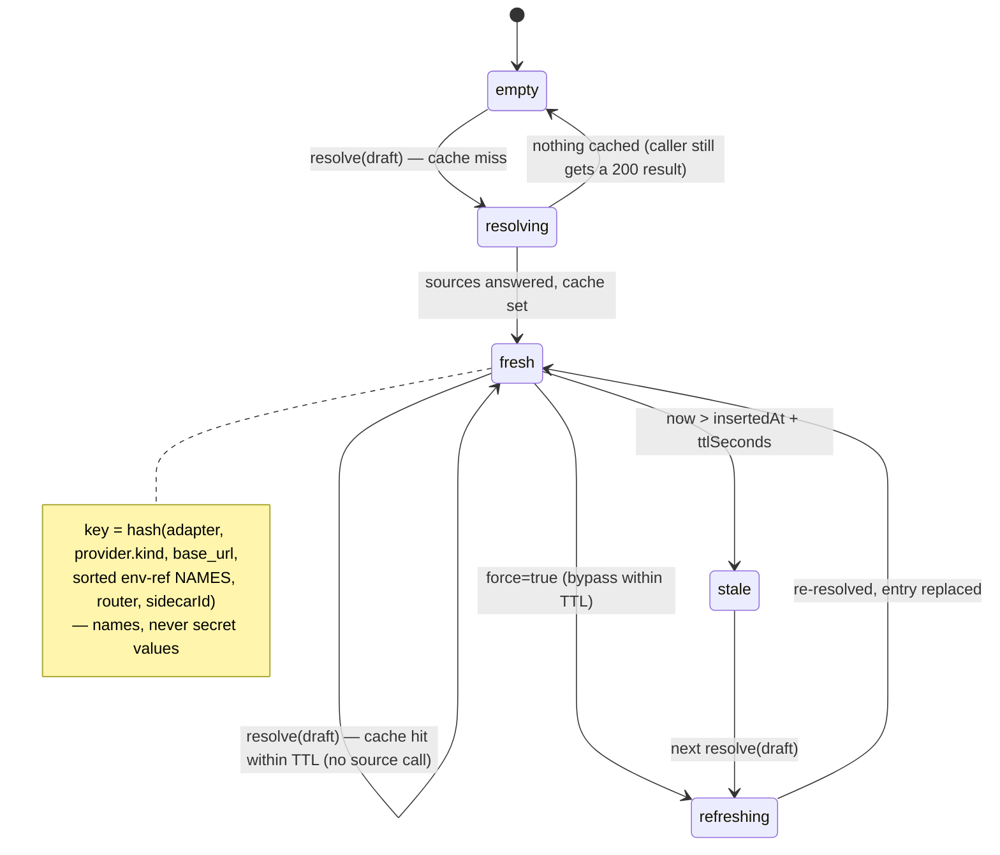
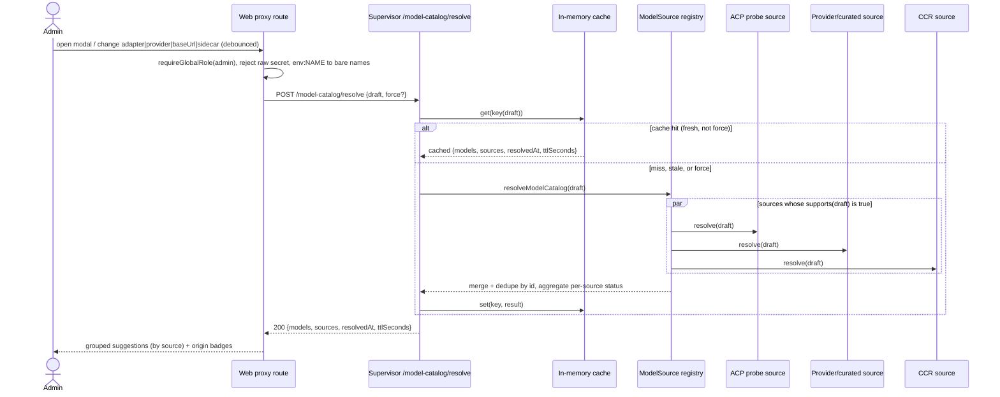
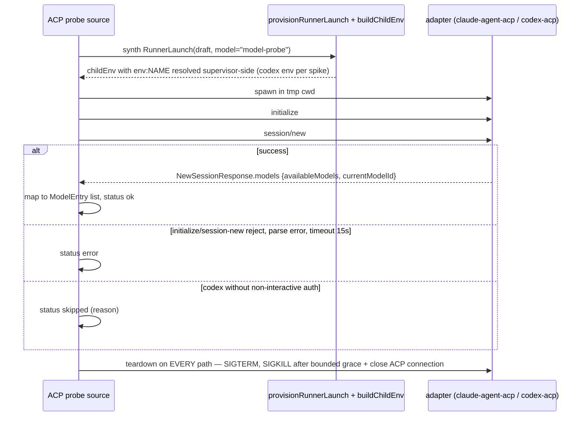
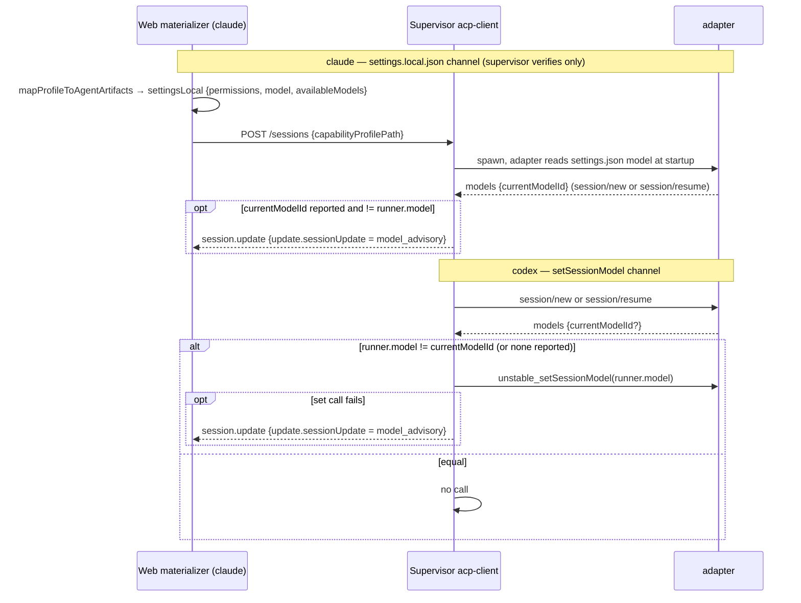
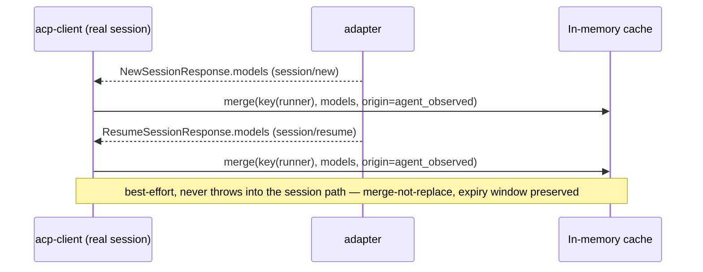

# Model catalog domain (discovery + application)

## Purpose

The model catalog domain answers two questions the runner catalog left open:
*which model ids are valid for a given runner draft (adapter + provider +
router)?* and *how does the configured model actually reach the running agent?*
It owns a **supervisor-side resolver** that discovers model ids from layered
sources (ACP active probe, provider listing APIs, a curated GLM list, and CCR),
an **in-memory TTL cache**, a passive harvest of model state from real sessions,
and the **per-adapter application channel** that pins the configured model on the
agent. It does NOT own the runner CRUD lifecycle (see
[acp-runners.md](acp-runners.md)), runner **resolution** precedence (see
[executors.md](executors.md)), or billed model attribution (`cost.jsonl` stays
ground truth). The decision record is
[ADR-076](../decisions.md#adr-076-acp-runner-model-discovery-resolver-on-supervisor--configured-model-application); the spike basis is
[`spikes/2026-06-11-acp-model-discovery-spikes.md`](../spikes/2026-06-11-acp-model-discovery-spikes.md).
Boundary: the catalog is **never persisted** — one supervisor host, one in-memory
cache; `platform_acp_runners.model` stays free text.

## Domain entities

- **Runner draft** — the resolve input: `{ adapter, provider, router?, sidecarId? }`
  plus a `force?` flag. `provider` reuses the `RunnerProvider` discriminated union
  from `supervisor/src/types.ts`. Implemented provider kinds are `anthropic |
  anthropic_compatible | openai | openai_compatible`; ADR-084 designs
  `google_gemini | google_vertex | google_gateway | agent_native` for Gemini,
  OpenCode, and MiMo. Env-ref fields (`authTokenEnv`, `apiKeyEnv`) carry **bare** names
  (`^[A-Za-z_][A-Za-z0-9_]*$`); the supervisor rejects an `env:`-prefixed or
  raw-secret value. The web tier converts its stored `env:NAME` refs to bare
  names via `envRefName()` before forwarding. (Implemented for current
  providers; Designed for ADR-084 providers)
- **`ModelSource`** — a pluggable resolver: `{ kind; supports(draft): boolean;
  resolve(draft, ctx): Promise<{ models: ModelEntry[]; status: SourceStatus }> }`.
  `SourceKind = "acp_probe" | "provider_api" | "curated" | "ccr" | "agent_observed"`.
  The registry (`registry.ts`) holds an ordered list; a new adapter/provider = a
  new `ModelSource` module, resolver core untouched. Routing: a CCR-routed draft
  (`router:"ccr"`) resolves ONLY via the `ccr` source — the direct-provider
  sources (`acp_probe` / `curated` / `provider_api`) decline it, because a CCR
  runner's model namespace is CCR's `provider,model` format, not direct ids. (Implemented)
- **`ModelEntry`** — one discovered model: `{ id; displayName?; origins: SourceKind[] }`.
  `origins` accumulates every source that advertised the id (dedupe is by `id`,
  first-source-wins on the entry body). (Implemented)
- **`SourceStatus`** — per-source outcome: `{ kind: SourceKind; status: "ok" |
  "skipped" | "error"; reason?; count? }`. A failure of one source is reported here,
  never raised. (Implemented)
- **Cache entry** — `{ key; models; sources; resolvedAt; ttlSeconds }` keyed by a
  stable hash of `(adapter, provider.kind, base_url, sorted env-ref NAMES, router,
  sidecarId)` — **names, never secret values**. Expiry is anchored to the entry's
  first insertion (`insertedAt`, internal): a passive-harvest merge refreshes
  `resolvedAt` but never extends the expiry window. (Implemented)
- **Suggestion DTO** — the web-facing, source-grouped shape the runner modal
  renders: `{ groups: [{ source; label; status; reason?; models: [{ id;
  displayName? }] }]; resolvedAt; ttlSeconds }`. (Implemented)
- **Application channel** — how the configured model is pinned: **claude** via the
  M14/ADR-043 `settings.local.json { model, availableModels }` materialization;
  **codex** via ACP `unstable_setSessionModel`. ADR-084 extends this to
  adapter metadata: Gemini/OpenCode/MiMo may use `unstable_setSessionModel` only after
  initialize capability smoke proves support; otherwise they emit advisory-only
  status or a typed skipped reason. (Implemented for Claude/Codex; Designed for
  Gemini/OpenCode/MiMo)
- **Model advisory** — a supervisor-synthesized `session.update` payload
  (`{ sessionUpdate: "model_advisory", configuredModel, observedModelId, channel }`)
  emitted on a post-application mismatch; informational only. (Implemented)

## Gemini/OpenCode/MiMo model behavior (Designed, ADR-084/ADR-085)

Gemini, OpenCode, and MiMo must not inherit Claude/Codex model defaults. Every
model suggestion response for these adapters must be source-labelled as live,
curated, observed, or skipped.

| Adapter | Suggested sources | Application channel | Initial status |
| --- | --- | --- | --- |
| `gemini` | ACP probe when SDK smoke passes; Google provider API only for provider kinds with documented list APIs; passive `agent_observed` harvest | `unstable_setSessionModel` only if advertised, else advisory-only | `skipped` until auth and protocol smoke prove a source |
| `opencode` | Native OpenCode ACP probe when binary/writable-state smoke passes; optional curated/native list only if OpenCode exposes stable output; passive `agent_observed` harvest | `unstable_setSessionModel` only if advertised, else advisory-only | `skipped` until stdio ACP smoke and model capability are proven |
| `mimo` | Native MiMo ACP probe only after binary and stdio smoke pass; passive `agent_observed` harvest | `set_session_model` — live ACP smoke proved `session/set_model` (Implemented); the adapter returns `models` + accepts `unstable_setSessionModel` | `skipped` until stdio ACP smoke and model capability are proven |

Source statuses for the new adapters are part of the contract:

- `skipped: "adapter not smoked"` when the adapter exists in schema but no SDK
  initialize/newSession smoke has passed;
- `skipped: "binary unavailable"` when diagnostics cannot execute the binary;
- `skipped: "first-run state unavailable"` for OpenCode or MiMo writable-state failure;
- `skipped: "model listing unsupported"` when an adapter can launch but exposes
  no reliable catalog source;
- `error` only for a source that was expected to run and failed.

Model application logs at INFO on successful set/apply with `adapter`,
`runnerId`, `sessionId`, `configuredModel`, and channel. Failures log WARN with
the ACP method and typed error code, then emit `model_advisory`; they do not mark
the run failed.

## State machine

A **cache entry**'s lifecycle for one draft key. `resolving`/`refreshing` are
transient (a resolve is in flight); `fresh` serves hits until TTL; a read past TTL
finds the entry `stale` and re-resolves; `force:true` jumps a `fresh` entry
straight to `refreshing`. (All Implemented.)

## Process flows

### Resolve fan-out (admin → web proxy → supervisor)

The modal resolves on open and on a debounced change of adapter / provider kind /
base URL / sidecar. The web proxy is admin-gated and converts `env:NAME` → bare
names; the supervisor fans out across `supports()`-matching sources, merges, and
caches. (Implemented)

### ACP probe with deferred-release (teardown on every exit path)

The primary source. A throwaway `RunnerLaunch` is synthesized; the
already-trusted adapter binary is spawned in an isolated tmp cwd, handshaked
promptless (zero tokens), and torn down on **every** exit path. (Implemented)

### Model application per adapter

claude is pinned before the first turn through materialized settings (the
supervisor only **verifies** the reported model); codex is pinned with a
post-session ACP call on new and resumed sessions, including when the adapter
omits `currentModelId`. A claude-reported mismatch or a failed codex set call
surfaces as the advisory only — there is no read-back/re-apply loop. (Implemented)

### Passive harvest (free, side-effect-free)

Every real `session/new` and `session/resume` already returns `models`; the
supervisor **merges** it into the same cache entry with `origin:
"agent_observed"` — union by model id, because a real session usually reports a
subset of the resolved catalog and a replace would shrink it — without extending
the entry's expiry window. It never blocks or errors the live session. (Implemented)

## Expectations

The steady-state acceptance contract. Each bullet is one testable invariant.
(All **Implemented** at M29. Discovery + application are CI-tested against
mocks — mock ACP adapter, stubbed CCR, mocked provider fetch, stub-supervisor;
live-provider / live-agent verification is pending, consistent with the ACP
spike baseline.)

- The supervisor resolve route MUST accept env-ref **names** only
  (`^[A-Za-z_][A-Za-z0-9_]*$`); an `env:`-prefixed or raw-secret value MUST be
  rejected as `MaisterError`/`SupervisorError("PRECONDITION")` (409) and MUST NEVER
  appear in any response or log.
- A resolve response MUST NEVER contain a secret value — only model `id`,
  `displayName`, `origins`, and per-source `status`/`reason`.
- The ACP probe MUST send NO `session/prompt` (zero-token discovery) and MUST
  tear the child process down **and** close the ACP connection on EVERY exit path
  (success, `initialize`/`session/new` reject, parse error, timeout ≤ 15 s) —
  `SIGTERM`, escalating to `SIGKILL` after a bounded grace when the child has not
  exited; no orphaned child MUST remain.
- A single source's failure MUST surface as that source's `status` (`error` |
  `skipped`) and MUST NOT fail the resolve; the resolve MUST still return every
  other source's models with HTTP 200.
- `resolveModelCatalog` MUST dedupe models by `id` (first-source-wins on the entry
  body) and MUST accumulate `origins` across every source advertising that `id`.
- The cache key MUST derive from `(adapter, provider.kind, base_url, sorted env-ref
  NAMES, router, sidecarId)` — names, NEVER secret values; two drafts differing
  only by an env-ref **value** MUST share one key.
- A cache hit within `ttlSeconds` MUST call no source; `force:true` MUST bypass the
  cache and repopulate it.
- The curated GLM list MUST be the source of truth for `anthropic_compatible`
  (z.ai); any authed `GET {base}/models` MUST be best-effort and MUST fall back to
  curated on any error.
- For a claude runner with `model` set, the materialized `settings.local.json` MUST
  carry `{ model }` (+ an `availableModels` allowlist for `anthropic_compatible` /
  CCR) on EVERY claude session, not only when permission entries exist.
- For a codex session the supervisor MUST call `unstable_setSessionModel(runner.model)`
  after `session/new` AND after `session/resume` iff `runner.model !==
  currentModelId` (an absent `currentModelId` counts as different), and MUST NOT
  call it when they are equal.
- A claude-reported model mismatch or a failed codex `setSessionModel` call MUST
  emit an advisory `session.update` (`sessionUpdate = "model_advisory"`) and MUST
  NEVER change `runs.status` (never `Failed`); `cost.jsonl` stays the
  billed-model ground truth.
- The catalog MUST live only in supervisor memory — NO Postgres row, NO migration,
  NO new env var; `platform_acp_runners.model` stays free text and an unknown model
  on save MUST be an advisory hint, NOT a validation error.
- Gemini/OpenCode/MiMo model suggestions MUST return a typed source status even when
  no model can be listed; the UI MUST render skipped/error reasons and MUST NOT
  show Claude/Codex fallback models for a different adapter. (Designed, ADR-084)
- Gemini/OpenCode/MiMo model application MUST be driven by adapter metadata. A missing
  or failing `unstable_setSessionModel` path emits `model_advisory` or a typed
  skipped status; it MUST NOT silently mutate `runner.model`, change run status,
  or retry through another adapter's mechanism. (Designed, ADR-084)

## Edge cases

- **Malformed draft** (unknown adapter, `env:`-prefixed/raw secret, bad provider
  union, `router` without `sidecarId`) → `SupervisorError("PRECONDITION")` (409) at
  the supervisor Zod boundary, before any source runs. See
  [error-taxonomy.md](../error-taxonomy.md).
- **Missing provider env-ref** (`authTokenEnv`/`apiKeyEnv` absent from supervisor
  env) → that source's `status:"error"`, `reason:"env ref not set"`; the resolve
  still returns 200 with the other sources.
- **Plain `anthropic` / `openai` provider kinds** carry no env-ref field, so the
  `provider_api` source reads the conventional supervisor-host keys
  (`ANTHROPIC_API_KEY` / `OPENAI_API_KEY` — see
  [configuration.md](../configuration.md)) and degrades to `status:"skipped"`
  when the key is unset.
- **z.ai authed listing fails** (401 / network) → the `anthropic_compatible`
  provider source falls back to the curated GLM list with `status:"ok"` (curated)
  or `status:"error"` only if curated is also unavailable (it never is — it is
  static).
- **CCR unreachable** (`router:"ccr"`, daemon down) → CCR source `status:"error"`;
  resolve still returns other sources.
- **ACP probe reject / timeout / malformed `models`** → probe source
  `status:"error"` with an `ACP_PROTOCOL`-class `reason`; the child is SIGTERM'd
  regardless. NOT a thrown 500.
- **codex probe without non-interactive auth** → probe source `status:"skipped"`
  (`reason`), per the Phase 0A T0A.2 determination.
- **Unknown `sidecarId`** (web proxy) → `MaisterError("CONFIG")` (422), validated
  against the platform sidecar catalog before forwarding.
- **Raw (non-`env:`) secret in a web draft** → `MaisterError("CONFIG")` (422); the
  bare name never leaves the supervisor host.
- **Supervisor unreachable / 5xx** (web proxy) → `MaisterError("EXECUTOR_UNAVAILABLE")`
  (503); the modal keeps the offline `presets.ts` layer and a retry affordance.
- **Unknown model saved** on a runner → accepted (`model` stays `min(1)`); the UI
  shows an advisory "not in the discovered list" hint, never a validation error.
- **Gemini/OpenCode/MiMo source not yet smoked** → resolve returns HTTP 200 with a
  `skipped` source status and zero models; the absence of suggestions is not a
  save blocker.
- **Gemini/OpenCode/MiMo model set unsupported** → the prompt/session continues only
  if launch readiness allows advisory-only application; otherwise readiness
  refuses before spawn. The supervisor never fakes model pinning.

## Linked artifacts

- **API contract:** [`api/supervisor.openapi.yaml`](../api/supervisor.openapi.yaml)
  — `resolveModelCatalog` (`POST /model-catalog/resolve`);
  [`api/web.openapi.yaml`](../api/web.openapi.yaml) — `postAdminAcpRunnerModelSuggestions`
  (`POST /api/admin/acp-runners/model-suggestions`).
- **Events:** [`api/async/supervisor-sse.asyncapi.yaml`](../api/async/supervisor-sse.asyncapi.yaml)
  — the `model_advisory` `session.update` payload variant.
- **Decision:** [ADR-076](../decisions.md#adr-076-acp-runner-model-discovery-resolver-on-supervisor--configured-model-application),
  [ADR-084](../decisions.md#adr-084-acp-adapter-families-for-gemini-cli-and-opencode).
- **Spike basis:** [`spikes/2026-06-11-acp-model-discovery-spikes.md`](../spikes/2026-06-11-acp-model-discovery-spikes.md).
- **Architecture:** [`architecture.md`](../architecture.md) — the `model-catalog`
  supervisor component.
- **Errors:** [error-taxonomy.md](../error-taxonomy.md) — `CONFIG` (web proxy),
  `EXECUTOR_UNAVAILABLE` / `PRECONDITION` / `ACP_PROTOCOL` (supervisor).
- **Related domains:** [acp-runners.md](acp-runners.md) (runner CRUD),
  [executors.md](executors.md) (resolution + routing).
- **Source (Implemented):** `supervisor/src/model-catalog/{types,registry,resolve,cache,harvest}.ts`,
  `supervisor/src/model-catalog/sources/{acp-probe,provider-api,curated,ccr,index}.ts`,
  `supervisor/src/{spawn,acp-client,http-api,main}.ts`,
  `web/lib/capabilities/{agent-map,materialize}.ts`,
  `web/lib/supervisor-client.ts`,
  `web/app/api/admin/acp-runners/model-suggestions/route.ts`,
  `web/components/settings/{acp-runner-modal,model-autocomplete}.tsx` +
  `web/components/settings/use-model-suggestions.ts`.
