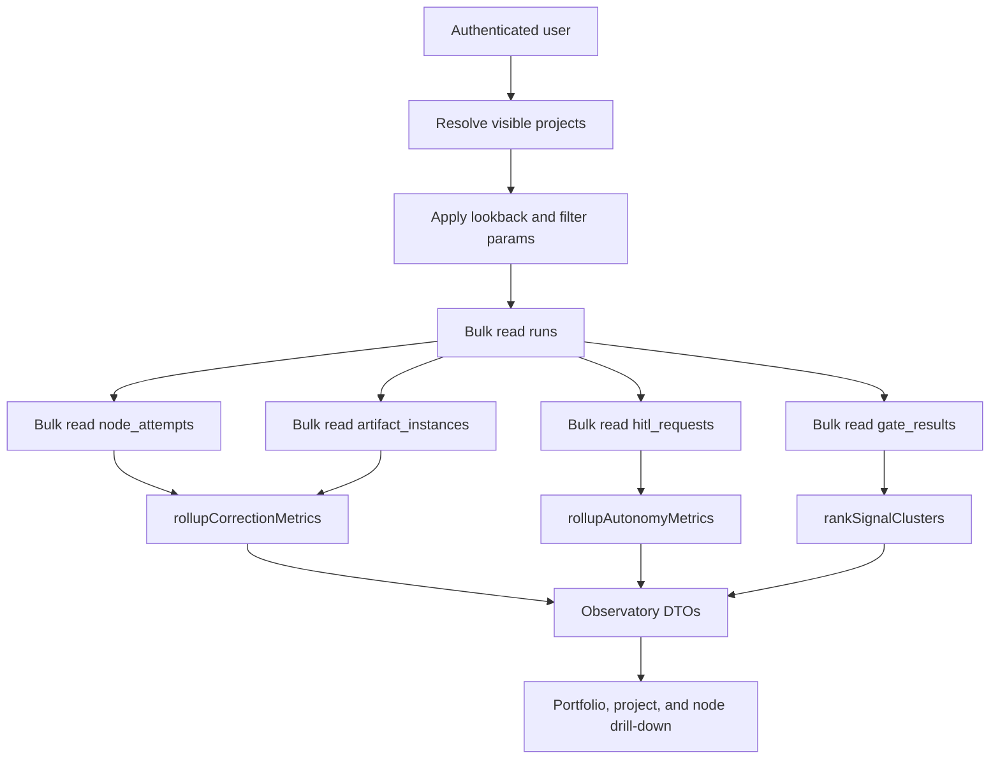
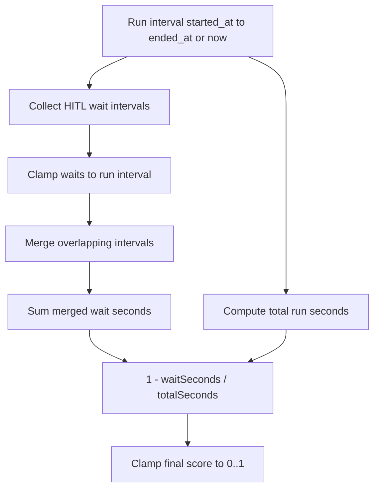
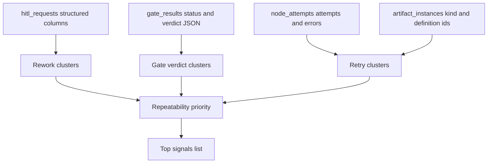
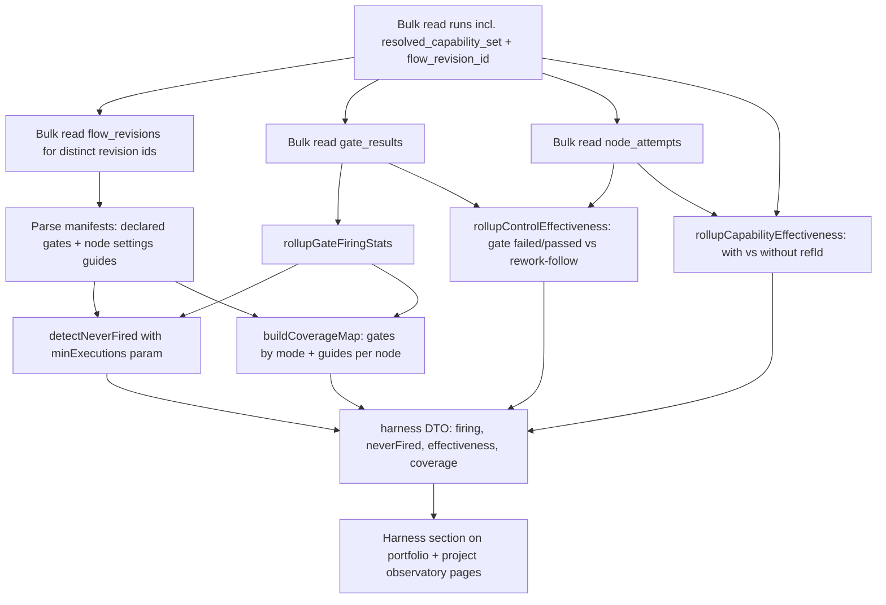

# Observatory domain

> **Status: Implemented (M23).** Observatory is the Wave-1 read-only metrics surface
> for correction pressure, autonomy, and repeatable harvestable signals. It
> builds on the M11a `node_attempts` ledger, M12 artifact evidence index, M15
> readiness verdict calibration, and HITL timing rows. Locked decision:
> [ADR-059](../decisions.md#adr-059-read-only-observatory-formulas-and-harvest-priority).
> The **harness adequacy & coherence** layer below is **(M29 — Implemented)** —
> sensor firing-rate, never-fired flags, per-control effectiveness, and the
> per-flow coverage map. Locked decision:
> [ADR-073](../decisions.md#adr-073-harness-adequacy--coherence-metrics-read-only-observatory-extension).

## Purpose

Observatory turns the existing run, node, gate, HITL, and artifact ledgers into
read-only operational metrics. Its boundary is aggregate read models and UI
surfaces for portfolio, project, flow, artifact, and node drill-downs. It does
not mutate Flow definitions, create recommendations, schedule work, inspect raw
payloads, or add persistence. The goal is to prove which correction and
autonomy patterns are repeatable enough to justify a later write-side learning
loop.

Implemented surfaces are `web/lib/queries/observatory.ts`,
`web/lib/queries/observatory-core.ts`,
`web/lib/queries/observatory-signals.ts`, `/observatory`, and
`/projects/[slug]/observatory`. They reuse existing tables only.

## Domain entities

- **Observatory scope** — the visible project set plus optional filters:
  `projectId`, `flowId`, `nodeId`, `artifactKind`, `artifactDefId`, and a
  lookback window. Default lookback is 30 days by `runs.started_at`.
- **Correction metric** — a DTO containing `runCount`, `reworkCount`,
  `retryCount`, `correctionRate`, grouping keys, and display metadata that marks
  the value as an unbounded pressure ratio.
- **Autonomy metric** — a DTO containing `totalSeconds`, `waitSeconds`,
  `openWaitCount`, `autonomyScore`, `volatile`, and
  `reviewDwellExcluded=true`.
- **Signal cluster** — a read-only observation with `kind`, `title`, `scope`,
  `occurrenceCount`, `affectedRunCount`, `affectedProjectCount`,
  `priorityScore`, redacted examples when text is explicitly approved, and
  drill-down parameters.
- **Contributing evidence** — run ids, node attempts, gate results,
  HITL waits, and artifact-instance links that explain an aggregate row without
  exposing server-only handles or raw payloads.
- **Sensor firing stats (M29 — Implemented)** — per `(projectId, flowId, nodeId,
gateId)` group and per gate `kind` rollup: terminal-status counts
  (`passed/failed/stale/skipped/overridden`), `executions`, and `fail_rate`
  per the ADR-073 formulas.
- **Never-fired flag (M29 — Implemented)** — a per-gate boolean raised when a
  declared, sufficiently-executed gate has zero `failed + stale` results in the
  window; threshold `MAISTER_HARNESS_NEVER_FIRED_MIN` (default 10) is read at
  the query layer and passed into the pure rollup as a parameter.
- **Control effectiveness (M29 — Implemented)** — per-gate rework-follow rates +
  lift, and per-capability (`runs.resolved_capability_set.capabilities[].refId`)
  with/without correction-rate comparison; runs with a null capability set are
  excluded.
- **Coverage map (M29 — Implemented)** — per flow (revisions used by scoped runs,
  joined via `runs.flow_revision_id`): per-node declared gate counts by `mode`,
  blocking count, guide-side presence (skills/rules/restrictions in node
  `settings`), and the "guides without sensors" imbalance flag.

## State machine

Observatory has no persisted state machine. It is a pure classification and
aggregation layer over current rows. Active runs are included in metrics but
MUST carry `volatile=true` because their attempts, waits, and ending timestamp
can still change.

## Cost dimension (ADR-087 cost accounting + ADR-101 budget + ADR-117 reconcile/runner)

The cost dimension is read-only and groups derived token/cost rollups by
project, Flow, and node. It does not read raw prompts, raw adapter lines, env
values, or secret-bearing payloads. Its source inputs are:

- `runs.started_at`, `runs.ended_at`, `runs.flow_id`, `runs.flow_revision_id`,
  `run_sessions.runner_snapshot` (per session), and the run-level cost rollup
  (`run_cost_rollups`, incl. its `by_model` and `by_runner` jsonb breakdowns);
- `node_attempts.started_at`, `node_attempts.ended_at`, and node-attempt cost
  rollups;
- enriched `cost.jsonl` records as the reconciliation source of truth — read
  **only** on the reconcile write paths below, never in the read path.

Token kinds are `input`, `output`, `cache_read`, and `cache_creation`.
Resume tax is the subtotal of records marked as resume/checkpoint overhead.
Active run cost rows render `volatile=true` for the same reason active autonomy
rows do: open runs can still append cost records or finish node attempts.

The UI adds a cost tab/filter set to the existing Observatory surfaces. It is
view-only: no write route, no background job, no recommendation mutation, and
no Flow/package edits. Rollups may be persisted by the runs domain for
efficient reads, but Observatory only consumes them through bulk read-model
queries and reconciles labels/denominators with the rest of the page.

### Model & runner breakdown (Implemented, ADR-117)

The project/portfolio model + runner breakdown and the two reconcile triggers
below are **Implemented**. The base token totals (ADR-087) and budget pressure
(ADR-101) were already **Implemented**.

`getProjectObservatory` / `getPortfolioObservatory` expose, alongside the flat
token totals, two grouped breakdowns over the persisted rollup columns:

- **`byModel`** — keyed by the cost record `model` string (`"unknown"` when
  absent), summed across every in-scope `run_cost_rollups.by_model`.
- **`byRunner`** — keyed by a snapshot-derived stable label `runnerKey =
"<adapter>/<model>"` (e.g. `claude/claude-sonnet-4-6`), summed across every
  in-scope `run_cost_rollups.by_runner`. The key is derived from
  `run_sessions.runner_snapshot` (not the catalog FK), so a deleted runner row
  never erases historical attribution. Cost with no matching `run_sessions` row
  buckets under `"unknown"`.

**Conditional by-runner precision.** The multi-runner split is _exact_ only when
a flow declares multiple logical sessions (distinct `sessionName` per node →
distinct `run_sessions` rows with distinct snapshots). A single-session flow,
and every scratch/agent run, maps all cost to one runner via `sessionName =
"default"` — correct, not a loss. There is no per-node runner split below session
granularity.

Both breakdowns are pure reads over the two jsonb columns — they add **no** new
HTTP surface (the project/portfolio Observatory is RSC).

### Reconcile triggers (ADR-117)

`run_cost_rollups` rows are written only by `reconcileRunCostRollups`. Because
Observatory is read-only, reconciliation runs on **write paths** only, via two
triggers with split roles:

- **`system_sweep` backstop — the completeness guarantee.** Keys on
  `runs.ended_at` (set on _every_ terminal transition, NULL for active runs),
  **not** a terminal-status allow-list and **not** a domain event. This is
  required because **scratch success emits no terminal domain event** (`run.done`
  is emitted only by promotion; only `run.failed` / `run.crashed` /
  TTL-`run.abandoned` are emitted) — an `ended_at`-keyed sweep is therefore the
  only reliable way to include a finished scratch run that fired no event, plus
  pre-existing history and late cost-flush races. Progress is tracked by the
  durable `runs.cost_reconciled_at` marker (stamped on every attempt) so an
  unreconcilable run settles after one attempt (no starvation of newer runs) and
  a pre-`0083` rollup with empty `by_runner` is backfilled once. Predicate:
  `ended_at IS NOT NULL AND ended_at > now − lookback AND (cost_reconciled_at IS
NULL OR cost_reconciled_at < ended_at + SETTLE_GRACE)`. `SETTLE_GRACE` (~2 min)
  forces one extra re-reconcile so the supervisor's async final `cost.jsonl`
  flush is captured; a settled run is skipped. Lookback =
  `MAISTER_COST_RECONCILE_LOOKBACK_HOURS` (default 168h). See
  [scheduler.md](scheduler.md).
- **`cost-rollup-reconcile` domain-event consumer — the low-latency fast-path.**
  Subscribes to the existing terminal kinds (`run.done | run.failed |
run.crashed | run.abandoned`; no new event kind), `startFrom: "now"`
  (forward-only — the sweep owns backfill). It is **poison-safe**: it reconciles
  each run inside a per-run try/catch that logs WARN and never throws, so a
  single permanently-failing run cannot stall the dispatch cursor. It is a
  fast-path for terminals that _do_ emit, **never** the completeness guarantee.
  See [domain-events.md](domain-events.md).

Both rely on `reconcileRunCostRollups` idempotency (at-least-once dispatch +
sweep re-reconcile); a re-reconcile after a runner/session change refreshes
`by_runner` with no stale buckets.

### TS contract

```ts
interface CostDimensionRow {
  key: string; // model string, or "<adapter>/<model>", or "unknown"
  label: string; // display label (same as key today)
  inputTokens: number;
  outputTokens: number;
  cacheReadTokens: number;
  cacheCreationTokens: number;
  totalTokens: number; // sum of the four kinds
}

interface ObservatoryCostSummary {
  // …existing flat totals (inputTokens, …, resumeTokens, totalTokens,
  // projectCount, flowCount, nodeCount)…
  byModel: CostDimensionRow[]; // sorted by totalTokens desc, then key
  byRunner: CostDimensionRow[]; // sorted by totalTokens desc, then key
}
```

The cost tab also surfaces **budget pressure** (ADR-101, Implemented): a
read-only count of token-budget breaches in the window, sourced project-scoped
from `domain_events` — escalations (`kind = 'run.escalated'`,
`payload->>'reason' = 'budget_exceeded'`) and terminations (`kind =
'run.failed'`, `payload->>'reason' in ('budget_exceeded', 'BUDGET_EXCEEDED',
'budget_breach', 'budget_restart', 'budget_abandoned')` — the terminate reason
is not normalized across flow/scratch/agent/tree-root and ADR-125 adds restart
and human-abandon reasons). `budget_parked` is intentionally excluded because
that path emits `run.abandoned` after preserving the work product. The WARN rung
is a `logExecPolicyAction` log line with no domain event and is therefore NOT
surfaced here. One grouped scan, no per-run loop, no new route.

UI/test acceptance:

| Surface                               | Acceptance and states                                                                                                                                                                                                        | Test owner                                                                                                          |
| ------------------------------------- | ---------------------------------------------------------------------------------------------------------------------------------------------------------------------------------------------------------------------------- | ------------------------------------------------------------------------------------------------------------------- |
| Portfolio Observatory cost tab/filter | Groups by project and Flow, shows token totals by kind, model breakdown, resume-tax subtotal, honest denominators, volatile marker for active runs, and useful empty state for no cost rows. All labels have EN/RU messages. | `web/e2e/multi-run-cost-policy.spec.ts`; `web/lib/queries/__tests__/observatory-cost*.test.ts`                      |
| Project/node drill-down               | Filters preserve URL-synchronized Observatory state, show node-attempt token totals/durations, and render "insufficient data" instead of fake zeroes when the denominator is too small.                                      | `web/e2e/multi-run-cost-policy.spec.ts`; pure rollup tests                                                          |
| Read-only failure mode                | Missing or stale derived rollups show a bounded warning/empty row; the UI never triggers recomputation through a mutating HTTP route and never polls raw `cost.jsonl`.                                                       | `web/e2e/multi-run-cost-policy.spec.ts`; query integration tests                                                    |
| Runner breakdown card                 | Portfolio + project cost tab render a "By runner" card with `<adapter>/<model>` rows, an `"unknown"` row for unattributed cost, an empty-state row, and EN/RU labels.                                                        | `web/components/observatory/__tests__/observatory-components.test.ts`; `web/e2e/observatory-cost-breakdown.spec.ts` |

### Acceptance & edge-case register (ADR-117)

Each criterion maps to exactly one owning test (minimum overlap — the sweep-only
and poison cases live only in the Phase-2 integration specs, not duplicated at
the unit layer).

| Criterion / edge case                                                                 | Owning test                                 |
| ------------------------------------------------------------------------------------- | ------------------------------------------- |
| Scratch run included without being opened (rollup written by a trigger)               | `cost-rollup-reconcile.integration.test.ts` |
| Scratch success with **no** terminal event → included via the `ended_at` sweep        | `cost-reconcile-sweep.integration.test.ts`  |
| Multi-model split in `by_model`                                                       | `cost-rollups.test.ts`                      |
| Multi-session flow → multi-runner split in `by_runner`                                | `cost-rollups.integration.test.ts`          |
| Single-session flow with N nodes → exactly one runner bucket (D2a)                    | `cost-rollups.integration.test.ts`          |
| `"unknown"` runner bucket (cost record with no `run_sessions` row)                    | `cost-rollups.integration.test.ts`          |
| Idempotent re-reconcile after session runner change → no stale `by_runner` key        | `cost-rollups.integration.test.ts`          |
| Poison-message safety: always-failing run never stalls the consumer cursor            | `cost-rollup-reconcile.integration.test.ts` |
| Late cost-flush captured via `SETTLE_GRACE` re-reconcile                              | `cost-reconcile-sweep.integration.test.ts`  |
| Long-settled rollup skipped (no redundant disk read)                                  | `cost-reconcile-sweep.integration.test.ts`  |
| Read-only boundary: `getCostSummary` performs no reconcile / no `cost.jsonl` read     | `observatory-cost.integration.test.ts`      |
| Resume tax not double-counted into the session bucket                                 | `cost-rollups.test.ts`                      |
| Project-less local-package run handled gracefully                                     | `cost-rollup-reconcile.integration.test.ts` |
| Empty project → `byModel: []`, `byRunner: []`                                         | `observatory-cost.integration.test.ts`      |
| Project/portfolio `byModel` + `byRunner` summed across runs, sorted deterministically | `observatory-cost.integration.test.ts`      |

## Process flows

### Aggregate read path

The read model batches by visible project and run ids, then reduces in memory
through pure helpers.



### Correction rate formula

`correction_rate = (rework_count + retry_count) / run_count`

- `run_count` is the distinct count of `runs.id` in scope where
  `run_kind = 'flow'` and at least one `node_attempts` row exists.
- `rework_count` counts `node_attempts.status = 'Reworked'`. This status is
  written only by the graph runner after a manifest-declared rework transition
  is selected.
- `retry_count` is the sum of `max(node_attempts.attempt) - 1` per
  `(run_id, node_id)`.
- Artifact grouping joins `artifact_instances` through `node_attempt_id` when
  available and otherwise groups by `kind`.
- The result is an unbounded pressure ratio. A value greater than `1` means
  more than one correction event per run.

Worked examples use `now = 2026-06-05T12:00:00.000Z`.

| Example                              | Rows in scope                                                                                                | Expected                                                          |
| ------------------------------------ | ------------------------------------------------------------------------------------------------------------ | ----------------------------------------------------------------- |
| No runs                              | zero eligible flow runs                                                                                      | `runCount=0`, `correctionRate=0`, empty groups                    |
| Rework plus second human review      | one run, node `implement` attempts `1,2`; node `review` attempts `1,2`; first review has `status='Reworked'` | `runCount=1`, `retryCount=2`, `reworkCount=1`, `correctionRate=3` |
| Legacy run without node attempts     | one flow run, zero `node_attempts`                                                                           | excluded from denominator and numerator                           |
| Artifact with null `artifact_def_id` | artifact linked to a contributing node attempt with `kind='log'`                                             | included in artifact bucket `kind:log`                            |

### Autonomy Score formula

`autonomy_score = 1 - sum(gate_wait_time) / total_run_time`



- `gate_wait_time` is built from `hitl_requests.created_at` to
  `coalesce(responded_at, now)`.
- Every wait interval is clamped to the run interval
  `[started_at, coalesce(ended_at, now)]`.
- Overlapping waits are merged before summing.
- `total_run_time` uses `coalesce(runs.ended_at, now) - runs.started_at` and is
  clamped to at least one second.
- Review and promotion dwell without a `hitl_requests` row are excluded in M23.
  The UI MUST label this metric as HITL wait share and carry
  `reviewDwellExcluded=true`.

Worked examples use `now = 2026-06-05T12:00:00.000Z`.

| Example                   | Rows in scope                                                                | Expected                                                                                         |
| ------------------------- | ---------------------------------------------------------------------------- | ------------------------------------------------------------------------------------------------ |
| Active run with open HITL | run `11:00..now`, one open HITL `11:30..now`                                 | `totalSeconds=3600`, `waitSeconds=1800`, `openWaitCount=1`, `autonomyScore=0.5`, `volatile=true` |
| Overlapping waits         | run `10:00..11:00`, waits `10:10..10:30` and `10:20..10:40`                  | merged wait is `10:10..10:40`, `waitSeconds=1800`, `autonomyScore=0.5`                           |
| Review dwell without HITL | run `10:00..11:00`, no `hitl_requests`, run sat in `Review` after completion | `waitSeconds=0`, `autonomyScore=1`, `reviewDwellExcluded=true`                                   |
| Zero-duration run         | run starts and ends at same timestamp                                        | denominator clamps to one second                                                                 |

### Signal clustering

Signal clustering ranks repeatable structured observations. It never offers a
mutation action.



- Rework clusters use `hitl_requests.decision`, `rework_target`,
  `workspace_policy`, `step_id`, and joined `runs.flow_id`. Optional
  node-attempt context joins on `(run_id, node_id = step_id)`.
- Gate clusters use `gate_results.kind`, `gate_id`, `status`,
  `verdict.verdict`, `verdict.calibration.outcome`,
  `verdict.recommendedAction`, and normalized `verdict.reasons[]`.
- Retry clusters use `(flow_id, node_id, node_type, error_code, exit_code)`,
  plus artifact kind/definition ids when linked.
- `priorityScore` is derived from occurrence count, affected run count, affected
  project count, and extra weight for failed or stale blocking gates.
- M17 `criticality` and `human_confidence` are optional future multipliers.

### Harness adequacy & coherence rollup (M29 — Implemented)

The harness layer answers "is the harness sensing anything, and do its controls
matter" over the same scoped window. It extends the existing bulk read path
with two run columns (`runs.resolved_capability_set`, `runs.flow_revision_id`)
and exactly ONE new bulk SELECT (`flow_revisions` by the distinct revision ids
of scoped runs, manifests parsed in TS). All formulas are normative in
[ADR-073](../decisions.md#adr-073-harness-adequacy--coherence-metrics-read-only-observatory-extension)
and are not restated here.



- The rollups are pure functions over bulk rows; the never-fired threshold
  (`MAISTER_HARNESS_NEVER_FIRED_MIN`, default 10) is read once at the query
  layer (instance-config pattern) and passed in as `minExecutions` (ADR-059
  explicit-parameter style).
- Declared gates come from `flow_revisions.manifest` →
  `nodes[].pre_finish.gates[]`; guide-side presence comes from node `settings`
  (selected skills/rules/restrictions). The declared set per flow is the union
  across the revisions used by scoped runs.
- Display follows the honest-N rule: every rate renders with its denominator,
  and groups with fewer than 3 executions render "—", never `0%`.

- Observatory MUST be read-only: no DB writes, filesystem writes, supervisor
  calls, background jobs, or state-changing routes are part of M23.
- Cost dimensions (ADR-087 totals, ADR-117 model/runner breakdown) MUST preserve
  the read-only boundary: Observatory reads derived cost rollups and bulk
  run/node rows only; it never triggers recomputation through a mutating route,
  never calls any `reconcile*` function, and never reads raw `cost.jsonl`
  payloads in a request loop. Reconciliation lives only on the ADR-117 write
  paths (the `cost-rollup-reconcile` consumer and the `system_sweep` backstop).
- Formula helpers MUST accept an explicit `now` and MUST NOT call `Date.now()`
  internally.
- `correction_rate` MUST use `node_attempts.status = 'Reworked'` for rework
  and `max(attempt) - 1` per `(run_id, node_id)` for retries.
- `correction_rate` MUST be rendered as an unbounded pressure ratio, never as a
  percentage.
- Autonomy wait time MUST clamp HITL intervals to their run interval and merge
  overlaps before summing.
- Active runs MUST be included by default and marked `volatile=true`.
- Review or promotion dwell without `hitl_requests` MUST be excluded and exposed
  as `reviewDwellExcluded=true`.
- Portfolio, project, and node drill-down surfaces MUST use shared rollup
  helpers for formula consistency.
- Read-model queries MUST bulk-fetch by visible project and run ids; per-run
  query loops are forbidden.
- Child bucket `runCount` values MUST reconcile to parent rows by set union, not
  by numeric sum.
- Signal clusters MUST use structured metadata first and MUST NOT read raw
  prompts, raw artifact payloads, cost payloads, env values, or secret-bearing
  fields.
- UI labels MUST say signals or patterns, not recommendations or automatic
  fixes.
- **(M29 — Implemented)** Harness rollups MUST be computed on-the-fly from the
  bulk rows with exactly ONE additional bulk SELECT (`flow_revisions` by
  distinct scoped revision ids) — no caching, no read-model table, no per-run
  query loops, no schema change, no new HTTP route.
- **(M29 — Implemented)** The never-fired flag MUST raise only when the gate is
  declared in ≥1 revision used by scoped runs AND
  `executions >= MAISTER_HARNESS_NEVER_FIRED_MIN` AND `failed + stale == 0`;
  the threshold MUST be passed into the pure rollup as a parameter, never read
  from env inside it.
- **(M29 — Implemented)** Capability effectiveness MUST exclude runs whose
  `runs.resolved_capability_set` is null (never counted as "without"); coverage
  MUST exclude runs whose `runs.flow_revision_id` is null from the declared
  side while keeping their firing stats.
- **(M29 — Implemented)** Every harness rate MUST render with its denominator, and
  any group with `executions < 3` MUST render as "—" (insufficient data), never
  as `0%`.
- **(ADR-101 / ADR-125 — Implemented)** Budget surfacing MUST read
  `domain_events` project-scoped within the window via ONE grouped SELECT
  (escalations = `run.escalated`/`budget_exceeded`; terminations =
  `run.failed`/{`budget_exceeded`, `BUDGET_EXCEEDED`, `budget_breach`,
  `budget_restart`, `budget_abandoned`}); it MUST count only budget-reason
  failed events, MUST exclude `run.abandoned`/`budget_parked`, MUST NOT surface
  the WARN rung (no domain event), and MUST stay read-only (no actions, EN+RU
  labels).

## Edge cases

- Empty scope returns zero-valued metrics and useful empty states, not an error.
- Legacy flow runs without `node_attempts` rows are excluded from
  `runCount` and surfaced only as legacy-no-ledger query diagnostics.
- Active runs with open HITL waits are volatile and may change between refreshes.
- Overlapping HITL rows on the same run are merged to prevent wait time from
  exceeding total run time.
- Missing artifact definitions fall back to artifact `kind` buckets.
- Text extraction is disabled by default; any later bounded text subset requires
  redaction tests before it can appear in examples.
- A performance need for new indexes is a migration task, not an implicit
  read-model change.
- **(M29 — Implemented)** A gate with zero executions in the window (declared but
  never run — e.g. its node never executed) is NOT never-fired-flagged: the
  flag requires the execution threshold; the coverage map still lists the gate
  as declared.
- **(M29 — Implemented)** Null `runs.resolved_capability_set` (pre-ADR-069
  launches) thins capability-effectiveness denominators; such runs are dropped
  from both sides of the comparison and the honest-N denominator shows it.
- **(M29 — Implemented)** Revision drift — scoped runs spanning multiple revisions
  of the same flow — makes the declared-gate set the UNION across used
  revisions; a gate present in only one revision still appears, with its firing
  stats from the runs that declared it. A manifest that fails to parse skips
  that revision with a WARN and the coverage map omits it.

## Linked artifacts

- ADR: [ADR-059](../decisions.md#adr-059-read-only-observatory-formulas-and-harvest-priority)
- ADR (harness layer, M29):
  [ADR-073](../decisions.md#adr-073-harness-adequacy--coherence-metrics-read-only-observatory-extension)
- Env knob (M29 — Implemented): `MAISTER_HARNESS_NEVER_FIRED_MIN` —
  [`../configuration.md`](../configuration.md) env table (host env only,
  ADR-023 — never compose files)
- Run state: [`runs.md`](runs.md)
- HITL timing and response semantics: [`hitl.md`](hitl.md)
- Node attempts and rework: [`flow-graph.md`](flow-graph.md)
- Readiness verdict calibration: [`readiness.md`](readiness.md)
- Artifact evidence index: [`artifacts.md`](artifacts.md)
- DB schema reference: [`../database-schema.md`](../database-schema.md)
- Web API: no OpenAPI change in M23 because Observatory uses server-component
  read models, not external HTTP API routes.
