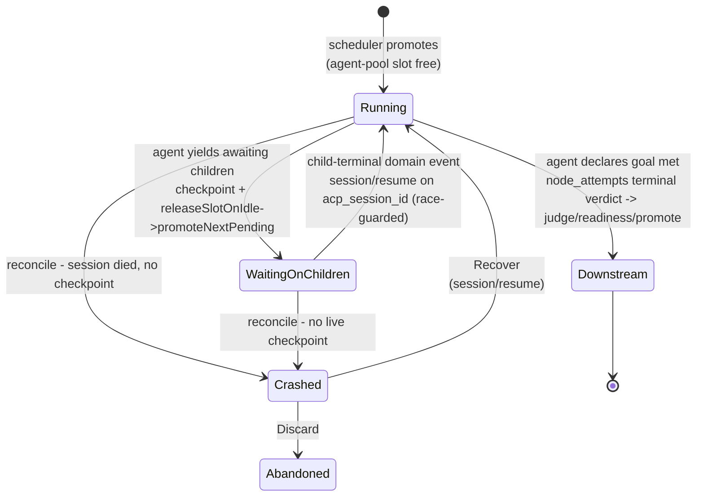
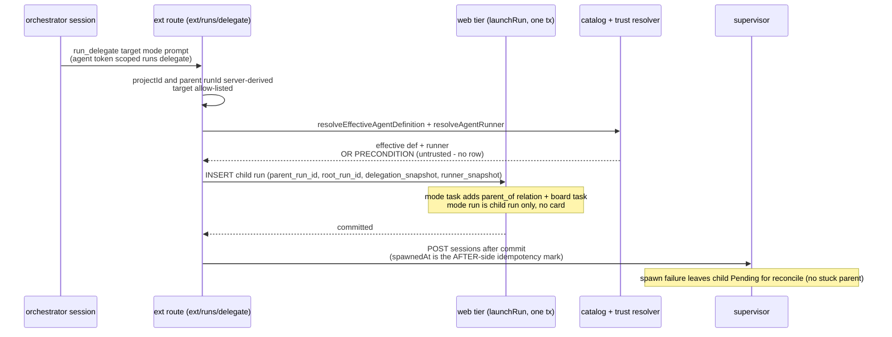
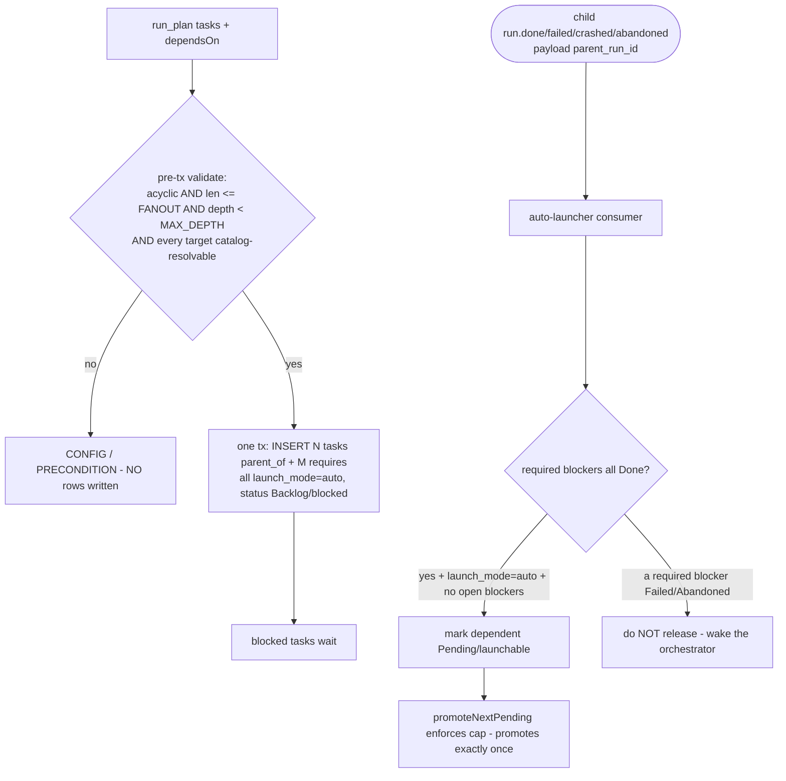
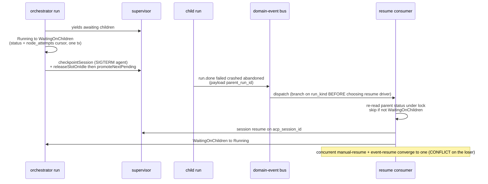
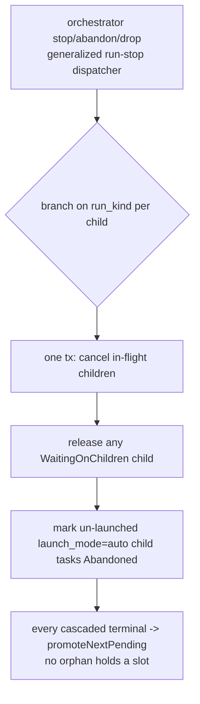

# Orchestrator engine domain

## Purpose

The orchestrator engine (**Designed**, ADR-095/ADR-096, M36) gives a running
agent governed **dynamic delegation**: an `orchestrator` flow node is a
long-lived supervisory step that spawns and coordinates child Runs, parks
(idle-checkpoints) while they execute, and reaches a terminal verdict only when
the agent declares the goal met. Every delegated unit stays a real, governed Run
(worktree, gates, promotion, board visibility, concurrency cap); dynamism lives
only in *coordination*, never in bypassing governance, and children are
catalog-resolved (the M34 effective definition — [agents.md](agents.md)), never
runtime-authored. Boundary: this domain owns the `orchestrator` node lifecycle,
the run-tree (`runs.parent_run_id`/`root_run_id`), the `WaitingOnChildren` run
status, the delegation toolset over the MCP facade (`run_delegate` / `run_plan` /
`run_collect` / `run_cancel`), the success-gated `requires` relation kind, and the
idle-checkpoint wait + child-terminal-event resume loop. It does NOT own the base
run state machine ([runs.md](runs.md)), the outbox mechanics
([domain-events.md](domain-events.md)), the social-relation substrate it writes
through ([social-board.md](social-board.md)), the scheduler cap
([scheduler.md](scheduler.md)), the catalog/trust resolution it consumes
([agents.md](agents.md)), or capability enforcement (materialize-only per
ADR-041/ADR-043 — [flow-settings.md](flow-settings.md)).

## Domain entities

- **Orchestrator node** (Designed) — an `orchestrator` flow node (engine floor
  `1.6.0`) in a `FlowGraph`. Carries `action.prompt`, inherits the `ai_coding`
  capability `settings` shape, plus a `delegation` sub-block (`max_fanout?`,
  `max_depth?`). Executes as an ACP session like an `ai_coding` node, but with a
  **supervisory** lifecycle: park → delegate → `WaitingOnChildren` → resume →
  complete → downstream transition. Recorded in the `node_attempts` ledger under
  the new `node_attempts.node_type = orchestrator`. See [flow-dsl.md](../flow-dsl.md).
- **Run-tree** (Designed) — child Runs linked to their parent by
  `runs.parent_run_id` (FK→`runs`, on-delete set-null) and to the orchestrator at
  the top of the tree by `runs.root_run_id` (FK→`runs`). A child may itself be an
  orchestrator (bounded by `MAISTER_ORCHESTRATOR_MAX_DEPTH`). See
  [db/runs-domain.md](../db/runs-domain.md).
- **`runs.delegation_snapshot`** (Designed) — jsonb on the child run holding
  **only** the effective agent-definition id + pinned revision resolved at spawn;
  the resolved runner stays in the existing `runs.runner_snapshot` (never
  duplicated). The terminal/enforcement path reads the snapshot, never a drifting
  live projection.
- **`runs.launch_mode`** (Designed) — `auto` | `manual`. `run_plan`-emitted child
  tasks are `auto` (the auto-launcher and cancel-cascade key on this); manually
  launched runs are `manual`.
- **`WaitingOnChildren` run status** (Designed) — a `runs.status` value for an
  orchestrator that has yielded awaiting children. Holds **no** scheduler slot
  (the agent idle-checkpoints); allow-listed in every run-status consumer (read
  models, board, sweeps, guards) and **excluded** from the
  `MAISTER_MAX_CONCURRENT_AGENTS` cap. See [runs.md](runs.md).
- **`requires` task relation** (Designed) — a success-gated `task_relations.kind`:
  releases a dependent **only** when the required task is `Done`; `Failed` /
  `Abandoned` keeps it blocked and wakes the orchestrator. Distinct from
  `depends_on` / `blocks` (release on Done **and** Abandoned) and `parent_of`
  (never gates). See [social-board.md](social-board.md).
- **Delegation toolset** (Designed) — `run_delegate` / `run_plan` / `run_collect`
  / `run_cancel`, exposed over the maister MCP facade and reachable only from an
  `orchestrator` session via a per-launch ephemeral `agent:<id>` token scoped
  `runs:delegate`. See [`../api/external/operations.openapi.yaml`](../api/external/operations.openapi.yaml)
  (`/api/v1/ext/runs/*`).

## State machine

The orchestrator-run execution axis. The base run FSM is in [runs.md](runs.md);
this diagram shows only the `WaitingOnChildren` wait/resume cycle that M36 adds.
All transitions Designed.

Cancel or abandon of the orchestrator run (operator stop / drop / abandon)
**cascades** to the entire child run-tree in one transaction — see flow (d) and
Expectation 11. `WaitingOnChildren` re-reads its status under lock before any
resume RPC (Expectation 9), so a concurrent manual-resume and event-resume
converge to a single resume.

## Process flows

### (a) as-run / as-task delegation (Designed)

The orchestrator calls `run_delegate` over the facade; the ext route hands the
**web tier** the transaction (run row + task/relation rows), and the supervisor
`POST /sessions` happens only **after** commit. `as-task` adds a `parent_of`
relation + a board task; `as-run` creates a child run with `parent_run_id` and no
board card.

### (b) as-plan task-DAG with `requires` success-gate + auto-launcher (Designed)

`run_plan` validates the DAG **before** any write (acyclic, fan-out, depth), then
emits N child tasks + M `requires` relations in **one** transaction, all
`launch_mode='auto'`. As each blocker terminates `Done`, the auto-launcher
consumer clears the `requires` edge, marks the now-unblocked dependent `Pending`,
and lets the existing `promoteNextPending` enforce the pool cap — it never
launches directly.

### (c) idle-checkpoint wait then child-terminal resume — the inbox (Designed)

When the orchestrator yields awaiting children it transitions
`Running → WaitingOnChildren`, checkpoints, and releases its agent-pool slot. A
child terminal of ANY kind (`Done` / `Failed` / `Crashed` / `Abandoned`) emits a
domain event carrying `parent_run_id`; the resume consumer wakes the parked
parent via ACP `session/resume`.

### (d) cancel / abandon cascade down the run-tree (Designed)

Stopping, abandoning, or dropping an orchestrator run cascades to its children in
one transaction; every cascaded terminal honors `promoteNextPending`.

## Expectations

- An `orchestrator` node MUST require `compat.engine_min >= 1.6.0`; a lower floor
  is refused at load with `MaisterError("CONFIG")`.
- A `WaitingOnChildren` run MUST NOT count against `MAISTER_MAX_CONCURRENT_AGENTS`
  (`countLiveRuns` excludes it) and MUST hold no scheduler slot.
- Every child Run MUST carry `runs.parent_run_id` and `runs.root_run_id`;
  `as-task` additionally creates a `parent_of` relation + a board task, while
  `as-run` creates NO board card.
- `run_delegate`/`run_plan` MUST resolve the target through the project's
  enabled+trusted catalog (`resolveEffectiveAgentDefinition`); an unresolvable or
  untrusted target is refused `PRECONDITION` and creates NO child run.
- A child run MUST snapshot its effective agent-definition id + pinned revision in
  `runs.delegation_snapshot` and its resolved runner in `runs.runner_snapshot` at
  spawn; the terminal/enforcement path reads the snapshot, never a live projection.
- A `requires` relation MUST release a dependent ONLY when the required task is
  `Done`; `Failed`/`Abandoned` MUST keep it blocked and wake the orchestrator.
  `parent_of` MUST never gate.
- `run_plan` MUST reject a cyclic `dependsOn`, `tasks.length >
  MAISTER_MAX_ORCHESTRATOR_FANOUT`, or run-tree depth `>=
  MAISTER_ORCHESTRATOR_MAX_DEPTH` BEFORE writing any row (`CONFIG`); a valid plan
  writes all task + relation rows in one transaction.
- Auto-launch MUST mark a dependency-cleared `launch_mode='auto'` task
  `Pending`/launchable and let `promoteNextPending` enforce the cap — it MUST NOT
  launch directly; the dependent MUST be promoted exactly once under concurrent
  child terminals.
- The orchestrator-resume path MUST use ACP `session/resume` on
  `runs.acp_session_id`, re-read parent status under lock before the resume RPC,
  and skip if the status is not `WaitingOnChildren` (concurrent resume converges to
  one).
- A child terminal of ANY kind (`Done`/`Failed`/`Crashed`/`Abandoned`) MUST wake a
  parked parent; the resume consumer MUST branch on `runs.run_kind` before choosing
  the resume driver.
- Cancelling or abandoning an orchestrator run MUST cascade to its run-tree in one
  transaction (cancel in-flight children, release `WaitingOnChildren`, mark
  un-launched `launch_mode='auto'` child tasks Abandoned) and every cascaded
  terminal MUST honor `promoteNextPending`.
- The delegation tools MUST be reachable ONLY from an `orchestrator` session
  (ephemeral `agent:<id>` token scoped `runs:delegate` materialized into its ACP
  `mcpServers`), and the token MUST be revoked on terminal.

## Edge cases

- **Unresolvable/untrusted delegation target** → `MaisterError("PRECONDITION")`;
  no child run created (resolve+trust is physically separate from launch).
- **Cyclic / over-fanout / over-depth DAG** → `MaisterError("CONFIG")` pre-tx; no
  rows written.
- **Orchestrator node with `engine_min < 1.6.0`** → `MaisterError("CONFIG")` at
  flow load.
- **Concurrent manual-resume + event-resume** → guarded to a single resume
  (`MaisterError("CONFLICT")` on the loser, or a no-op skip after the under-lock
  status re-read).
- **Orchestrator session crash with no checkpoint** → `Crashed`; the reconcile
  sweep surfaces "Recover or discard".
- **Supervisor spawn failure after the child run row committed** → the child is
  left `Pending` for the per-project reconcile sweep (no stuck-parent expectation;
  `spawnedAt` is the AFTER-side idempotency mark).
- **`strict` path-scoped write declaration** → `MaisterError("CONFIG")` at launch
  — real path-scoped enforcement needs the policy layer **(Phase 2)**; maister
  enforces read-only-vs-full only, so path-scope ships `instructed`-only (ADR-096).
- **Reviewer read-only child** (`workspace: repo_read` delegation) reuses the
  L1/L2/L3 read-only enforcement free via `launchAgentRun` (supervisor
  `readOnlySession` + materialized deny rules + dirty-watchdog quarantine,
  ADR-041/ADR-090 untouched) — no orchestrator-specific enforcement code.
- **`workspace_mode: shared` with no `root_run_id`** (a top-level run) →
  `MaisterError("CONFIG")` at launch — a shared tree is keyed by the tree root,
  so only a delegated child can join one (ADR-096).

## Linked artifacts

- **Decisions:** [ADR-095](../decisions.md#adr-095-orchestrator-engine--supervisory-node-governed-run-tree-delegation-toolset-success-gated-task-dag-idle-checkpoint-waitresume),
  [ADR-096](../decisions.md#adr-096-persistent-swarm-layer-2--addressable-sessions-star-routed-messaging-worktree-modes-per-agent-read-only);
  boundary kept from ADR-041/ADR-043 (materialize-only) and ADR-008 (closed error
  union — no new code).
- **Flow DSL + engine:** [`../flow-dsl.md`](../flow-dsl.md) (`orchestrator` node
  type, `1.6.0` floor, delegation semantics).
- **DB:** [`../database-schema.md`](../database-schema.md) (migration `0055`:
  run-tree columns, `WaitingOnChildren`, `node_attempts.node_type` value,
  `requires` kind), [`db/runs-domain.md`](../db/runs-domain.md) (run-tree ERD),
  [`social-board.md`](social-board.md) (`requires` relation).
- **HTTP + SSE:** [`../api/external/operations.openapi.yaml`](../api/external/operations.openapi.yaml)
  (`/api/v1/ext/runs/*` delegation routes),
  [`../api/async/web-runs.asyncapi.yaml`](../api/async/web-runs.asyncapi.yaml)
  (`WaitingOnChildren` SSE status).
- **Triggers:** [`domain-events.md`](domain-events.md) (orchestrator-resume +
  auto-launcher consumer; `run.done/failed/crashed/abandoned` payload widened with
  `parent_run_id`, no new event kind), [`db/domain-events.md`](../db/domain-events.md).
- **Errors:** [`../error-taxonomy.md`](../error-taxonomy.md) (`PRECONDITION`,
  `CONFIG`, `CONFLICT`, `CHECKPOINT`, `EXECUTOR_UNAVAILABLE` callers).
- **Catalog/trust + run substrate:** [agents.md](agents.md)
  (`resolveEffectiveAgentDefinition`, ephemeral agent tokens), [runs.md](runs.md)
  (base FSM, `run_kind`), [scheduler.md](scheduler.md) (cap, `promoteNextPending`).
- **Source (Designed):** `web/lib/flows/graph/runner-graph.ts` (orchestrator node
  dispatch + supervisory lifecycle), `web/lib/social/relations.ts` (`requires`
  success-gate), `web/lib/runs/launchability.ts` (shared classifier wiring),
  `web/lib/domain-events/consumers.ts` (auto-launcher + orchestrator-resume),
  `mcp/src/tools.ts` (`run_delegate`/`run_plan`/`run_collect`/`run_cancel`).
