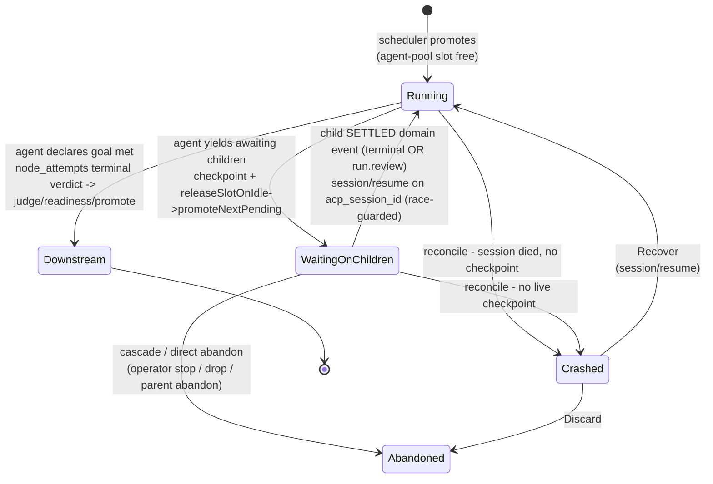
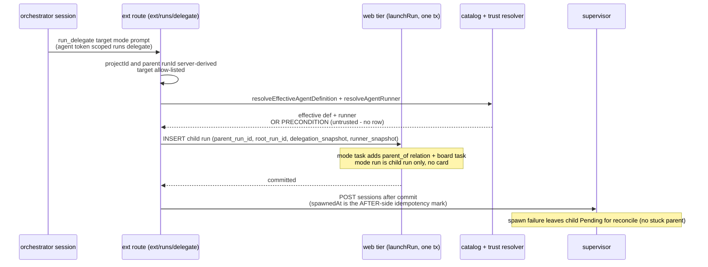
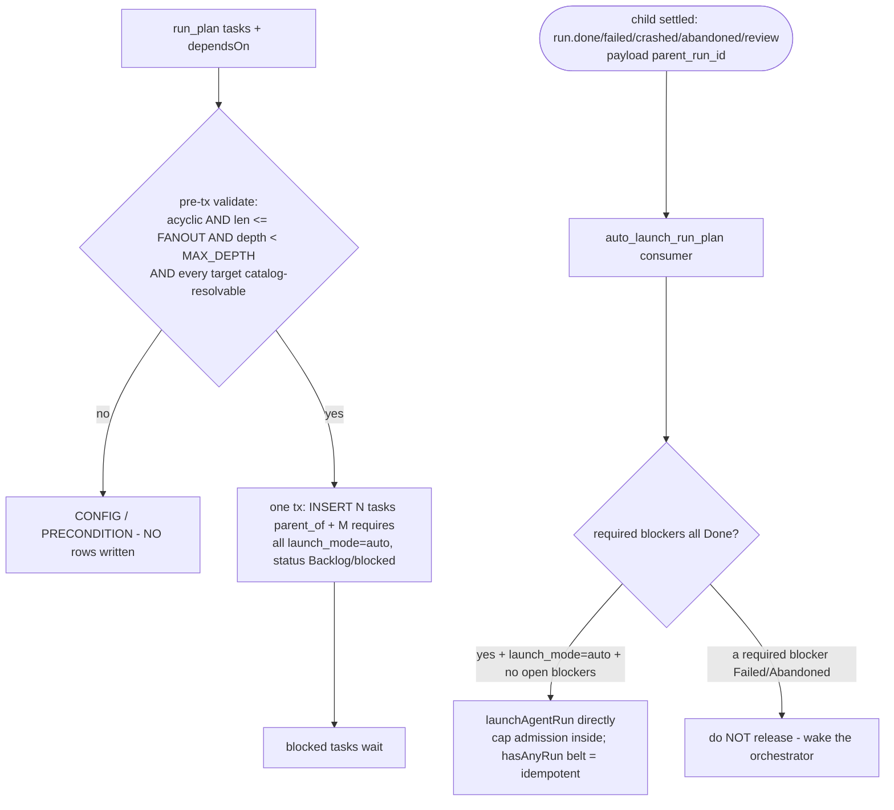
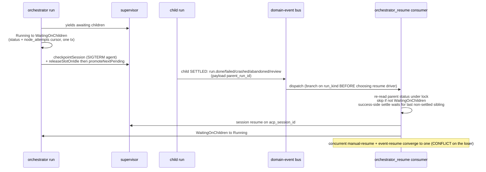
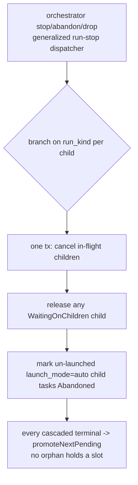
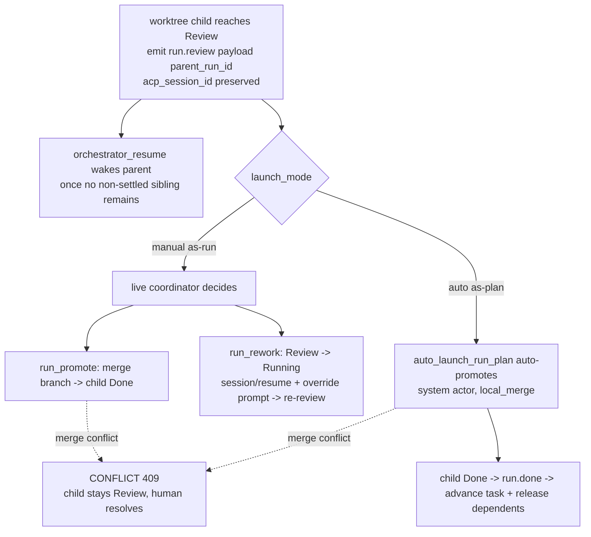
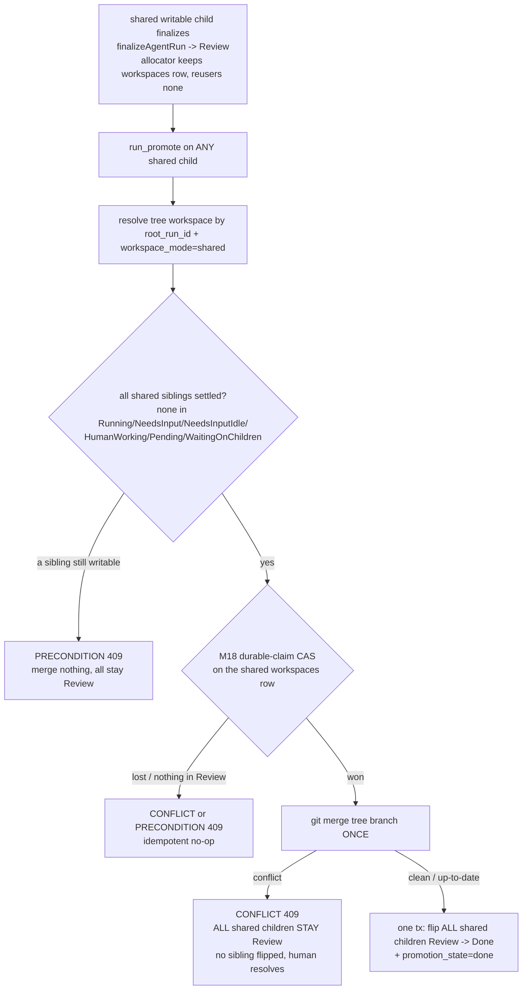

# Orchestrator engine domain

## Purpose

The orchestrator engine (**Implemented**, ADR-098/ADR-099, M37) gives a running
agent governed **dynamic delegation**: an `orchestrator` flow node is a
long-lived supervisory step that spawns and coordinates child Runs, parks
(idle-checkpoints) while they execute, and reaches a terminal verdict only when
the agent declares the goal met. Every delegated unit stays a real, governed Run
(worktree, gates, promotion, board visibility, concurrency cap); dynamism lives
only in *coordination*, never in bypassing governance, and children are
catalog-resolved (the M34 effective definition — [agents.md](agents.md)), never
runtime-authored. Boundary: this domain owns the `orchestrator` node lifecycle,
the run-tree (`runs.parent_run_id`/`root_run_id`), the `WaitingOnChildren` run
status, the delegation toolset over the MCP facade (`run_delegate` / `run_plan` /
`run_collect` / `run_cancel`), the success-gated `requires` relation kind, and the
idle-checkpoint wait + child-terminal-event resume loop. It does NOT own the base
run state machine ([runs.md](runs.md)), the outbox mechanics
([domain-events.md](domain-events.md)), the social-relation substrate it writes
through ([social-board.md](social-board.md)), the scheduler cap
([scheduler.md](scheduler.md)), the catalog/trust resolution it consumes
([agents.md](agents.md)), or capability enforcement (materialize-only per
ADR-041/ADR-043 — [flow-settings.md](flow-settings.md)). The shared-worktree
tree-level review/promote ownership model (re-enabling `workspace_mode: shared` for
writable worktrees) is **Implemented — ADR-101**; flow (f) and its
Expectations/Edge-cases carry that tag.

## Domain entities

- **Orchestrator node** (Implemented) — an `orchestrator` flow node (engine floor
  `1.6.0`) in a `FlowGraph`. Carries `action.prompt`, inherits the `ai_coding`
  capability `settings` shape, plus a `delegation` sub-block (`max_fanout?`,
  `max_depth?`). Executes as an ACP session like an `ai_coding` node, but with a
  **supervisory** lifecycle: park → delegate → `WaitingOnChildren` → resume →
  complete → downstream transition. Recorded in the `node_attempts` ledger under
  the new `node_attempts.node_type = orchestrator`. See [flow-dsl.md](../flow-dsl.md).
- **Run-tree** (Implemented) — child Runs linked to their parent by
  `runs.parent_run_id` (FK→`runs`, on-delete set-null) and to the orchestrator at
  the top of the tree by `runs.root_run_id` (FK→`runs`). A child may itself be an
  orchestrator (bounded by `MAISTER_ORCHESTRATOR_MAX_DEPTH`). See
  [db/runs-domain.md](../db/runs-domain.md).
- **`runs.delegation_snapshot`** (Implemented) — jsonb on the child run holding
  **only** the effective agent-definition id + pinned revision resolved at spawn;
  the resolved runner stays in the existing `runs.runner_snapshot` (never
  duplicated). The terminal/enforcement path reads the snapshot, never a drifting
  live projection.
- **`runs.launch_mode`** (Implemented) — `auto` | `manual`. `run_plan`-emitted child
  tasks are `auto` (the auto-launcher and cancel-cascade key on this); manually
  launched runs are `manual`.
- **`WaitingOnChildren` run status** (Implemented) — a `runs.status` value for an
  orchestrator that has yielded awaiting children. Holds **no** scheduler slot
  (the agent idle-checkpoints); allow-listed in every run-status consumer (read
  models, board, sweeps, guards) and **excluded** from the
  `MAISTER_MAX_CONCURRENT_AGENTS` cap. See [runs.md](runs.md).
- **`requires` task relation** (Implemented) — a success-gated `task_relations.kind`:
  releases a dependent **only** when the required task is `Done`; `Failed` /
  `Abandoned` keeps it blocked and wakes the orchestrator. Distinct from
  `depends_on` / `blocks` (release on Done **and** Abandoned) and `parent_of`
  (never gates). See [social-board.md](social-board.md).
- **Delegation toolset** (Implemented) — `run_delegate` / `run_plan` /
  `run_collect` / `run_cancel`, plus `run_message` (re-message a persistent
  swarm child, ADR-099) and `run_promote` / `run_rework` (resolve a reviewed
  child, ADR-100), exposed over the maister MCP facade and reachable only from an
  `orchestrator` session via a per-launch ephemeral run-bound token carrying
  `ORCHESTRATOR_TOKEN_SCOPES`
  (`runs:delegate`+`runs:collect`+`runs:cancel`+`runs:promote`). See
  [`../api/external/operations.openapi.yaml`](../api/external/operations.openapi.yaml)
  (`/api/v1/ext/runs/*`).

## State machine

The orchestrator-run execution axis. The base run FSM is in [runs.md](runs.md);
this diagram shows only the `WaitingOnChildren` wait/resume cycle that M37 adds.
All transitions Implemented.

Cancel or abandon of the orchestrator run (operator stop / drop / abandon)
**cascades** to the entire child run-tree in one transaction — see flow (d) and
Expectation 11. `WaitingOnChildren` re-reads its status under lock before any
resume RPC (Expectation 9), so a concurrent manual-resume and event-resume
converge to a single resume.

## Process flows

### (a) as-run / as-task delegation (Implemented)

The orchestrator calls `run_delegate` over the facade; the ext route hands the
**web tier** the transaction (run row + task/relation rows), and the supervisor
`POST /sessions` happens only **after** commit. `as-task` adds a `parent_of`
relation + a board task; `as-run` creates a child run with `parent_run_id` and no
board card.

### (b) as-plan task-DAG with `requires` success-gate + auto-launcher (Implemented)

`run_plan` validates the DAG **before** any write (acyclic, fan-out, depth), then
emits N child tasks + M `requires` relations in **one** transaction, all
`launch_mode='auto'`. As each blocker terminates `Done`, the `auto_launch_run_plan`
consumer flips the producer task `Done`, clears the `requires` edge, and calls
`launchAgentRun` **directly** for the now-unblocked dependent — cap admission
(Pending vs Running under the global cap) happens inside that call, so there is no
separate `promoteNextPending` mark; the per-task `hasAnyRun` belt makes a
redelivered window idempotent.

### (c) idle-checkpoint wait then child-terminal resume — the inbox (Implemented)

When the orchestrator yields awaiting children it transitions
`Running → WaitingOnChildren`, checkpoints, and releases its agent-pool slot. A
child is **SETTLED** when it reaches a terminal state (`Done` / `Failed` /
`Crashed` / `Abandoned`) OR `Review` (a diff awaiting the coordinator); each
settled transition emits a domain event carrying `parent_run_id`. A
`Failed`/`Crashed`/`Abandoned` child wakes the parent unconditionally; a
success-side settle (`run.done` OR `run.review`) wakes it only once no pending
(non-settled, `SETTLED_RUN_STATUSES`) sibling remains. The `orchestrator_resume`
consumer does the wake via ACP `session/resume`; a child reaching `Review` keeps
its `acp_session_id` so a later `run_rework` can resume it.

### (d) cancel / abandon cascade down the run-tree (Implemented)

Stopping, abandoning, or dropping an orchestrator run cascades to its children in
one transaction; every cascaded terminal honors `promoteNextPending`.

### (e) reviewed-child settle → promote / rework / auto-promote (Implemented, ADR-100)

A `worktree` child runs to `Review` (a diff), not straight to `Done`. Reaching
`Review` emits `run.review` (only when the child has a parent; `acp_session_id`
is preserved). The coordinator's choice differs by `launch_mode`: a **manual**
(as-run) child waits for the live coordinator to `run_promote` (merge → `Done`)
or `run_rework` (`Review → Running` + `session/resume` with an override prompt);
an **as-plan** (`launch_mode='auto'`) child is **auto-promoted** by
`auto_launch_run_plan` (system actor, `local_merge`) so the DAG flows without a
live coordinator. A merge conflict surfaces as `CONFLICT` (409) and leaves the
child in `Review` — never auto-resolved (§8).

### (f) shared-tree review/promote — one tree, one Review, one promote (Implemented — ADR-101)

A `workspace_mode='shared'` writable tree is ONE branch with ONE cumulative diff, so
every shared writable child finalizes to `Review` (not `Done`) and the WHOLE tree is
promoted once. The allocator (first) child owns the tree `workspaces` row; a
`run_promote` on ANY shared child resolves that row by `(root_run_id,
workspace_mode='shared')`, re-checks under lock that every shared sibling is settled,
merges once, and flips ALL shared children `Review → Done` in one transaction. The
settled-gate and the merge run BEFORE the cross-tree settle flip; exactly-once falls
out of the M18 durable-claim CAS plus the `status === 'Review'` re-check.

## Expectations

- An `orchestrator` node MUST require `compat.engine_min >= 1.6.0` (refused at
  load with `MaisterError("CONFIG")`), and `run_plan` MUST reject a cyclic
  `dependsOn`, `tasks.length > MAISTER_MAX_ORCHESTRATOR_FANOUT`, or run-tree depth
  `>= MAISTER_ORCHESTRATOR_MAX_DEPTH` BEFORE writing any row (`CONFIG`); a valid
  plan writes all task + relation rows in one transaction.
- A `WaitingOnChildren` run MUST NOT count against `MAISTER_MAX_CONCURRENT_AGENTS`
  (`countLiveRuns` excludes it) and MUST hold no scheduler slot.
- Every child Run MUST carry `runs.parent_run_id` and `runs.root_run_id`;
  `as-task` additionally creates a `parent_of` relation + a board task, while
  `as-run` creates NO board card.
- `run_delegate`/`run_plan` MUST resolve the target through the project's
  enabled+trusted catalog (`resolveEffectiveAgentDefinition`); an unresolvable or
  untrusted target is refused `PRECONDITION` and creates NO child run.
- A child run MUST snapshot its effective agent-definition id + pinned revision in
  `runs.delegation_snapshot` and its resolved runner in `runs.runner_snapshot` at
  spawn; the terminal/enforcement path reads the snapshot, never a live projection.
- A `requires` relation MUST release a dependent ONLY when the required task is
  `Done`; `Failed`/`Abandoned` MUST keep it blocked and wake the orchestrator.
  `parent_of` MUST never gate.
- `auto_launch_run_plan` MUST launch a dependency-cleared `launch_mode='auto'`
  dependent by calling `launchAgentRun` directly (cap admission inside that
  call), guarded idempotent by the per-task `hasAnyRun` belt so the dependent
  starts exactly once under concurrent child settles.
- A child SETTLE (terminal `Done`/`Failed`/`Crashed`/`Abandoned` OR `run.review`)
  MUST wake a parked parent via `orchestrator_resume` — `Failed`/`Crashed`/
  `Abandoned` unconditionally, a success-side settle (`run.done`/`run.review`)
  only once no non-settled (`SETTLED_RUN_STATUSES`) sibling remains — using ACP
  `session/resume` on `runs.acp_session_id` after branching on `runs.run_kind`
  and re-reading parent status under lock (skip if not `WaitingOnChildren`;
  concurrent resume converges to one).
- A DELEGATED child reaching `Review` MUST emit `run.review` (a top-level Review
  emits nothing) and keep its `acp_session_id`; a manual child MUST be resolvable
  via `run_promote` (merge → `Done`; conflict → `CONFLICT`, stays `Review`) or
  `run_rework` (`Review → Running` + resume), while a `launch_mode='auto'` child
  MUST instead be auto-promoted (system actor, `local_merge`) by
  `auto_launch_run_plan`.
- **(Implemented — ADR-101)** A `workspace_mode='shared'` writable tree MUST be ONE
  Review and ONE promote: every shared writable child MUST finalize to `Review`
  (never straight to `Done`); the allocator (first) child's `workspaces` row
  (`worktree_path` UNIQUE) is the tree handle and reuser children get NO row;
  `run_promote` on ANY shared child MUST resolve the tree workspace by
  `(root_run_id, workspace_mode='shared')`, MUST refuse with `PRECONDITION` while
  ANY shared sibling is in a writable status (`Running | NeedsInput |
  NeedsInputIdle | HumanWorking | Pending | WaitingOnChildren`, the complement of
  `SETTLED_RUN_STATUSES`), then MUST merge ONCE and CAS-flip ALL shared children
  of the tree `Review → Done` in one transaction (exactly-once via the M18
  durable-claim CAS on the shared `workspaces` row + the `status === 'Review'`
  re-check; a tree merge conflict returns `CONFLICT` and flips NO sibling); opening
  ANY shared child's diff MUST resolve that tree workspace (run-diff route +
  review-comments gate-diff source, NEVER an empty diff); the shared worktree MUST
  NEVER be GC-removed while any shared sibling is non-terminal; the serialized-writer
  guard (`sharedWriterSiblingActive`, one active writer per shared tree) is RETAINED
  unchanged.
- Cancelling or abandoning an orchestrator run MUST cascade to its run-tree in one
  transaction (cancel in-flight children, release `WaitingOnChildren`, mark
  un-launched `launch_mode='auto'` child tasks Abandoned) and every cascaded
  terminal MUST honor `promoteNextPending`.
- The delegation tools MUST be reachable ONLY from an `orchestrator` session (a
  run-bound token carrying `ORCHESTRATOR_TOKEN_SCOPES` =
  `runs:delegate`+`runs:collect`+`runs:cancel`+`runs:promote` materialized into
  its ACP `mcpServers`; `runs:promote` is held by NO child agent token), and the
  token MUST be revoked on terminal but MUST survive the `WaitingOnChildren` park.

## Edge cases

- **Unresolvable/untrusted delegation target** → `MaisterError("PRECONDITION")`;
  no child run created (resolve+trust is physically separate from launch).
- **Cyclic / over-fanout / over-depth DAG** → `MaisterError("CONFIG")` pre-tx; no
  rows written.
- **Orchestrator node with `engine_min < 1.6.0`** → `MaisterError("CONFIG")` at
  flow load.
- **Concurrent manual-resume + event-resume** → guarded to a single resume
  (`MaisterError("CONFLICT")` on the loser, or a no-op skip after the under-lock
  status re-read).
- **Orchestrator session crash with no checkpoint** → `Crashed`; the reconcile
  sweep surfaces "Recover or discard".
- **Supervisor spawn failure after the child run row committed** → the child is
  left `Pending` for the per-project reconcile sweep (no stuck-parent expectation;
  `spawnedAt` is the AFTER-side idempotency mark).
- **`strict` path-scoped write declaration** → `MaisterError("CONFIG")` at launch
  — real path-scoped enforcement needs the policy layer **(Phase 2)**; maister
  enforces read-only-vs-full only, so path-scope ships `instructed`-only (ADR-099).
- **Reviewer read-only child** (`workspace: repo_read` delegation) reuses the
  L1/L2/L3 read-only enforcement free via `launchAgentRun` (supervisor
  `readOnlySession` + materialized deny rules + dirty-watchdog quarantine,
  ADR-041/ADR-090 untouched) — no orchestrator-specific enforcement code.
- **`workspace_mode: shared` with no `root_run_id`** (a top-level run) →
  `MaisterError("CONFIG")` at launch — a shared tree is keyed by the tree root,
  so only a delegated child can join one (ADR-099).
- **`workspace_mode: shared` with a writable `worktree`** **(Implemented — ADR-101)** →
  one tree-level Review + one tree-level promote (NO launch gate, NOT fail-closed):
  every shared writable child finalizes to `Review`; the allocator child's
  `workspaces` row (`worktree_path` UNIQUE) is the tree handle and reuser children
  have none; `run_promote` on ANY shared child resolves the tree workspace by
  `(root_run_id, workspace_mode='shared')`, merges the tree branch once, and flips
  ALL shared children `Review → Done` in one transaction. Supersedes ADR-099 §4's
  GATED/Phase-2 decision; `workspace_mode: own` is the default and unchanged.
- **Shared tree-promote with a still-writable sibling** **(Implemented — ADR-101)** →
  `MaisterError("PRECONDITION")` (409): the promote-time settled re-check refuses
  while ANY shared sibling is in a writable status (the complement of
  `SETTLED_RUN_STATUSES` — `Running | NeedsInput | NeedsInputIdle | HumanWorking |
  Pending | WaitingOnChildren`); no merge, all siblings stay `Review`. The same
  `PRECONDITION` also covers a promote target that is not a shared child / has no
  resolvable tree workspace, and a re-promote that finds nothing in `Review`
  (already promoted — an idempotent no-op).
- **Shared tree-promote merge conflict** **(Implemented — ADR-101)** →
  `MaisterError("CONFLICT")` (409): the `local_merge` tree merge conflicts; ALL
  shared children STAY `Review`, no sibling is flipped (the conflict path runs
  BEFORE the tree-settle flip), never auto-resolved — a human resolves, then
  re-promotes (§8).
- **Shared sibling re-opened (rework) during the tree-promote merge window**
  **(Implemented — ADR-101)** → `MaisterError("CONFLICT")` (409): the finalize tx
  RE-RUNS the settled-gate under the allocator-`workspaces` lock; if a shared
  sibling left `Review` (e.g. `run_rework` `Review→Running`) after the claim
  committed and during the lockless merge, the settle ABORTS — NO shared child is
  flipped, the allocator `workspaces` row is reset to a reclaimable state, and a
  re-promote after the sibling re-settles re-merges (git up-to-date / idempotent).
  No stranded sibling work.
- **Shared child diff with no own `workspaces` row** **(Implemented — ADR-101)** → the
  run-diff route and the review-comments gate-diff source MUST resolve the shared
  TREE workspace by `(root_run_id, workspace_mode='shared')` and render the one
  shared diff — NEVER an empty diff or `PRECONDITION` "workspace not found" (the
  pre-ADR-101 reuser behavior).
- **A run-bound ext token whose orchestrator has TERMINALIZED**
  (`Done`/`Failed`/`Crashed`/`Abandoned`) → `MaisterError("PRECONDITION")` (HTTP
  409) on delegate/plan/collect/cancel/promote/rework/message. Every run-bound
  route re-checks the bound run is non-terminal (`resolveActiveBoundRun`), and the
  orchestrator's `orchestrator-run:<id>` token is revoked in the
  abandon/stop/drop/crash cascade — a stale or copied token cannot mutate a
  terminal tree (ADR-098).
- **Merge conflict on promote** (`run_promote` or the as-plan auto-promote) →
  `MaisterError("CONFLICT")` (HTTP 409); the child STAYS in `Review`, never
  auto-resolved — a human resolves it, then re-promotes (ADR-100, §8).
- **`run_promote` from a child agent token** → 403 by scope (`runs:promote` is
  held only by the run-bound orchestrator token, not child agent tokens).

## Linked artifacts

- **Decisions:** [ADR-098](../decisions.md#adr-098-orchestrator-engine--supervisory-node-governed-run-tree-delegation-toolset-success-gated-task-dag-idle-checkpoint-waitresume),
  [ADR-099](../decisions.md#adr-099-persistent-swarm-layer-2--addressable-sessions-star-routed-messaging-worktree-modes-per-agent-read-only),
  [ADR-100](../decisions.md#adr-100-delegated-child-review-settle--promoterework)
  (delegated-child `Review` settle + promote/rework, the `run.review` kind),
  [ADR-101](../decisions.md#adr-101-shared-worktree-tree-level-reviewpromote-ownership)
  (shared-worktree tree-level review/promote: allocator-row handle, per-tree Review,
  settled-gate, idempotent tree-promote settling all siblings — Designed, supersedes
  ADR-099 §4); boundary kept from ADR-041/ADR-043 (materialize-only) and ADR-008
  (closed error union — no new code).
- **Flow DSL + engine:** [`../flow-dsl.md`](../flow-dsl.md) (`orchestrator` node
  type, `1.6.0` floor, delegation semantics).
- **DB:** [`../database-schema.md`](../database-schema.md) (migration `0060`:
  run-tree columns, `WaitingOnChildren`, `node_attempts.node_type` value,
  `requires` kind; migration `0060`: the `run.review` `domain_events_kind` CHECK,
  ADR-100), [`db/runs-domain.md`](../db/runs-domain.md) (run-tree ERD),
  [`social-board.md`](social-board.md) (`requires` relation).
- **HTTP + SSE:** [`../api/external/operations.openapi.yaml`](../api/external/operations.openapi.yaml)
  (`/api/v1/ext/runs/*` delegation routes — incl. `message`/`promote`/`rework`),
  [`../api/async/web-runs.asyncapi.yaml`](../api/async/web-runs.asyncapi.yaml)
  (`WaitingOnChildren` SSE status).
- **Triggers:** [`domain-events.md`](domain-events.md) (the `auto_launch_run_plan`
  + `orchestrator_resume` sibling consumers reacting to the SETTLED set;
  `run.done/failed/crashed/abandoned` payload widened with `parent_run_id`; the
  new `run.review` settled-not-terminal kind, ADR-100),
  [`db/domain-events.md`](../db/domain-events.md).
- **Errors:** [`../error-taxonomy.md`](../error-taxonomy.md) (`PRECONDITION`,
  `CONFIG`, `CONFLICT`, `CHECKPOINT`, `EXECUTOR_UNAVAILABLE` callers).
- **Catalog/trust + run substrate:** [agents.md](agents.md)
  (`resolveEffectiveAgentDefinition`, ephemeral agent tokens), [runs.md](runs.md)
  (base FSM, `run_kind`), [scheduler.md](scheduler.md) (cap, `promoteNextPending`).
- **Source (Implemented):** `web/lib/flows/graph/runner-graph.ts` (orchestrator node
  dispatch + supervisory lifecycle + `countPendingChildren`),
  `web/lib/runs/run-status-sets.ts` (`SETTLED_RUN_STATUSES` — the shared
  child-pending set), `web/lib/social/relations.ts` (`requires` success-gate),
  `web/lib/runs/launchability.ts` (shared classifier wiring),
  `web/lib/domain-events/auto-launch.ts` (`auto_launch_run_plan` — launch +
  auto-promote) + `web/lib/domain-events/orchestrator-resume.ts`
  (`orchestrator_resume` — wake) + `web/lib/domain-events/consumers.ts`
  (registry), `web/lib/runs/promote.ts` (`promoteChildRunForToken`),
  `web/lib/agents/launch.ts` (`finalizeAgentRun` `run.review` emit +
  `reworkChildRun`), `mcp/src/tools.ts`
  (`run_delegate`/`run_plan`/`run_collect`/`run_cancel`/`run_message`/`run_promote`/`run_rework`).
- **Source (Implemented — ADR-101):** the shared-tree review/promote model threads
  through `web/lib/runs/promote.ts` (`promoteChildRunForToken` — resolve the tree
  workspace by `(root_run_id, workspace_mode='shared')`, promote-time settled
  re-check over `SETTLED_RUN_STATUSES`, merge-once + cross-tree `Review → Done`
  settle), `web/lib/agents/launch.ts` (`finalizeAgentRun` — shared writable child →
  `Review`), the run-diff route + review-comments gate-diff source (tree-workspace
  resolution), and the workspace GC (tree-aware — never remove while a shared sibling
  is non-terminal). The serialized-writer guard in `web/lib/scheduler.ts`
  (`sharedWriterSiblingActive`, wired into `tryStartRun` + `promoteNextPending`) is
  reused unchanged.
