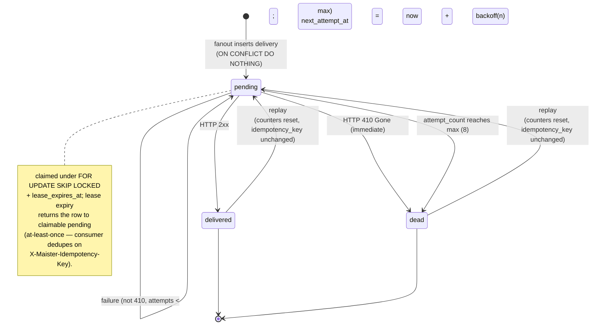
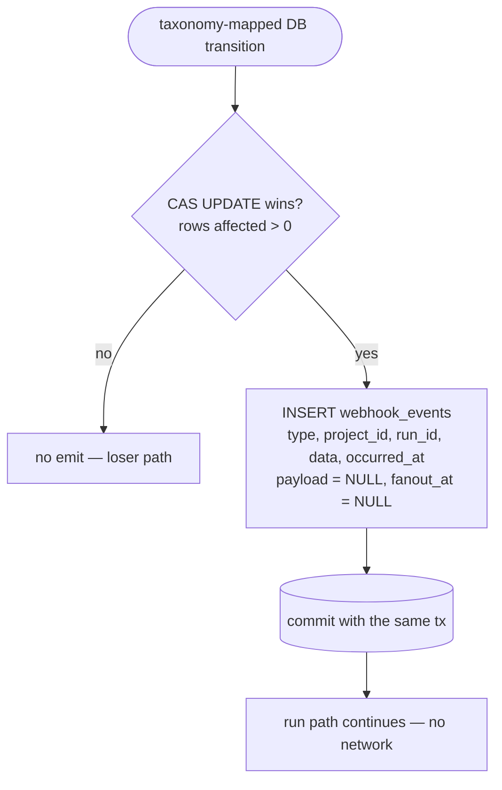
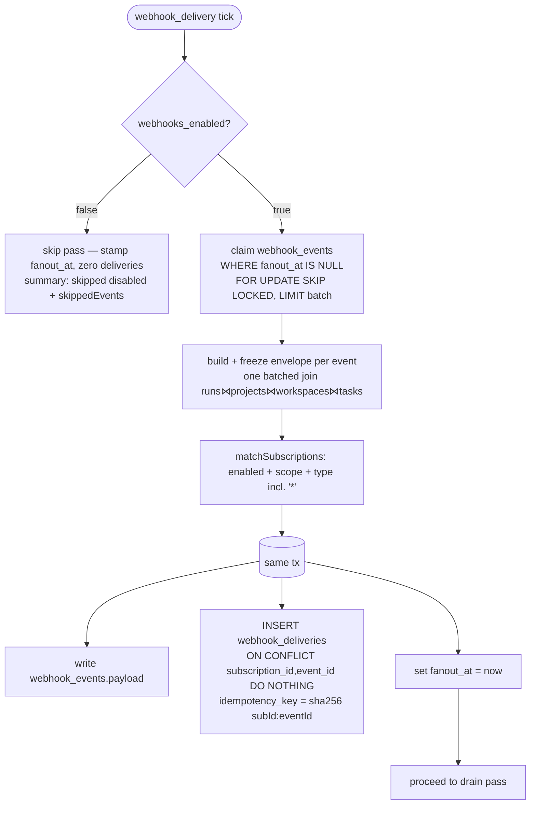
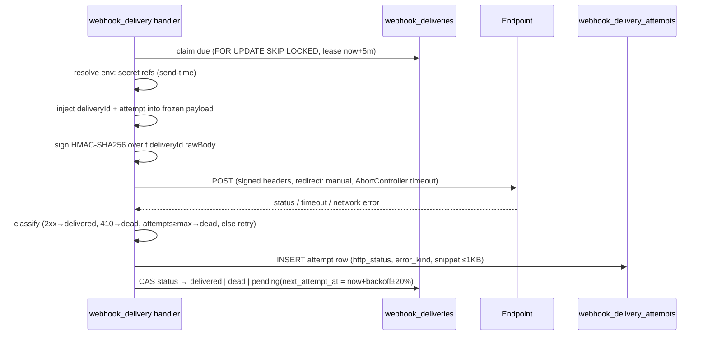
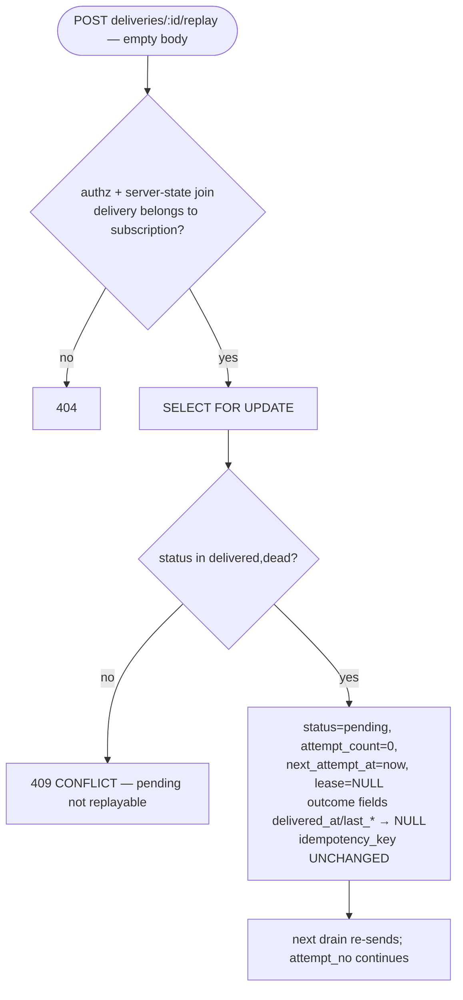

# Outbound webhooks domain

## Purpose

Outbound webhooks (**Implemented**, ADR-077) is MAIster's generic, vendor-neutral
**event-delivery primitive**: it turns curated run/HITL/gate lifecycle
transitions into signed HTTP POSTs to operator-registered endpoints. This domain
owns the full path from capture to delivery — a transactional outbox written in
the SAME transaction as each taxonomy-mapped DB transition, a fanout pass that
freezes one immutable envelope and matches subscriptions, and a tick-driven
drain pass that signs, sends, classifies, and retries with a bounded backoff
curve. It is the substrate future consumers ride on — agent-over-MCP, Telegram /
attention routing, CI triggers, external board sync — none of which this domain
implements; it only emits the events they subscribe to. Boundary: this domain
does NOT own the inbound gate-unblock surface (`external_check`), the run state
machine itself ([runs.md](runs.md)), the background clock it borrows
([scheduler.md](scheduler.md)), or the low-level `run.events.jsonl` session
stream (ADR-022) — webhook events are CURATED lifecycle facts, never raw
`session/update` noise.

## Domain entities

- **`webhook_subscriptions`** (Implemented) — one registered endpoint: `{ id,
  project_id?, name, url, method, headers, event_types, signing_secret_ref,
  secondary_signing_secret_ref?, enabled, … }`. `project_id IS NULL` = platform
  scope (matches every project); a non-null `project_id` scopes the subscription
  to one project. `headers` values and both secret refs are stored ONLY as
  `env:NAME` references, resolved server-side at send. `event_types` is a
  taxonomy-validated `string[]` (literal `"*"` = all types). Persisted; see
  [db/webhooks.md](../db/webhooks.md).
- **`webhook_events`** (Implemented) — the transactional outbox. One row per
  emitted lifecycle fact: `{ id, project_id, run_id, type, data, payload?,
  occurred_at, fanout_at?, … }`. `data` is the minimal per-type fact written at
  emit; `payload` (the full frozen envelope) is `NULL` until fanout; `fanout_at
  IS NULL` is the fanout cursor (no separate cursor table). Persisted; see
  [db/webhooks.md](../db/webhooks.md).
- **`webhook_deliveries`** (Implemented) — one row per `(subscription, event)` pair
  to attempt: `{ id, event_id, subscription_id, status, attempt_count,
  next_attempt_at, lease_expires_at?, idempotency_key, last_http_status?,
  last_error_kind?, delivered_at?, … }`. `status ∈ {pending, delivered, dead}`.
  `idempotency_key = hex(sha256("<subscriptionId>:<eventId>"))`, stable across
  every retry AND replay. Persisted; see [db/webhooks.md](../db/webhooks.md).
- **`webhook_delivery_attempts`** (Implemented) — append-only per-attempt audit:
  `{ id, delivery_id, attempt_no, requested_at, duration_ms, http_status?,
  error_kind?, error_detail?, response_snippet? }`. `error_kind ∈ {timeout,
  network, http, config}` is a LOCAL enum, not a `MaisterError` code. Persisted;
  see [db/webhooks.md](../db/webhooks.md).
- **`platform_runtime_settings.webhooks_enabled`** (Implemented) — global
  kill-switch (`boolean NOT NULL DEFAULT true`) on the singleton settings row.
- **Envelope v1** (Implemented) — the immutable JSON delivery body (below), built
  once at fanout and reused byte-identically by every retry and replay; only
  `deliveryId` and `attempt` are injected at send.

## State machine

The delivery FSM (`webhook_deliveries.status`). A delivery is born `pending` at
fanout, lands terminal `delivered` (any 2xx) or `dead` (HTTP `410 Gone`,
attempts exhausted), and may be pushed back to `pending` by an explicit operator
**replay** — counters reset, `idempotency_key` UNCHANGED. (All transitions
Implemented.)



## Process flows

### (a) Capture — same-transaction outbox INSERT

Capture rides the existing write path. `emitWebhookEvent` performs ONE INSERT of
the minimal record into `webhook_events` inside the SAME transaction as the
taxonomy-mapped status/HITL/gate write — no reads, no joins, no network. It can
only fail if the surrounding transaction was already going to fail (DB down), so
delivery can never block or fail a run. Emit happens ONLY on the CAS-winner path
(rows-affected check); a losing CAS emits nothing.



### (b) Fanout — build + freeze envelope, match, insert deliveries

The `webhook_delivery` scheduler handler (one singleton job, cadence 60s) runs
fanout first. It claims un-fanned events (`fanout_at IS NULL`, `FOR UPDATE SKIP
LOCKED`, LIMIT batch), builds the full envelope ONCE per event via a single
batched join (`runs ⋈ projects ⋈ workspaces ⋈ tasks` — `runs` has no `branch`
column), matches enabled in-scope subscriptions, then in the SAME tx writes
`payload`, inserts deliveries `ON CONFLICT (subscription_id, event_id) DO
NOTHING`, and sets `fanout_at`. Fanout is exactly-once: the cursor flip and the
delivery inserts share one transaction, with the unique constraint as
belt-and-braces.



### (c) Drain — claim due, sign, POST, classify, record

The same handler then drains due deliveries: claim `status='pending' AND
next_attempt_at <= now AND (lease NULL OR expired)` under `FOR UPDATE SKIP
LOCKED` with a fresh lease, then per delivery (bounded in-drain HTTP
concurrency) resolve secret refs, inject `deliveryId` + `attempt` into the
stored payload, sign, `fetch` with an `AbortController` timeout and
`redirect:"manual"`, classify the outcome, and in ONE tx append the attempt row
and CAS the delivery to its next state. Two-phase ordering: the `pending`
next-attempt write is the durable intent recorded BEFORE the side-effect; the
attempt + terminal marker are recorded AFTER.



### (d) Replay

`POST …/deliveries/{deliveryId}/replay` is a single transaction: `SELECT … FOR
UPDATE`, allow-list `status ∈ {delivered, dead}` (a `pending` delivery → 409
`CONFLICT`), then reset `status='pending', attempt_count=0,
next_attempt_at=now(), lease_expires_at=NULL` and clear the prior outcome
(`delivered_at`, `last_http_status`, `last_error_kind`, `last_error_message`
→ NULL). The event row is NOT re-emitted
and `idempotency_key` is UNCHANGED, so a consumer that already processed the
event treats the replay as a duplicate. Attempt audit rows keep appending —
`attempt_no` continues from the running total.



### (e) Ping — synchronous, unpersisted

`POST …/{id}/ping` (empty body) builds a synthetic `ping` envelope (synthetic
event id, the real subscription, a fresh `deliveryId`), signs it, POSTs
synchronously with the drain fetch pattern (10s timeout), and returns
`{ ok, httpStatus, durationMs, errorKind? }` live. NOTHING is persisted — no DB
write means no two-phase-commit obligation. `ping` is NOT in the outbox and is
never fanned out or retried.

## Event taxonomy v1

Exactly 13 types, each mapped from a DB transition (never raw `session/update`).
Adding a type later = one taxonomy entry + one emit site + one doc row (additive,
cheap). (All Implemented.)

| Type | Trigger anchor | Emit sites (`web/lib/`) |
| ---- | -------------- | ----------------------- |
| `run.started` | `Pending → Running` (direct start and queue-promote) | `scheduler.ts` (`tryStartRun`, `promoteNextPending`) |
| `run.needs_input` | `→ NeedsInput` (permission / form / human) | `flows/runner.ts`, `flows/runner-human.ts`, `flows/runner-agent.ts`, `flows/graph/runner-graph.ts`, `scratch-runs/events.ts` |
| `run.escalated` | execution-policy B3 on-stuck (human gate can't auto-pass: `escalate` / `notify_only`) | `flows/graph/runner-graph.ts` (`emitRunEscalated`) |
| `hitl.requested` | `hitl_requests` INSERT | `flows/runner-agent.ts`, `flows/runner-human.ts`, `flows/graph/runner-graph.ts` (persist writepoint), `scratch-runs/events.ts` |
| `hitl.responded` | `hitl_requests.responded_at` write (incl. idle-resume + auto-deliver) | `services/hitl.ts` (permission / form / human review), `flows/runner-agent.ts` (auto-deliver), `runs/resume-driver.ts` (idle-resume) |
| `run.review` | `Running → Review` (runner and workbench paths) | `flows/runner.ts`, `flows/graph/runner-graph.ts`, `workbench-lifecycle/service.ts` (stop / drop→Review), `runs/resume-driver.ts`, `scratch-runs/events.ts` |
| `run.promoted` | promotion success (mode + target in `data`) | `runs/promote.ts` (local_merge / pull_request / scratch) |
| `run.done` | `→ Done` | `runs/promote.ts` (same three paths), `flows/runner.ts` (scratch Done) |
| `run.failed` | `→ Failed` | `runs/state-transitions.ts`, `flows/runner.ts`, `flows/graph/runner-graph.ts`, `runs/keepalive-sweeper.ts` (watchdog), `services/hitl.ts` |
| `run.crashed` | `→ Crashed` (reconcile / GC / runner crash paths) | `runs/state-transitions.ts`, `flows/runner.ts`, `flows/graph/runner-graph.ts`, `flows/runner-agent.ts`, `scratch-runs/events.ts`, `scratch-runs/service.ts`, `services/hitl.ts` |
| `run.abandoned` | `→ Abandoned` (user, workbench drop, and idle-TTL sweep) | `runs/state-transitions.ts` (`markAbandoned`), `workbench-lifecycle/service.ts` (`dropWorkbench`), `runs/keepalive-sweeper.ts` (TTL pass, `source: "ttl"` — ADR-086 gap closure) |
| `gate.decided` | `gate_results` reaching `passed | failed | overridden` | `flows/graph/gate-store.ts` (insert-at-terminal + all terminal transitions) |
| `ping` | synthetic test ping — NOT persisted, NOT fanned out | `webhooks/ping.ts` |

### Deliberately NOT emitted in v1

Each is additive later (one emit site + one row); none is a wire contract today.

- **`NeedsInput ↔ NeedsInputIdle` checkpoint/resume** — internal cost-management
  lifecycle, not a consumer-relevant lifecycle fact.
- **`HumanWorking` claim / release / return** — manual-takeover internal states;
  the run re-enters the taxonomy at its next terminal/review transition.
- **Run creation / `Pending`** — pre-execution queueing; `run.started` is the
  first consumer-meaningful fact.
- **Keepalive bumps** — pure timer hygiene, no state change.
- **Gate `pending` / `running` / `stale`** — non-terminal gate churn; only
  `passed | failed | overridden` is a decision.
- **`gate.opened`** — sync gate kinds open-and-decide within one runner pass, so
  an `opened` event would be back-to-back noise immediately before
  `gate.decided`; the genuinely-waiting cases are already signalled by
  `run.needs_input` + `hitl.requested` (`human_review`) or belong to the inbound
  gate-unblock sibling (`external_check`). Additive later via one emit at the
  `gate_results` insert.
- **`node_attempts` lifecycle** — internal ledger granularity below the curated
  taxonomy.
- ~~**TTL-driven `NeedsInputIdle → Abandoned`**~~ — **superseded (ADR-086,
  Implemented):** the keepalive sweeper's TTL pass now emits `run.abandoned`
  with `source: "ttl"` inside the same transaction as the flip (the predicted
  `source` enum extension).
- **Direct recover `Crashed → Running`** (slot-free recover, `recover.ts`) —
  not a `Pending → Running` start, so no `run.started`. A recover that instead
  re-queues to `Pending` still emits `run.started { trigger: "queue_promote" }`
  on its eventual `Pending → Running` leg.
- **All `session.*` stream events** — raw `run.events.jsonl` session noise
  (ADR-022), explicitly NOT the curated taxonomy.

## Envelope v1

The HTTP body. Built once at fanout, frozen into `webhook_events.payload`, reused
byte-identically by every retry and replay; only `deliveryId` and `attempt` are
injected at send. `data` carries ids, statuses, and titles ONLY — NEVER secrets,
env values, tokens, or raw agent output.

```json
{
  "apiVersion": 1,
  "id": "<event id>",
  "type": "run.review",
  "occurredAt": "<ISO-8601 UTC>",
  "deliveryId": "<delivery id>",
  "attempt": 2,
  "project": { "id": "…", "slug": "…", "name": "…" },
  "run": { "id": "…", "taskId": "…", "flowId": "…", "branch": "…", "status": "Review" },
  "data": { /* per-type, below */ }
}
```

Top-level keys are ALWAYS present: `apiVersion` (int `=1`), `id`, `type` (one of
the 12), `occurredAt` (ISO-8601 UTC), `deliveryId`, `attempt` (int `≥1`),
`project` `{id,slug,name}`, `run` `{id,taskId,flowId,branch,status}`, `data`.

### Per-type `data` shapes

| Type | `data` shape |
| ---- | ------------ |
| `run.started` | `{ trigger: "direct" \| "queue_promote" }` |
| `run.needs_input` | `{ reason: "permission" \| "form" \| "human", nodeId: string \| null }` |
| `hitl.requested` | `{ hitlRequestId: string, kind: "permission" \| "form" \| "human", nodeId: string \| null }` |
| `hitl.responded` | `{ hitlRequestId: string, kind: "permission" \| "form" \| "human", via: "user" \| "auto" }` |
| `run.review` | `{ source: "runner" \| "workbench" }` |
| `run.promoted` | `{ mode: "local_merge" \| "pull_request", target: string, pullRequestUrl: string \| null }` |
| `run.done` | `{}` |
| `run.failed` | `{ errorCode: string \| null }` |
| `run.crashed` | `{ errorCode: string \| null }` |
| `run.abandoned` | `{ source: "user" \| "workbench" \| "ttl" }` |
| `gate.decided` | `{ gateId: string, kind: "command_check" \| "skill_check" \| "ai_judgment" \| "artifact_required" \| "external_check" \| "human_review", mode: "blocking" \| "advisory", status: "passed" \| "failed" \| "overridden", nodeAttemptId: string \| null }` |
| `ping` | `{ message: string }` |

## Retry and backoff

Per-delivery retry state lives on `webhook_deliveries.next_attempt_at`; the
singleton job's own `consecutiveFailures` tracks only handler crashes, never
delivery outcomes. (Implemented.)

| Failure # | Delay before next attempt |
| --------- | ------------------------- |
| 1 | 1m |
| 2 | 5m |
| 3 | 15m |
| 4 | 1h |
| 5 | 4h |
| 6 | 12h |
| 7 | 24h |
| — | after attempt 8 (initial + 7) → terminal `dead` |

- Max **8 attempts total** (initial + 7 retries, ≈ 41.5h span), then `dead` —
  the delivery row + its attempts ARE the dead-letter record (no separate queue
  table).
- Jitter `±20%` on every delay. Effective floor = the 60s tick cadence.
- Classification: any **2xx → `delivered`**; HTTP **`410 Gone` → `dead`
  immediately**; `attempt_count` reaching max → `dead`; **everything else (incl.
  3xx) → retry** (`redirect:"manual"` — signatures MUST NOT follow cross-origin
  redirects); a missing-env-secret (`error_kind=config`) → retry on the same
  curve (the operator may export the var), and the ref's value is NEVER logged.
- Delivery latency ≈ one tick (60s cadence + the external cron period) — fine for
  notification / CI semantics, documented as the accepted trade-off.

## Signing and rotation

- **HMAC-SHA256** (`node:crypto`), hex digest. The secret is resolved
  server-side at send from `signing_secret_ref` (`env:NAME → process.env.NAME`).
- **Signature base string:** `"${t}.${deliveryId}.${rawBody}"` where `t` = unix
  seconds at send. Binding time + delivery id + the exact body bytes lets a
  consumer reject a stale `t` to kill replay attacks.
- **Headers on every delivery:**

  | Header | Value |
  | ------ | ----- |
  | `Content-Type` | `application/json` |
  | `User-Agent` | `MAIster-Webhooks/1` |
  | `X-Maister-Event` | `<type>` |
  | `X-Maister-Event-Id` | `<event id>` |
  | `X-Maister-Delivery-Id` | `<delivery id>` |
  | `X-Maister-Idempotency-Key` | `hex(sha256("<subscriptionId>:<eventId>"))` |
  | `X-Maister-Signature` | `t=<unix>,v1=<hex>[,v1=<hex2 from secondary secret>]` |

- **Rotation:** an optional `secondary_signing_secret_ref` appends a second `v1=`
  entry (Stripe scheme). The consumer accepts ANY match; the operator overlaps
  both refs, then drops the old one.

## Crash windows and delivery semantics

Delivery is **at-least-once, unordered**; the consumer dedupes on
`X-Maister-Idempotency-Key`. Per-subscription ordering is rejected — it forces
serial delivery per endpoint, so one delivery in a 24h backoff would dam every
later event for that endpoint (head-of-line blocking), fatal for notification
semantics. Events carry `occurredAt` + `run.id` so consumers can order
themselves. Every crash window converges to a duplicate send, which the
idempotency key absorbs:

- **Death between claim-lease and POST** → the lease expires → the row is
  reclaimed and re-sent.
- **Death between POST and attempt-record** → the lease expires → re-sent (the
  consumer already received the first POST; the key makes the duplicate a no-op).
- `FOR UPDATE SKIP LOCKED` + the lease prevents concurrent double-send on
  overlapping ticks; a concurrent-tick integration test asserts exactly-one send.

## Disable semantics

- Global `platform_runtime_settings.webhooks_enabled = false` OR per-subscription
  `enabled = false` → the subscription is SKIPPED at fanout. Window events are
  NEVER delivered retroactively (skip, not buffer).
- While globally disabled, each scheduler tick runs a **skip pass**: un-fanned
  events are claimed (same `FOR UPDATE SKIP LOCKED` batch bound as fanout) and
  stamped `fanout_at = now()` with NO frozen payload and ZERO delivery rows —
  consumed-and-dropped, reported as `skippedEvents` in the job summary. The
  prune tail-pass GCs them after retention once re-enabled.
- Deliveries already fanned out before a global disable PAUSE in `pending`
  (the disabled tick skips the drain pass entirely) and RESUME on re-enable.

## SSRF stance

- Scheme allow-list: **http / https only**, boundary-validated on the `url`
  field.
- **Destination egress policy (Implemented, ADR-077 revised)** —
  `web/lib/webhooks/destination.ts`. Blocked ranges: loopback (`127.0.0.0/8`,
  `::1`), private (`10/8`, `172.16/12`, `192.168/16`, `fc00::/7`), link-local
  incl. the `169.254.169.254` cloud-metadata endpoint (`169.254/16`,
  `fe80::/10`), multicast, unspecified (`0.0.0.0/8`, `::`); IPv4-mapped IPv6
  classifies by the embedded IPv4.
  - **Write-time** (`assertUrl` on create/update): an IP-literal host in a
    blocked range → `MaisterError("CONFIG")` → 422. Hostnames pass here —
    their records are only knowable at send time.
  - **Send-time** (`signAndSend`, the single chokepoint for drain AND ping):
    IP literals re-checked; hostnames resolved (`dns.lookup`, all records) and
    refused if ANY answer is blocked. A refused destination is an
    `error_kind: "config"` failure decided BEFORE the wire — the drain retries
    on the curve, ping reports the config failure, nothing is sent.
  - **DNS-rebind (TOCTOU) closed**: the connect goes through an undici
    dispatcher pinned to the vetted lookup answers; TLS SNI/cert validation
    still uses the hostname.
  - **Operator override**: `MAISTER_WEBHOOK_ALLOW_HOSTS` (comma-separated
    exact hosts, case-insensitive) exempts known-internal endpoints — e.g.
    `127.0.0.1` for a local consumer in dev/e2e.
- Rationale (supersedes the v1 deferral): a `member`-created subscription or
  ping must not become a read primitive against IMDS or intra-host services —
  the truncated response snippet is persisted on the delivery attempt and
  readable by project viewers.

## Identifier discipline (per route)

Every cross-resource id is a url-param or a server-state join; bodies carry
config values only — zero body-controlled cross-resource ids. `ping` and
`replay` take EMPTY bodies. (Implemented.)

| Label | Carrier |
| ----- | ------- |
| `slug`, subscription `id`, `deliveryId` | url-param |
| acting user + role | auth-context (`requireGlobalRole("admin")` for platform; project membership for project scope) |
| project ↔ subscription ↔ delivery ownership | server-state joins — a mismatch returns 404, never trusts the body |
| subscription config (`name`, `url`, `method`, `headers`, `event_types`, secret refs) | body-controlled (config values only) |
| `ping` / `replay` inputs | none — empty body |

Routes: platform admin under `/api/admin/webhooks*` + `/api/admin/webhook-settings`
(all `requireGlobalRole("admin")`); project routes under
`/api/projects/{slug}/webhooks*` (write allow-list `owner | admin | member`,
`viewer` read-only — deliberately looser than the MCP-catalog admin-write
precedent). Subscription `DELETE` is usage-guarded: 409 `CONFLICT` while ANY
delivery history exists (retire via `enabled=false`).

## Expectations

- The capture INSERT into `webhook_events` MUST share the transaction of its
  taxonomy-mapped transition and MUST emit only on the CAS-winner path; a losing
  CAS MUST emit nothing and delivery MUST NEVER block or fail a run.
- A `webhook_deliveries` row MUST be unique per `UNIQUE (subscription_id,
  event_id)`; fanout MUST insert `ON CONFLICT DO NOTHING` so re-fanout never
  duplicates a delivery.
- `webhook_events.payload` MUST be NULL until fanout, MUST be frozen in the same
  transaction that sets `fanout_at`, and MUST be reused byte-identically by every
  retry and replay (only `deliveryId`/`attempt` injected at send).
- `webhook_deliveries.status` MUST be one of `pending | delivered | dead`; any
  2xx MUST land `delivered`, HTTP `410` MUST land `dead` immediately, and
  `attempt_count` reaching the max (8) MUST land `dead`.
- The retry schedule MUST be `1m, 5m, 15m, 1h, 4h, 12h, 24h` with `±20%` jitter,
  at most 8 attempts total, never below the 60s tick floor.
- `X-Maister-Idempotency-Key` MUST equal `hex(sha256("<subscriptionId>:<eventId>"))`
  and MUST stay UNCHANGED across every retry AND every replay.
- `X-Maister-Signature` MUST be HMAC-SHA256 hex over `"${t}.${deliveryId}.${rawBody}"`;
  when `secondary_signing_secret_ref` is set the header MUST carry two `v1=`
  entries.
- Subscription `headers`, `signing_secret_ref`, and `secondary_signing_secret_ref`
  MUST persist only as `env:NAME` references; a raw value MUST be rejected with
  `MaisterError("CONFIG")` and MUST NEVER be logged, streamed, or echoed in any
  response, and envelope `data` MUST carry ids/statuses/titles only.
- Replay MUST be allowed only from `status ∈ {delivered, dead}`; replaying a
  `pending` delivery MUST return `MaisterError("CONFLICT")`, and replay MUST NOT
  re-emit the event nor change `idempotency_key`.
- Subscription `DELETE` MUST be usage-guarded: while ANY `webhook_deliveries`
  history exists it MUST return `MaisterError("CONFLICT")`; retirement is
  `enabled=false`.
- When `platform_runtime_settings.webhooks_enabled = false` OR a subscription's
  `enabled = false`, that subscription MUST be skipped at fanout (window events
  never delivered retroactively); a globally-disabled tick MUST stamp un-fanned
  events consumed-and-dropped (`fanout_at` set, `payload` NULL, zero
  deliveries); already-fanned-out `pending` deliveries pause and resume on
  re-enable.
- Subscription `url` MUST be `http`/`https` only AND satisfy the destination
  egress policy at write and send time (blocked: loopback / private /
  link-local incl. metadata / multicast / unspecified; a blocked send records
  `error_kind: "config"` and never reaches the wire;
  `MAISTER_WEBHOOK_ALLOW_HOSTS` exempts exact hosts); project-scope writes MUST
  require `owner | admin | member` (`viewer` read-only) and platform-scope writes
  MUST require `requireGlobalRole("admin")`.

## Edge cases

- **Missing env secret at send** (`error_kind=config`) → the delivery retries on
  the normal backoff curve; the ref's value is never logged. The validation-time
  bad-ref case (raw value or malformed `env:` ref on write) is
  `MaisterError("CONFIG")`.
- **Replay of a `pending` delivery** → `MaisterError("CONFLICT")` (the FSM
  allow-list rejects it); only `delivered`/`dead` are replayable.
- **`DELETE` of a subscription with delivery history** → `MaisterError("CONFLICT")`;
  the UI suggests `enabled=false`. Hard delete succeeds only for a never-delivered
  subscription.
- **Cross-project / cross-subscription id in the URL** (delivery does not belong
  to the named subscription, or a platform subscription requested under a project
  route) → 404 via the server-state join, never a body-trusted lookup.
- **Duplicate fanout under concurrent ticks** → `ON CONFLICT (subscription_id,
  event_id) DO NOTHING` keeps it idempotent; no error.
- **Concurrent drains claiming the same due delivery** → `FOR UPDATE SKIP LOCKED`
  + lease yields exactly one send; the other tick skips the locked row.
- **Crash between POST and attempt-record** → lease expiry reclaims and re-sends;
  the consumer absorbs the duplicate via the idempotency key (at-least-once).
- **HTTP `3xx` response** → treated as a retryable failure (`redirect:"manual"`);
  signatures never follow cross-origin redirects.
- **No matching subscriptions for an event** → no deliveries inserted; the
  zero-delivery `webhook_events` row is pruned after 7 days (events referenced by
  any delivery are kept forever for replay/audit).
- **Non-admin hitting a platform route** / **viewer writing a project
  subscription** → `MaisterError("UNAUTHORIZED")` (403) before any mutation.

## Linked artifacts

- **Decision:** [ADR-077](../decisions.md#adr-077-outbound-webhooks-generic-event-delivery-primitive-transactional-outbox--singleton-drainer).
- **HTTP API:** [`api/web.openapi.yaml`](../api/web.openapi.yaml) — admin +
  project webhooks CRUD, deliveries log, ping, replay, webhook-settings.
- **Outbound wire contract:** [`api/async/outbound-webhooks.asyncapi.yaml`](../api/async/outbound-webhooks.asyncapi.yaml)
  — envelope v1, headers, signature recipe, per-type payloads.
- **DB:** [`db/webhooks.md`](../db/webhooks.md) and
  [`database-schema.md`](../database-schema.md) — the 4 tables + the
  `platform_runtime_settings.webhooks_enabled` column (migration `0040`).
- **Background clock:** [`scheduler.md`](scheduler.md) — the `webhook_delivery`
  job kind, `webhookDelivery: 1` budget, and `webhook_delivery.default` 60s seed.
- **Related boundary:** the inbound gate-unblock surface (`external_check`,
  [readiness.md](readiness.md) / [flow-graph.md](flow-graph.md)) is a separate
  sibling, not this domain.
- **Errors:** [error-taxonomy.md](../error-taxonomy.md) —
  `CONFIG | CONFLICT | PRECONDITION | UNAUTHORIZED` (no new code).
- **Source:** `web/lib/webhooks/*` (`taxonomy.ts`, `signing.ts`, `backoff.ts`,
  `outbox.ts`, `match.ts`, `subscriptions.ts`, `replay.ts`, `ping.ts`),
  `web/lib/scheduler/handlers/webhook-delivery.ts`,
  `web/app/api/admin/webhooks/**`, `web/app/api/projects/[slug]/webhooks/**`,
  `web/components/webhooks/*`.
