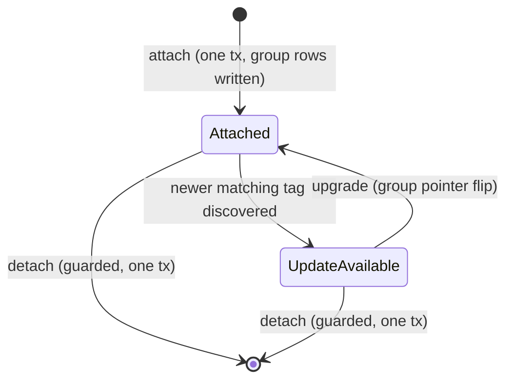
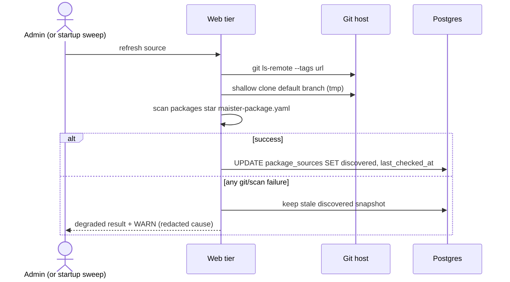
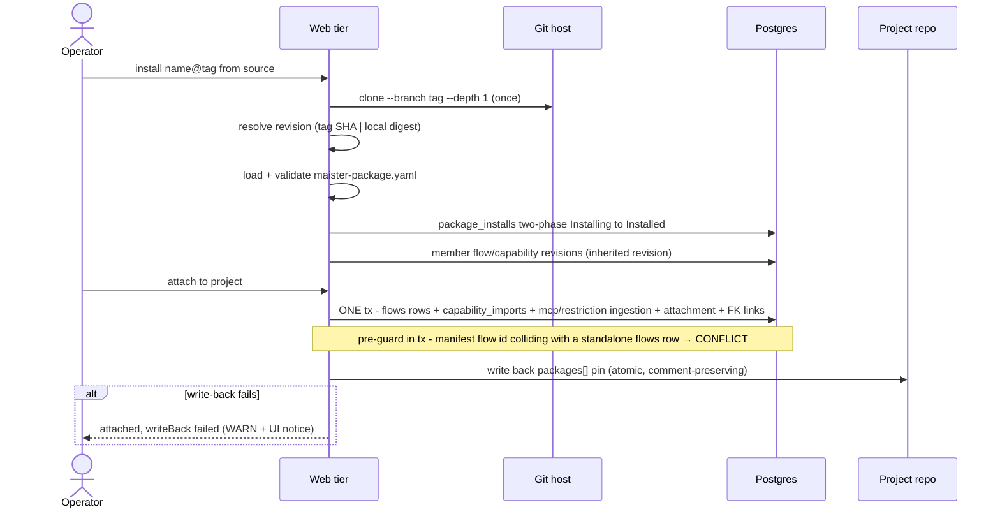

# Packages domain

## Purpose

Packages are the multi-flow distribution unit above the per-revision install
substrate of [`flow-packages.md`](flow-packages.md): one git-monorepo source
ships several flows plus the capability content they need (skills, agents, MCP
server templates, restriction path-sets) under a single
`maister-package.yaml` manifest and a single per-package version tag. This
domain covers platform package sources, version discovery, package
installation, per-project attachment/detach/upgrade, package-level trust, local
versions, and the `maister.yaml packages[]` bootstrap + write-back contract
(ADR-087). Everything below is **(Implemented)** — shipped by the
`feature/package-management` plan (M33); per-revision install/trust mechanics stay in
[`flow-packages.md`](flow-packages.md) and are referenced, not restated.

## Domain entities

- **Package source** — a configured git monorepo URL (`package_sources` row,
  platform scope): enabled flag, cached `discovered` snapshot, `last_checked_at`.
- **Discovered package** — a `packages/<name>/maister-package.yaml` found in a
  source's default branch, plus its `<name>/vX.Y.Z` tags (cached jsonb on the
  source row; not separately persisted).
- **Package install** — an immutable installed package revision
  (`package_installs` row): source URL, name, version label, resolved revision
  (tag SHA or local content digest), manifest + inventory, install path, trust
  state.
- **Project package attachment** — per-project enablement of one package
  install (`project_package_attachments` row); member `flows` and
  `capability_imports` rows join the group via nullable `package_install_id`
  FKs (ERD: [`../db/projects-domain.md`](../db/projects-domain.md)).
- **Local version** — a package install whose source is a local directory;
  version label `local-<digest12>`, content-digest addressed.
- **Package manifest** — `maister-package.yaml` v1 (schema:
  [`../configuration.md`](../configuration.md)): `flows[]`, `capabilities[]`,
  `mcps[]` templates, `restrictions[]` path-sets, package metadata.

## State machine

A package install reuses the revision lifecycle vocabulary of
[`flow-packages.md`](flow-packages.md) (`Installing → Installed | Failed`,
`Removed` via GC). The per-project **attachment** lifecycle is new:

## Process flows

### Discovery (refresh button / startup debounce)

Per enabled source: tag listing plus a shallow manifest scan; failures degrade
to the cached snapshot and never block the catalog page.

The startup path runs the same refresh for enabled sources whose
`last_checked_at` is null or older than `MAISTER_PACKAGE_DISCOVERY_STALE_HOURS`
(default 24), sequentially, fire-and-forget.

### Install + attach

Install is idempotent and content-addressed (one resolved revision per
package; every member sub-install inherits it). Attach writes the project
group in one transaction; the `maister.yaml` write-back is a post-commit
side-effect.

### Detach / upgrade / trust

- **Detach**: refuse with `PRECONDITION` while any member revision is pinned
  by a non-terminal run; otherwise one transaction removes the attachment,
  member `flows` rows, ingested MCP/restriction records; member revisions stay
  for in-flight runs and GC ([`reconciliation-gc.md`](reconciliation-gc.md)).
- **Upgrade**: install the newer revision beside the old one, then one
  transaction flips the group pointers; in-flight runs keep their pinned
  revisions; write-back updates the yaml pin.
- **Trust**: one operator decision per package revision; the same transaction
  fans `trust_status`/`exec_trust` onto every member `flow_revisions` +
  `capability_imports` row, THEN the existing post-trust setup path runs
  per-member `setup.sh` (never at install — fetch and execute stay physically
  separate, ADR-021/ADR-042/ADR-069).

### Crash windows (attach path)

| Window | Reachable state | Recovery |
| --- | --- | --- |
| Install done, attach tx not committed | Orphan package install | Harmless; reused on retry or swept by GC when unreferenced |
| Attach tx committed, write-back not performed | DB attached, yaml stale | Next attach/detach/upgrade rewrites the pin; manual edit also valid |
| Trust tx committed, setup not yet run | Members trusted, `setup_status='pending'` | Existing launch precondition refuses until setup completes; setup retried via the trust/enable path |

## Expectations

- Exactly one `package_installs` row per `(source_url, name,
  resolved_revision)`; installed package revisions are immutable.
- Attach group writes — member `flows` rows, `capability_imports`,
  MCP/restriction ingestion, `project_package_attachments`,
  `package_install_id` FK links — MUST commit in ONE transaction.
- Attach MUST refuse with `MaisterError("CONFLICT")` when a manifest flow id
  collides with an existing standalone `flows` row of the project
  (`flows_project_ref_uq`).
- `setup.sh` NEVER executes during package install or attach; only the
  post-trust setup path runs it, per member revision.
- A package trust decision MUST fan `trust_status`/`exec_trust` to ALL member
  rows in the same transaction.
- Every member sub-install MUST record the package's resolved revision (tag
  SHA or content digest) as `flow_revisions.resolved_revision` — never the
  `"unknown"` sentinel.
- `maister.yaml` write-back happens AFTER the mutating transaction commits; a
  write-back failure MUST NOT roll back the operation and MUST surface
  `writeBack: "failed"` to the caller.
- Detach MUST refuse with `MaisterError("PRECONDITION")` while any member
  revision is pinned by a non-terminal run's `runs.flow_revision_id`.
- Upgrade flips group pointers only; in-flight runs keep their pinned
  revisions (ADR-021 pinning contract unchanged).
- Per-source discovery failure MUST degrade to the cached `discovered`
  snapshot with a WARN and never block the catalog surface.
- MCP templates and restriction records ingested on attach MUST be removed on
  detach and recreated on re-attach (SET / CLEAR / re-SET symmetric).
- `packages[].version` accepts `/` (tag form `<name>/vX.Y.Z`); member
  sub-installs receive the path-safe label (`/` → `-`) because
  `versionTagSchema` forbids slashes.

## Edge cases

- **`git ls-remote` / clone failure during discovery** → degraded refresh
  result (stale cache + WARN); no `MaisterError` surfaces to the page.
- **`maister-package.yaml` invalid (schema, dup ids, escape path, bad
  `env:NAME` ref)** → `MaisterError("CONFIG")`; nothing installed.
- **Manifest `flows[].id` ≠ the referenced `flow.yaml` `name`** →
  `MaisterError("CONFIG")` from the package installer.
- **Package install clone/copy failure** → `MaisterError("FLOW_INSTALL")`
  (stage-tagged, ADR-021 shape).
- **Attach with colliding standalone flow id** → `MaisterError("CONFLICT")`,
  no partial group.
- **Detach while a member revision is run-pinned** →
  `MaisterError("PRECONDITION")`.
- **Source delete while installs from it are attached** →
  `MaisterError("CONFLICT")` (usage guard).
- **Write-back target unwritable** → operation succeeds, `writeBack:
  "failed"` + WARN; DB remains the runtime truth.
- **Registration `packages[]` id colliding with `flows[]` /
  `capability_imports[]` ids** → `MaisterError("CONFIG")` at config load.

## Linked artifacts

- Decision: [`../decisions.md` ADR-087](../decisions.md#adr-087-multi-flow-package-management)
  (+ amended [ADR-021](../decisions.md#adr-021-flow-package-lifecycle-multi-revision-trust-and-compatibility)).
- Design: `docs/pv/package-management.md` (owner-approved target picture).
- Revision substrate: [`flow-packages.md`](flow-packages.md);
  flow entity/install pipeline: [`flows.md`](flows.md),
  [`../flow-installer.md`](../flow-installer.md).
- Config contract: [`../configuration.md`](../configuration.md)
  (`packages[]`, `maister-package.yaml` v1,
  `MAISTER_PACKAGE_DISCOVERY_STALE_HOURS`).
- ERD: [`../db/projects-domain.md`](../db/projects-domain.md),
  [`../database-schema.md`](../database-schema.md).
- Web API: [`../api/web.openapi.yaml`](../api/web.openapi.yaml)
  (`/api/admin/package-sources*`, `/api/admin/package-installs`,
  `/api/projects/{slug}/packages*`).
- AIF package content: the `maister-plugins` repo (`packages/aif`,
  tag `aif/v2.0.0`); consumption notes in
  [`../flow-aif-plugin.md`](../flow-aif-plugin.md).
