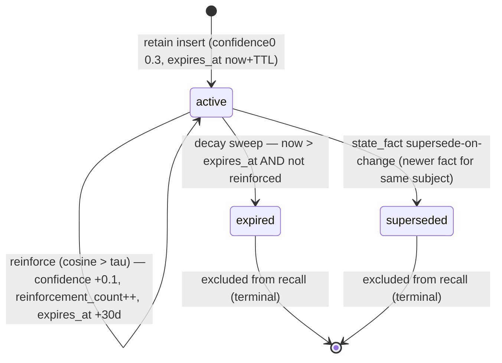
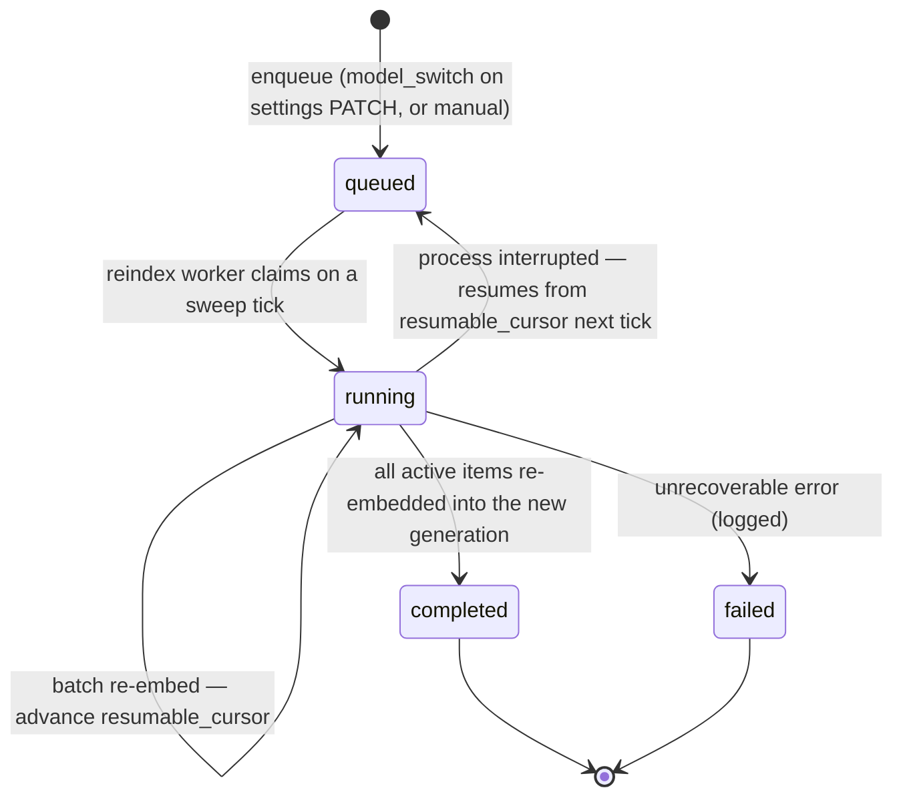
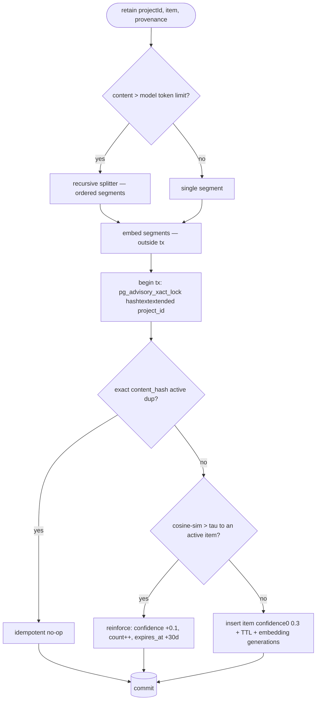
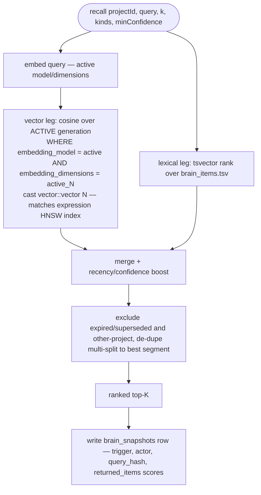
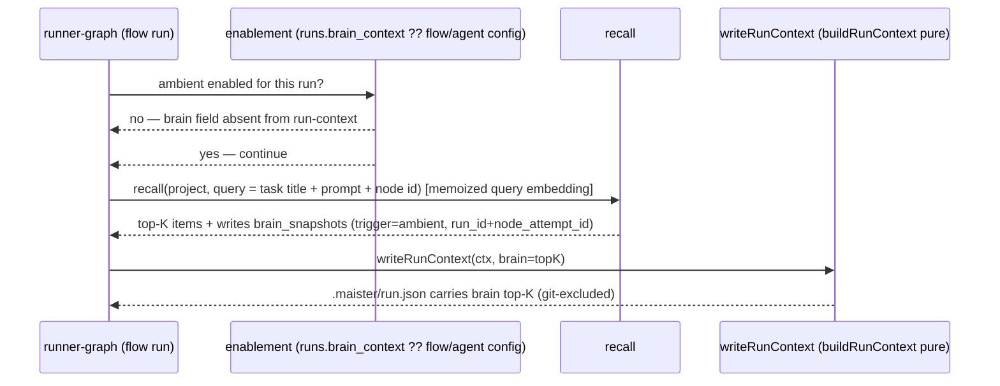
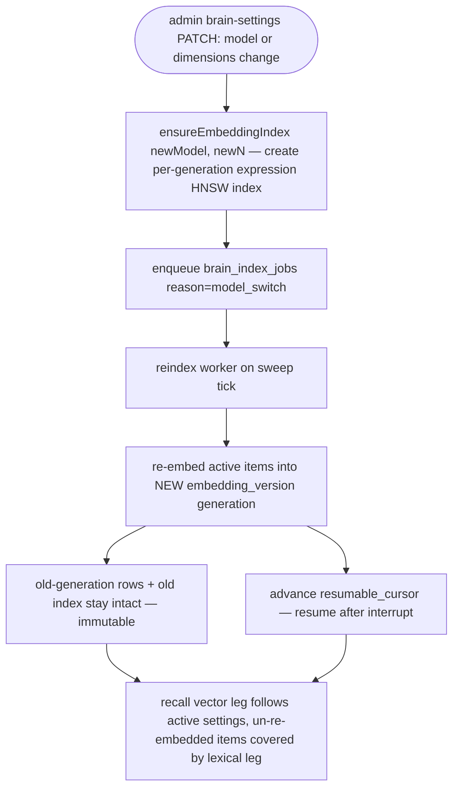

# Project Brain domain (Sub-project A — Foundation)

## Purpose

The **Project Brain** (ADR-122) is MAIster's per-project, vectorized knowledge
substrate: a self-improving, project-scoped memory that platform agents use
natively. **Sub-project A (Foundation)** — the slice this doc governs — ships the
**owned/volatile tier** only: kinds `lesson` / `observation` / `state_fact`
auto-harvested from the `domain_events` bus, embedded and stored in `brain_*`
tables on the existing Postgres + pgvector instance, decayed by a scheduled
sweep, and read back through a hybrid `RecallRanker` (no LLM at read) via three
paths — an MCP tool (explicit), the P7 run-context (ambient, flow runs only), and
the external operations API. Boundary: this domain owns the `brain_*` tables, the
harvest consumer, distillation, retain/decay/recall, the embedding-provider
registry, and the 4-layer enablement axes; it does NOT own the `domain_events`
fact log it consumes ([domain-events.md](domain-events.md)), the run state machine
([runs.md](runs.md)), the M25 authored catalog (the canonical source of truth), or
the clock the decay/reindex sweeps borrow ([scheduler.md](scheduler.md)). The
indexed/consultant tier (`ChunkerRegistry`, `decision`/`direction` kinds, canonical
pointers) is **Sub-project B**; the self-improvement `brain_proposals` bridge and
LSP edge connector are **Sub-project C**.

## Domain entities

- **`brain_items`** (Designed) — one knowledge item: `{ id, project_id (FK,
  ON DELETE CASCADE — the auth boundary), kind (lesson|observation|state_fact in A),
  tier (owned), title, content, status (active|expired|superseded), confidence,
  reinforcement_count, last_reinforced_at, expires_at, content_hash, provenance
  (source_run_id?, source_node_attempt_id?, source_domain_event_id?,
  source_gate_kind?), created_at, updated_at, tsv (generated tsvector) }`. See
  [db/brain-domain.md](../db/brain-domain.md).
- **`brain_embeddings`** (Designed) — **immutable** per (item, embedding
  generation): `{ id, item_id (FK cascade), split_ordinal, vector (dimension-
  untyped), embedding_provider, embedding_model, embedding_dimensions,
  embedding_version, source_hash, content_hash, embedded_at }`. N rows per item
  across generations × splits. A model OR dimension switch writes a NEW generation,
  never mutates a row. One **active** generation is read at recall.
- **`brain_snapshots`** (Designed) — a recall snapshot written at **consumption**
  (ambient inject or explicit recall) for reproducibility/audit: `{ id, run_id?
  (FK), node_attempt_id?, actor_type, actor_id, trigger (ambient|explicit), query,
  query_hash, embedding_model, returned_items (jsonb: [{itemId, score}] — ids AND
  scores), ranker_version, created_at }`. The launch-time *decision* to include
  Brain context persists on `runs.brain_context`, not here.
- **`brain_index_jobs`** (Designed) — reindex work: `{ id, project_id (FK), reason
  (model_switch|manual in A), status, progress, resumable_cursor, created_at }`.
  Consumed by the reindex worker on the M24 tick.
- **Shared-table columns (Designed, migration `0088`)** — `platform_runtime_settings`
  gains `embedding_base_url`, `embedding_model`, `embedding_dimensions`,
  `embedding_api_key_ref`, `distill_model` (all nullable); `projects.brain_enabled`
  (bool, default false); `agent_project_links.can_read_brain` /
  `can_write_brain` (bool, default false); `runs.brain_context` (bool, nullable —
  null = inherit flow/agent config).
- **Kinds (owned tier, A subset)** (Designed) — `lesson` (decay TTL, promoted by
  recurrence), `observation` (slower decay), `state_fact` (supersede-on-change, not
  decayed). `decision`/`direction` (indexed tier) are **(Phase 2 — Sub-project B)**.
- **Policy constants** (Designed) — `web/lib/brain/policy.ts`: τ=0.85 (dedup cosine),
  confidence₀=0.3, TTL=30d, reinforce=+0.1 confidence / +30d `expires_at`, ambient
  K=5. Named constants, tune-on-real-runs; not env, not DB in A.
- **`RecallRanker`** (Designed) — the DIP seam (`web/lib/brain/recall-ranker.ts`):
  a swappable ranking interface with a default pgvector hybrid implementation.

## State machine

### `brain_items` lifecycle (Designed)

An item is inserted `active` at confidence₀; a semantically-near retain **reinforces**
it in place (self-loop, no new row); the decay sweep expires it past `expires_at`; a
new `state_fact` about the same subject supersedes the prior one.

Embedding generations are immutable: an item's `active` status is orthogonal to how
many `brain_embeddings` generations it carries. A reindex adds a new generation and
moves the active-generation pointer (platform embedding settings); old rows persist.

### `brain_index_jobs` lifecycle (Designed)

## Process flows

### (a) Harvest → distill → retain (Designed)

The `memory_harvest` consumer rides the `domain_events` dispatcher
([domain-events.md](domain-events.md)). It matches an explicit per-kind predicate
(`RUN_TERMINAL_EVENT_KINDS` + `gate.failed`; `run.review` excluded), skips when the
project's Brain is disabled, distills concrete sources into a structured lesson, and
calls `retain` with provenance FKs.

### (b) `retain` — atomic dedup-or-reinforce (Designed)

`retain` embeds OUTSIDE the transaction, then serializes per-project writes with an
advisory lock and either reinforces a near active item or inserts a new one.

The partial UNIQUE `(project_id, content_hash) WHERE status = active` makes the
exact-dup race a `CONFLICT`-mapped constraint at the DB, not a duplicate row; the
partial UNIQUE `(project_id, source_domain_event_id)` makes at-least-once harvest
redelivery idempotent at the DB.

### (c) Recall — hybrid, no LLM at read (Designed)

The lexical leg also covers items not yet re-embedded mid-reindex. No completion/LLM
call happens on this path.

### (d) Ambient inject via P7 (flow runs only) (Designed)

Recall is computed in `runner-graph.ts` (which has DB + policy) and the ready brain
projection is passed INTO `writeRunContext` as plain data — `buildRunContext` stays
pure. The query embedding is memoized per runner process, keyed by
`hash(query + embedding_model + embedding_dimensions)`.

### (e) Reindex on model/dimension switch (Designed)

### (f) Decay sweep (throttled) (Designed)

`runBrainDecaySweep()` is folded into `runSystemSweep()`. The 60s system tick
self-throttles the sweep to hourly via a last-run stamp; confidence aging is computed
from elapsed time (never per-tick decrements). Items past `expires_at` without
reinforcement become `expired` and drop out of recall. A sweep error is caught into
the sweep summary, never thrown.

## Expectations

*(E-n pin the spec §13 numbering, top-to-bottom. A-relevant subset below; E-5, E-9,
E-13, E-14 and the source-indexing half of E-7 are **(Phase 2 — Sub-projects B/C)**.
All A pieces tagged (Designed) flip to (Implemented) at T6.2.)*

- **E-1** — Every `brain_*` row MUST carry `project_id`; recall MUST NEVER return
  items across a `project_id` boundary. (Designed)
- **E-2** — `brain_embeddings` rows MUST be immutable; a model or dimension change
  MUST create a new embedding generation, NEVER mutate an existing row. (Designed)
- **E-3** — `retain` MUST be idempotent on identical `content_hash` and MUST
  reinforce (not duplicate) a semantically-near active item above threshold τ=0.85.
  (Designed)
- **E-4** — Harvested `lesson`/`observation` items MUST start at confidence₀=0.3
  (below any auto-apply threshold) and MUST become `expired` at `expires_at` unless
  reinforced. (Designed)
- **E-6** — Recall MUST perform NO LLM call at read time. (Designed)
- **E-7** — Harvest MUST be event-driven off `domain_events`; decay and reindex MUST
  be scheduler-driven; the domain MUST NEVER use `fs.watch`/chokidar/polling.
  (Designed; event-driven indexing of external *sources* is Phase 2 — Sub-project B.)
- **E-8** — Reindex work MUST be resumable via `brain_index_jobs.resumable_cursor`
  (source-hash-gated skip-unchanged is Phase 2 — Sub-project B). (Designed)
- **E-10** — Embedding-provider secrets MUST be stored as `env:NAME` refs and MUST
  NEVER be logged, streamed, or embedded in any payload. (Designed)
- **E-11** — In SQLite mode the Brain MUST be disabled: Brain routes/services MUST
  refuse with `PRECONDITION` and MCP memory tools MUST fail closed (the facade still
  lists `TOOL_SPECS` statically). (Designed)
- **E-12** — Every run/node that consumes Brain context MUST record a
  `brain_snapshots` row (ambient inject and explicit recall alike). (Designed)

Additional A-specific invariants:

- The harvest predicate MUST be `RUN_TERMINAL_EVENT_KINDS` + `gate.failed` only;
  `run.review` MUST NOT be harvested. (Designed)
- A project MUST NOT be enabled (`brain_enabled=true`) unless platform embedding
  config AND `distill_model` are set — the PATCH MUST refuse `CONFIG` otherwise.
  (Designed)
- Recall MUST be gated by `agent_project_links.can_read_brain`; retain MUST be gated
  by `can_write_brain` (a separate axis — a read grant MUST NOT open retain). (Designed)

## Edge cases

- **Embedding provider outage** (timeout / 429 / 5xx past bounded retry) →
  `MaisterError("EMBEDDING_UNAVAILABLE")` (HTTP 503). On the harvest path this is
  **transient**: the consumer throws, the cursor holds, and the window redelivers
  next tick — no event lost.
- **`distill_model` cleared while projects are enabled** → harvest treats the missing
  config as **transient** `CONFIG`: throw, cursor holds, retry next tick (NEVER
  skip-and-advance, which would silently lose the event forever). Unreachable in
  steady state given the enable-gate.
- **Schema-invalid distill output** → after one in-process retry, the consumer logs
  and **skips the event** (advances the cursor) — a permanent failure MUST NOT become
  a poison-pill loop.
- **Returned-vector dimension ≠ configured `embedding_dimensions`** →
  `MaisterError("CONFIG")` (misconfiguration, not an outage).
- **Exact-dup / near-dup retain race** → the DB partial UNIQUEs collapse the race:
  exact `content_hash` → `MaisterError("CONFLICT")`-mapped constraint (idempotent
  no-op); the per-project advisory lock serializes near-dup reinforcement.
- **SQLite dialect** → `MaisterError("PRECONDITION")` from Brain service entrypoints;
  MCP memory tools fail closed; the brain migration lineage is not provisioned.
- **Cross-project token / slug mismatch on the ext route** → HTTP 404 (the body
  carries no project id; `projectId` is server-derived from the token + slug).
- **Missing scope or agent link axis** → HTTP 403 (`memory:read`/`memory:write` scope
  missing, or `can_read_brain`/`can_write_brain` false).

## Linked artifacts

- **Decision:** [ADR-122](../decisions.md#adr-122-project-brain-per-project-memory-substrate).
- **Design spec (SSOT):** [`../plans/2026-07-01-project-brain-architecture.md`](../plans/2026-07-01-project-brain-architecture.md)
  — locked decisions D1–D10, data model §4, pipelines §5, Expectations §13,
  Acceptance §14.
- **DB:** [`db/brain-domain.md`](../db/brain-domain.md) (domain ERD) +
  [`database-schema.md`](../database-schema.md) (narrative) — migrations main `0088`
  + brain lineage `0001`.
- **Harvest feed:** [`domain-events.md`](domain-events.md) — the `memory_harvest`
  consumer on the `domain_events` bus (ADR-086).
- **Background clock:** [`scheduler.md`](scheduler.md) — the decay + reindex sweeps
  folded into `runSystemSweep()` on the M24 tick.
- **Ambient host:** [`sessions.md`](sessions.md) / P7 run-context — `writeRunContext`
  → `.maister/run.json` (flow runs only).
- **MCP facade / ext API:** [`external-operations.md`](external-operations.md) — the
  `memory_recall`/`memory_retain` tools + `GET/POST /api/v1/ext/projects/{slug}/memory`.
- **Error taxonomy:** [`error-taxonomy.md`](../error-taxonomy.md) —
  `EMBEDDING_UNAVAILABLE` (503).
- **Secret redaction pattern:** `web/lib/mcp/projection.ts` (`env:NAME` refs).
- **Source (Designed → Implemented at T6.2):** `web/lib/brain/*`
  (`policy.ts`, `schema.ts`, `guard.ts`, `openai-compatible.ts`, `embedding-index.ts`,
  `retain.ts`, `recall.ts`, `recall-ranker.ts`, `distill.ts`, `decay.ts`,
  `reindex.ts`), `web/lib/domain-events/memory-harvest.ts`,
  `web/lib/db/brain-migrations/*`, `web/lib/db/migrate-brain.ts`.
