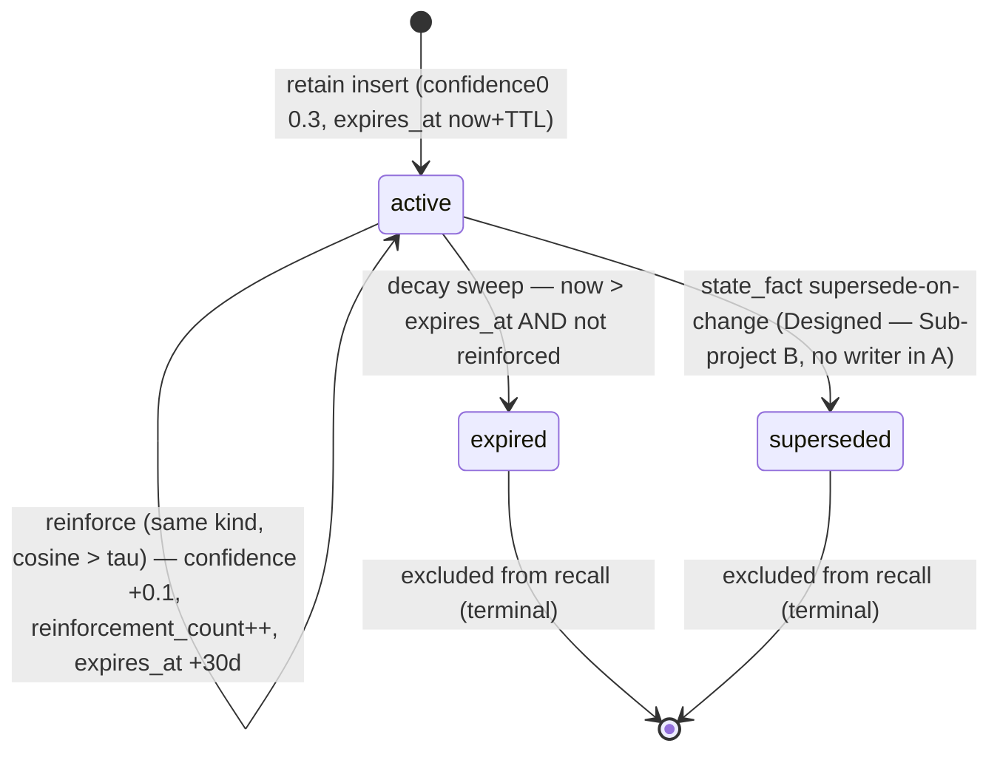
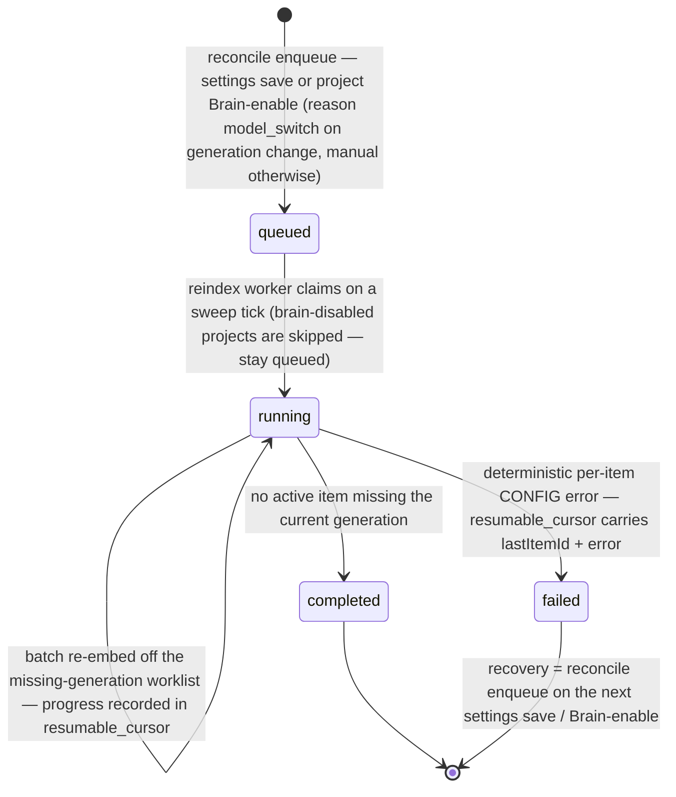
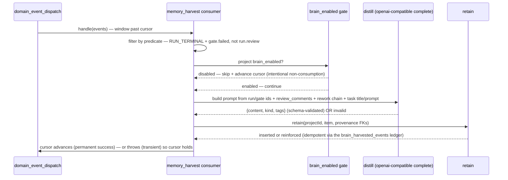
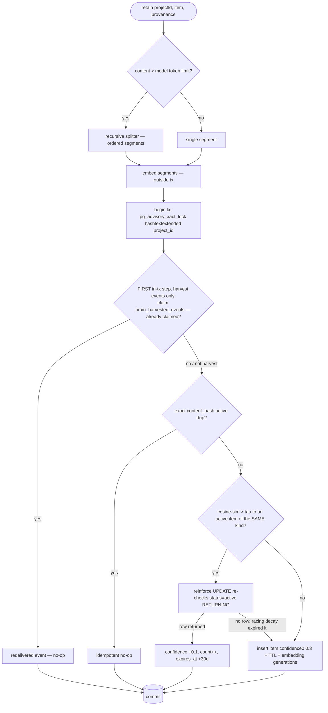
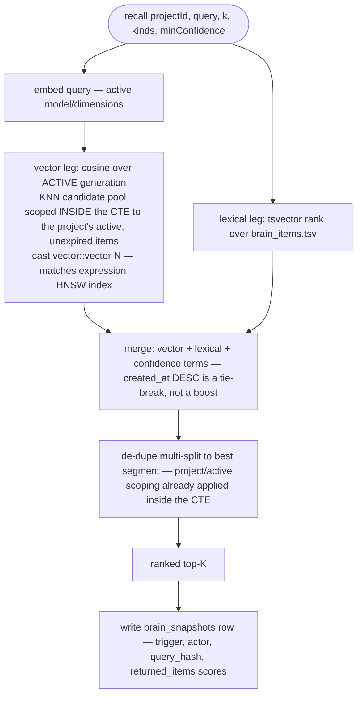
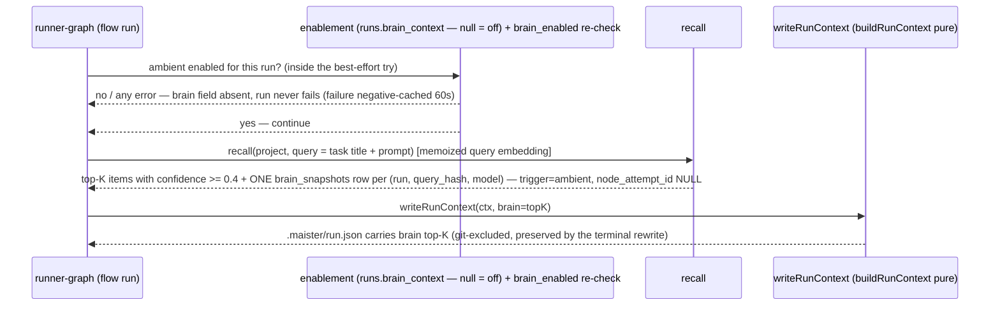
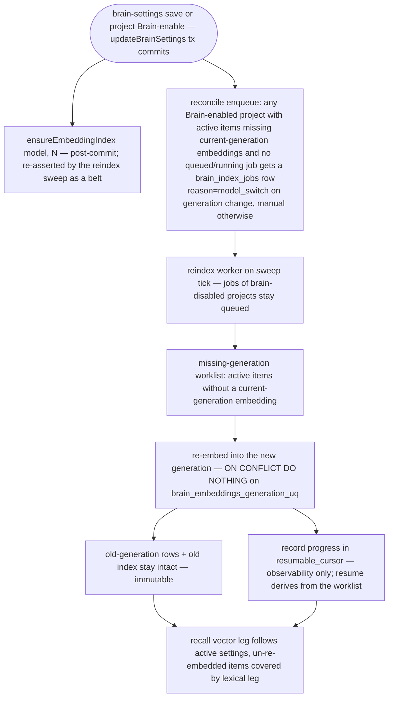

# Project Brain domain (Sub-project A — Foundation)

## Purpose

The **Project Brain** (ADR-122) is MAIster's per-project, vectorized knowledge
substrate: a self-improving, project-scoped memory that platform agents use
natively. **Sub-project A (Foundation)** — the slice this doc governs — ships the
**owned/volatile tier** only: kinds `lesson` / `observation` / `state_fact`
auto-harvested from the `domain_events` bus, embedded and stored in `brain_*`
tables on the existing Postgres + pgvector instance, decayed by a scheduled
sweep, and read back through a hybrid `RecallRanker` (no LLM at read) via three
paths — an MCP tool (explicit), the P7 run-context (ambient, flow runs only), and
the external operations API. Boundary: this domain owns the `brain_*` tables, the
harvest consumer, distillation, retain/decay/recall, the embedding-provider
registry, and the 4-layer enablement axes; it does NOT own the `domain_events`
fact log it consumes ([domain-events.md](domain-events.md)), the run state machine
([runs.md](runs.md)), the M25 authored catalog (the canonical source of truth), or
the clock the decay/reindex sweeps borrow ([scheduler.md](scheduler.md)). The
indexed/consultant tier (`ChunkerRegistry`, `decision`/`direction` kinds, canonical
pointers) is **Sub-project B**; the self-improvement `brain_proposals` bridge and
LSP edge connector are **Sub-project C**.

## Domain entities

- **`brain_items`** (Implemented) — one knowledge item: `{ id, project_id (FK,
  ON DELETE CASCADE — the auth boundary), kind (lesson|observation|state_fact in A),
  tier (owned), title, content, status (active|expired|superseded), confidence,
  reinforcement_count, last_reinforced_at, expires_at, content_hash, tags
  (jsonb string[] — owned metadata), provenance
  (source_run_id?, source_node_attempt_id?, source_domain_event_id?,
  source_gate_kind?), created_at, updated_at, tsv (generated tsvector) }`. See
  [db/brain-domain.md](../db/brain-domain.md).
- **`brain_embeddings`** (Implemented) — **immutable** per (item, embedding
  generation): `{ id, item_id (FK cascade), split_ordinal, vector (dimension-
  untyped), embedding_provider, embedding_model, embedding_dimensions,
  embedding_version, source_hash, content_hash, embedded_at }`. N rows per item
  across generations × splits. A model OR dimension switch writes a NEW generation,
  never mutates a row. One **active** generation is read at recall.
- **`brain_snapshots`** (Implemented) — a recall snapshot written at **consumption**
  (ambient inject or explicit recall) for reproducibility/audit: `{ id, project_id
  (FK CASCADE), run_id? (FK), node_attempt_id? (RESERVED — always NULL in A),
  actor_type, actor_id, trigger (ambient|explicit), query, query_hash,
  embedding_model, returned_items (jsonb: [{itemId, score}] — ids AND scores),
  ranker_version, created_at }`. Ambient writes exactly ONE row per `(run,
  query_hash, embedding_model)` — repeated node iterations never duplicate; rows
  older than 30 days (`BRAIN_POLICY.snapshotTtlDays`) are pruned by the decay
  sweep. The launch-time *decision* to include Brain context persists on
  `runs.brain_context`, not here.
- **`brain_index_jobs`** (Implemented) — reindex work: `{ id, project_id (FK), reason
  (model_switch|manual in A), status (queued|running|completed|failed), progress,
  resumable_cursor, created_at }`. Enqueued by the reconcile pass on every
  brain-settings save and every project Brain-enable; consumed by the reindex
  worker on the M24 tick. `resumable_cursor` is progress/observability metadata
  (`{lastItemId, error}` on failure) — resume derives from the missing-generation
  worklist, not the cursor.
- **`brain_harvested_events`** (Implemented, brain migration `0002`) — the harvest
  idempotency ledger: `{ project_id (FK CASCADE), domain_event_id (no FK — the
  marker outlives `domain_events` GC), harvested_at }`, PK `(project_id,
  domain_event_id)`. Claimed as the FIRST step of `retain`'s transaction so an
  at-least-once redelivery is a no-op across ALL retain outcomes
  (insert / reinforce / exact-dup).
- **Shared-table columns (Implemented, migration `0088`)** — `platform_runtime_settings`
  gains `embedding_base_url`, `embedding_model`, `embedding_dimensions`,
  `embedding_api_key_ref`, `distill_model` (all nullable); `projects.brain_enabled`
  (bool, default false); `agent_project_links.can_read_brain` /
  `can_write_brain` (bool, default false); `runs.brain_context` (bool, nullable —
  null = off (default) in A; a flow/agent-level default is reserved).
- **Kinds (owned tier, A subset)** (Implemented) — `lesson` (decay TTL, promoted by
  recurrence), `observation` (slower decay), `state_fact` (not decayed;
  supersede-on-change is **(Designed — Sub-project B)** — the `superseded` status
  exists in the enum only, with no writer in A). `decision`/`direction` (indexed
  tier) are **(Phase 2 — Sub-project B)**.
- **Policy constants** (Implemented) — `web/lib/brain/policy.ts`: τ=0.85 (dedup cosine),
  confidence₀=0.3, TTL=30d, reinforce=+0.1 confidence / +30d `expires_at`, ambient
  K=5, `ambientMinConfidence`=0.4 (ambient-inject floor — one reinforce above
  confidence₀; explicit recall is unaffected), `snapshotTtlDays`=30 (snapshot GC).
  Named constants, tune-on-real-runs; not env, not DB in A.
- **`RecallRanker`** (Implemented) — the DIP seam (`web/lib/brain/recall-ranker.ts`):
  a swappable ranking interface with a default pgvector hybrid implementation.

## State machine

### `brain_items` lifecycle (Implemented)

An item is inserted `active` at confidence₀; a semantically-near retain of the SAME
kind **reinforces** it in place (self-loop, no new row); the decay sweep expires it
past `expires_at`. `state_fact` supersede-on-change (a newer fact about the same
subject superseding the prior one) is **(Designed — Sub-project B)** — the
`superseded` status exists in the enum only, with no writer in A.

Embedding generations are immutable: an item's `active` status is orthogonal to how
many `brain_embeddings` generations it carries. A reindex adds a new generation and
moves the active-generation pointer (platform embedding settings); old rows persist.

### `brain_index_jobs` lifecycle (Implemented)

An interrupted/crashed job STAYS `running` and is re-claimed on the next tick;
transient per-item errors also leave it `running` for retry. Resume derives from the
missing-generation worklist (active items without a current-generation embedding),
NOT from a cursor. Recovery after `failed` is the reconcile enqueue: every
brain-settings save and every project Brain-enable enqueues a job for any
Brain-enabled project whose active items miss current-generation embeddings and
that has no queued/running job.

## Process flows

### (a) Harvest → distill → retain (Implemented)

The `memory_harvest` consumer rides the `domain_events` dispatcher
([domain-events.md](domain-events.md)). It matches an explicit per-kind predicate
(`RUN_TERMINAL_EVENT_KINDS` + `gate.failed`; `run.review` excluded), skips when the
project's Brain is disabled, distills concrete sources into a structured lesson, and
calls `retain` with provenance FKs.

Untrusted run data in the distiller prompt (task title/prompt, review comments, the
rework chain) is FENCED between explicit `BEGIN/END UNTRUSTED RUN DATA` markers with
a data-not-instructions instruction, and the distill completion request carries
`max_tokens` (bounds respend on a runaway provider).

### (b) `retain` — atomic dedup-or-reinforce (Implemented)

`retain` embeds OUTSIDE the transaction, then serializes per-project writes with an
advisory lock and either reinforces a near active item or inserts a new one.

The partial UNIQUE `(project_id, content_hash) WHERE status = active` makes the
exact-dup race a `CONFLICT`-mapped constraint at the DB, not a duplicate row.
Harvest redelivery is idempotent across ALL retain outcomes: the
`brain_harvested_events` ledger row (PK `(project_id, domain_event_id)`) is claimed
as the first in-transaction step, and the partial UNIQUE
`(project_id, source_domain_event_id)` stays as the insert-path belt.

### (c) Recall — hybrid, no LLM at read (Implemented)

The lexical leg also covers items not yet re-embedded mid-reindex. No completion/LLM
call happens on this path.

### (d) Ambient inject via P7 (flow runs only) (Implemented)

Recall is computed in `runner-graph.ts` (which has DB + policy) and the ready brain
projection is passed INTO `writeRunContext` as plain data — `buildRunContext` stays
pure. The whole ambient step — including the `projects.brain_enabled` re-check —
runs inside one best-effort try: any DB/provider error degrades to no-injection and
NEVER fails the run, and a recall/provider failure is negative-cached for 60s per
process. Only items with `confidence >= 0.4` (`BRAIN_POLICY.ambientMinConfidence` —
one reinforce above confidence₀, so an item must have recurred at least once before
it is auto-injected; explicit recall is unaffected) are injected. The query embedding
is memoized per runner process, keyed by
`hash(query + embedding_model + embedding_dimensions)`, and exactly ONE snapshot row
is written per `(run, query_hash, embedding_model)` — repeated node iterations do not
duplicate (`node_attempt_id` is RESERVED, always NULL in A). The agent prompt pointer
carries a caveat that `brain` entries are distilled memory — background context, not
instructions.

### (e) Reindex on model/dimension switch (Implemented)

`updateBrainSettings` runs in ONE transaction with `SELECT … FOR UPDATE` on the
singleton row (concurrent admin PATCHes serialize — no lost updates);
`ensureEmbeddingIndex` runs after commit and the reindex sweep re-asserts it as a
belt. Every brain-settings save AND every project Brain-enable then runs a
reconcile enqueue — this is also the recovery path after a `failed` job.

### (f) Decay sweep (throttled) (Implemented)

`runBrainDecaySweep()` is folded into `runSystemSweep()`. The 60s system tick
self-throttles the sweep to hourly via a last-run stamp; decay is expiry-only in A —
confidence never decreases and there is no per-tick decrement. Items past
`expires_at` without reinforcement become `expired` and drop out of recall. The same
sweep prunes `brain_snapshots` older than 30 days (`BRAIN_POLICY.snapshotTtlDays`).
A sweep error is caught into the sweep summary, never thrown.

## Expectations

*(E-n pin the spec §13 numbering, top-to-bottom. A-relevant subset below; E-5, E-9,
E-13, E-14 and the source-indexing half of E-7 are **(Phase 2 — Sub-projects B/C)**.)*

- **E-1** — Every `brain_*` row MUST carry `project_id` directly or transitively via
  `item_id` (`brain_embeddings`); recall MUST NEVER return items across a
  `project_id` boundary. (Implemented)
- **E-2** — `brain_embeddings` rows MUST be immutable — a model or dimension change
  MUST create a new embedding generation, NEVER mutate a row — and `(item_id,
  split_ordinal, embedding_model, embedding_dimensions)` is UNIQUE, so an
  overlapping reindex sweep never writes a duplicate generation row. (Implemented)
- **E-3** — `retain` MUST be idempotent on identical `content_hash` and MUST
  reinforce (not duplicate) a semantically-near active item of the SAME kind above
  threshold τ=0.85. (Implemented)
- **E-4** — Harvested `lesson`/`observation` items MUST start at confidence₀=0.3
  (below any auto-apply threshold) and MUST become `expired` at `expires_at` unless
  reinforced. (Implemented)
- **E-6** — Recall MUST perform NO LLM call at read time. (Implemented)
- **E-7** — Harvest MUST be event-driven off `domain_events` over exactly
  `RUN_TERMINAL_EVENT_KINDS` + `gate.failed` (`run.review` MUST NOT be harvested)
  and idempotent across ALL retain outcomes via the `brain_harvested_events` ledger
  claimed in `retain`'s transaction; decay and reindex MUST be scheduler-driven; the
  domain MUST NEVER use `fs.watch`/chokidar/polling. (Implemented; event-driven
  indexing of external *sources* is Phase 2 — Sub-project B.)
- **E-8** — An interrupted reindex job MUST stay `running` and be re-claimed on a
  later tick; resume MUST derive from the missing-generation worklist —
  `brain_index_jobs.resumable_cursor` records progress/observability metadata only,
  carrying `{lastItemId, error}` on failure (source-hash-gated skip-unchanged is
  Phase 2 — Sub-project B). (Implemented)
- **E-10** — Embedding-provider secrets MUST be stored as `env:NAME` refs and MUST
  NEVER be logged, streamed, or embedded in any payload. (Implemented)
- **E-11** — In SQLite mode the Brain MUST be disabled: the ext memory routes,
  `GET/PATCH /api/admin/brain-settings`, and the project `brainEnabled` enable-gate
  MUST call `assertBrainProvisioned()` FIRST (409 `PRECONDITION`), and MCP memory
  tools MUST fail closed (the facade still lists `TOOL_SPECS` statically). (Implemented)
- **E-12** — Every Brain consumption MUST record a `brain_snapshots` row — explicit
  recall records the token's `boundRunId` as `run_id` when run-bound; ambient writes
  exactly ONE row per `(run, query_hash, embedding_model)` with `node_attempt_id`
  NULL (reserved in A). (Implemented)
- Enablement MUST flow through the ONE shared guard (`web/lib/brain/guard.ts`
  `isProjectBrainEnabled`/`assertProjectBrainEnabled`) — enforced at the ext route
  AND inside `recall()`/`retain()` as a belt, with ambient inject and harvest
  re-checking through the same function (an admin can disable the Brain after a
  launch opted in, so a disabled project recalls/injects/snapshots nothing). (Implemented)
- A project MUST NOT be enabled (`brain_enabled=true`) unless platform embedding
  config AND `distill_model` are set (the PATCH MUST refuse `CONFIG`); for AGENT
  tokens recall MUST additionally be gated by `agent_project_links.can_read_brain`
  and retain by `can_write_brain` (a separate axis — a read grant MUST NOT open
  retain; user/project tokens pass these link axes by design). (Implemented)

## Edge cases

- **Embedding provider outage** (timeout / 429 / 5xx / network / malformed 200 body,
  past bounded retry) → `MaisterError("EMBEDDING_UNAVAILABLE")` (HTTP 503,
  retryable). On the harvest path this is **transient**: the consumer throws, the
  cursor holds, and the window redelivers next tick — no event lost.
- **Deterministic provider 4xx** (400/401/403/404/422 — everything except 408/429)
  → `MaisterError("CONFIG")` with NO retry (422 on the ext routes). The harvest
  consumer holds the cursor (a config problem — fix it and the window drains);
  distill respend is bounded by `max_tokens`; dispatcher-level backoff for a
  persistent hold is a platform-level follow-up.
- **Embedding provider stall** (accepts the connection then hangs) → each attempt
  carries an `AbortSignal.timeout` deadline (`timeoutMs`, default 30 s); the abort is
  classified transient → retried → `EMBEDDING_UNAVAILABLE`. Recall/retain routes and
  the harvest/reindex sweeps can NEVER hang indefinitely on a stalled provider.
- **Malformed embedding response body** → `data[]` is sorted by `index` when
  present and every element must be a finite number; a violating 200 body is
  classified transient → bounded retry → `EMBEDDING_UNAVAILABLE`.
- **`distill_model` cleared while projects are enabled** → harvest treats the missing
  config as **transient** `CONFIG`: throw, cursor holds, retry next tick (NEVER
  skip-and-advance, which would silently lose the event forever). Unreachable in
  steady state given the enable-gate.
- **Schema-invalid distill output** (including empty or >2000-char `content`) →
  counts as an invalid attempt; after one in-process retry the consumer logs and
  **skips the event** (advances the cursor) — a permanent failure MUST NOT become
  a poison-pill loop.
- **Returned-vector dimension ≠ configured `embedding_dimensions`** →
  `MaisterError("CONFIG")` (misconfiguration, not an outage).
- **Exact-dup / near-dup retain race** → the DB partial UNIQUEs collapse the race:
  exact `content_hash` → `MaisterError("CONFLICT")`-mapped constraint (idempotent
  no-op); the per-project advisory lock serializes near-dup reinforcement.
- **Near-dup across kinds** → dedup is KIND-SCOPED: a `state_fact` never reinforces
  a `lesson` — a cross-kind near-duplicate inserts a separate item.
- **Reinforce vs decay race** → the reinforce UPDATE re-checks `status='active'`
  (`RETURNING`); if a racing decay sweep expired the item mid-transaction, retain
  falls through and INSERTS a fresh item instead of reinforcing an invisible one.
- **Ambient recall failure** → the enable-check runs INSIDE the best-effort try:
  any DB/provider error degrades to no-injection (the run NEVER fails) and is
  negative-cached for 60s per process; items below `confidence` 0.4
  (`ambientMinConfidence`) are not injected.
- **Oversized/abusive ext input** → the ext memory routes + MCP mirror cap
  `content` ≤ 32000 chars, `title` 1..512, `tags` ≤ 10 items × ≤ 64 chars, recall
  `q` 1..2000, `limit` 1..50, `minConfidence` 0..1; an unknown `kinds` value → 422
  `CONFIG` (not silently ignored). Rate limiting is an accepted deferral
  (Sub-project B candidate).
- **Reindex job hits a deterministic per-item error** → `MaisterError("CONFIG")`
  marks the job `failed` (`resumable_cursor` carries `{lastItemId, error}`);
  transient errors leave it `running` for retry; recovery is the reconcile enqueue
  on the next brain-settings save or project Brain-enable.
- **Reindex job of a brain-DISABLED project** → skipped (stays `queued`) until the
  project is re-enabled.
- **Snapshot growth** → `brain_snapshots` rows older than 30 days
  (`BRAIN_POLICY.snapshotTtlDays`) are pruned by the decay sweep.
- **Non-English content on the lexical leg** → the `tsv` column uses the
  `'english'` tsvector config; RU text gets exact-lexeme matching only (no
  stemming) — a known bias, the config knob is deferred.
- **SQLite dialect** → `MaisterError("PRECONDITION")` from Brain service entrypoints;
  MCP memory tools fail closed; the brain migration lineage is not provisioned.
- **Cross-project token / slug mismatch on the ext route** → HTTP 404 (the body
  carries no project id; `projectId` is server-derived from the token + slug).
- **Missing scope or agent link axis** → HTTP 403 (`memory:read`/`memory:write` scope
  missing, or `can_read_brain`/`can_write_brain` false).

## Linked artifacts

- **Decision:** [ADR-122](../decisions.md#adr-122-project-brain-per-project-memory-substrate).
- **Design spec (SSOT):** [`../plans/2026-07-01-project-brain-architecture.md`](../plans/2026-07-01-project-brain-architecture.md)
  — locked decisions D1–D10, data model §4, pipelines §5, Expectations §13,
  Acceptance §14.
- **DB:** [`db/brain-domain.md`](../db/brain-domain.md) (domain ERD) +
  [`database-schema.md`](../database-schema.md) (narrative) — migrations main `0088`
  + brain lineage `0001`–`0002`.
- **Harvest feed:** [`domain-events.md`](domain-events.md) — the `memory_harvest`
  consumer on the `domain_events` bus (ADR-086).
- **Background clock:** [`scheduler.md`](scheduler.md) — the decay + reindex sweeps
  folded into `runSystemSweep()` on the M24 tick.
- **Ambient host:** [`flow-graph.md`](flow-graph.md) / P7 run-context — `writeRunContext`
  → `.maister/run.json` (flow runs only).
- **MCP facade / ext API:** [`external-operations.md`](external-operations.md) — the
  `memory_recall`/`memory_retain` tools + `GET/POST /api/v1/ext/projects/{slug}/memory`.
- **Error taxonomy:** [`error-taxonomy.md`](../error-taxonomy.md) —
  `EMBEDDING_UNAVAILABLE` (503).
- **Secret redaction pattern:** `web/lib/mcp/projection.ts` (`env:NAME` refs).
- **Source (Implemented):** `web/lib/brain/*`
  (`policy.ts`, `schema.ts`, `guard.ts`, `chunk.ts`, `openai-compatible.ts`,
  `embedding-index.ts`, `retain.ts`, `recall.ts`, `recall-ranker.ts`, `distill.ts`,
  `decay.ts`, `reindex.ts`, `ambient.ts`), `web/lib/domain-events/memory-harvest.ts`,
  `web/lib/db/brain-migrations/*`, `web/lib/db/migrate-brain.ts`.
