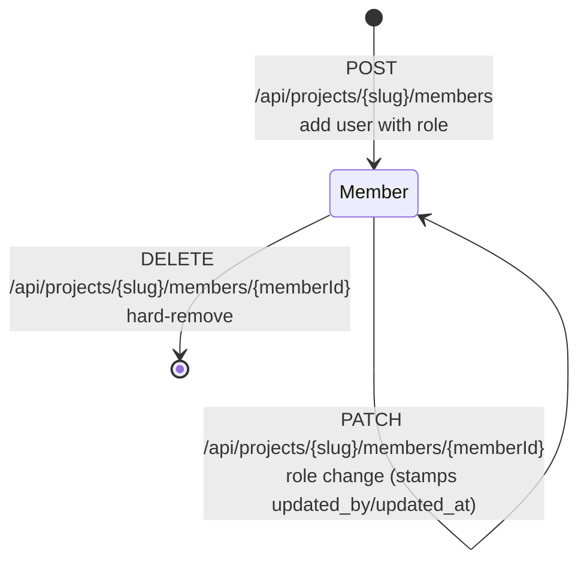
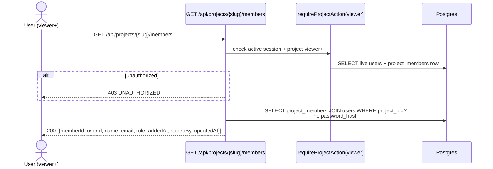
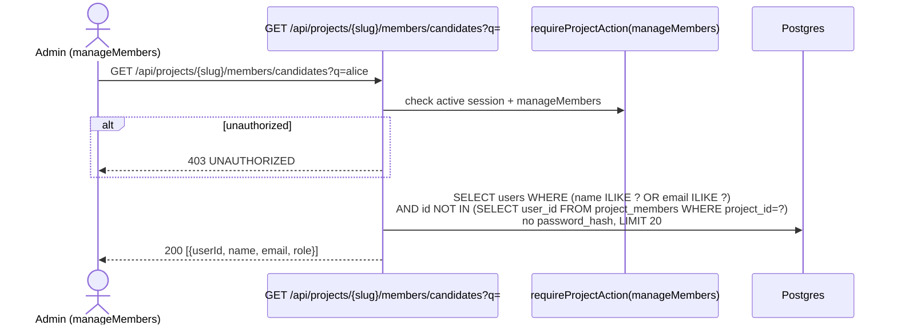
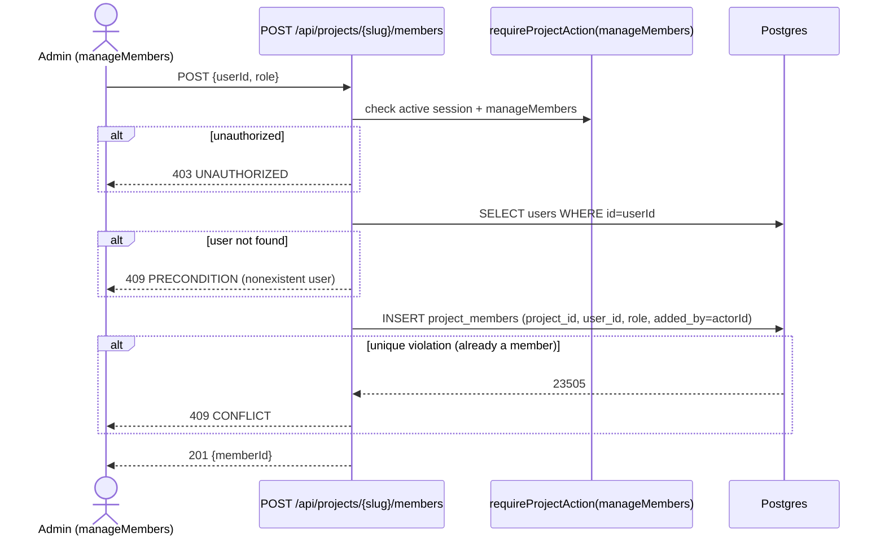
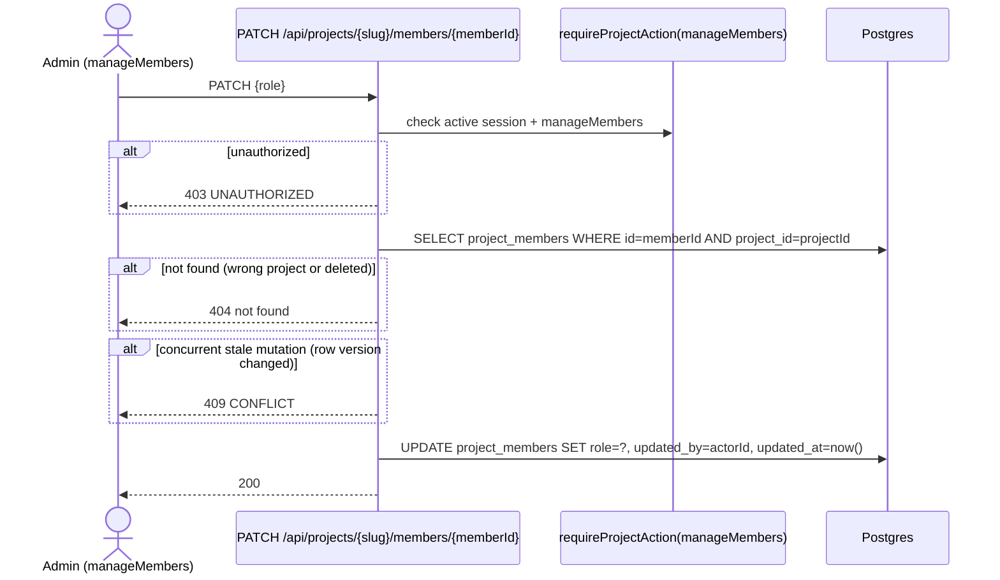
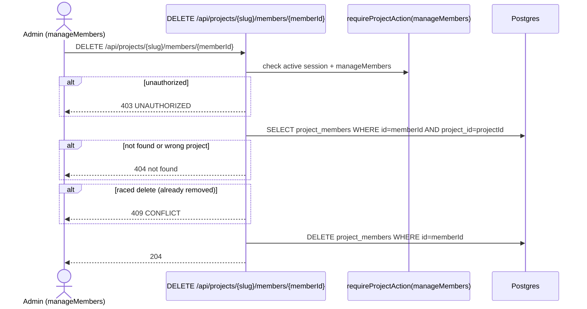

# Project membership domain

## Purpose

The **project membership** domain covers per-project roster management:
listing members, searching platform users as add candidates, adding a user
with a role, changing an existing member's role, and removing a member.
The domain boundary ends at routing labels assigned to Flow nodes —
per-node role routing in `project_flow_roles` (M13) is out of scope.

Status: **Implemented** — ADR-062, migration 0029; service
(`web/lib/project-members.ts`), routes (`/api/projects/{slug}/members*`), and
the project Members tab are shipped and covered by unit + integration tests.

## Domain entities

- **`project_members`** — join table between `projects` and `users`. One row
  per `(project_id, user_id)` pair. Carries `role` and audit columns.
  See [`../db/erd.md#project_members`](../db/erd.md#project_members).
- **`project_members.role`** — `owner | admin | member | viewer`. `owner` confers
  no capability beyond `admin` in the current implementation; global admins are
  implicit owners of every project and are not required to have an explicit row.
- **Audit columns (migration 0029)** — nullable `added_by` (FK to `users.id`,
  set on insert), `updated_at` (timestamp, set on role change), `updated_by`
  (FK to `users.id`, set on role change).
- **`manageMembers` action** — the `PROJECT_ACTION_MIN` value is `admin`,
  meaning any member with `project_members.role >= admin` or a global admin
  may mutate the roster. Reads (`GET` list) require `viewer+`.
- **Global admin** — implicit owner of every project; no `project_members` row
  required; always passes `manageMembers`.

## State machine

The following diagram shows the lifecycle of a single `project_members` row.

## Process flows

### List project members (Implemented)

Any project member (viewer+) or global admin may read the roster.

### Search add candidates (Implemented)

Returns platform users not yet members of the project, filtered by name/email
prefix `q`. Requires `manageMembers` (project admin+ or global admin).

### Add member (Implemented)

Adds an existing platform user to the project. The user must already exist
in `users`; this route does NOT create new accounts.

### Change member role (Implemented)

Updates `project_members.role` and stamps `updated_by` / `updated_at`.

### Remove member (Implemented)

Hard-removes the `project_members` row. No last-owner guard (D8).

## Expectations

- Exactly one `project_members` row per `(project_id, user_id)` pair; uniqueness enforced at the DB layer.
- `project_members.role` is one of `owner | admin | member | viewer`; `role='owner'` confers no capability beyond `admin` today, and NO last-owner guard is enforced (D8 decision, ADR-062).
- Global admins are implicit project owners and always pass `manageMembers` without a `project_members` row.
- `manageMembers` action minimum is `admin`; roster reads (`GET` list) require `viewer+`.
- `POST /api/projects/{slug}/members` attaches an **existing** platform user only; it MUST NOT create a new `users` row.
- Adding a user stamps `project_members.added_by = actorId`; a role change stamps `updated_by = actorId` and `updated_at = now()`.
- A `memberId` is scoped to its project; the same numeric id in a different project resolves to not-found.
- A concurrent stale role-change or delete (detected by row absence or version conflict) MUST return `CONFLICT` (409), not silently succeed.
- `users.password_hash` MUST NEVER appear in any member list or candidates response.
- `GET /api/projects/{slug}/members` is readable by any project `viewer+` or global admin; no mutation capability is implied.

## Edge cases

- **Duplicate add (user already a member)** -> DB unique constraint fires; translated to `MaisterError("CONFLICT", ...)`; 409.
- **Add nonexistent user** -> `users` lookup returns no row; `MaisterError("PRECONDITION", ...)`; 409.
- **`memberId` from a different project** -> `SELECT … AND project_id=?` finds no row; 404 not found.
- **Raced delete then role-change (stale memberId)** -> row absent; `MaisterError("CONFLICT", ...)`; 409.
- **Raced concurrent role-change** -> optimistic check on row version or re-SELECT detects staleness; `MaisterError("CONFLICT", ...)`; 409.

## Linked artifacts

- ERD: [`../db/erd.md#project_members`](../db/erd.md#project_members).
- API: [`../api/web.openapi.yaml`](../api/web.openapi.yaml) — `/api/projects/{slug}/members` paths.
- Authorization helper: `web/lib/authz.ts`.
- ADR: [ADR-062](../decisions.md#adr-062) — user and project member management.
- Migration: `0029` — `project_members.{added_by, updated_at, updated_by}` + `users.{created_by, updated_at, updated_by}`.
- Related domain: [`identity-access.md`](identity-access.md) — global user lifecycle.
