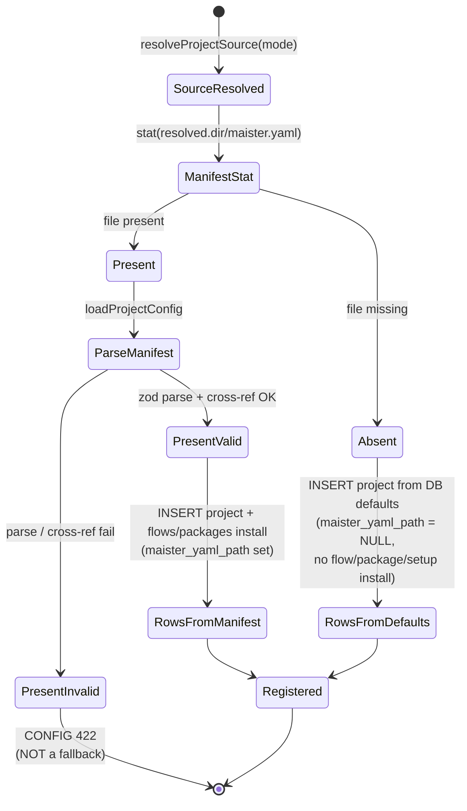
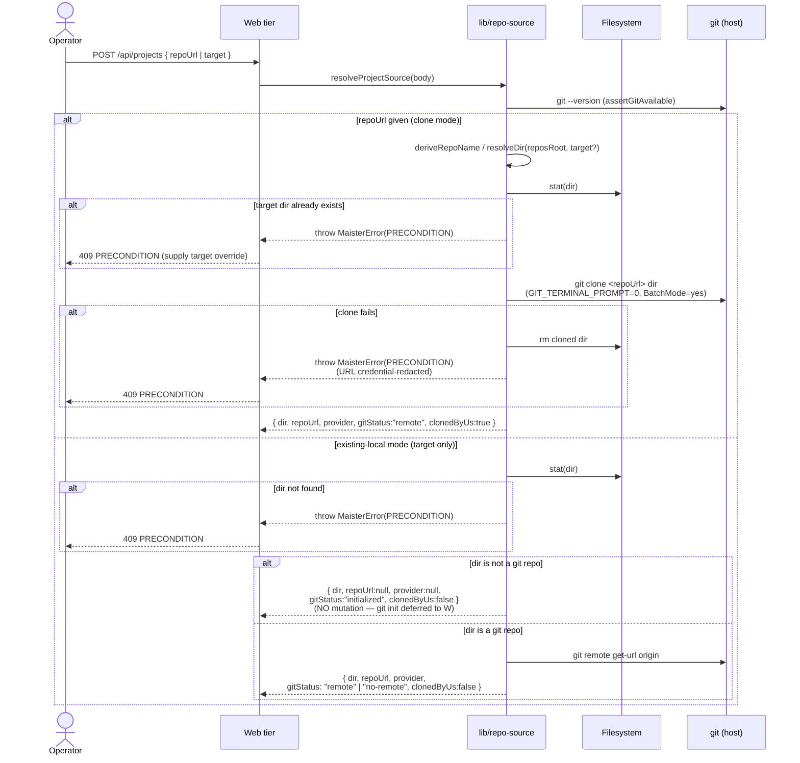
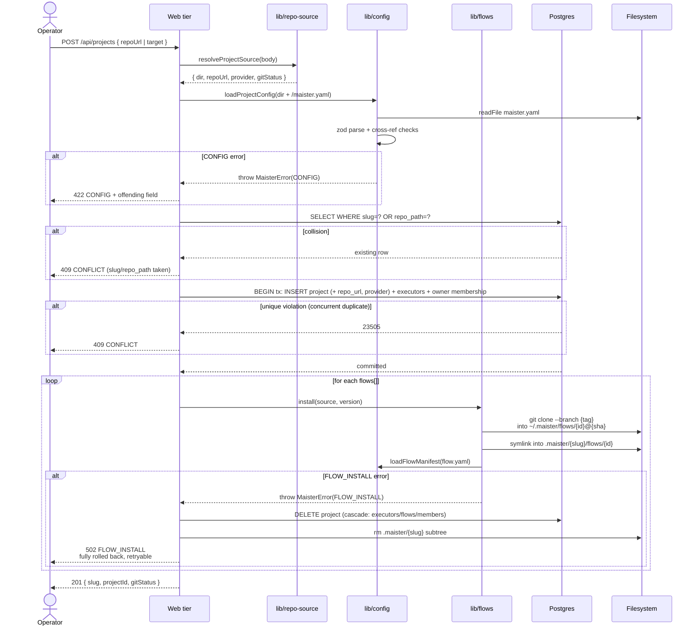
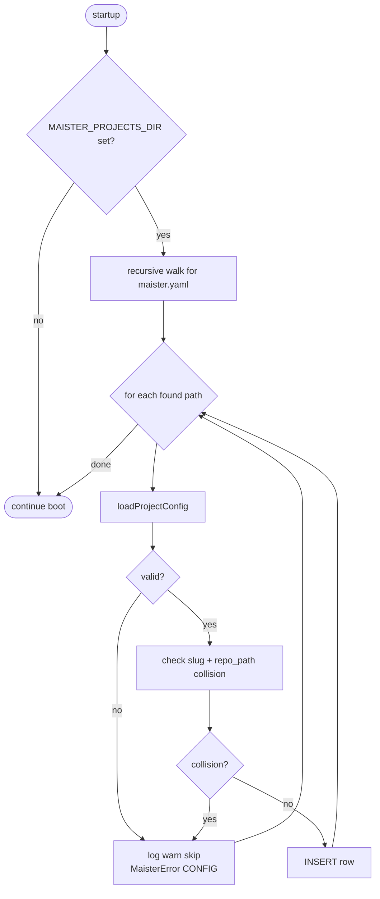

# Projects domain

## Purpose

A **project** is a single registered git repository that MAIster
operates on. Registration resolves the project source through one of three
**onboarding modes** (`clone | existing | new`, [ADR-093](../decisions.md#adr-093-project-onboarding--optional-maisteryaml-host-ambient-git-auth-onboarding-modes-advisory-clone-reasons),
[`git-integration.md`](git-integration.md)) — then, **when the repo carries a
`maister.yaml`**, loads it (v2), installs the Flow plugins it references, and
creates rows in `projects` and `flows` with platform runner references. When the
manifest is **absent** the project registers from DB defaults with the repo left
untouched ([ADR-093](../decisions.md#adr-093-project-onboarding--optional-maisteryaml-host-ambient-git-auth-onboarding-modes-advisory-clone-reasons)).
The domain boundary covers project lifecycle (register, archive) and the
immediate fanout that lifecycle triggers.

## Domain entities

- **Project** — registered repo. Persisted as `projects` row. See
  [`../db/projects-domain.md`](../db/projects-domain.md).
- **Platform ACP runner reference** — optional project or Flow binding to a
  platform runner id. Runner definitions live in platform runtime settings, not
  inside project config. See [`executors.md`](executors.md).
- **Flow package enablement** — project pointer to the package revision new
  runs should use. Current implementation installs git-cloned plugins under
  the MAIster flow cache and symlinks them into the project's `.maister/`
  subtree; planned M10 separates immutable package revisions from project
  enablement. See [`flow-packages.md`](flow-packages.md) and [`flows.md`](flows.md).
- **`repo_url`** — nullable origin URL captured at register time (the clone
  source, or the existing repo's `origin`). Provider metadata, not a gate.
- **`provider`** — nullable auto-detected host tag
  (`github | gitlab | gitea | gitverse | generic`). See
  [`git-integration.md`](git-integration.md).
- **`maister_yaml_path`** — nullable path the manifest was loaded from
  **(Implemented, [ADR-093](../decisions.md#adr-093-project-onboarding--optional-maisteryaml-host-ambient-git-auth-onboarding-modes-advisory-clone-reasons))**.
  `NULL` is the **"config lives only in the DB"** signal: the project registered
  without a `maister.yaml` and the repo was not mutated. A persist action can
  later write the manifest and flip this non-null (see
  [`git-integration.md`](git-integration.md)).

Identifiers:

- `slug` — kebab-case, derived from `project.name`. UNIQUE.
- `repo_path` — the **resolved on-disk directory** (clone target or the
  existing local dir), not read from `maister.yaml`. UNIQUE NOT NULL.
  `maister.yaml`'s `project.repo_path` is now optional and ignored.

## State machine

```mermaid
stateDiagram-v2
    [*] --> Registered: POST /api/projects (clone | existing | new)<br/>(source resolved; from maister.yaml OR DB defaults)
    Registered --> Registered: edit maister.yaml<br/>(re-validate, no row change)
    Registered --> Archived: DELETE /api/projects/[slug]<br/>(soft archive)
    Archived --> Registered: unarchive<br/>(Phase 2)
    note right of Archived
        Soft only: archived_at set.
        repo_path stays reserved
        against new collisions.
    end note
```

Status: **Registration Implemented (M9)** — `POST /api/projects` is live
(admin-only; see [`../api/web.openapi.yaml`](../api/web.openapi.yaml) and
`web/app/api/projects/route.ts`). **Archive** remains **Designed**: the schema
supports it (`projects.archived_at`) but no `DELETE /api/projects/[slug]` route
is wired yet (Phase 2).

### Manifest branch at registration (Implemented)

After the source resolves, the manifest presence at `resolved.dir` selects the
registration branch. The branch is an **allow-list** keyed on the `stat` result —
exactly as the code gates **([ADR-093](../decisions.md#adr-093-project-onboarding--optional-maisteryaml-host-ambient-git-auth-onboarding-modes-advisory-clone-reasons))**.
A *missing* file is the only thing that branches to DB defaults; a malformed file
is a user error, never a silent fallback.

Status: **Designed ([ADR-093](../decisions.md#adr-093-project-onboarding--optional-maisteryaml-host-ambient-git-auth-onboarding-modes-advisory-clone-reasons))** — the
present-manifest branch is today's path (Implemented M9); the absent-manifest
DB-default branch is new. `MAISTER_PROJECTS_DIR` auto-discovery stays
`maister.yaml`-gated (it needs a marker to find a project; only the **manual**
`POST /api/projects` path becomes optional).

## Process flows

### Resolve project source (Implemented; `new` mode Designed)

The union resolved before any config load, selected by an explicit
**onboarding mode** **([ADR-093](../decisions.md#adr-093-project-onboarding--optional-maisteryaml-host-ambient-git-auth-onboarding-modes-advisory-clone-reasons))**:

- **`clone`** (Implemented) — `repoUrl` → clone into `MAISTER_REPOS_ROOT`
  (refuse if the target dir already exists; supply a `target` override).
- **`existing`** (Implemented) — an existing local dir → `git init` when it is
  not yet a repo (deferred to the last register step), then read its `origin`.
- **`new`** (Implemented) — a no-URL path that does **not** exist → `mkdir -p` +
  `git init`, created **only** on an explicit `mode="new"` (never on a typo), no
  remote → `gitStatus:"initialized"`.

The diagram below shows the two Implemented modes; the `new` mode mirrors the
`existing` no-git-dir branch (mkdir-then-deferred-`git init`).

Status: **Implemented** — `web/lib/repo-source.ts:resolveProjectSource`,
called by `web/app/api/projects/route.ts` before `loadProjectConfig`.
`resolveProjectSource` never mutates an existing local dir; for a non-git dir
it returns `gitStatus:"initialized"` and the route runs `git init` only as the
LAST registration step (after the manifest validates and the project is
committed), reverting the created `.git` on any failure. On a clone we created,
a downstream register failure removes the clone (the route's outer compensation).

### Register a project (Implemented M9)

Registration inserts an initial owner membership row for the registering admin.
Per-project member management (list, add, role change, remove) is documented
in [`project-membership.md`](project-membership.md).

### Auto-discovery on startup (Designed)

Recursive scan of `MAISTER_PROJECTS_DIR` registers every `maister.yaml`
found. Slug or `repo_path` collisions are rejected (the existing row
wins; the new one is skipped with a logged warning).

## Expectations

- `projects.slug` and `projects.repo_path` are globally UNIQUE; uniqueness is
  enforced at the DB layer and survives soft archival.
- `projects.repo_path` is the resolved on-disk dir and stays UNIQUE NOT NULL;
  `projects.repo_url` and `projects.provider` are nullable metadata only and
  never gate registration.
- A clone whose target dir already exists is refused with `PRECONDITION`, and
  MAIster stores no git provider secrets — auth is host-credential only
  ([ADR-025](../decisions.md#adr-025-project-repo-onboarding--url-clone-or-local-path-host-credential-auth-configurable-roots)).
- Archived projects (`archived_at IS NOT NULL`) keep their `repo_path`
  reserved against new registrations per ADR-019.
- Project registration is atomic: `projects` + Flow attachments + project/Flow
  runner bindings insert in one transaction, or nothing does. The optional `git init`
  of a non-git local dir runs only after the manifest validates and flows
  install, and its `.git` is reverted on any failure — a failed registration
  never mutates the operator's directory.
- Concurrent `POST /api/projects` calls are serialized by a process-wide lock
  (`withRegistrationLock`) so two registrations cannot race on the same derived
  clone target (single-host control plane).
- Every `project.default_runner` and every `flows[].runner` resolves to a
  platform ACP runner id at validation time; refuse with `CONFIG` otherwise.
- `flows[].id` values are unique within `maister.yaml`; duplicates refused with
  `CONFIG`.
- Flow plugin install is idempotent on `{id}@{tag}` — cache hit at
  `~/.maister/flows/<id>@<tag>/` short-circuits the clone.
- **(Planned M10)** Project registration or `maister.yaml` refresh discovers
  desired Flow packages, but install, trust, setup, and enablement are explicit
  lifecycle actions in the UI. Active runs keep their snapshotted package
  revision after upgrade or rollback.
- Editing `maister.yaml` MUST re-validate before any row delta; a valid
  edit that changes nothing structurally produces no row change.
- Auto-discovery from `MAISTER_PROJECTS_DIR` is recursive and rejects
  collisions with a logged warning — existing row wins, no overwrite.
- Archival is soft only: `archived_at` is set, no row is deleted, no Flow
  plugin cache is GC'd.

## Edge cases

- **`maister.yaml` schema mismatch** → `MaisterError("CONFIG", ...)`.
  See [`../error-taxonomy.md`](../error-taxonomy.md).
- **`project.default_runner` not in platform runners** → `CONFIG`.
- **`flows[].runner` not in platform runners** → `CONFIG` or a required Flow
  reconfiguration step when the Flow package carries a missing recommended ACP.
- **Clone fails (`git clone`)** → `PRECONDITION` (409). The dir MAIster
  created is removed; the URL is credential-redacted in the error.
- **Clone `target` path already exists** → `PRECONDITION` (409); supply a
  `target` override to clone under a different name.
- **`git init` on an existing local dir** → deferred to the LAST register step
  (after manifest validation); leaves an **unborn HEAD**, so worktree creation
  fails until the first commit (`gitStatus:"initialized"`). A failed
  registration reverts the created `.git` (only the one MAIster created — never
  a pre-existing repo's).
- **Existing local dir with no `origin`** → `gitStatus:"no-remote"`,
  `repo_url`/`provider` null; PR promotion is unavailable until a remote is
  added.
- **Slug collision on register** → `CONFLICT` (409).
- **`repo_path` collision on register** → `CONFLICT` (409). Archived
  projects' `repo_path` stays reserved per ADR-019.
- **Concurrent duplicate register (TOCTOU past the collision check)** → the
  unique constraint on `slug` / `repo_path` fires inside the insert
  transaction; translated to `CONFLICT` (409), not a 500.
- **Flow plugin `git clone --branch <tag>` fails** → `FLOW_INSTALL` (502).
  Registration is **fully rolled back** (project row deleted, cascading to
  executors/flows/owner membership; slug artifact subtree removed), so the
  identical `maister.yaml` can be retried with no leftover row. The shared
  system cache (`~/.maister/flows/<id>@<sha>`) is intentionally retained.
- **Flow's `flow.yaml` schema mismatch** → `CONFIG` raised by
  `loadFlowManifest`, surfaced as `FLOW_INSTALL` at the registration
  boundary (same full rollback as above).

## Linked artifacts

- ADRs: [ADR-010 Flow Engine v2](../decisions.md#adr-010-flow-engine-v2-plugin-packaging--step-dsl),
  [ADR-019 Project slug + repo_path uniqueness](../decisions.md#adr-019-project-slug--repo_path-uniqueness-soft-archival),
  [ADR-025 Project repo onboarding](../decisions.md#adr-025-project-repo-onboarding--url-clone-or-local-path-host-credential-auth-configurable-roots).
- ERD: [`../db/projects-domain.md`](../db/projects-domain.md).
- API: registration Route Handler (Designed) — see
  [`../architecture.md`](../architecture.md) §Component map.
- Config reference: [`../configuration.md`](../configuration.md).
- Related domains: [`instance-config.md`](instance-config.md) (roots),
  [`git-integration.md`](git-integration.md) (provider + host credentials).
- Source: `web/lib/repo-source.ts`, `web/lib/config.ts`,
  `web/lib/config.schema.ts`, `web/lib/db/schema.ts`
  (projects/executors/flows tables).
