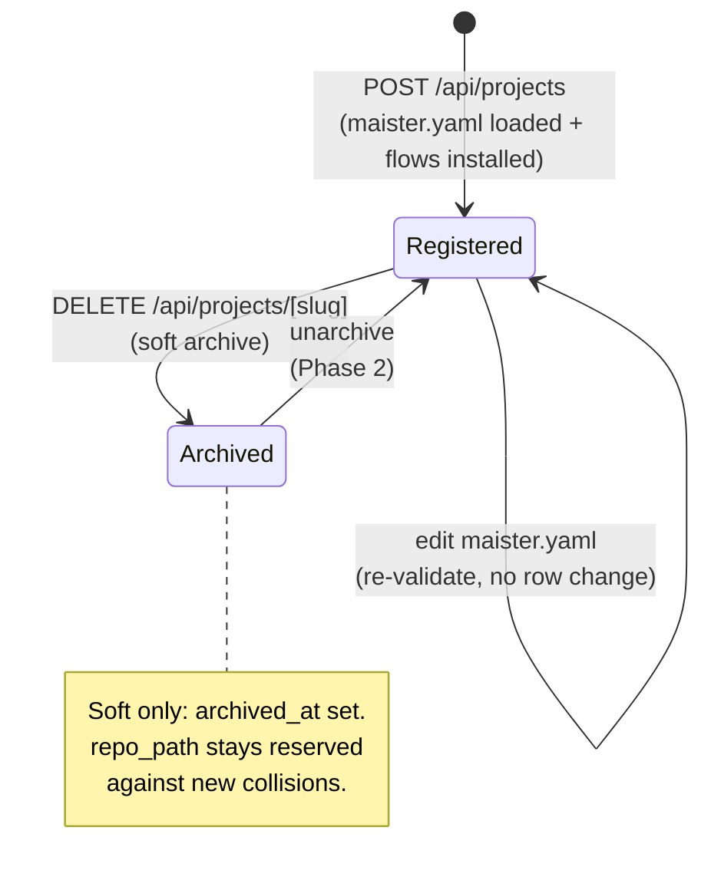

# Projects domain

## Purpose

A **project** is a single registered git repository that MAIster
operates on. Registration loads `maister.yaml` v2, installs the Flow
plugins it references, and creates rows in `projects`, `executors`,
and `flows`. The domain boundary covers project lifecycle (register,
archive) and the immediate fanout that lifecycle triggers.

## Domain entities

- **Project** — registered repo. Persisted as `projects` row. See
  [`../db/projects-domain.md`](../db/projects-domain.md).
- **Executor** — agent identity (`{agent, model, env?, router?}`)
  declared in `maister.yaml` `executors[]`. See [`executors.md`](executors.md).
- **Flow installation** — git-cloned plugin under
  `~/.maister/flows/<id>@<tag>/`, symlinked into the project's
  `.maister/<slug>/flows/<id>/`. See [`flows.md`](flows.md).

Identifiers:

- `slug` — kebab-case, derived from `project.name`. UNIQUE.
- `repo_path` — absolute filesystem path. UNIQUE.

## State machine



Status: **Designed**. Today the schema supports archival
(`projects.archived_at`); no Route Handler is wired yet.

## Process flows

### Register a project (Designed)

```mermaid
sequenceDiagram
    actor U as Operator
    participant W as Web tier
    participant CFG as lib/config
    participant FL as lib/flows (planned)
    participant DB as Postgres
    participant FS as Filesystem

    U->>W: POST /api/projects { maisterYamlPath }
    W->>CFG: loadProjectConfig(path)
    CFG->>FS: readFile maister.yaml
    CFG->>CFG: zod parse + cross-ref checks
    alt CONFIG error
        CFG-->>W: throw MaisterError(CONFIG)
        W-->>U: 400 BAD_CONFIG + offending field
    end
    W->>DB: SELECT WHERE slug=? OR repo_path=?
    alt collision
        DB-->>W: existing row
        W-->>U: 409 PRECONDITION (slug/repo_path taken)
    end
    W->>DB: BEGIN tx: INSERT project + executors + owner membership
    alt unique violation (concurrent duplicate)
        DB-->>W: 23505
        W-->>U: 409 CONFLICT
    end
    DB-->>W: committed
    loop for each flows[]
        W->>FL: install(source, version)
        FL->>FS: git clone --branch {tag}<br/>into ~/.maister/flows/{id}@{sha}
        FL->>FS: symlink into .maister/{slug}/flows/{id}
        FL->>CFG: loadFlowManifest(flow.yaml)
        alt FLOW_INSTALL error
            FL-->>W: throw MaisterError(FLOW_INSTALL)
            W->>DB: DELETE project (cascade: executors/flows/members)
            W->>FS: rm .maister/{slug} subtree
            W-->>U: 502 FLOW_INSTALL (fully rolled back; retryable)
        end
    end
    W-->>U: 201 { slug, projectId }
```

### Auto-discovery on startup (Designed)

Recursive scan of `MAISTER_PROJECTS_DIR` registers every `maister.yaml`
found. Slug or `repo_path` collisions are rejected (the existing row
wins; the new one is skipped with a logged warning).


## Expectations

- `projects.slug` and `projects.repo_path` are globally UNIQUE; uniqueness is
  enforced at the DB layer and survives soft archival.
- Archived projects (`archived_at IS NOT NULL`) keep their `repo_path`
  reserved against new registrations per ADR-019.
- Project registration is atomic: `projects` + all `executors[]` + all
  `flows[]` insert in one transaction, or nothing does.
- Every `default_executor` and every `flows[].executor_override` resolves
  to an entry in `executors[].id` at validation time; refuse with `CONFIG`
  otherwise.
- `executors[].id` and `flows[].id` are unique within their parent
  `maister.yaml`; duplicates refused with `CONFIG`.
- Flow plugin install is idempotent on `{id}@{tag}` — cache hit at
  `~/.maister/flows/<id>@<tag>/` short-circuits the clone.
- Editing `maister.yaml` MUST re-validate before any row delta; a valid
  edit that changes nothing structurally produces no row change.
- Auto-discovery from `MAISTER_PROJECTS_DIR` is recursive and rejects
  collisions with a logged warning — existing row wins, no overwrite.
- Archival is soft only: `archived_at` is set, no row is deleted, no Flow
  plugin cache is GC'd.

## Edge cases

- **`maister.yaml` schema mismatch** → `MaisterError("CONFIG", ...)`.
  See [`../error-taxonomy.md`](../error-taxonomy.md).
- **Duplicate executor id within `executors[]`** → `CONFIG` with the
  duplicated id in the message.
- **`default_executor` not in `executors[].id`** → `CONFIG`.
- **`flows[].executor_override` not in `executors[].id`** → `CONFIG`.
- **Slug collision on register** → `CONFLICT` (409).
- **`repo_path` collision on register** → `CONFLICT` (409). Archived
  projects' `repo_path` stays reserved per ADR-019.
- **Concurrent duplicate register (TOCTOU past the collision check)** → the
  unique constraint on `slug` / `repo_path` fires inside the insert
  transaction; translated to `CONFLICT` (409), not a 500.
- **Flow plugin `git clone --branch <tag>` fails** → `FLOW_INSTALL` (502).
  Registration is **fully rolled back** (project row deleted, cascading to
  executors/flows/owner membership; slug artifact subtree removed), so the
  identical `maister.yaml` can be retried with no leftover row. The shared
  system cache (`~/.maister/flows/<id>@<sha>`) is intentionally retained.
- **Flow's `flow.yaml` schema mismatch** → `CONFIG` raised by
  `loadFlowManifest`, surfaced as `FLOW_INSTALL` at the registration
  boundary (same full rollback as above).

## Linked artifacts

- ADRs: [ADR-010 Flow Engine v2](../decisions.md#adr-010-flow-engine-v2-plugin-packaging--step-dsl),
  [ADR-019 Project slug + repo_path uniqueness](../decisions.md#adr-019-project-slug--repo_path-uniqueness-soft-archival).
- ERD: [`../db/projects-domain.md`](../db/projects-domain.md).
- API: registration Route Handler (Designed) — see
  [`../architecture.md`](../architecture.md) §Component map.
- Config reference: [`../configuration.md`](../configuration.md).
- Source: `web/lib/config.ts`, `web/lib/config.schema.ts`,
  `web/lib/db/schema.ts` (projects/executors/flows tables).
