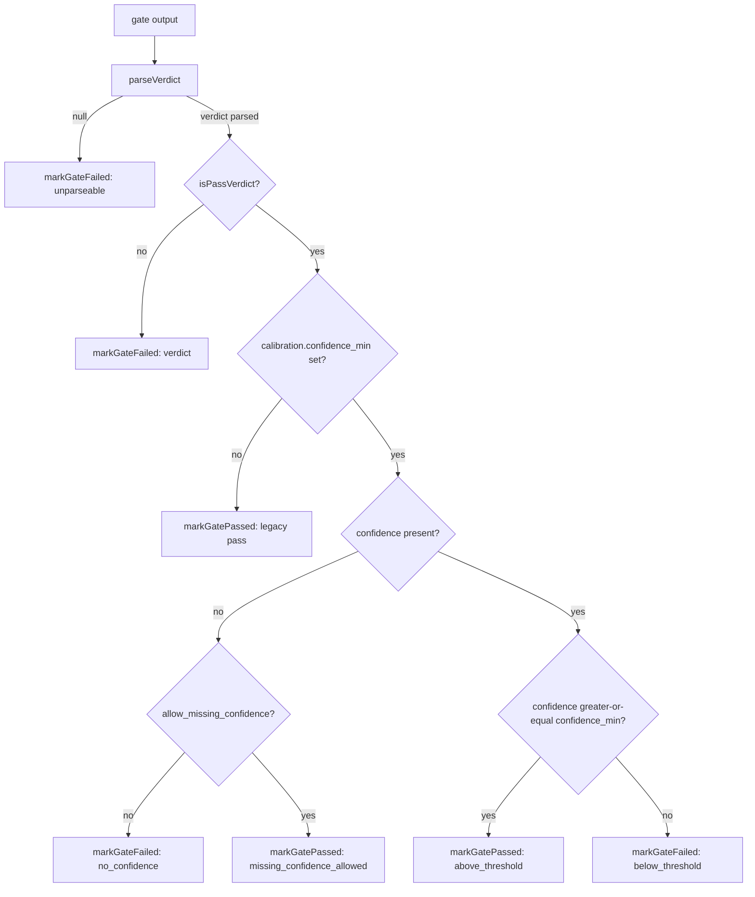
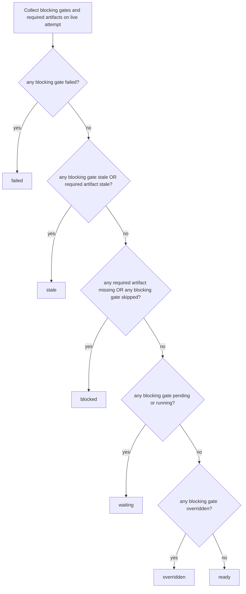
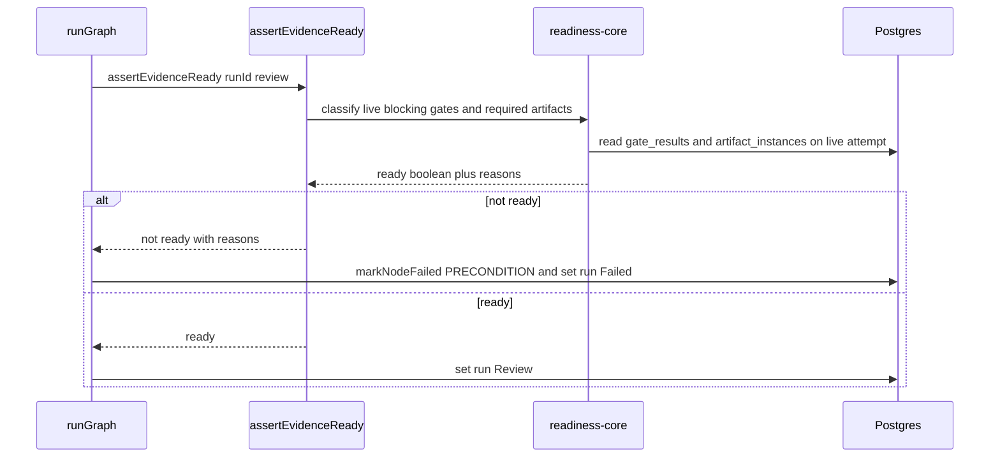

# Readiness domain (M15)

> **Status: Designed (M15 spec-freeze), as of 2026-06-03.** This file is the frozen
> readiness contract authored before code (SDD). The M11a gate-execution lifecycle, the
> M12 artifact-validity rules, and the M16 `external_check` loop it builds on are
> **Implemented**; the M15-specific behaviors (all-kind enforcement, verdict calibration,
> the `overridden` summary state, and the shared classifier) are **Designed** here and
> flipped to Implemented in the M15 as-built reconcile. Locked decisions:
> [ADR-048](../decisions.md#adr-048-readiness-enforcement-over-all-blocking-gate-kinds--verdict-calibration-m15),
> bounded by [ADR-028](../decisions.md#adr-028-full-featured-gate-execution-in-m11a-m15-re-scoped)
> and [ADR-045](../decisions.md#adr-045-external_check-enforcement-via-the-review-chokepoint-m16m15m18-carve).

## Purpose

Readiness is the contract that decides **when a run may promote** and how an
`ai_judgment`/`skill_check` confidence becomes a deterministic gate outcome. M11a
*executes* gates and records `gate_results`; M15 *consumes* those results to refuse or
allow Review (and, for flow runs, merge — owned by M18). A run is ready for a phase when
every Flow-declared **blocking** gate on its live node attempt is current and either
`passed` or explicitly `overridden`, and every artifact `requiredFor` that phase is
present and not stale. Verdict calibration sets a gate's `status` **at execution time** so
the readiness layer reads only `status` and stays confidence-agnostic.

Domain boundary: the readiness classifier (`readiness-core.ts`), the Review chokepoint
enforcer (`assertEvidenceReady`), the read-model (`getRunReadiness`), the board/portfolio
readiness surfaces, and the per-gate / flow-level calibration policy. Out of scope: gate
*execution* and the status lifecycle (M11a — see [`flow-graph.md`](flow-graph.md)); artifact
validity transitions (M12 — see [`artifacts.md`](artifacts.md)); the `external_check`
report ingestion loop (M16 — see [`external-operations.md`](external-operations.md));
flow-run promotion and real merge enforcement (M18); a complex `readiness_policy` DSL,
org-wide gate templates, and a judge-calibration lab (all deferred — ROADMAP M15).

## Domain entities

- **Blocking gate** — a `gate_results` row with `mode: "blocking"` on the live
  `node_attempts` attempt. The `mode: "blocking"` signal doubles as "promotion-required"
  (no separate `readiness_policy` grammar — [ADR-048](../decisions.md#adr-048-readiness-enforcement-over-all-blocking-gate-kinds--verdict-calibration-m15)).
  (Implemented — M11a)
- **Gate calibration config** — per-gate `calibration.confidence_min` (0..1) and
  `allow_missing_confidence` (default `false`) in `gateSchema`, plus a flow-level
  `verdict_calibration.confidence_min` default in `flowYamlV1Schema`, folded into each
  gate's effective `calibration` at compile time. (Designed — M15)
- **`GateVerdict.calibration`** — the observability sub-object persisted in the existing
  `gate_results.verdict` JSONB: `{ confidenceMin, rawVerdict, outcome }`. No migration.
  (Designed — M15)
- **`readiness-core.ts`** — the single pure classifier: live-attempt collection +
  external-gate collapse + the per-kind allow-list + the priority classifier. The one
  source of truth shared by the enforcer, read-model, board, and portfolio. (Designed — M15)
- **`assertEvidenceReady(runId, phase)`** — the enforcer. Returns
  `{ ready: boolean; reasons: string[] }` (it does **not** throw); the runner converts a
  not-ready verdict into a `PRECONDITION` failure at the Review transition. (Implemented —
  M16; broadened to all kinds in M15)
- **`getRunReadiness` → `ReadinessDTO`** — the read-model returning the unified summary
  and its evidence. (Implemented — M16; gains `overridden` + the shared core in M15)
- **Readiness summary** — exactly one of `ready | blocked | stale | failed | waiting |
  overridden`. (Designed — M15; `overridden` is new)

## State machine

Readiness is a **pure classification** of the current gate/artifact state, not a separate
persisted state machine — there are no readiness-to-readiness transitions to record. The
underlying `gate_results.status` lifecycle (`pending → running → passed|failed|stale|
skipped|overridden`) is owned by M11a; see [`flow-graph.md`](flow-graph.md). The
run-level classification is given under **Process flows → Readiness classifier**.

Per-status contribution of a single **blocking** gate on the live attempt:

| `gate_results.status` | Clears the phase? | Summary contribution |
| --------------------- | ----------------- | -------------------- |
| `passed`              | yes               | (none — ready)       |
| `overridden`          | yes               | `overridden`         |
| `failed`              | no                | `failed`             |
| `stale`               | no                | `stale`              |
| `skipped`             | no                | `blocked`            |
| `pending`             | no                | `waiting`            |
| `running`             | no                | `waiting`            |

`artifact_required` `failed` is re-evaluated against current inputs (it blocks only when an
`inputArtifactRefs` def is still non-current or `refs.length === 0`) — preserved from M12.
Required-artifact presence/validity (`requiredFor` containing the phase) contributes
`blocked` when missing and `stale` when `validity === "stale"` — preserved from M12.

## Process flows

### Verdict calibration at gate execution (`ai_judgment` + `skill_check`)

Calibration runs inside the shared executor case and decides the persisted `status`. The
flow-level default has already been folded into `gate.calibration` at compile time.

Calibration truth table (the frozen `verdict.calibration.outcome` strings the executor MUST
emit):

| `isPassVerdict` | threshold set | confidence | `confidence ≥ min` | `allow_missing_confidence` | resulting `status` | `outcome` |
| --------------- | ------------- | ---------- | ------------------ | -------------------------- | ------------------ | --------- |
| no              | —             | —          | —                  | —                          | `failed`           | (M11a verdict-fail path; no `calibration`) |
| yes             | no            | —          | —                  | —                          | `passed`           | (legacy pass; no `calibration`) |
| yes             | yes           | present    | yes                | —                          | `passed`           | `above_threshold` |
| yes             | yes           | present    | no                 | —                          | `failed`           | `below_threshold` |
| yes             | yes           | absent     | —                  | `false` (default)          | `failed`           | `no_confidence` |
| yes             | yes           | absent     | —                  | `true`                     | `passed`           | `missing_confidence_allowed` |

When a `calibration` object is recorded it carries `{ confidenceMin, rawVerdict, outcome }`;
`rawVerdict` is the parsed `verdict` string before calibration.

### Readiness classifier (run-level, shared core)

The single classifier consumed by the enforcer, read-model, board, and portfolio. It runs
over the live node attempt's blocking gates (external gates collapsed to latest-per-gate)
and the artifacts `requiredFor` the phase.

Priority is strict: `failed > stale > blocked > waiting > overridden > ready`. `overridden`
sits just above `ready` because an overridden blocking gate **clears** enforcement (the run
may promote) but the summary still flags that promotion rests on a manual override.

### Review chokepoint enforcement

The pre-M15 `artifactEnforcementActive` (engine `1.2.0`) guard around this call is removed:
enforcement now applies to **all** graph flows. The merge phase reuses the same
`assertEvidenceReady(runId, "merge")`; in M15 it is wired only into the scratch promote
route as a reusable call site (vacuously ready — scratch runs carry no flow gates), with
genuine flow-run merge enforcement deferred to M18.

## Expectations

- A blocking gate (`mode: "blocking"`) on the live `node_attempts` row MUST clear a phase
  only when its `gate_results.status` is `passed` or `overridden`; every other status blocks.
- `assertEvidenceReady(runId, phase)` MUST evaluate all executed blocking gate kinds
  (`command_check`, `ai_judgment`, `skill_check`, `artifact_required`, `external_check`),
  not only `artifact_required` + `external_check`. (Designed — M15)
- Review MUST refuse (node/run → `Failed` via `MaisterError("PRECONDITION")`) when any
  required blocking gate is missing, `pending`, `running`, `failed`, `stale`, or `skipped`.
- The enforcer, `getRunReadiness`, the board query, and the portfolio query MUST classify
  through the single `readiness-core.ts`; no surface re-derives the verdict inline.
  (Designed — M15)
- The readiness summary MUST be exactly one of `ready | blocked | stale | failed | waiting |
  overridden`, resolved by priority `failed > stale > blocked > waiting > overridden > ready`.
- Verdict calibration MUST be applied at gate execution and set `gate_results.status`; the
  readiness layer MUST read only `status` and never re-read `confidence`. (Designed — M15)
- A passing `ai_judgment`/`skill_check` verdict with `confidence` below the effective
  `calibration.confidence_min` MUST become `failed` with
  `verdict.calibration.outcome = "below_threshold"`. (Designed — M15)
- A passing verdict with no `confidence` while a threshold is configured MUST become
  `failed` (`outcome: "no_confidence"`) unless the gate sets `allow_missing_confidence: true`
  (then `passed`, `outcome: "missing_confidence_allowed"`). (Designed — M15)
- A flow-level `verdict_calibration.confidence_min` MUST be folded into each gate's effective
  `calibration` at compile time; `gates-exec.ts` MUST read only `gate.calibration`.
  (Designed — M15)
- A `blocking` `human_review` gate MUST be rejected at manifest validation with
  `MaisterError("CONFIG")`; advisory `human_review` is permitted. (Designed — M15)
- Board and portfolio readiness MUST be computed over bulk-fetched rows; neither MUST call
  `getRunReadiness` per run (no N+1). (Designed — M15)
- M15 MUST NOT add a DB migration, a new `MaisterError` code, a new `runs.status` value, or
  bump `MAISTER_ENGINE_VERSION` (stays `1.2.0`).

## Edge cases

- **Blocking `human_review` in a manifest** — rejected pre-run at `validateGraphManifest`
  with `MaisterError("CONFIG")`; it would otherwise deadlock promotion (executor always
  records `human_review` as `skipped`).
- **Review refusal** — `assertEvidenceReady` returns `ready:false`; the runner records
  `MaisterError("PRECONDITION")` and the run goes `Failed`, with `reasons[]` surfaced.
- **Threshold set, agent emits no confidence** — fail-closed `no_confidence` gate failure
  (not an error code); set `allow_missing_confidence: true` for gates that legitimately omit
  confidence.
- **Unparseable verdict** — existing M11a `markGateFailed` "unparseable" path; calibration
  is not reached.
- **`external_check` still `pending` at Review** — contributes `waiting`; enforcement
  refuses Review until the M16 report loop flips it `passed`/`failed`.
- **Overridden blocking gate** — clears enforcement (run may promote) but the summary shows
  `overridden`; the original `verdict` is never erased (override-without-erasure, M11a).
- **Scratch run merge guard** — `assertEvidenceReady(runId, "merge")` is vacuously ready
  (no flow gates); this is future-proofing, not the AC's merge-refuse coverage (M18).

## Linked artifacts

- **ADR:** [ADR-048](../decisions.md#adr-048-readiness-enforcement-over-all-blocking-gate-kinds--verdict-calibration-m15)
  (readiness + calibration), [ADR-028](../decisions.md#adr-028-full-featured-gate-execution-in-m11a-m15-re-scoped)
  (gate execution scope), [ADR-045](../decisions.md#adr-045-external_check-enforcement-via-the-review-chokepoint-m16m15m18-carve)
  (external_check / merge carve).
- **Config:** calibration fields documented in [`../configuration.md`](../configuration.md)
  (`gateSchema.calibration`, `flowYamlV1Schema.verdict_calibration`).
- **Source (enforcer + core):** `web/lib/flows/graph/evidence-readiness.ts`,
  `web/lib/flows/graph/readiness-core.ts`, `web/lib/flows/graph/external-gate-readiness.ts`,
  `web/lib/flows/graph/runner-graph.ts`.
- **Source (calibration):** `web/lib/flows/graph/gates-exec.ts`,
  `web/lib/flows/graph/compile.ts`, `web/lib/config.schema.ts`, `web/lib/config.ts`,
  `web/lib/db/schema.ts` (`GateVerdict`, `gate_results`).
- **Source (read-model + surfaces):** `web/lib/queries/readiness.ts`,
  `web/lib/queries/board.ts`, `web/components/board/flight-card.tsx`,
  `web/lib/queries/portfolio.ts`, `web/components/portfolio/project-card.tsx`,
  `web/app/api/runs/[runId]/promote/route.ts`.
- **Related domains:** [`flow-graph.md`](flow-graph.md) (gate lifecycle),
  [`artifacts.md`](artifacts.md) (artifact validity),
  [`external-operations.md`](external-operations.md) (`external_check` report loop).
- **Roadmap:** ROADMAP M15.
