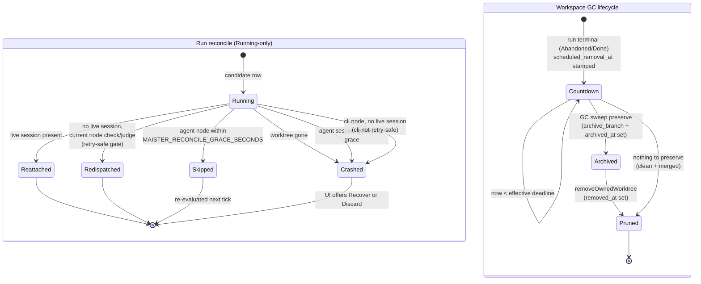
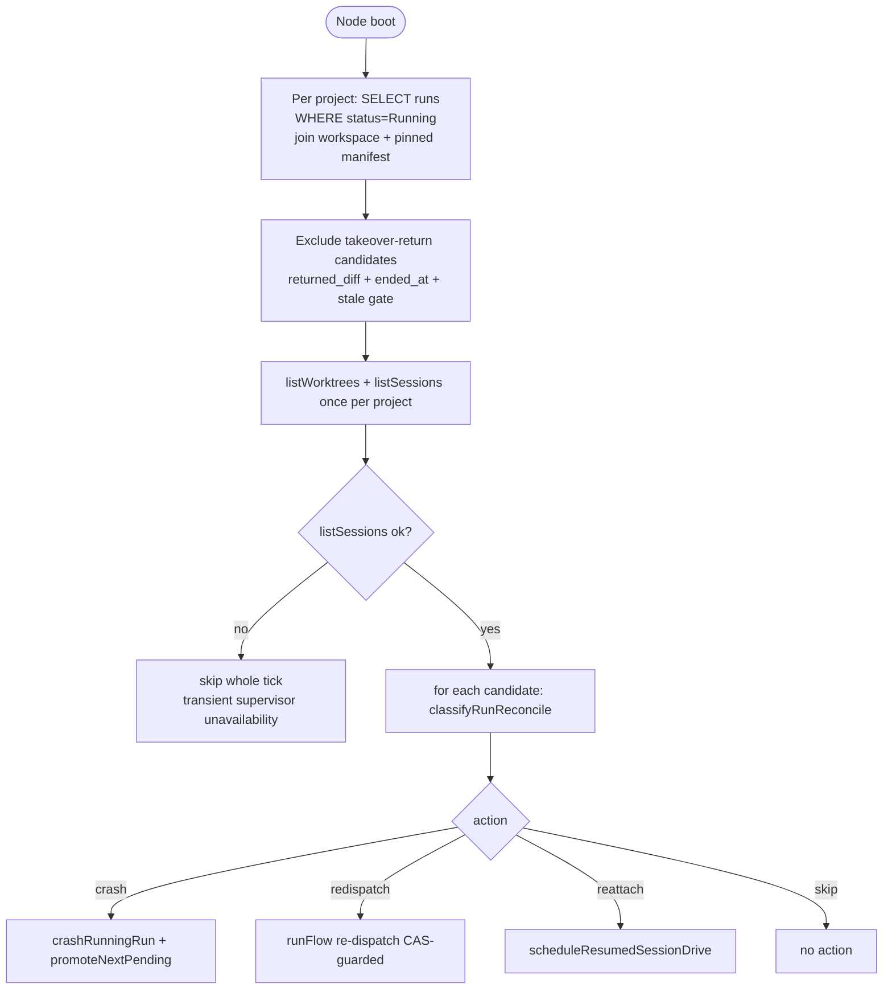
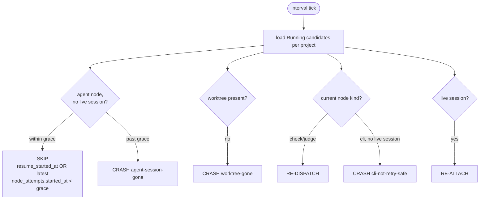
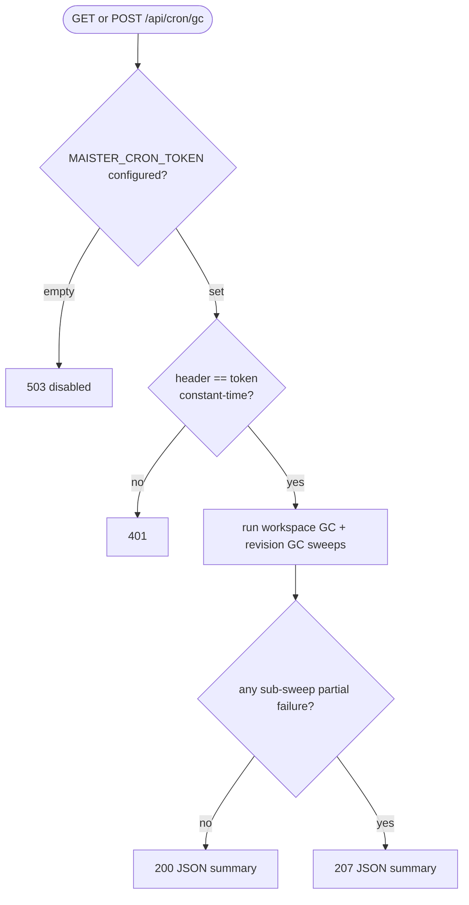
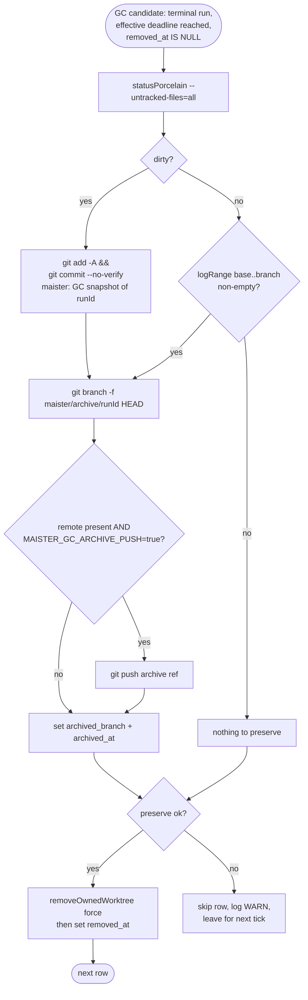

# Reconciliation and GC domain

## Purpose

This domain (**Designed, M19**) covers two recovery-and-cleanup concerns
that sit below the live run machine. **Crash reconciliation** detects a
stranded `Running` run — a runner loop gone after a Next.js or supervisor
restart, or a session-less node left dangling — and classifies it into
re-attach, re-dispatch, skip, or `Crashed`. **Graceful workspace and
revision GC** reclaims disk for terminal runs and unreferenced flow
revisions on a graceful, preserve-then-prune schedule. The boundary: the
live mid-stream crash path (`Running → Crashed` inside an active session
via `session.crashed`/`session.exited`) is owned by the runner and is NOT
re-implemented here; reconciliation is the out-of-band recovery sweep, and
GC is the deferred removal that never destroys un-committed work.

## Domain entities

- **Run** — `runs` row. Reconciliation only acts on `runs.status='Running'`
  (allow-list). It can transition a run to `Crashed`; GC reads terminal
  runs (`Abandoned`/`Done`). See [`runs.md`](runs.md).
- **Resume-in-flight marker** — `runs.resume_started_at` (timestamptz, null
  by default; **Designed, M19**, migration 0015). Stamped by Recover before
  the supervisor side-effect; anchors the reconcile grace window. Cleared on
  first progress or on terminal write.
- **Workspace** — `workspaces` row / git worktree. GC entities added by
  migration 0015 (**Designed, M19**):
  - `scheduled_removal_at` (timestamptz, null) — terminal GC deadline,
    stamped at the `Abandoned`/`Done` transition.
  - `archived_branch` (text, null) — name of the preserved archive ref
    (`maister/archive/<runId>`).
  - `archived_at` (timestamptz, null) — when preservation completed.
  - `removed_at` (timestamptz, null; pre-existing) — when the worktree was
    pruned. Rows are NEVER hard-deleted.
- **Flow revision** — `flow_revisions` row. GC deletes rows whose
  `package_status='Removed'` once unreferenced and past age. See
  [`flow-packages.md`](flow-packages.md).
- **Live session set** — supervisor `listSessions()` records keyed by
  `acp_session_id` with `status: 'live' | 'exited' | 'crashed'`. The
  reconcile classifier joins this against `runs.acp_session_id`.
- **Worktree set** — `listWorktrees(projectRepoPath)` paths, joined against
  `workspaces.worktree_path` (the "runs vs `git worktree list`" check).

## State machine

The run reconcile axis (allow-list `Running`-only) and the workspace GC
lifecycle (terminal → countdown → archived → pruned). Both are
**Designed, M19**.

`Crashed` is a real `runs.status` value; the GC lifecycle states are
**derived** from `scheduled_removal_at`, `archived_at`, and `removed_at` —
there is no `gc_state` enum column.

## Process flows

### Startup reconcile (Designed, M19)

Runs once on Node boot from `web/instrumentation.ts`, AFTER the two
existing recovery sweeps (`runResumeRecoverySweep`,
`runTakeoverReturnRecoverySweep`) and BEFORE the keep-alive sweeper.

### Periodic reconcile sweep (Designed, M19)

A `globalThis`-singleton timer
(`setInterval(...).unref()`, `MAISTER_RECONCILE_SWEEP_INTERVAL_SECONDS`,
default 60) re-runs the same classification on a cadence. This is the
sanctioned recovery poll (heartbeat + reconcile), NOT a banned live-path
transition poll — the live path stays ACP-notification-driven.

### Operator Recover — agent resume (Implemented, M19)

Operator-driven Recover (`POST /api/runs/{runId}/recover`) of a `Crashed`
agent node continues the prior agent session via `--resume <acpSessionId>`
(`createSession({ resumeSessionId })` + `scheduleResumedSessionDrive`) — the
same mechanism M8 idle-resume uses, and the continuation is exercised in CI
against the mock ACP adapter. Session-less gate/`cli`/`human` nodes carry no
resumable session and are re-dispatched via `runFlow` instead. The durable
`Crashed → Running` (or `Crashed → Pending` when the cap is full) flip commits
before any supervisor side-effect, so a lost supervisor ack leaves the run
`Running` for the reconciler, never double-spawns.

### Cron GC route (Designed, M19)

`GET`/`POST /api/cron/gc` runs both sweeps on demand, guarded by a
constant-time `X-Maister-Cron-Token` comparison.

### Preserve-then-prune (Designed, M19)

The destructive-safety core: every removal is gated on preserve success;
GC archives a branch, it never merges to main/target (that is M18
promotion).

## Expectations

- Reconcile is **allow-list `Running`-only**: a row whose `runs.status` is
  not `Running` is NEVER reclassified by the reconcile sweep.
- A `Running` run whose `workspaces.worktree_path` is absent from
  `listWorktrees` MUST be crashed (reason `worktree-gone`) via
  `crashRunningRun`.
- A `Running` agent run with no live session MUST be SKIPPED while
  `resume_started_at` OR the latest `node_attempts.started_at` is within
  `MAISTER_RECONCILE_GRACE_SECONDS` (default 90); only past grace MUST it be
  crashed (reason `agent-session-gone`).
- A `Running` run with no live session whose current node is a read-only
  gate eval (`check`/`judge`) MUST be re-dispatched; a `cli` node MUST be
  crashed (reason `cli-not-retry-safe`) and NEVER auto-re-dispatched.
- A supervisor `listSessions` failure MUST skip the whole reconcile tick;
  the sweep NEVER crashes a run on transient supervisor unavailability.
- Reconcile candidate sets MUST stay disjoint from `runResumeRecoverySweep`
  (`NeedsInput`) and `runTakeoverReturnRecoverySweep` (returned takeover);
  reconcile excludes the takeover-return predicate.
- Every `Running → Crashed` MUST call `promoteNextPending` after commit and
  MUST clear `runs.resume_started_at` so the row is cleanly re-recoverable.
- GC MUST select terminal candidates by the effective deadline
  `COALESCE(workspaces.scheduled_removal_at, runs.ended_at + MAISTER_GC_AGE_DAYS) <= now()`
  so pre-0015 terminal runs with null `scheduled_removal_at` are still
  collected (no backfill migration).
- GC MUST preserve before pruning: a dirty worktree's tracked **and**
  untracked changes are snapshot-committed and pointed at archive branch
  `maister/archive/<runId>`; removal MUST be gated on preserve success and a
  preserve failure MUST skip the row (never force-remove unpreserved state).
- GC MUST NOT merge into main/target; preservation is archive-branch
  (+ optional push when `MAISTER_GC_ARCHIVE_PUSH=true`, default `false`)
  only.
- The cron route MUST return 503 when `MAISTER_CRON_TOKEN` is empty/unset,
  401 on token mismatch (constant-time compare), and MUST NEVER log or
  stream the token; `MAISTER_CRON_TOKEN` is a server-only secret.
- Revision GC MUST delete a `flow_revisions` row only when its
  `package_status='Removed'`, past `MAISTER_GC_AGE_DAYS`, with zero
  `runs.flow_revision_id` references and zero `flows.enabled_revision_id`
  references; it only removes (`rm installedPath`), never runs `setup.sh`.

## Edge cases

- **`CHECKPOINT`** — Recover hit a supervisor 4xx for an unresumable ACP
  session; the run is crashed (`crashRunningRun`, `resume_started_at`
  cleared) and only Discard is offered. No new error code is introduced.
- **`CONFLICT`** — surfaced by an underlying read-only range git op during
  preserve (e.g. `logRange`/snapshot failure on a damaged worktree); the
  preserve returns not-ok, the row is skipped and the worktree is NOT
  removed.
- **`PRECONDITION`** — Recover/Discard refused because the row is not in an
  admitted allow-list state (e.g. a concurrent transition already moved it);
  returned as 409.
- **`EXECUTOR_UNAVAILABLE`** — supervisor transient 5xx/network/timeout
  during a Recover side-effect: the row is LEFT `Running` (no rollback,
  ack may have been lost) and the reconciler re-attaches if the session came
  up or re-crashes past grace; returned as 503, retryable.
- **Cron token missing** — `MAISTER_CRON_TOKEN` empty ⇒ route is disabled
  (503), the sweep never runs from the HTTP surface; the background sweeper
  is unaffected.
- **Preserve crash window** — a death between snapshot and prune converges
  on the next tick: dirty-not-snapshotted re-runs `statusPorcelain` +
  snapshot; archived-not-pruned re-runs preserve (idempotent `git branch
  -f`) then removes; pruned-not-marked sets `removed_at` (no-op removal on a
  missing path).

## Linked artifacts

- ADRs: [ADR-033 Crash reconciliation model](../decisions.md#adr-033),
  [ADR-034 Crashed-run recovery semantics](../decisions.md#adr-034),
  [ADR-035 Graceful workspace GC (preserve-then-prune)](../decisions.md#adr-035),
  [ADR-036 Flow-revision GC](../decisions.md#adr-036).
- API: [`../api/web.openapi.yaml`](../api/web.openapi.yaml)
  (`/api/runs/{runId}/recover`, `/api/runs/{runId}/discard`,
  `/api/cron/gc`).
- ERD: [`../db/runs-domain.md`](../db/runs-domain.md),
  [`../db/erd.md`](../db/erd.md) (`workspaces.scheduled_removal_at`,
  `archived_branch`, `archived_at`, `runs.resume_started_at` — migration
  0015).
- Config reference: [`../configuration.md`](../configuration.md) —
  `MAISTER_RECONCILE_SWEEP_INTERVAL_SECONDS`,
  `MAISTER_RECONCILE_GRACE_SECONDS`, `MAISTER_GC_SWEEP_INTERVAL_SECONDS`,
  `MAISTER_GC_AGE_DAYS`, `MAISTER_GC_WARNING_DAYS`,
  `MAISTER_GC_ARCHIVE_PUSH`, `MAISTER_CRON_TOKEN`.
- Error taxonomy: [`../error-taxonomy.md`](../error-taxonomy.md)
  (`CHECKPOINT`, `CONFLICT`, `PRECONDITION`, `EXECUTOR_UNAVAILABLE` —
  reused, no new code).
- Related domains: [`runs.md`](runs.md), [`workspaces.md`](workspaces.md),
  [`flow-packages.md`](flow-packages.md), [`flow-graph.md`](flow-graph.md).
- Source (Designed, M19): `web/lib/reconcile.ts`, `web/lib/runs/recover.ts`,
  `web/lib/gc/preserve.ts`, `web/lib/gc/workspace-gc.ts`,
  `web/lib/gc/revision-gc.ts`, `web/lib/gc/sweeper.ts`.

## Reconcile classification (ADR-033)

For each run at reconcile time, gather: `run.status`, `run.runKind`,
`run.acpSessionId`, `run.currentStepId`, the workspace `worktreePath`, the
**node type of `currentStepId`** (from the run's pinned
`flow_revisions.manifest`, compiled to the graph; legacy `steps[]` compile
to single-action nodes), `worktreeExists` (path ∈ `listWorktrees`),
`liveSession` (`acpSessionId` ∈ live `listSessions` map). Then:

| Run state | Condition | Action | Reason |
|-----------|-----------|--------|--------|
| status ∉ `{Running}` | any | **SKIP** | reconcile is **allow-list `Running`-only**; `NeedsInput`/`NeedsInputIdle`/`HumanWorking`/terminal owned by other sweeps |
| `Running` | worktree MISSING | **CRASH** (`crashRunningRun`, reason `worktree-gone`) | the "runs vs `git worktree list`" check; cannot continue |
| `Running` | worktree present, `liveSession` present | **RE-ATTACH** (`scheduleResumedSessionDrive`) or re-dispatch `runFlow` | live agent session with no attached runner (post web restart) — not crashed |
| `Running` | worktree present, no live session, current node is a **retry-safe gate eval** (`check`/`judge` — read-only) | **RE-DISPATCH** `runFlow` (CAS-guarded) | safe re-run of a read-only evaluation; avoids the FORBIDDEN false-positive crash on a gate executing between sessions |
| `Running` | worktree present, no live session, current node is **`cli`** (arbitrary side effects, NOT retry-safe) | **CRASH** (`crashRunningRun`, reason `cli-not-retry-safe`) | CAS prevents concurrent runners, NOT re-run idempotency (Codex F4); a half-run `cli` may have partial file/network side effects — never silently re-run. Recoverable via explicit human Recover (accepted-risk re-dispatch). A future manifest `retry_safe: true` opt-in can widen this. |
| `Running` | worktree present, no live session, current node is **agent**, **recently started** (`resume_started_at` OR latest `node_attempts.started_at` within `MAISTER_RECONCILE_GRACE_SECONDS`) | **SKIP** (grace window) | a launch/recover is still spinning its ACP session up — do NOT crash an in-flight session |
| `Running` | worktree present, no live session, current node is **agent**, **past grace** | **CRASH** (`crashRunningRun`, reason `agent-session-gone`) | recoverability computed at UI render from `acpSessionId` presence; auto-resume of a mid-turn agent is unsafe → explicit human Recover |
| `Running`, `runKind='scratch'` | session gone, past grace | **CRASH** via `markScratchCrashed` (sets both `runs.status` and `scratchRuns.dialogStatus`) | scratch parity |
