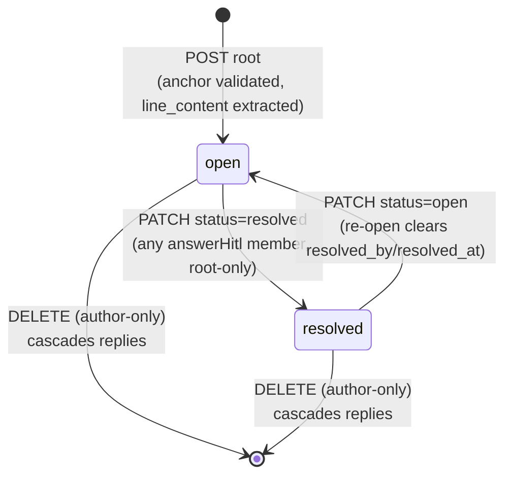
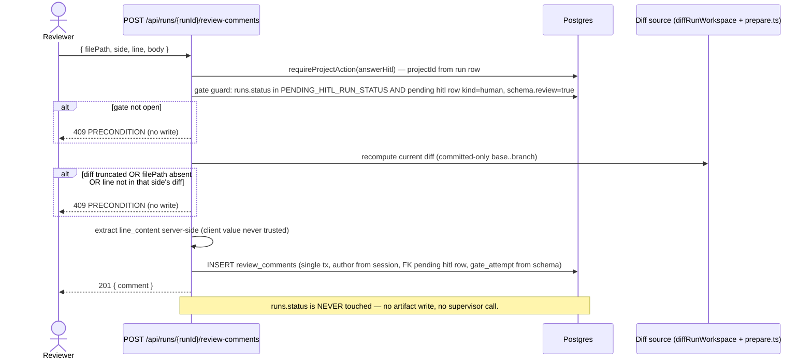
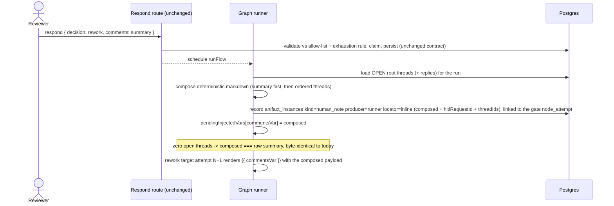
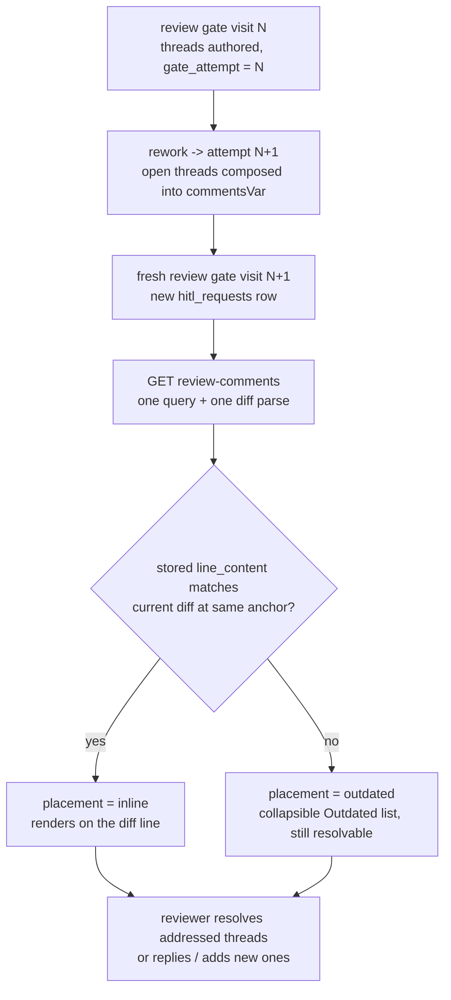
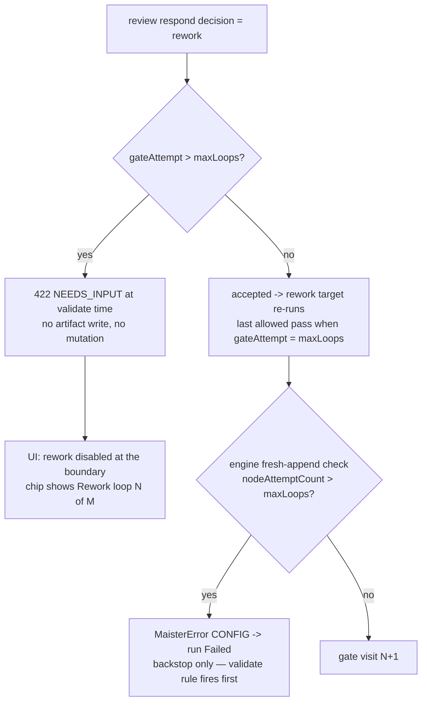

# Review comments domain

> **Status: Implemented (ADR-072), as of 2026-06-10.** This file was frozen
> as the Phase-0 contract before implementation; the table (migration
> `0039`), routes, runner-side compose + evidence, validate guard, and diff
> UI all shipped, and the tags below were reconciled as-built. The locked
> decision is
> [ADR-072](../decisions.md#adr-072-pr-grade-review-comments--review_comments-table-snapshot-anchoring-runner-side-rework-compose-open-gate-guard).

## Purpose

**Review comments** are PR-grade, line-anchored, threaded, resolvable remarks
a reviewer leaves on the review-gate diff of a run, feeding the existing
review-driven rework loop. The domain boundary is: the `review_comments`
table, the anchor/placement model over the committed `base..branch` diff, the
four run-scoped comment routes and their open-review-gate guard, the
runner-side compose of open threads into the rework `commentsVar` payload,
the `human_note` evidence snapshot, and the loop-exhaustion validate rule. It
does NOT cover the review decision itself (the respond route —
[`hitl.md`](hitl.md)), the rework engine ([`flow-graph.md`](flow-graph.md)),
the diff substrate (`GET /api/runs/{runId}/diff`, ADR-066), multi-reviewer
assignment, suggested edits, GitHub PR sync, or fuzzy re-anchoring (all
deferred).

## Domain entities

- **Comment** — a `review_comments` row (migration `0039` — see
  [`../db/hitl-domain.md`](../db/hitl-domain.md) ERD). Columns: `id` (text PK,
  `randomUUID`), `run_id` (FK → `runs.id`, cascade), `hitl_request_id` (FK →
  `hitl_requests.id`, cascade — the gate visit of authoring), `node_id`,
  `gate_attempt` (int — iteration tag), `parent_id` (self-FK, cascade),
  `author_user_id` (FK → `users.id`, SET NULL), `author_label` (text
  snapshot), `file_path`, `side` (text enum `old | new`), `line` (int),
  `line_content` (text, server-extracted), `body` (text), `status` (text enum
  `open | resolved`, default `open`), `resolved_by_user_id` (FK → `users.id`,
  SET NULL), `resolved_at`, `created_at`, `updated_at`. `node_id`,
  `gate_attempt`, `body`, and `status` are NOT NULL (as are `id`, `run_id`,
  `hitl_request_id`, `author_label`, `created_at`); the anchor and
  resolution fields are nullable per the CHECK and lifecycle rules.
- **Thread** — a root comment (`parent_id IS NULL`, carries the anchor +
  `status`) plus its replies (`parent_id = root.id`, no anchor). Exactly one
  level: a reply can never be a parent. DB CHECK: anchor fields (`file_path`,
  `side`, `line`, `line_content`) non-null ⇔ root (`parent_id IS NULL`).
  Indexes: `(run_id, created_at)`, `(run_id, status)`, `(hitl_request_id)`,
  `(parent_id)`.
- **Anchor** — `(file_path, side, line)` + the exact `line_content` snapshot
  extracted server-side from the recomputed run diff at POST time. `side`
  names the diff half (`old` = base, `new` = branch); `line` is the 1-based
  line number on that side. `file_path` is opaque anchor DATA — never used as
  a filesystem path component anywhere.
- **Placement** — a derived (not stored) per-thread value computed in GET:
  `inline` when the stored `line_content` exactly matches the current diff at
  the same `(file_path, side, line)`; `outdated` otherwise. No fuzzy
  re-anchoring (v2 candidate).
- **Open review gate** — the precondition for every comment write:
  `runs.status ∈ PENDING_HITL_RUN_STATUS` (= `{NeedsInput, NeedsInputIdle}`,
  the existing constant, exported as part of this work) AND a pending `hitl_requests` row
  (`respondedAt IS NULL`) with `kind = 'human'` AND `schema.review === true`
  (the [`review-gate.ts`](../../web/lib/flows/review-gate.ts) predicate). New
  comments FK that row.
- **Review-gate schema fields** — the stored `hitl_requests.schema` of a
  review gate additionally carries `{ maxLoops, gateAttempt }` (server-state;
  `gateAttempt` is the 1-based visit number of the current gate, `maxLoops`
  from the node's `rework.maxLoops`, `null` when the node declares no
  rework). See [`hitl.md`](hitl.md).
- **Composed rework payload** — the deterministic markdown the runner injects
  as `pendingInjectedVars[commentsVar]` at rework consumption: user summary
  first, then file/line-ordered open threads with quoted `line_content` and
  replies. Zero open threads ⇒ output ≡ raw summary, byte-identical.
- **Evidence snapshot** — an `artifact_instances` row (`kind: human_note`,
  `producer: runner`, locator `inline` carrying the composed text plus
  additive `{hitlRequestId, threadIds}` metadata) linked to the gate's
  `node_attempt`. See [`artifacts.md`](artifacts.md).

## State machine — comment status (Implemented)

Root comments only (replies carry no own status; they follow their root).
Placement (`inline | outdated`) is a derived read-time value, not a state.



## Process flows

### Drafting comments at an open review gate (Implemented)

Comments are drafted incrementally BEFORE the review decision — through the
new route family, never through the respond route.



Replies (`{parentId, body}`) skip anchor validation; the parent MUST resolve
to a ROOT comment of the SAME run (server-state compare) — otherwise 409
`CONFLICT`. Edit (`PATCH {body}`) and DELETE are author-only (403
`UNAUTHORIZED` for a non-author); resolve/unresolve (`PATCH {status}`) is
root-only and open to any `answerHitl` member. `GET` is `readBoard` (viewer)
and NOT status-gated — history stays visible after the gate closes, like the
diff.

### Rework compose into `commentsVar` (Implemented)

The respond route stays UNTOUCHED (two-phase commit, idempotency CAS,
pristine `response`/`input-<stepId>.json` payloads). The compose happens
runner-side, at rework consumption, in the existing
`if (commentsVar)` branch.



**(M30 — Implemented, [ADR-078](../decisions.md#adr-078-gate-chat-at-hitl-pauses-with-three-layer-workspace-neutrality)) Gate-chat folded into compose.**
When a pause had answer-only gate-chat turns (`gate_chat_messages`), the same
runner-side compose appends the chat transcript (reviewer questions + agent
answers, in `seq` order) after the review-comment threads in the `commentsVar`
payload, so a resumed rework attempt sees the clarifying Q&A. Zero chat turns ⇒
the payload is byte-identical to the review-comments-only compose.

**Serialization format (frozen).** Inputs: `summary` = the reviewer's
submitted comments value (may be absent), `threads` = OPEN root comments with
their replies. Resolved threads NEVER serialize. Roots sort by `file_path`
(ascending, lexicographic), then `line` (ascending), then `side` (`old`
before `new`), then `created_at`, then `id`; replies sort by `created_at`,
then `id` (both ascending).

- **Zero open threads:** the injected value is the raw `summary`, verbatim
  and byte-identical; when no summary was submitted, nothing is injected —
  exactly the pre-feature behavior.
- **Open threads present:** the output is the summary part and the threads
  section joined by one blank line (`\n\n`); when `summary` is absent or the
  empty string, the output is the threads section alone. Blocks inside the
  threads section are joined by `\n\n`; no trailing newline. Template:

```markdown
<summary>

## Review comments

### <file_path>:<line> (<side>)

> <line_content>

**<root author_label>:**

<root body>

**Reply — <reply author_label>:**

<reply body>
```

One `### <file_path>:<line> (<side>)` block per open thread, in sort order;
zero or more reply blocks per thread, in reply order. The compose does NOT
recompute placement: an open-but-outdated thread serializes the same way,
its stored `line_content` snapshot quoted — the agent always receives the
content the comment was anchored to, so staleness never corrupts the
payload, and no `inline`/`outdated` marker appears in the output.

### Re-review carry across iterations (Implemented)

Threads belong to the RUN (not a single gate visit): rows FK the
`hitl_requests` row of their authoring visit and carry `gate_attempt` as an
iteration tag, so a fresh gate visit shows the prior iterations' threads.



### Loop exhaustion (Implemented)

Total allowed gate visits = `maxLoops + 1` (initial visit is `gateAttempt`
1; the engine's prior-count check runs BEFORE the attempt row is appended,
so `nodeAttemptCount > maxLoops` throws `CONFIG` → run `Failed`). The
boundary rule: **reject rework when `gateAttempt > maxLoops`** (equivalently
`gateAttempt ≥ maxLoops + 1`). As-built, the engine check fires only when a
FRESH visit would be appended — resume-reuse re-entries (the `NeedsInput`
resume or takeover-claim re-entry that processes a decision AT the current
visit, where the ledger count already includes that visit) are exempt via
the `reusesCurrentAttempt` predicate, so a decision processed at the final
allowed visit is never killed by its own attempt row; a rework that slips
past the validate rule still dies when traversal returns to append visit
`maxLoops + 2`.



Approve is soft-warned (never blocked) while open threads exist.

## Expectations

All bullets are **(Implemented)** — the as-built acceptance contract.

- Every comment is a `review_comments` row; a root (`parent_id IS NULL`) MUST
  carry all four anchor fields (`file_path`, `side`, `line`, `line_content`)
  and a reply MUST carry none — enforced by a DB CHECK constraint.
- A reply's `parent_id` MUST resolve to a ROOT comment of the SAME run;
  reply-to-reply or cross-run parents are refused 409 `CONFLICT` before any
  write.
- Comment writes are allowed ONLY at an open review gate: `runs.status ∈
  PENDING_HITL_RUN_STATUS` (allow-list, never a `!terminal` complement) AND a
  pending `hitl_requests` row (`respondedAt IS NULL`) with `kind = 'human'`
  AND `schema.review === true`; otherwise 409 `PRECONDITION`. New comments FK
  that row.
- Comment operations NEVER mutate `runs.status` (the runner owns it) and are
  each a single DB transaction with no artifact write, no supervisor call,
  and no deferred created or released.
- POST (root) MUST validate `(filePath, side, line)` against the
  server-recomputed current diff (same `diffRunWorkspace` +
  `lib/diff/prepare.ts` source the view renders) and store the
  server-extracted `line_content`; a `truncated` diff or a file absent from
  the parsed diff → 409 `PRECONDITION`.
- GET is exactly one DB query for the run's comments plus AT MOST one
  in-memory diff parse — no N+1; zero threads short-circuit without
  computing a diff, an unavailable diff source (removed/GC'd workspace)
  degrades every placement to `outdated` (200, never a 500), and `placement`
  is computed purely in memory as `inline` iff the stored `line_content`
  exactly matches the current diff at the same anchor, else `outdated`.
- RBAC: GET = `readBoard` (viewer); POST/PATCH/DELETE = `answerHitl`
  (member); `PATCH {body}` and DELETE are author-only (403 `UNAUTHORIZED`
  otherwise); `PATCH {status}` is root-only and open to any `answerHitl`
  member. `projectId` is always derived from the run row, never the body.
- `body` MUST be non-empty and ≤ 10 000 chars (zod → 400); comment body
  content is NEVER logged — ids and lengths only.
- The runner composes ONLY open root threads (+ replies) in the frozen order
  `(file_path, line, side old<new, created_at, id)`; resolved threads never
  serialize; zero open threads ⇒ the injected `commentsVar` value is
  byte-identical to the raw summary (and nothing is injected when no summary
  was submitted) — existing flows see exactly today's behavior.
- At compose time the runner records the composed payload as exactly one
  `artifact_instances` row (`kind = human_note`, `producer = runner`, locator
  `inline`) linked to the gate's `node_attempt`.
- The stored review-gate schema carries server-state `{ maxLoops,
  gateAttempt }`; a rework decision MUST be rejected 422 (`NEEDS_INPUT`) when
  `gateAttempt > maxLoops` (total visits = `maxLoops + 1`); the engine
  `CONFIG` throw remains the backstop (it fires only on a fresh-visit
  append, never on a resume-reuse re-entry) — the rule applies only when the
  stored schema carries BOTH fields: a no-rework node stamps `maxLoops`
  null and pre-ADR-072 rows lack the fields entirely, so the rule stays off
  there.
- `file_path` is opaque anchor data — it MUST NEVER be used as a filesystem
  path component; `author_user_id`/`author_label` come from the session
  auth-context, never from the body.

## Edge cases

- **Diff `truncated` at POST** → 409
  [`PRECONDITION`](../error-taxonomy.md) — anchors cannot be validated
  against a partial diff (mirrors the truncated-diff promotion
  acknowledgement). GET still works: threads whose file fell past the bound
  render as `outdated`.
- **Diff source unavailable at GET** (workspace removed/GC'd, terminal run)
  → 200 with every thread's placement = `outdated` — the read never 500s;
  a run with zero threads short-circuits without computing a diff at all.
- **Anchored file absent from the parsed diff at POST** (or the line absent
  on the named side) → 409 [`PRECONDITION`](../error-taxonomy.md); nothing
  written.
- **Gate not open** (wrong `runs.status`, or no pending review-gate
  `hitl_requests` row) → 409 [`PRECONDITION`](../error-taxonomy.md) on every
  write; GET is unaffected (history visible).
- **Rework at an exhausted loop** (`gateAttempt > maxLoops`) → 422
  [`NEEDS_INPUT`](../error-taxonomy.md) from the respond route's validate
  step; the engine `MaisterError("CONFIG")` fresh-append check is the
  backstop if validation is bypassed — it fires when traversal returns to
  append visit `maxLoops + 2`, never on the resume re-entry that processes
  a decision at the final allowed visit. Only reachable when the node
  declares rework (`maxLoops` non-null) — a no-rework review gate has no
  rework decision to reject.
- **Reply to a reply** → 409 [`CONFLICT`](../error-taxonomy.md) (1-level
  threads).
- **Reply to a RESOLVED root** → allowed — a reply never re-opens the
  thread; `status` changes only through `PATCH {status}`.
- **`parentId` from another run** → 409
  [`CONFLICT`](../error-taxonomy.md) (server-state compare).
- **Resolve/unresolve targeting a reply** → 409
  [`CONFLICT`](../error-taxonomy.md) (`status` is root-only).
- **`commentId` not found, or `row.run_id ≠ runId`** → bare 404 (existence
  check on server state; not a thrown `MaisterError`).
- **Non-author edit or delete** → 403
  [`UNAUTHORIZED`](../error-taxonomy.md).
- **Open-but-outdated thread at compose** → it DOES serialize, quoting the
  stored `line_content` snapshot (no placement marker in the payload); the
  agent sees the content the comment anchored to.
- **Resolved thread at compose** → never serialized, regardless of
  placement.
- **Root deleted** → replies cascade-delete with it (`parent_id` FK
  cascade); the thread disappears from GET and from any later compose.
- **Author account deleted** → `author_user_id` is SET NULL; the
  `author_label` snapshot keeps the thread attributable in the UI and in the
  composed payload. Author-only edit/delete become permanently unavailable
  for that comment (no session user can match a null author) — by design.
- **Summary absent or empty while open threads exist** → the composed value
  is the threads section alone (no leading blank line); zero threads + no
  summary → nothing is injected (pre-feature behavior).

## Linked artifacts

- ADR: [ADR-072](../decisions.md#adr-072-pr-grade-review-comments--review_comments-table-snapshot-anchoring-runner-side-rework-compose-open-gate-guard)
  (storage, anchoring, compose, guard, identifiers, boundary rule);
  [ADR-066](../decisions.md#adr-066-editor-and-diff-rendering-stack-shiki-git-diff-view-codemirror)
  (comment-ready diff substrate);
  [ADR-008](../decisions.md#adr-008-typed-error-taxonomy-maistererror)
  (closed error union — no new codes).
- API: [`../api/web.openapi.yaml`](../api/web.openapi.yaml)
  (`/api/runs/{runId}/review-comments` GET/POST,
  `/api/runs/{runId}/review-comments/{commentId}` PATCH/DELETE,
  `ReviewCommentThread` / `ReviewComment` schemas, respond-route 422
  exhaustion case).
- ERD: [`../db/hitl-domain.md`](../db/hitl-domain.md) (review_comments ERD +
  prose), [`../db/erd.md`](../db/erd.md) (consolidated),
  [`../database-schema.md`](../database-schema.md) (narrative reference).
- Related: [`hitl.md`](hitl.md) (review-gate schema `{maxLoops, gateAttempt}`
  + exhaustion refusal), [`flow-graph.md`](flow-graph.md) (rework loop,
  composed `commentsVar` semantics), [`../flow-dsl.md`](../flow-dsl.md)
  (`rework.commentsVar`), [`artifacts.md`](artifacts.md) (`human_note`
  evidence), [`workbench.md`](workbench.md) (diff view).
- Source (Implemented): `web/lib/review-comments/service.ts` (authz-free
  service), `web/lib/review-comments/anchor.ts` (extraction + placement),
  `web/lib/review-comments/serialize.ts` (compose),
  `web/lib/review-comments/order.ts` (frozen thread ordering),
  `web/lib/review-comments/dto.ts` (wire DTO projection + code→HTTP map),
  `web/lib/review-comments/run-diff-source.ts` (shared diff recompute +
  placement + gate-panel counts),
  `web/app/api/runs/[runId]/review-comments/**` (routes),
  `web/lib/flows/graph/runner-graph.ts` (gate schema + compose injection),
  `web/lib/flows/hitl-validate.ts` (exhaustion rule),
  `web/lib/flows/review-gate.ts` (gate predicate),
  `web/lib/db/schema.ts` (`review_comments` table, migration `0039`).
