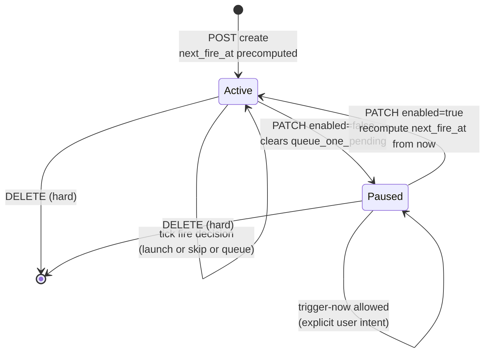
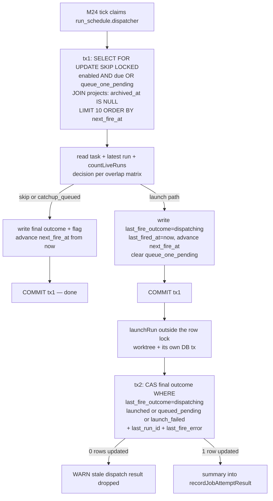
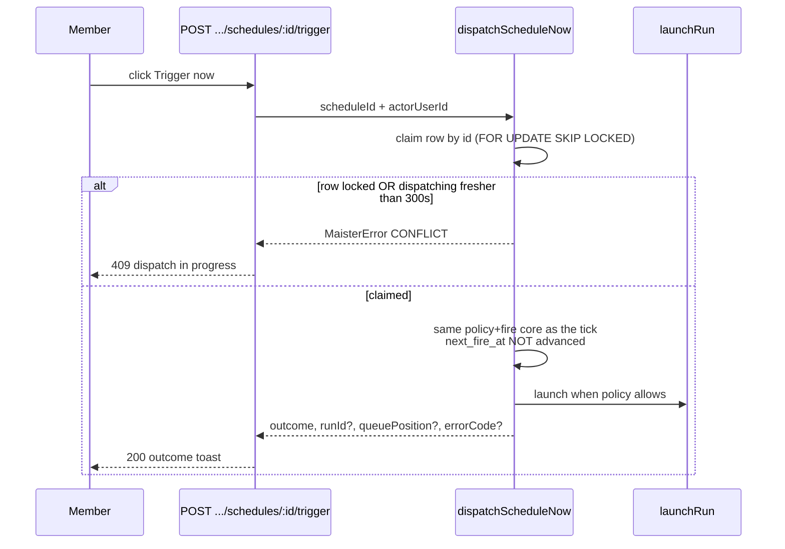
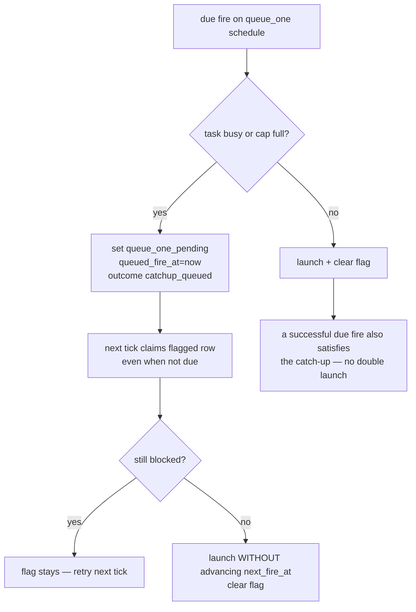

# Run schedules domain

## Purpose

This domain (**Designed, M28**) covers user-facing recurring schedules: a
per-project, member-gated `run_schedules` row that launches a REAL Flow run
for its task on a cron expression (5-field, IANA timezone) with an overlap
policy (`skip | queue_one | start_anyway`), pause/resume, trigger-now, and
last-fire feedback. Fires are driven by the EXISTING M24 scheduler tick
through ONE seeded dispatcher job — no second clock, no new timer, no cap
change. The boundary excludes `agent_tick` scheduling (E4), event/webhook
triggers, and flow-target schedules that mint a task per fire (Phase 2).

## Domain entities

- **Run schedule** (`run_schedules`, Designed, M28) — durable per-project
  schedule: target task, `cron_expr` + `timezone`, `overlap_policy`,
  `enabled`, precomputed `next_fire_at`, non-stacking `queue_one_pending`
  catch-up flag, and last-fire feedback (`last_fired_at`,
  `last_fire_outcome`, `last_fire_error`, `last_run_id`). ERD:
  [`../db/scheduler-domain.md`](../db/scheduler-domain.md).
- **Schedule dispatcher job** (`scheduler_jobs` row `run_schedule.dispatcher`,
  Designed, M28) — the ONE seeded engine job (`job_kind = 'run_schedule'`,
  60s cadence, budget 1, `max_failures` 3) whose handler claims due schedule
  rows. Disabling it on `/admin/scheduler` is the global kill switch.
- **Fire** — one dispatch decision for one schedule row: either a launch
  through `launchRun` (one `runs` row + workspace + worktree, attempt N+1)
  or a recorded skip/queue outcome. Outcome enum: `launched | queued_pending
  | catchup_queued | skipped_task_busy | skipped_cap |
  skipped_target_terminal | skipped_crashed | launch_failed | dispatching`.
- **Launchability classifier** (`classifyTaskLaunchability`, Designed, M28) —
  shared single source of truth for "can this task launch", encoding the
  board retry rule (latest run `Failed | Abandoned` → launchable, attempt
  N+1). Used by `launchRun` itself and by the dispatcher's policy decision.
- **Schedules tab** (project board `?tab=schedules`, Designed, M28) —
  view for `readBoard`, mutate affordances for `manageSchedules` (member).

## State machine

A schedule row has one persisted axis (`enabled`) plus the per-fire decision
applied every dispatcher tick while it is enabled and due.

The per-fire decision (overlap policy × blocked dimensions, in precedence
order) is the DQ7 matrix:

| Condition (precedence order) | `skip` | `queue_one` | `start_anyway` |
| --- | --- | --- | --- |
| `target_terminal` (task or latest run Done, task Abandoned) | `skipped_target_terminal` | `skipped_target_terminal` (no flag) | `skipped_target_terminal` |
| `crashed` (latest run Crashed — owes recover/discard) | `skipped_crashed` | `skipped_crashed` (no flag) | `skipped_crashed` |
| `busy` (active run on the task) | `skipped_task_busy` | flag + `catchup_queued` | `skipped_task_busy` — a second concurrent run per task is structurally impossible; `start_anyway` overrides only the CAP dimension |
| cap full (task launchable) | `skipped_cap` | flag + `catchup_queued` | `launchRun` → run lands `Pending` + queue position (`queued_pending`) |
| free | launch | launch (+ clear flag) | launch |

## Process flows

### Dispatcher tick (single-claim due-OR-catchup)

The M24 tick claims the `run_schedule.dispatcher` job; the handler then
claims schedule rows in one query and runs the two-phase fire pipeline per
row.

Catch-up collapses by construction: `next_fire_at` is recomputed from NOW at
claim time, so a schedule overdue by N slots fires exactly once (mirrors the
engine's "catch-up without backfill").

### Trigger-now

Trigger-now is allowed on a paused schedule (explicit user intent), respects
the overlap policy and the cap (no bypass), and never advances
`next_fire_at` — manual fires are out-of-band of the cron rhythm.

### queue_one catch-up cycle

The flag is non-stacking: at most ONE queued catch-up regardless of how many
fires were missed. `Pending` runs from `start_anyway` keep strict priority —
the existing engine promotes them on slot release, before any tick-driven
catch-up.

## Expectations

- Every fire MUST create runs only through `launchRun` with its full
  preconditions, gates, HITL, and promotion — no side-channel run creation.
- The M24 tick MUST remain the only clock: exactly one seeded
  `run_schedule.dispatcher` job (60s cadence, budget 1) fires schedules; no
  new timer, no `fs.watch`, no polling of run state.
- `scheduler_jobs.cadence_interval_seconds` MUST remain the only engine
  cadence model; cron expressions live exclusively in `run_schedules`.
- A due schedule MUST fire at most once per slot: concurrent
  `dispatchDueSchedules` claims and trigger-now on the same row yield exactly
  one launch (`FOR UPDATE SKIP LOCKED` + the `dispatching` guard).
- `next_fire_at` MUST be advanced from NOW at claim time so any number of
  missed slots collapses into exactly one fire (no backfill).
- Launch intent (`last_fire_outcome = 'dispatching'`) MUST be durably
  committed before `launchRun`, and the final outcome write MUST be
  CAS-guarded on `'dispatching'` — a stale result is dropped with a WARN,
  never clobbers a concurrent edit/delete/later-fire.
- Cap checks MUST reuse the exported `countLiveRuns` /
  `maxConcurrentRunsCap` helpers from `web/lib/scheduler.ts`;
  `start_anyway` rides the existing `Pending` queue and NEVER bypasses the
  cap.
- `queue_one_pending` MUST be non-stacking, set only when a `queue_one` fire
  is blocked by `busy`/cap, consumed without advancing `next_fire_at`,
  cleared by a successful due fire, and cleared by pause.
- A refused fire (`launch_failed` or any skip) MUST record its outcome on the
  schedule row while the dispatcher job attempt records `Succeeded` — one
  schedule's failure never disables the shared dispatcher.
- Mutating routes MUST require `manageSchedules` (member); listing requires
  `readBoard`; cron fires pass `actorUserId: null`, trigger-now passes the
  clicking user's id.
- `cron_expr` MUST be 5-field and `timezone` a valid IANA name, validated
  through the croner wrapper (`MaisterError("CONFIG")`); `croner` MUST be
  imported only by `web/lib/run-schedules/cron.ts` and MUST never start
  timers.
- Schedules of archived projects MUST never be claimed; deleting the task
  cascades the schedule away, while `last_run_id` (`ON DELETE SET NULL`)
  keeps launched runs untouched.

## Edge cases

- **W1 crash window** (process death after tx1, before `launchRun`): the fire
  is LOST BY DESIGN (at-most-once launch — retrying here is what double-fires
  runs). The row shows `dispatching` until the next fire overwrites it; the
  UI renders it as "dispatching…".
- **W2 crash window** (after `launchRun`, before tx2): the run EXISTS and is
  fully owned by the normal run lifecycle; the schedule is stuck
  `dispatching` without `last_run_id` and self-heals at the next fire.
- **Trigger-now vs fresh `dispatching`**: refused with
  `MaisterError("CONFLICT")` (409) while `last_fired_at` is within the 300s
  scheduler attempt timeout; an OLDER `dispatching` remnant (W1) is past the
  window and MAY be triggered — the staleness escape that keeps W1 from
  bricking the button.
- **Trigger-now racing the tick on the same due second**: the row lock
  serializes them; the loser observes the winner's run as `busy` → policy
  outcome, no duplicate. For `start_anyway` with cap headroom the worst case
  is one manual + one cron run — both explicitly requested.
- **DST**: skipped local times (spring-forward) fire at the next valid
  instant; the repeated hour (fall-back) fires once — croner's documented
  behavior, asserted in the wrapper's unit fixtures.
- **`target_terminal` / `crashed` skips**: recorded as
  `skipped_target_terminal` / `skipped_crashed` under EVERY policy and never
  set the `queue_one` flag — the task owes a human action (board retry rules
  in [`tasks.md`](tasks.md)).
- **Archived project**: the claim query JOINs `projects` and excludes
  `archived_at IS NOT NULL` rows — archived projects never fire.
- **Invalid `cron_expr` / `timezone` / never-matching expression** on
  create/edit: `MaisterError("CONFIG")` → 400.
- **Cross-project `taskId`** on create: `MaisterError("PRECONDITION")` → 409;
  schedule lookups from another project's slug → 404.
- **`launchRun` refusal** (dirty repo, branch taken, supervisor down, …):
  recorded as `launch_failed` with `last_fire_error = "CODE: message"`
  (bounded ≤ 500 chars); the dispatcher does not throw.
- **Dispatcher auto-disable**: 3 consecutive ENGINE-level failures (handler
  crash, lease expiry — not schedule-level refusals) disable the dispatcher
  job; admin re-enable on `/admin/scheduler` is the documented kill-switch
  recovery.
- **Batch truncation**: more than 10 due schedules in one tick — the
  remainder stays due for the next tick; the attempt summary carries a
  structured `truncated` flag plus a WARN log.

## Linked artifacts

- API: [`../api/web.openapi.yaml`](../api/web.openapi.yaml)
  (`/api/projects/{slug}/schedules` family).
- DB: [`../database-schema.md`](../database-schema.md),
  [`../db/scheduler-domain.md`](../db/scheduler-domain.md), and
  [`../db/erd.md`](../db/erd.md).
- ADR: [ADR-071](../decisions.md#adr-071-user-facing-run-schedules-on-the-m24-clock),
  [ADR-060](../decisions.md#adr-060-unified-scheduler-clock-and-polymorphic-job-budgets),
  [ADR-009](../decisions.md#adr-009-global-concurrency-cap--3).
- Engine domain: [`scheduler.md`](scheduler.md); board retry rules:
  [`tasks.md`](tasks.md).
- Source seams (Designed): `web/lib/run-schedules/{cron,service,queries,dispatch}.ts`,
  `web/lib/runs/launchability.ts`, `web/lib/scheduler/{jobs,tick-service,budgets}.ts`,
  `web/lib/services/runs.ts`, `web/lib/scheduler.ts`.
