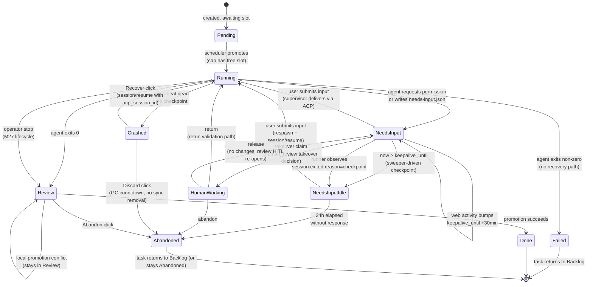
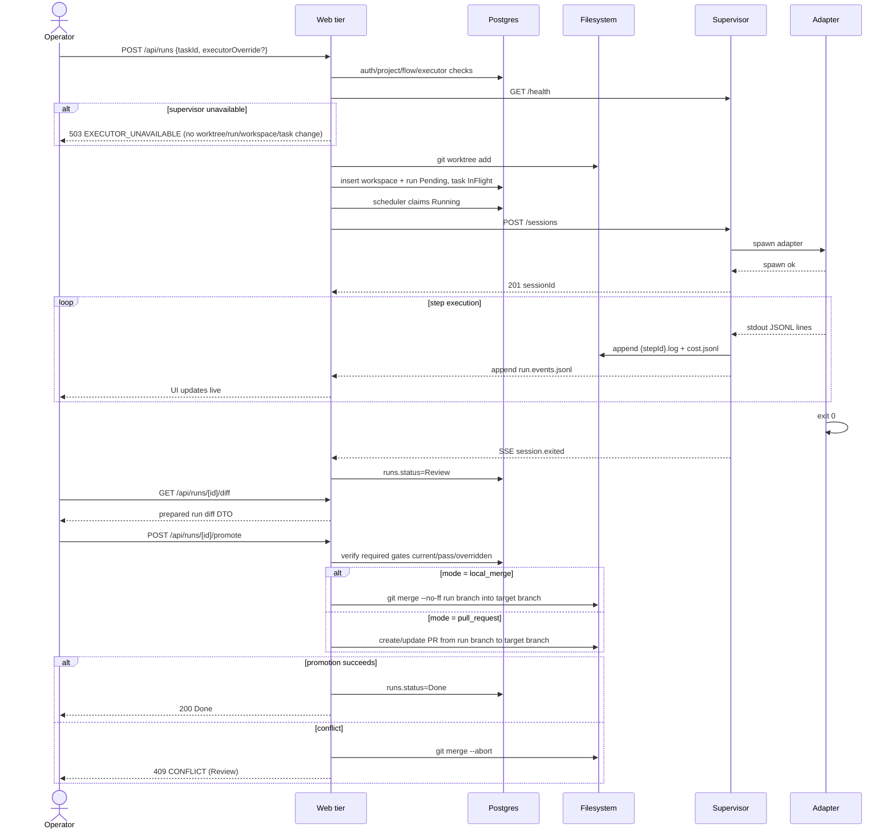
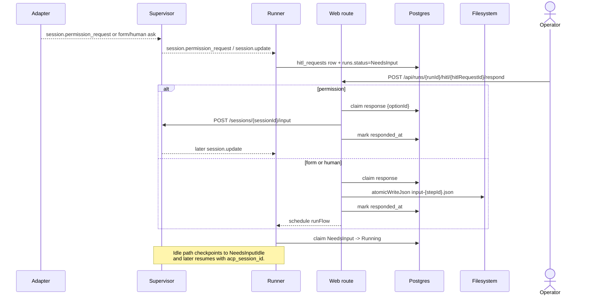
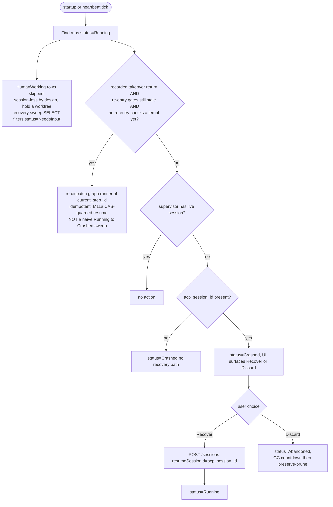
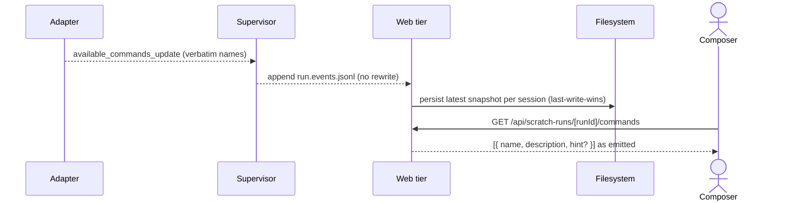
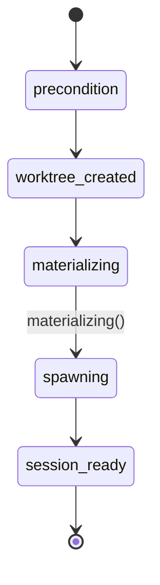

# Runs domain

## Purpose

A **run** is one execution attempt of a task through a Flow. It owns
the ACP session, the worktree, and the per-run artifacts on disk. The
runs domain is the heart of MAIster's state machine; every other
domain projects state onto it.

## Domain entities

- **Run** — `runs` row. FK to `tasks`, `projects`, `flows`,
  `executors`.
- **Assignment** — M13 ownership row for pending human-visible work. It points
  at a run for inbox/read-model purposes but does not add run statuses and does
  not participate in scheduler caps.
- **ACP session id** — opaque resume handle (`runs.acp_session_id`).
  Lifecycle described in [`../decisions.md#adr-006-hybrid-hitl-keep-alive--checkpointresume`](../decisions.md#adr-006-hybrid-hitl-keep-alive--checkpointresume).
- **Workspace** — git worktree under
  `.maister/<slug>/runs/<runId>/`. See [`workspaces.md`](workspaces.md).
- **Per-run artifacts on disk**:
  - `<stepId>.log` — append-only stdout of each step.
  - `cost.jsonl` — token usage records.
  - `needs-input.json` — present while the run waits for structured
    form input.
  - `input-<stepId>.json` — atomic-written response payload.

## Run detail UI hierarchy (Planned M35)

The run detail screen does not add run statuses or mutate the run state
machine. It projects the existing run, workspace, graph, evidence, timeline,
diff, and lifecycle read models into three stable regions:

- **Non-scratch Flow runs** land on Flow results and selected-node outputs.
  The graph/list, current node, gates, artifacts, HITL context, token/cost
  contribution, and review entry point are the primary page center.
- **Standalone agent runs** without a pinned Flow manifest land on an agent
  activity/result center. They still expose evidence, timeline, diff, branch,
  and lifecycle actions, but they do not fabricate Flow nodes.
- **Secondary workbench** tabs are Files, Diff, Evidence, and Timeline. Files
  remain `readRepoFiles`; Diff remains run-scoped and uses the existing
  `readBoard`/`readScratchRun` gates.
- **Right inspector** is shared by Flow, agent, and scratch runs. It summarizes
  change size, branch/worktree facts, run status, Flow/session mini-map, and
  server-derived action availability.

## Runs ledger UI (Implemented)

`/runs` is the read-only run ledger reached from the Active workspaces rail
**See all** link. It does not create a new state machine or write model. It
projects existing rows from `runs`, `projects`, optional `tasks`, `flows`,
`workspaces`, `run_cost_rollups`, and the `run_schedules.last_run_id` link into
a URL-filtered table.

Filters are project, state, source, runner, and inclusive start-date range.
Global admins see every non-archived project's runs; other users see only runs
for projects where they have `project_members` visibility. Flow and standalone
agent rows open `/runs/{runId}`; scratch rows open `/scratch-runs/{runId}`.

## State machine — execution axis



Status names exactly match the `runs.status` enum in
`web/lib/db/schema.ts`.

### M11a graph rework loop (Implemented)

The M11a review-driven rework loop does **not** add a run status. It is a
**node-pointer move inside `Running`**: a `review` node finishes `human` and the
run enters `NeedsInput` (same as any HITL); when the reviewer's `rework`
decision is resumed, the runner marks downstream gates stale, moves the node
pointer back to the rework target, opens attempt N+1, and continues — all within
`Running`. Three invariants hold so the run machine is not over-claimed:

1. **No new status.** Rework is a pointer move within `Running`; there is **no
   `HumanWorking`** status in M11a (that is M11b). The only HITL-driven status is
   the existing `NeedsInput`/`NeedsInputIdle` pair.
2. **`current_step_id` carries the node id.** `runs.current_step_id` now holds
   the compiled-graph **node id** (≡ the step id for compiled-linear nodes). The
   existing fail-closed resume check (unknown id in the pinned manifest →
   `Crashed` + `MaisterError("CONFIG")`) applies unchanged to the compiled graph.
3. **Gates feed, do not gate promotion.** M11a writes `gate_results` but they do
   **not** block promotion. The promote sequence's "verify required gates" step
   is the **M15/M18** readiness policy, not M11a — see the note on the happy-path
   diagram below and [`flow-graph.md`](flow-graph.md).

### M27 operator stop to `Review` (Implemented)

The workbench lifecycle surface can intentionally stop a live Flow run and park
it in `Review` without deleting the worktree. This broadens `Review`: it can
mean "agent completed" or "operator stopped and wants to inspect, preserve, or
handoff partial work". Promotion still re-gates readiness at promote time, so a
stopped run is not treated as completed merely because it is reviewable. Full
stop, archive, drop, snapshot, export, and handoff semantics live in
[`workbench-lifecycle.md`](workbench-lifecycle.md).

### M11b manual-takeover status `HumanWorking` (Implemented)

Manual takeover ([ADR-030](../decisions.md#adr-030-manual-takeover-as-a-local-worktree-handoff-humanworking-status))
adds the real `runs.status` value `HumanWorking`. A reviewer parked at a
`human_review` node claims the run (`NeedsInput → HumanWorking`), edits the
existing worktree in place on the same host, and returns it
(`HumanWorking → Running`, the runner reruns the declared validation path) or
releases it (`HumanWorking → NeedsInput`, the original review HITL re-opens) or
abandons it (`HumanWorking → Abandoned`). Full domain detail lives in
[`manual-takeover.md`](manual-takeover.md). Four invariants bind it to the run
machine:

1. **`HumanWorking` is a REAL run status**, unlike the M11a rework loop above
   (a node-pointer move *within* `Running`). A claimed run leaves the
   `Running`/`NeedsInput` machine and renders a distinct board surface.
2. **It counts against the global cap exactly like `Running`/`NeedsInput`**
   ([ADR-009](../decisions.md#adr-009-global-concurrency-cap--3)) — a claimed
   worktree holds a real slot through **both** scheduler cap-check predicates
   (`web/lib/scheduler.ts`, the initial-promote and under-advisory-lock-recheck
   counts of `status IN ('Running','NeedsInput','HumanWorking')`).
3. **The takeover branch IS `workspaces.branch`** — no new branch, target, base
   selection, or PR is created (that is **M18**). The claim exposes the existing
   `worktree_path` + branch only.
4. **`HumanWorking` is session-less BY DESIGN** (the human edits locally; there
   is no live ACP session) yet HOLDS a worktree, so it is **EXCLUDED from the
   startup recovery sweep classification** and never mis-flagged `Crashed`. The
   orphan→`Crashed` path is `runResumeRecoverySweep` in
   `web/lib/runs/resume-recovery.ts` (there is no `reconcile.ts`), whose SELECT
   filters `runs.status='NeedsInput' AND acpSessionId IS NOT NULL` — so
   `HumanWorking` is excluded by construction.

### M19 reconcile-driven `Running → Crashed` + hybrid Recover (Designed)

M19 ([ADR-033](../decisions.md#adr-033), [ADR-034](../decisions.md#adr-034))
adds an out-of-band **reconcile sweep** (startup + periodic) that classifies a
stranded `Running` run into re-attach / re-dispatch / skip / `Crashed`. This is
the **`Running → Crashed`** transition that did not previously exist (only
`NeedsInput → Crashed` did, via `crashResumedRun`); M19 adds `crashRunningRun`
(CAS `WHERE status='Running'`). The full classification table and the GC
lifecycle live in [`reconciliation-gc.md`](reconciliation-gc.md). Four
invariants bind it to the run machine:

1. **Allow-list `Running`-only.** Reconcile NEVER touches a non-`Running` row;
   `NeedsInput`/`NeedsInputIdle`/`HumanWorking`/terminal stay owned by the
   `resume-recovery`, `takeover-return`, and idle sweeps. Candidate sets are
   disjoint by construction.
2. **Grace guard.** A `Running` agent run with no live session is SKIPPED while
   `runs.resume_started_at` OR the latest `node_attempts.started_at` is within
   `MAISTER_RECONCILE_GRACE_SECONDS` (default 90); only past grace is it
   `Crashed`. This protects in-flight launches and Recovers.
3. **Retry-safety split.** No-live-session `check`/`judge` gate nodes
   re-dispatch (read-only, CAS-guarded no-op when a runner still holds the run);
   a `cli` node is `Crashed` (`cli-not-retry-safe`) and never auto-re-dispatched.
4. **Hybrid Recover.** `POST /api/runs/{runId}/recover` flips `Crashed → Running`
   and stamps `runs.resume_started_at` BEFORE the supervisor side-effect, then
   resumes an agent node (ACP `session/resume`) or re-dispatches a session-less gate node. It
   re-admits through the global cap (a `Crashed` run already released its slot):
   slot-free resumes now, cap-full queues as `Pending` (202) and the scheduler
   resumes it on slot-free. `POST /api/runs/{runId}/discard` marks `Abandoned`
   and enters the GC countdown (no synchronous worktree removal).

### M18 flow-run `Review → Done` promotion (Implemented)

Before M18 a **flow** run dead-ended at `Review` (`Running→Review` is
CAS-guarded; no promote path flipped it terminal — only scratch runs promoted).
M18
([ADR-058](../decisions.md#adr-058-branch-targeting-at-launch-shared-promotion-service-promote-time-readiness-re-gate-m18m15-carve))
wires the **existing** `Review → Done` edge for flow runs through a **shared
`promoteRun` service** that drives both run kinds. This adds **NO new
`runs.status` value** — `local_merge` terminates at the existing `Done`. The
`pull_request` mode (which also lands at `Done` and records `pr_url`/`pr_number`
on the workspace but is not tracked to merge) is **Implemented (M18)**.
The full claim → side-effect → finalize contract (the durable
`promotion_state` claim + per-attempt `promotion_attempt_id` token, idempotency,
and the crash windows) lives in [`workspaces.md`](workspaces.md). Four
invariants bind it to the run machine:

1. **No new status.** Both modes land on the existing terminal `Done`; the
   `Review → Review` self-edge still absorbs a `local_merge` conflict (run stays
   `Review` + a manual-resolution assignment is created). This deliberately
   avoids the new-status consumer fan-out.
2. **Promote-time readiness re-gate.** The promote service calls
   `assertEvidenceReady(runId, "review")` a **second** time, at promote time —
   the M16 chokepoint already enforces it once at Review-entry, but gates can go
   stale between Review-entry and the promote click. A not-ready/stale gate
   refuses promotion `PRECONDITION` (run stays `Review`, no side-effect);
   **overridden** gates satisfy it via the existing `{passed, overridden}`
   allow-list (`isExternalGateReady`). This **reuses M16, with no M15
   dependency** — an ADR-045-consistent M18 carve, not an M15 implementation.
3. **Allow-list guard.** The promote guard is `status ∈ {Review}` (flow) /
   `dialogStatus = "Review"` (scratch), NOT `if (!terminal)` — a future status is
   rejected by default.
4. **Terminal write is atomic + idempotent.** `Review → Done` is one finalize
   transaction keyed on the attempt token; a retry after success returns `409`
   (already `Done`), never a second promotion.

### Multi-run launch overrides (Designed, ADR-085)

Manual task launches are no longer limited to Backlog retry. The manual
surface uses a positive allow-list from [`tasks.md`](tasks.md):
`Done`, `Review`, `Failed`, `Abandoned`, and `Crashed` are launchable through
"Run again"; active/busy states and relation blockers remain disabled with a
visible reason.

`launchRun` stays the single creation service for internal UI, task page,
board card, and any future dispatcher. It accepts only server-validated
overrides:

- `flowId` — optional, must be an enabled Flow on the task's project. Default
  is the task's Flow.
- `runnerId` — optional, resolved through the existing ADR-076 runner/model
  chain for the selected Flow. The route returns configured model and model
  application metadata for display; secret provider fields are never returned.
- `baseBranch` and `targetBranch` — optional, both validated against
  server-derived branch lists. The worktree forks from the resolved
  launch-time base commit; target is the promotion target snapshot.
- `deliveryPolicy` — optional launch override, resolved against the project
  default and snapshotted on the run.

The branch naming summary is deterministic:
`<project.branchPrefix>task-<taskId>/attempt-<nextAttempt>` unless a later
ADR changes branch identity. The launch dialog displays the branch name and
base branch before POST. Every displayed override is marked as a deviation from
the default.

Internal `POST /api/runs` and `GET /api/runs/launch-options` expose this
contract. `POST /api/v1/ext/runs` remains v1-compatible in ADR-085: it accepts
`taskId`, optional `runnerId`, `baseBranch`, and `targetBranch` only. It keeps
the same `launchRun` service, token project-scope check, and audit row, but it
does not accept `flowId` or delivery-policy override until a versioned external
API decision adds parity.

### Cost and time accounting (Designed, ADR-085)

`cost.jsonl` remains the append-only source of truth. Cost records are enriched
at the supervisor boundary with:

- `runId`, `projectSlug`, `stepId`, and `nodeAttemptId`;
- `sessionId` and optional ACP resume marker;
- `model`;
- token totals by kind: `input`, `output`, `cache_read`, and
  `cache_creation`.

For `new-session` nodes, the web tier sends `nodeAttemptId` when creating the
session. For shared `slash-in-existing` sessions, every prompt call updates the
active attribution context before the adapter turn starts. The supervisor
either serializes prompt turns for the session or refuses concurrent prompts
with a typed precondition failure; it never writes ambiguous node-attempt cost.

Derived DB rollups are reconcilable from `cost.jsonl` and may be recomputed on
read or updated through the existing run event path. Rollups store token/cost
totals, not redundant duration. Run wall-clock duration is derived from
`runs.started_at` to `coalesce(runs.ended_at, now)`. Node active duration is
derived from `node_attempts.started_at` to `coalesce(node_attempts.ended_at,
now)`. Resume tax is the subtotal of records where the resume marker is true,
especially cache-creation tokens paid by checkpoint/resume.

UI surfaces:

- Run detail summary card: token totals by kind and model, resume-tax subtotal,
  active time and wall-clock side by side.
- Run timeline: per-node-attempt token and duration columns.
- Task page: aggregate totals across every run attempt for the task.
- Observatory: read-only cost dimension by project, Flow, and node.

Live updates reuse the existing run SSE/server-refresh path. No client
`setInterval`, filesystem polling, `fs.watch`, or `chokidar` path is allowed.

### Resolved prompt capture (Implemented)

Each `ai_coding` / `judge` node computes a final Mustache-resolved prompt at
dispatch. The graph runner eagerly persists it to `node_attempts.resolved_prompt`
(migration `0053`, nullable) in `runAgentStep`, immediately after the prompt is
resolved and BEFORE the agent turn is dispatched, so the prompt is recoverable
even if the attempt later crashes or stalls. The write is per-attempt and
write-once (guarded `WHERE resolved_prompt IS NULL`): a rework loop records its
own row's prompt, and a `NeedsInput` resume that re-enters the node preserves the
first dispatch's prompt rather than overwriting it. It is best-effort — a failed
`UPDATE` logs a `WARN` and never blocks dispatch (the prompt is audit data, not
control flow).

UI surface: the run timeline exposes a collapsible **Prompt** disclosure per
node-attempt (monospace + copy). For runs created before `0053`,
`resolved_prompt` is null and the node's manifest **template** is shown instead
with a "resolved prompt not captured for this run" note — never a best-effort
re-render (which would lie on `{{ steps.*.output }}`).

### Delivery policy (Designed, ADR-085)

Delivery policy resolves as:

```text
project default -> launch override -> promote-time override
```

The resolved launch snapshot is immutable for the run and is visible on run
detail even when the project default later changes.

```ts
type DeliveryPolicy = {
  strategy: "merge" | "rebase_merge" | "pull_request" | "ai_rebase_merge";
  push: "never" | "on_success";
  trigger: "manual" | "auto_on_ready";
  targetBranch?: string;
};
```

Compatibility:

- legacy `local_merge` maps to `{ strategy: "merge", push: "never",
  trigger: "manual" }`;
- legacy `pull_request` maps to `{ strategy: "pull_request", push:
  "on_success", trigger: "manual" }`;
- scratch runs stay on legacy M18 promote semantics in this slice.

`auto_on_ready` fires only when a run is in `Review` and the existing
readiness gate returns ready/overridden. The run-detail banner states that the
run will auto-deliver when ready and exposes a cancel action that switches only
the run snapshot to `manual` through a CAS guarded by `status = Review` and
`trigger = auto_on_ready`.

Promotion preselects the run snapshot but allows an explicit human override.
`merge`, `pull_request`, and `rebase_merge` share the existing promotion claim,
readiness re-gate, target-drift token, conflict assignment, and finalize-token
behavior. `rebase_merge` runs a rebase before the final merge and restores or
aborts cleanly on conflict. Conflict/degradation UI shows the failing command,
paths, and status at parity with the current merge-conflict surface.

`ai_rebase_merge` is separable but runs on the same durable promotion substrate:
the policy mode is preserved for audit/API responses, the git side effect uses
the existing rebase-merge lane, and conflicts appear as the existing
`merge_conflict` assignment kind in the standard inbox/needs-you surfaces unless
a future autonomous resolver introduces additional standard HITL rows.

### Phase A audit and QA matrix (Designed, ADR-085)

Verified baseline for this slice:

- Current latest ADR before this feature: ADR-084; this feature uses ADR-085.
- Current latest migration: `0044_mcp_supported_agents_all_adapters`; the next
  schema migration is `0047`.
- Launch choke points: `web/lib/services/runs.ts`, `web/app/api/runs/route.ts`,
  `web/app/api/v1/ext/runs/route.ts`,
  `web/app/api/runs/launch-options/route.ts`, and
  `web/lib/run-schedules/dispatch.ts`.
- UI surfaces: `web/components/board/launch-popover.tsx`,
  `web/components/board/task-card.tsx`,
  `web/app/(app)/projects/[slug]/tasks/[number]/page.tsx`,
  `web/app/(app)/runs/[runId]/layout.tsx`,
  `web/components/runs/review-panel.tsx`,
  `web/components/board/panels/settings-panel.tsx`, and Observatory pages.
- Supervisor attribution surfaces: `supervisor/src/types.ts`,
  `supervisor/src/http-api.ts`, `supervisor/src/cost.ts`,
  `web/lib/supervisor-client.ts`, `web/lib/flows/runner-agent.ts`, and
  `web/lib/flows/graph/runner-graph.ts`.

Required RED tests before implementation:

| Surface/behavior | Test owner |
| --- | --- |
| Manual launchability allow-list and disabled reasons | `web/lib/runs/__tests__/launchability.test.ts` |
| Scheduler classifier preservation | `web/lib/run-schedules/__tests__/dispatch-decision.test.ts` and dispatch integration |
| Internal launch route flow/policy trust boundary | `web/app/api/runs/__tests__/*` |
| External v1 launch compatibility | `web/app/api/v1/ext/runs/__tests__/*` |
| Launch-options DTO shape and no scratch-options dependency | `web/app/api/runs/launch-options/__tests__/route.test.ts` |
| Delivery-policy schema/resolution/cancel | `web/lib/runs/__tests__/*` and route integration |
| Promote policy transitions and scratch regression | `web/lib/runs/__tests__/promote-*.test.ts` |
| Supervisor cost stamping and prompt attribution | `supervisor/src/__tests__/cost.test.ts` plus web integration |
| Run/task/Observatory cost read models | `web/lib/queries/__tests__/*` |
| Task card/page Run again and disabled tooltip states | `web/e2e/multi-run-cost-policy.spec.ts` with seeded Done/Review/Failed/Abandoned/Crashed/busy/blocked tasks |
| Launch dialog flow/runner/model/branch/policy defaults and override badges | `web/e2e/multi-run-cost-policy.spec.ts`; fixture `web/e2e/_seed/multi-run-cost-policy.ts` |
| Task run-history columns and aggregate totals | `web/e2e/multi-run-cost-policy.spec.ts` plus `web/lib/queries/__tests__/task-detail*.test.ts` |
| Board latest-run card plus run-count badge | `web/e2e/multi-run-cost-policy.spec.ts` |
| Run detail cost summary, policy snapshot, auto banner/cancel | `web/e2e/multi-run-cost-policy.spec.ts` plus route/query integration tests |
| Run timeline duration/token columns | `web/e2e/multi-run-cost-policy.spec.ts` plus query integration tests |
| Promote panel policy preselection/override/conflict/degradation | `web/e2e/multi-run-cost-policy.spec.ts` plus temp-git promote integration tests |
| Observatory cost dimension | `web/e2e/multi-run-cost-policy.spec.ts` plus observatory rollup query tests |

`AUTHED_SPEC` must match `multi-run-cost-policy.spec.ts`; if the regex remains
allow-listed, update it in `web/playwright.config.ts` before running the e2e
lane. A feature task is not done until its surface row above has a green
Playwright assertion, EN/RU copy, and an integration/unit owner for its
server-side contract.

Logging requirements:

- accepted launches: DEBUG with `taskId`, `runId`, `flowId`, `runnerId`,
  policy summary, base branch, and target branch;
- refused launches: WARN with classifier result and blocker refs, without
  server-only paths;
- cost ingestion: DEBUG bounded token totals and attribution ids; WARN malformed
  or unattributable records; never raw adapter lines, prompts, or secrets;
- delivery policy: INFO snapshot/auto-trigger/cancel; WARN degradation with
  failing command/path/status; ERROR only for unrecoverable side-effect failure
  with attempt id.

## Process flows

### Happy path — launch to Review, promote after Review (Implemented)



> The "verify required gates" step above is the readiness re-gate. In **M11a**
> the graph runner *records* `gate_results` (pass/fail/stale/overridden) but does
> **not** gate promotion on them. **(Implemented, M18)** the promote service enforces
> readiness here by calling `assertEvidenceReady(runId, "review")` a **second**
> time (a deliberate M16 reuse, no M15 dependency —
> [ADR-058](../decisions.md#adr-058-branch-targeting-at-launch-shared-promotion-service-promote-time-readiness-re-gate-m18m15-carve));
> overridden gates satisfy it. `local_merge` finalizes at `Done`; `pull_request`
> is **(Implemented, M18)**. See [`flow-graph.md`](flow-graph.md) and
> [`workspaces.md`](workspaces.md).

### NeedsInput and keep-alive cycle



### Crash recovery (Designed for Flow runs; scratch recovery implemented separately)



> The **takeover-return** branch rescues a run stranded in `Running` when the
> process died after the return's `HumanWorking → Running` flip but before the
> runner attached. The re-dispatch is idempotent (M11a CAS-guarded resume): a
> live runner makes it a no-op, a genuinely stale pointer fails closed to
> `Crashed`. A naive "`Running` + no live session → `Crashed`" sweep is rejected —
> it would false-positive on a session-less `command_check` gate running after the
> return. See [`manual-takeover.md`](manual-takeover.md).

### Live availableCommands capture (Designed — FR-A1…A3)

The ACP `available_commands_update` event is currently **discarded** as
transcript noise (`web/lib/scratch-runs/transcript.ts`,
`web/lib/projector/artifact-projector.ts`). This feature **(Designed)** stops
discarding it and instead persists the **latest snapshot per session**
(last-write-wins) in run stream state (e.g. `session.json`). The snapshot is the
authoritative, runner-correct command list once a session is live — it includes
the agent's native/global commands, which the static catalog cannot know.

Snapshot element shape is the ACP `AvailableCommand`:
`{ name, description, input?: { hint } }`. **Names are persisted and exposed
exactly as emitted** — `codex-acp` bakes `$` into the `name`, `claude-agent-acp`
emits bare names (plus an `mcp:` prefix for MCP commands). The
**verbatim-forward invariant holds**: the supervisor does **no** rewriting; the
web composer maps emitted names to canonical capability refs via the catalog
(see [`capability-catalog.md`](capability-catalog.md)).

The snapshot is exposed **scratch-only** via
`GET /api/scratch-runs/[runId]/commands` → `[{ name, description, hint? }]`. Flow
nodes are non-interactive, so the node composer stays static-catalog-only and
does not consume this stream.



Two invariants bind this to the existing run stream:

1. **Reconnect is unaffected.** SSE `lastEventId` replay over
   `run.events.jsonl` still works; persisting the snapshot adds run stream state
   and does not change the monotonic event sequence.
2. **Fan-out is preserved.** The event must **no longer surface as transcript
   noise**, and every other `sessionUpdate` consumer must keep working with the
   event now captured (fan-out audit across both former discard sites).

### Launch progress streaming (Implemented — FR-F1/F2)

`launchScratchRun` (and flow launch via `launchRun`) stream staged progress on
the **launch POST's own `text/event-stream` response** — NOT the run SSE (the
run row and its `/api/runs/{runId}/stream` do not exist until the launch
finishes; sub-plan 2026-06-17, Option 2). Each side-effect boundary yields a
frame so the composer/board renders a live loader instead of freezing on a
blocking POST (decision D9). Scratch spawns its session synchronously and emits
all five stages; flow launch has no synchronous spawn (`runFlow` runs in the
background) and `POST /api/runs` is **content-negotiated** — it streams the
`precondition → worktree_created → materializing(<adapter>)` subset only when the
client `Accept`s `text/event-stream`, otherwise it returns the JSON 202. The
stages are server-provided labels:



The route drives one generator step (running every precondition) BEFORE
committing to the stream, so a precondition failure is a JSON error with its
HTTP status; a failure AFTER the stream opens surfaces a typed `MaisterError`
code as an in-stream `error` frame (`PRECONDITION`, `EXECUTOR_UNAVAILABLE`, …)
rather than a bare string. A client cancel (disconnect) aborts at the next
side-effect boundary: pre-commit it GCs the worktree+branch (no orphan);
post-commit it leaves a **tracked** run row (scratch → `Crashed`, flow → the
already-inserted run) — never an orphan worktree or live ACP session.

## Expectations

- `runs.status` values exactly match the enum in `web/lib/db/schema.ts`;
  no string-typed status outside the enum is permitted.
- Every run owns exactly one workspace and at most one live ACP session
  at any time; **`HumanWorking` runs intentionally have no live session**
  (the human edits the worktree locally — see
  [ADR-030](../decisions.md#adr-030-manual-takeover-as-a-local-worktree-handoff-humanworking-status)).
- Global concurrency cap = `MAISTER_MAX_CONCURRENT_RUNS` (default 6,
  hard cap); excess runs wait as `Pending` and auto-promote when a slot
  frees. `HumanWorking` counts toward the cap exactly like
  `Running`/`NeedsInput` — a claimed worktree holds a slot.
- **(Implemented, M11b)** A `HumanWorking` run survives Next.js and
  supervisor restart WITHOUT being classified `Crashed`: it is session-less
  by design and is excluded from the `runResumeRecoverySweep` SELECT
  (`status='NeedsInput' AND acpSessionId IS NOT NULL`) by construction.
- `NeedsInput` keep-alive window is `MAISTER_KEEPALIVE_MINUTES`
  (default 30 min); every web-activity event extends `keepalive_until`.
- Idle past `keepalive_until` triggers graceful checkpoint → run becomes
  `NeedsInputIdle` with `runs.acp_session_id` retained as the resume handle.
- `NeedsInputIdle` resume respawns the adapter and restores context via the
  ACP `session/resume` call on `acp_session_id` (not a CLI flag) and incurs
  ~$0.28 cache-creation cost per respawn (operator-visible if surfaced).
- 24 h elapsed in `NeedsInputIdle` without operator response →
  `Abandoned`. This sweeper transition does not raise `HITL_TIMEOUT`.
- **(Designed)** Full Flow-run state survives Next.js restart AND
  supervisor restart; on boot, reconciliation classifies orphans as
  `Crashed` and offers Recover or Discard.
- **(Designed, M19)** The reconcile sweep is allow-list `Running`-only and
  transitions a stranded `Running` run to `Crashed` (`crashRunningRun`)
  ONLY when the worktree is gone, a `cli` node has no live session, or an
  agent session is gone past `MAISTER_RECONCILE_GRACE_SECONDS`; every such
  transition calls `promoteNextPending` and clears
  `runs.resume_started_at`. See [`reconciliation-gc.md`](reconciliation-gc.md).
- **(Designed, M19)** Recover stamps `runs.resume_started_at` and flips
  `Crashed → Running` (cap free) or `Crashed → Pending` (cap full, 202)
  BEFORE any `createSession`; it re-admits through the global cap and never
  over-spawns. See [`reconciliation-gc.md`](reconciliation-gc.md).
- **(Designed)** Flow-run Recover is offered ONLY when
  `runs.acp_session_id IS NOT NULL`; otherwise Discard is the sole
  option.
- Every state transition is persisted to `runs` BEFORE the UI reflects
  it; UI never derives status from supervisor in-memory state.
- **(Implemented)** SSE stream from web tier
  (`GET /api/runs/[runId]/stream`) tails a single durable per-run
  log at `.maister/<slug>/runs/<runId>/run.events.jsonl` that the
  supervisor appends to in lockstep with its own SSE channel.
  `Last-Event-ID` (or `?lastEventId=` fallback) replays from the
  durable file across step boundaries, supervisor restarts, and
  consecutive sessions of the same run. The supervisor seeds
  `record.monotonicId` from the tail of the run log on every spawn
  so the per-run event sequence stays strictly increasing across
  sessions. The bridge never replays from in-memory ring state on
  the web side.
- **(Designed, FR-A1…A3)** The supervisor MUST persist the **latest**
  `available_commands_update` snapshot per session (last-write-wins) and
  forward command names **verbatim** (no `$`/`/`/`mcp:` rewriting); the
  event MUST NOT surface as transcript noise, SSE `lastEventId` reconnect
  MUST still work, and the snapshot is exposed scratch-only via
  `GET /api/scratch-runs/[runId]/commands`.
- **(Implemented, FR-F1/F2)** A launch (`launchScratchRun`; flow `launchRun`
  when the client `Accept`s `text/event-stream`) MUST stream staged progress on
  the POST's own `text/event-stream` response (scratch: `precondition →
  worktree_created → materializing → spawning → session_ready`; flow: the
  `precondition → worktree_created → materializing` subset — no synchronous
  spawn), surface a post-open failure as a typed `MaisterError` `error` frame,
  and leave NO orphan worktree/session on any failure or cancel-mid-launch path.
- **(Implemented)** HITL response surface
  (`POST /api/runs/[runId]/hitl/[hitlRequestId]/respond`) does NOT
  flip `runs.status` to `Running` itself; the runner is the sole
  owner of the `NeedsInput → Running` transition so its `isResume`
  gate matches. Terminal `NeedsInput → Failed` (permission
  `HITL_TIMEOUT`) and `Running → Crashed` (HITL row insert failure
  in the runner) are current behavior — see [`hitl.md`](hitl.md#expectations).
- **(Implemented)** Every run is bound to an immutable,
  content-addressed flow bundle. At launch the upstream git commit
  SHA is snapshotted into `runs.flow_revision`; the runner derives
  the bundle path from `(flows.flow_ref_id, runs.flow_revision)`.
  Resumes read the exact same bytes regardless of intervening flow
  upgrades. If `runs.current_step_id` is not present in the pinned
  manifest at resume time, the runner fails closed: marks
  `runs.status = "Crashed"` and raises `MaisterError("CONFIG")`. See
  [`flows.md`](flows.md#expectations).
- **(Implemented)** Terminal `runs.status` precedence: a step
  whose result carries `errorCode = "CRASH"` (e.g. permission-row
  insert failure surfaced by `runner-agent`) transitions the run to
  `Crashed`, not `Failed`. The runner accumulates the highest-severity
  error observed across the step loop in a local `runErrorCode`
  carrier so the terminal write can branch
  `CRASH → Crashed | other failure → Failed | success → Review`.
- **(Implemented)** Promotion is the product action after Review through the
  shared `promoteRun` service, which promotes both **scratch** and **flow** runs
  via `local_merge` or `pull_request`. Promotion
  targets the selected target branch after readiness gates pass or are
  explicitly overridden. No deploy or release management is implied.
- **(Implemented, M18)** A **flow** run MUST be promotable from `Review` through the
  shared `promoteRun` service to the existing terminal `Done` — `local_merge`
  finalizes at `Done` (no new `runs.status`). The `pull_request` mode (also
  landing at `Done`, recording `pr_url`/`pr_number` but not tracking the PR to
  merge) is **(Implemented, M18)**.
- **(Implemented, M18)** Promotion MUST re-check readiness at promote time via
  `assertEvidenceReady(runId, "review")`; a not-ready/stale gate refuses
  `PRECONDITION` (run stays `Review`, no side-effect) and overridden gates
  satisfy it (`{passed, overridden}` allow-list) — the M16 chokepoint reused, no
  M15 dependency.
- **(Implemented)** Local promotion uses `git merge --no-ff`; conflicts always
  abort the merge, leave the run in `Review`, and create/keep a manual
  resolution path. The legacy `merge` route name is superseded by
  `POST /api/runs/[id]/promote` in the product contract.

## Edge cases

- **`PRECONDITION`** — dirty repo, branch taken, worktree path
  occupied, cap hit (mapped to `Pending` instead in this last case),
  executor unregistered.
- **`SPAWN`** — adapter binary missing on PATH (`ENOENT`),
  permission denied, OOM at fork.
- **`NEEDS_INPUT`** — soft validation/state code; UI keeps the HITL
  form open with field errors. Not a hard error.
- **`HITL_TIMEOUT`** — live permission deferred expired before delivery.
  The 24h `NeedsInputIdle` sweeper abandonment is not a `HITL_TIMEOUT`.
- **`CRASH`** — heartbeat detected dead PID (`ESRCH` on
  `process.kill(pid, 0)`), or child emitted non-zero exit + signal
  without intentional shutdown.
- **`CONFLICT`** — local promotion could not auto-merge the run branch into
  the selected target branch. Run stays `Review`.
- **`CHECKPOINT`** — graceful checkpoint or terminal resume failed.
  Worker stays live; UI surfaces "couldn't checkpoint — keep tab open"
  warning.
- **`ACP_PROTOCOL`** — supervisor received a JSONL line it cannot
  decode, or saw an unexpected ACP transition. Surfaces the raw
  payload to the UI.
- **Recover when `acp_session_id` is null** — UI hides Recover button;
  Discard is the only option.
- **Abandon a `Running` run** — supervisor `DELETE /sessions/<id>` (sends
  SIGTERM → grace → SIGKILL), then transitions run to `Abandoned`,
  removes worktree on GC.

## M8 keep-alive + checkpoint + resume

### State transitions added by M8

```
                 keep-alive expired
NeedsInput ────────────────────────────► NeedsInputIdle
    ▲                                          │
    │ markResumed                              │ operator submits
    │ (via /respond on Idle)                   │ via /respond
    │                                          │ (resumeRun)
    └──────────────────────────────────────────┘
                                               │
                                               │ checkpoint_at +
                                               │ NEEDSINPUTIDLE_TTL_HOURS
                                               ▼
                                          Abandoned
NeedsInput ────► Crashed  (T11 resume-prompt watchdog timeout)
NeedsInputIdle ─► Failed  (resumeRun terminal error: supervisor 400/404, empty acpSessionId)
```

All transitions go through atomic UPDATEs with status-guard WHERE
clauses in `web/lib/runs/state-transitions.ts` (markCheckpointed,
markCheckpointedFromExit, markResumed, bumpKeepalive, failResumedRun,
crashResumedRun, rollbackResumedRun). No code mutates `runs.status`
directly outside these helpers and the scheduler.

`markCheckpointed` and `markCheckpointedFromExit` share identical SQL
(`UPDATE runs SET status='NeedsInputIdle', checkpoint_at=now(),
keepalive_until=NULL WHERE id=:id AND status='NeedsInput'`) and differ
only in the trigger they record in logs — sweeper-driven vs.
runner-agent-observing-`session.exited.reason="checkpoint"`. The
status-guard makes them idempotent w.r.t. each other.

### Keep-alive sliding window

The keep-alive window is the interval between the latest
`POST /api/runs/:runId/activity` (or the supervisor's most recent
`session.permission_request` event) and `keepalive_until`.

- Every web-console activity ping calls `bumpKeepalive(runId)` →
  sets `keepalive_until = now + MAISTER_KEEPALIVE_MINUTES`.
- The frontend `useActivityPing(runId)` hook fires pings on mount,
  `visibilitychange → visible`, `window.focus`, debounced (5s)
  pointerdown/keydown, AND a periodic heartbeat every
  `MAISTER_KEEPALIVE_MINUTES / 2` while the tab is visible.
- The activity route returns:
  - `204` while the row is in `Running` or `NeedsInput`.
  - `409` on `NeedsInputIdle` (hint: use `/respond` to resume).
  - `410` on any terminal status (the hook then stops pinging).

### Idle sweeper + scheduler interaction

`web/lib/runs/keepalive-sweeper.ts` is a `globalThis`-singleton timer
that runs `runSweepTick()` every `MAISTER_KEEPALIVE_SWEEP_INTERVAL_SECONDS`
(default 30). Each tick runs two passes serially, each capped at 50
rows per tick and concurrency 4:

| Pass | SELECT | Per-row action |
|------|--------|----------------|
| 1 | `NeedsInput WHERE keepalive_until < now()` | look up supervisor session by `acpSessionId`; if live → `checkpointSession()` then `markCheckpointed`; if not live → `markCheckpointed` directly; on supervisor 5xx → leave row, next tick retries; on success → `releaseSlotOnIdle` → `promoteNextPending` |
| 2 | `NeedsInputIdle WHERE checkpoint_at + ttl < now()` | UPDATE to `Abandoned` with status-guard; close any open `hitl_requests.respondedAt`; TTL = `MAISTER_NEEDSINPUTIDLE_TTL_HOURS` |

The scheduler cap is `count(status IN ('Running','NeedsInput'))` —
`NeedsInputIdle` does NOT count, so a checkpointed run frees a slot
immediately. Resumes (`NeedsInputIdle → NeedsInput` via
`markResumed`) bypass the cap by design — operator-driven, not
auto-scheduled.

Every resume-driver terminal transition (`completeResumedStepAndHandoff`
last-step `Review`, `failResumedRun`, `crashResumedRun`) MUST call
`promoteNextPending` after the terminal write — same contract as
`runFlow`'s normal-path terminal in `web/lib/flows/runner.ts:586`.
Without this, capacity freed by a resume-driver terminal stays
effectively locked until some other run terminates.

### Resume-recovery sweep (boot-time, Codex review fix #2)

`web/instrumentation.ts` runs `runResumeRecoverySweep()` once on Node
runtime boot, BEFORE the keep-alive sweeper. The sweep catches HITL
intents stranded across a web-process restart between the `/respond`
202 (`state: "resume-in-progress"`) response and the in-process
`queueMicrotask` driver attaching. The durable shape that flags a
candidate is `runs.status='NeedsInput' AND acpSessionId IS NOT NULL`
joined to the latest `hitl_requests` row where `response IS NOT NULL
AND respondedAt IS NULL`.

| Supervisor state for the row's `acpSessionId` | Action |
|------------------------------------------------|--------|
| Live (`listSessions` returns matching record) | Re-schedule `scheduleResumedSessionDrive` against the live session — driver takes ownership. |
| Gone (`listSessions` ok but no match) | Atomic `rollbackResumedRun` to `NeedsInputIdle` (status-guarded). `hitl_requests.response` stays in place — operator's same-payload retry on `/respond` re-enters the standard resume path. |
| Supervisor 5xx / network failure | Skip the candidate this boot. Pass 2 of the keep-alive sweeper (TTL → `Abandoned`) is the long-term safety net. |

Always-on, no feature flag. Idempotent — a second invocation finds no
matching rows.

## Linked artifacts

- ADRs: [ADR-006 Hybrid HITL](../decisions.md#adr-006-hybrid-hitl-keep-alive--checkpointresume),
  [ADR-011 Workspace lifecycle](../decisions.md#adr-011-workspace-lifecycle-via-git-worktree),
  [ADR-018 Task ↔ Run 1:N](../decisions.md#adr-018-task--run-cardinality-is-1n),
  [ADR-058 Branch targeting + shared promotion + promote-time readiness re-gate](../decisions.md#adr-058-branch-targeting-at-launch-shared-promotion-service-promote-time-readiness-re-gate-m18m15-carve)
  (Implemented, M18).
- ERD: [`../db/runs-domain.md`](../db/runs-domain.md).
- Config reference: [`../configuration.md`](../configuration.md)
  §`Environment variables (server tier)` —
  `MAISTER_MAX_CONCURRENT_RUNS`, `MAISTER_KEEPALIVE_MINUTES`,
  `MAISTER_HEARTBEAT_INTERVAL_MS`, `MAISTER_KILL_GRACE_MS`.
- API: [`../api/supervisor.openapi.yaml`](../api/supervisor.openapi.yaml),
  [`../api/async/supervisor-sse.asyncapi.yaml`](../api/async/supervisor-sse.asyncapi.yaml).
- Related: [`hitl.md`](hitl.md), [`workspaces.md`](workspaces.md),
  [`tasks.md`](tasks.md), [`flow-graph.md`](flow-graph.md) (M11a rework loop),
  [`workbench-lifecycle.md`](workbench-lifecycle.md).
- Source: `web/lib/db/schema.ts` (runs table),
  `supervisor/src/heartbeat.ts`, `supervisor/src/spawn.ts`.
