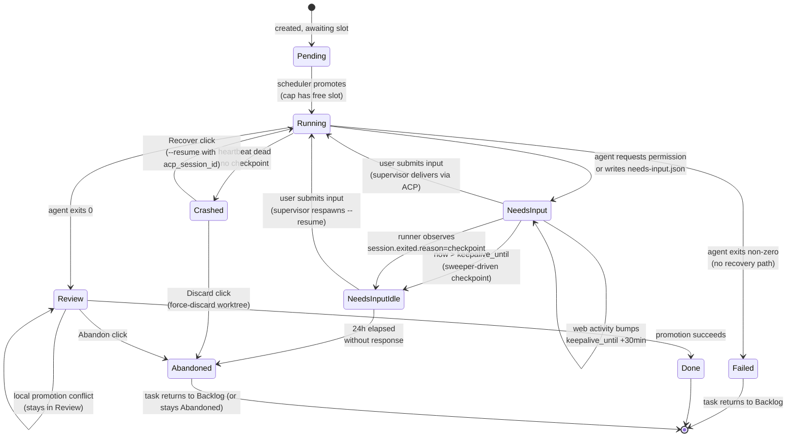
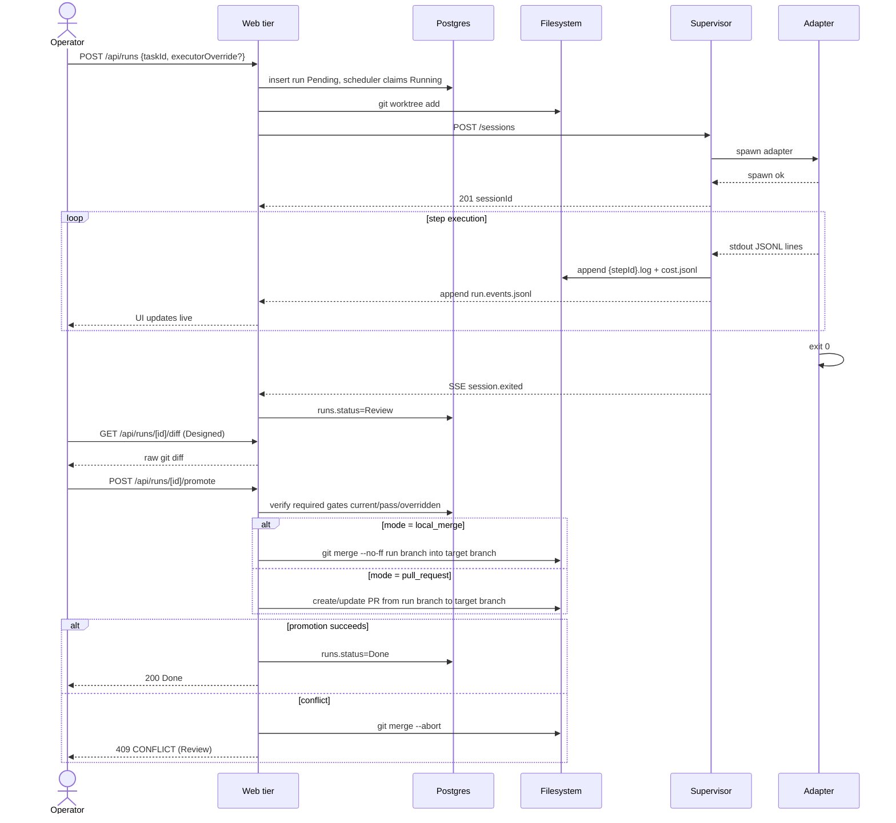
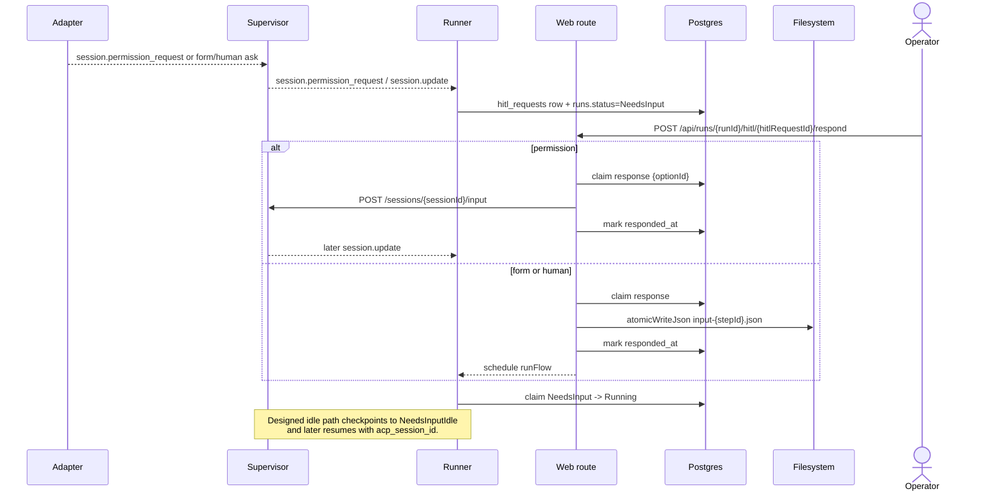
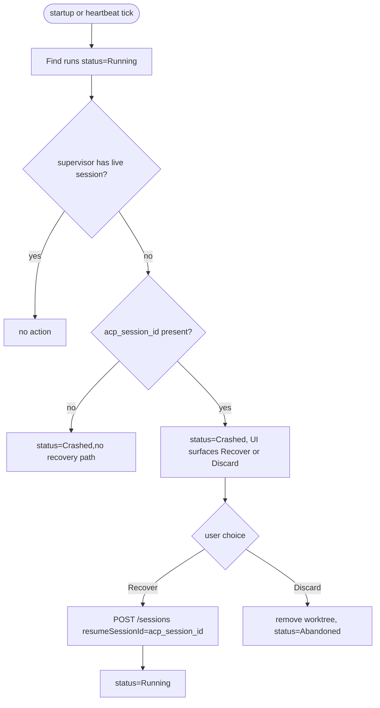

# Runs domain

## Purpose

A **run** is one execution attempt of a task through a Flow. It owns
the ACP session, the worktree, and the per-run artifacts on disk. The
runs domain is the heart of MAIster's state machine; every other
domain projects state onto it.

## Domain entities

- **Run** — `runs` row. FK to `tasks`, `projects`, `flows`,
  `executors`.
- **ACP session id** — opaque resume handle (`runs.acp_session_id`).
  Lifecycle described in [`../decisions.md#adr-006-hybrid-hitl-keep-alive--checkpointresume`](../decisions.md#adr-006-hybrid-hitl-keep-alive--checkpointresume).
- **Workspace** — git worktree under
  `.maister/<slug>/runs/<runId>/`. See [`workspaces.md`](workspaces.md).
- **Per-run artifacts on disk**:
  - `<stepId>.log` — append-only stdout of each step.
  - `cost.jsonl` — token usage records.
  - `needs-input.json` — present while the run waits for structured
    form input.
  - `input-<stepId>.json` — atomic-written response payload.

## State machine — execution axis



Status names exactly match the `runs.status` enum in
`web/lib/db/schema.ts`.

## Process flows

### Happy path — launch to Review (Implemented), promote after Review (Designed)



### NeedsInput and designed keep-alive cycle



### Crash recovery (Designed)



## Expectations

- `runs.status` values exactly match the enum in `web/lib/db/schema.ts`;
  no string-typed status outside the enum is permitted.
- Every run owns exactly one workspace and at most one live ACP session
  at any time.
- Global concurrency cap = `MAISTER_MAX_CONCURRENT_RUNS` (default 3,
  hard cap); excess runs wait as `Pending` and auto-promote when a slot
  frees.
- **(Designed)** `NeedsInput` keep-alive window is
  `MAISTER_KEEPALIVE_MINUTES` (default 30 min); every web-activity
  event extends `keepalive_until` by that amount. Current code ships the
  `runs.keepalive_until` column but never writes to it and exposes no
  activity route.
- **(Designed)** Idle past `keepalive_until` triggers graceful
  checkpoint → run becomes `NeedsInputIdle` with
  `runs.acp_session_id` retained as the resume handle. Supervisor
  `POST /sessions/:id/checkpoint` still returns the deferred stub.
- **(Designed)** `NeedsInputIdle` resume respawns the adapter with
  `--resume <acp_session_id>` and incurs ~$0.28 cache-creation cost
  per respawn (operator-visible if surfaced).
- **(Designed)** 24 h elapsed in `NeedsInputIdle` without operator
  response → `Abandoned` with `HITL_TIMEOUT`. Depends on the
  checkpoint path above; no timeout watcher exists.
- **(Designed)** Run state survives Next.js restart AND
  supervisor restart; on boot, reconciliation classifies orphans as
  `Crashed` and offers Recover or Discard.
- **(Designed)** Recover is offered ONLY when
  `runs.acp_session_id IS NOT NULL`; otherwise Discard is the sole
  option.
- Every state transition is persisted to `runs` BEFORE the UI reflects
  it; UI never derives status from supervisor in-memory state.
- **(Implemented)** SSE stream from web tier
  (`GET /api/runs/[runId]/stream`) tails a single durable per-run
  log at `.maister/<slug>/runs/<runId>/run.events.jsonl` that the
  supervisor appends to in lockstep with its own SSE channel.
  `Last-Event-ID` (or `?lastEventId=` fallback) replays from the
  durable file across step boundaries, supervisor restarts, and
  consecutive sessions of the same run. The supervisor seeds
  `record.monotonicId` from the tail of the run log on every spawn
  so the per-run event sequence stays strictly increasing across
  sessions. The bridge never replays from in-memory ring state on
  the web side.
- **(Implemented)** HITL response surface
  (`POST /api/runs/[runId]/hitl/[hitlRequestId]/respond`) does NOT
  flip `runs.status` to `Running` itself; the runner is the sole
  owner of the `NeedsInput → Running` transition so its `isResume`
  gate matches. Terminal `NeedsInput → Failed` (permission
  `HITL_TIMEOUT`) and `Running → Crashed` (HITL row insert failure
  in the runner) are current behavior — see [`hitl.md`](hitl.md#expectations).
- **(Implemented)** Every run is bound to an immutable,
  content-addressed flow bundle. At launch the upstream git commit
  SHA is snapshotted into `runs.flow_revision`; the runner derives
  the bundle path from `(flows.flow_ref_id, runs.flow_revision)`.
  Resumes read the exact same bytes regardless of intervening flow
  upgrades. If `runs.current_step_id` is not present in the pinned
  manifest at resume time, the runner fails closed: marks
  `runs.status = "Crashed"` and raises `MaisterError("CONFIG")`. See
  [`flows.md`](flows.md#expectations).
- **(Implemented)** Terminal `runs.status` precedence: a step
  whose result carries `errorCode = "CRASH"` (e.g. permission-row
  insert failure surfaced by `runner-agent`) transitions the run to
  `Crashed`, not `Failed`. The runner accumulates the highest-severity
  error observed across the step loop in a local `runErrorCode`
  carrier so the terminal write can branch
  `CRASH → Crashed | other failure → Failed | success → Review`.
- **(Designed)** Promotion is the product action after Review. Initial modes
  are `local_merge` and `pull_request`; both promote the MAIster run branch to
  the selected target branch after readiness gates pass or are explicitly
  overridden. No deploy or release management is implied.
- **(Designed)** Local promotion uses `git merge --no-ff`; conflicts always
  abort the merge, leave the run in `Review`, and create/keep a manual
  resolution path. The legacy `merge` route name is superseded by
  `POST /api/runs/[id]/promote` in the product contract.

## Edge cases

- **`PRECONDITION`** — dirty repo, branch taken, worktree path
  occupied, cap hit (mapped to `Pending` instead in this last case),
  executor unregistered.
- **`SPAWN`** — adapter binary missing on PATH (`ENOENT`),
  permission denied, OOM at fork.
- **`NEEDS_INPUT`** — soft validation/state code; UI keeps the HITL
  form open with field errors. Not a hard error.
- **`HITL_TIMEOUT`** — live permission deferred expired or the
  designed 24h `NeedsInputIdle` timeout fires.
- **`CRASH`** — heartbeat detected dead PID (`ESRCH` on
  `process.kill(pid, 0)`), or child emitted non-zero exit + signal
  without intentional shutdown.
- **`CONFLICT`** — local promotion could not auto-merge the run branch into
  the selected target branch. Run stays `Review`.
- **`CHECKPOINT`** — graceful checkpoint failed (designed path).
  Worker stays live; UI surfaces "couldn't checkpoint — keep tab open"
  warning.
- **`ACP_PROTOCOL`** — supervisor received a JSONL line it cannot
  decode, or saw an unexpected ACP transition. Surfaces the raw
  payload to the UI.
- **Recover when `acp_session_id` is null** — UI hides Recover button;
  Discard is the only option.
- **Abandon a `Running` run** — supervisor `DELETE /sessions/<id>` (sends
  SIGTERM → grace → SIGKILL), then transitions run to `Abandoned`,
  removes worktree on GC.

## M8 keep-alive + checkpoint + resume

### State transitions added by M8

```
                 keep-alive expired
NeedsInput ────────────────────────────► NeedsInputIdle
    ▲                                          │
    │ markResumed                              │ operator submits
    │ (via /respond on Idle)                   │ via /respond
    │                                          │ (resumeRun)
    └──────────────────────────────────────────┘
                                               │
                                               │ checkpoint_at +
                                               │ NEEDSINPUTIDLE_TTL_HOURS
                                               ▼
                                          Abandoned
NeedsInput ────► Crashed  (T11 resume-prompt watchdog timeout)
NeedsInputIdle ─► Failed  (resumeRun terminal error: supervisor 400/404, empty acpSessionId)
```

All transitions go through atomic UPDATEs with status-guard WHERE
clauses in `web/lib/runs/state-transitions.ts` (markCheckpointed,
markCheckpointedFromExit, markResumed, bumpKeepalive, failResumedRun,
crashResumedRun, rollbackResumedRun). No code mutates `runs.status`
directly outside these helpers and the scheduler.

`markCheckpointed` and `markCheckpointedFromExit` share identical SQL
(`UPDATE runs SET status='NeedsInputIdle', checkpoint_at=now(),
keepalive_until=NULL WHERE id=:id AND status='NeedsInput'`) and differ
only in the trigger they record in logs — sweeper-driven vs.
runner-agent-observing-`session.exited.reason="checkpoint"`. The
status-guard makes them idempotent w.r.t. each other.

### Keep-alive sliding window

The keep-alive window is the interval between the latest
`POST /api/runs/:runId/activity` (or the supervisor's most recent
`session.permission_request` event) and `keepalive_until`.

- Every web-console activity ping calls `bumpKeepalive(runId)` →
  sets `keepalive_until = now + MAISTER_KEEPALIVE_MINUTES`.
- The frontend `useActivityPing(runId)` hook fires pings on mount,
  `visibilitychange → visible`, `window.focus`, debounced (5s)
  pointerdown/keydown, AND a periodic heartbeat every
  `MAISTER_KEEPALIVE_MINUTES / 2` while the tab is visible.
- The activity route returns:
  - `204` while the row is in `Running` or `NeedsInput`.
  - `409` on `NeedsInputIdle` (hint: use `/respond` to resume).
  - `410` on any terminal status (the hook then stops pinging).

### Idle sweeper + scheduler interaction

`web/lib/runs/keepalive-sweeper.ts` is a `globalThis`-singleton timer
that runs `runSweepTick()` every `MAISTER_KEEPALIVE_SWEEP_INTERVAL_SECONDS`
(default 30). Each tick runs two passes serially, each capped at 50
rows per tick and concurrency 4:

| Pass | SELECT | Per-row action |
|------|--------|----------------|
| 1 | `NeedsInput WHERE keepalive_until < now()` | look up supervisor session by `acpSessionId`; if live → `checkpointSession()` then `markCheckpointed`; if not live → `markCheckpointed` directly; on supervisor 5xx → leave row, next tick retries; on success → `releaseSlotOnIdle` → `promoteNextPending` |
| 2 | `NeedsInputIdle WHERE checkpoint_at + ttl < now()` | UPDATE to `Abandoned` with status-guard; close any open `hitl_requests.respondedAt`; TTL = `MAISTER_NEEDSINPUTIDLE_TTL_HOURS` |

The scheduler cap is `count(status IN ('Running','NeedsInput'))` —
`NeedsInputIdle` does NOT count, so a checkpointed run frees a slot
immediately. Resumes (`NeedsInputIdle → NeedsInput` via
`markResumed`) bypass the cap by design — operator-driven, not
auto-scheduled.

Every resume-driver terminal transition (`completeResumedStepAndHandoff`
last-step `Review`, `failResumedRun`, `crashResumedRun`) MUST call
`promoteNextPending` after the terminal write — same contract as
`runFlow`'s normal-path terminal in `web/lib/flows/runner.ts:586`.
Without this, capacity freed by a resume-driver terminal stays
effectively locked until some other run terminates.

### Resume-recovery sweep (boot-time, Codex review fix #2)

`web/instrumentation.ts` runs `runResumeRecoverySweep()` once on Node
runtime boot, BEFORE the keep-alive sweeper. The sweep catches HITL
intents stranded across a web-process restart between the `/respond`
202 (`state: "resume-in-progress"`) response and the in-process
`queueMicrotask` driver attaching. The durable shape that flags a
candidate is `runs.status='NeedsInput' AND acpSessionId IS NOT NULL`
joined to the latest `hitl_requests` row where `response IS NOT NULL
AND respondedAt IS NULL`.

| Supervisor state for the row's `acpSessionId` | Action |
|------------------------------------------------|--------|
| Live (`listSessions` returns matching record) | Re-schedule `scheduleResumedSessionDrive` against the live session — driver takes ownership. |
| Gone (`listSessions` ok but no match) | Atomic `rollbackResumedRun` to `NeedsInputIdle` (status-guarded). `hitl_requests.response` stays in place — operator's same-payload retry on `/respond` re-enters the standard resume path. |
| Supervisor 5xx / network failure | Skip the candidate this boot. Pass 2 of the keep-alive sweeper (TTL → `Abandoned`) is the long-term safety net. |

Always-on, no feature flag. Idempotent — a second invocation finds no
matching rows.

## Linked artifacts

- ADRs: [ADR-006 Hybrid HITL](../decisions.md#adr-006-hybrid-hitl-keep-alive--checkpointresume),
  [ADR-011 Workspace lifecycle](../decisions.md#adr-011-workspace-lifecycle-via-git-worktree),
  [ADR-018 Task ↔ Run 1:N](../decisions.md#adr-018-task--run-cardinality-is-1n).
- ERD: [`../db/runs-domain.md`](../db/runs-domain.md).
- Config reference: [`../configuration.md`](../configuration.md)
  §`Environment variables (server tier)` —
  `MAISTER_MAX_CONCURRENT_RUNS`, `MAISTER_KEEPALIVE_MINUTES`,
  `MAISTER_HEARTBEAT_INTERVAL_MS`, `MAISTER_KILL_GRACE_MS`.
- API: [`../api/supervisor.openapi.yaml`](../api/supervisor.openapi.yaml),
  [`../api/async/supervisor-sse.asyncapi.yaml`](../api/async/supervisor-sse.asyncapi.yaml).
- Related: [`hitl.md`](hitl.md), [`workspaces.md`](workspaces.md),
  [`tasks.md`](tasks.md).
- Source: `web/lib/db/schema.ts` (runs table),
  `supervisor/src/heartbeat.ts`, `supervisor/src/spawn.ts`.
