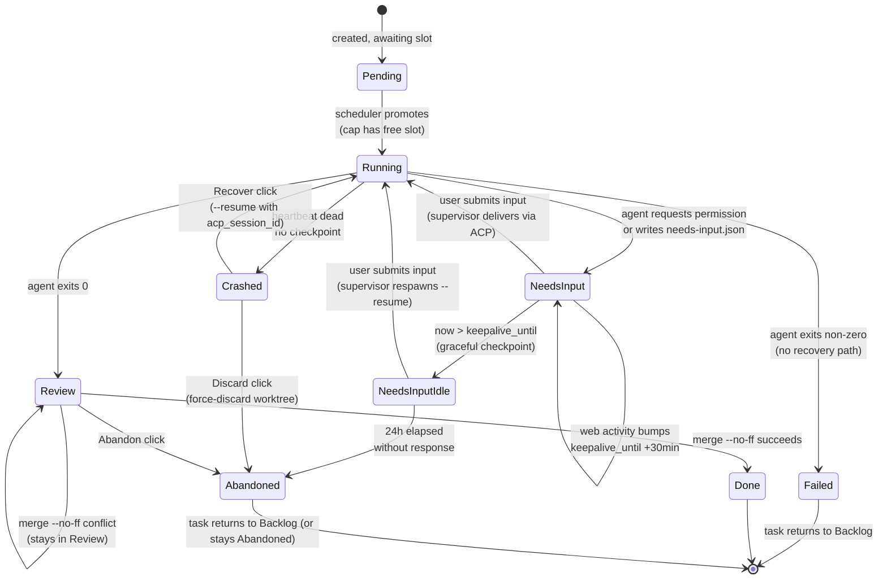
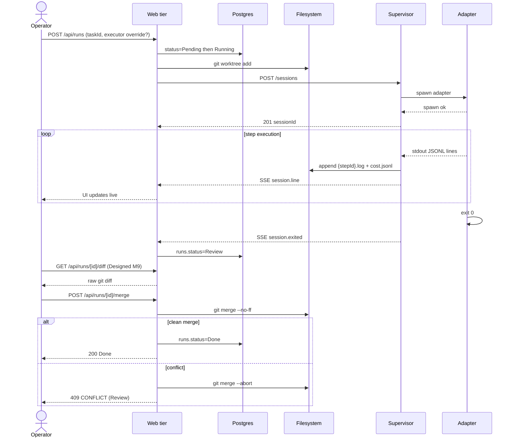
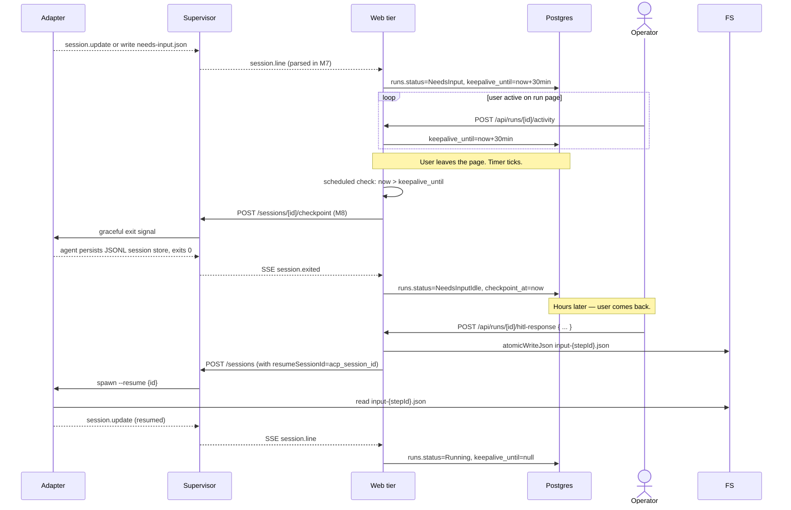

# Runs domain

## Purpose

A **run** is one execution attempt of a task through a Flow. It owns
the ACP session, the worktree, and the per-run artifacts on disk. The
runs domain is the heart of MAIster's state machine; every other
domain projects state onto it.

## Domain entities

- **Run** — `runs` row. FK to `tasks`, `projects`, `flows`,
  `executors`.
- **ACP session id** — opaque resume handle (`runs.acp_session_id`).
  Lifecycle described in [`../decisions.md#adr-006-hybrid-hitl-keep-alive--checkpointresume`](../decisions.md#adr-006-hybrid-hitl-keep-alive--checkpointresume).
- **Workspace** — git worktree under
  `.maister/<slug>/runs/<runId>/`. See [`workspaces.md`](workspaces.md).
- **Per-run artifacts on disk**:
  - `<stepId>.log` — append-only stdout of each step.
  - `cost.jsonl` — token usage records.
  - `needs-input.json` — present while the run waits for structured
    form input.
  - `input-<stepId>.json` — atomic-written response payload.

## State machine — execution axis

Status names exactly match the `runs.status` enum in
`web/lib/db/schema.ts`.

## Process flows

### Happy path — Launch to Review (Designed M6/M7)

### NeedsInput keep-alive cycle (Designed M7/M8)

### Crash recovery (Designed M6/M8)

## Edge cases

- **`PRECONDITION`** — dirty repo, branch taken, worktree path
  occupied, cap hit (mapped to `Pending` instead in this last case),
  executor unregistered.
- **`SPAWN`** — adapter binary missing on PATH (`ENOENT`),
  permission denied, OOM at fork.
- **`NEEDS_INPUT`** — soft signal raised in the bridge layer; UI
  renders the HITL form. Not a hard error.
- **`HITL_TIMEOUT`** — 24h elapsed in `NeedsInputIdle`.
- **`CRASH`** — heartbeat detected dead PID (`ESRCH` on
  `process.kill(pid, 0)`), or child emitted non-zero exit + signal
  without intentional shutdown.
- **`CONFLICT`** — `git merge --no-ff` could not auto-merge. Run stays
  `Review`.
- **`CHECKPOINT`** — graceful checkpoint failed (M8 will define).
  Worker stays live; UI surfaces "couldn't checkpoint — keep tab open"
  warning.
- **`ACP_PROTOCOL`** — supervisor received a JSONL line it cannot
  decode, or saw an unexpected ACP transition. Surfaces the raw
  payload to the UI.
- **Recover when `acp_session_id` is null** — UI hides Recover button;
  Discard is the only option.
- **Abandon a `Running` run** — supervisor `DELETE /sessions/<id>` (sends
  SIGTERM → grace → SIGKILL), then transitions run to `Abandoned`,
  removes worktree on GC.

## Linked artifacts

- ADRs: [ADR-006 Hybrid HITL](../decisions.md#adr-006-hybrid-hitl-keep-alive--checkpointresume),
  [ADR-011 Workspace lifecycle](../decisions.md#adr-011-workspace-lifecycle-via-git-worktree),
  [ADR-018 Task ↔ Run 1:N](../decisions.md#adr-018-task--run-cardinality-is-1n).
- ERD: [`../db/runs-domain.md`](../db/runs-domain.md).
- API: [`../api/supervisor.openapi.yaml`](../api/supervisor.openapi.yaml),
  [`../api/async/supervisor-sse.asyncapi.yaml`](../api/async/supervisor-sse.asyncapi.yaml).
- Related: [`hitl.md`](hitl.md), [`workspaces.md`](workspaces.md),
  [`tasks.md`](tasks.md).
- Source: `web/lib/db/schema.ts` (runs table),
  `supervisor/src/heartbeat.ts`, `supervisor/src/spawn.ts`.
