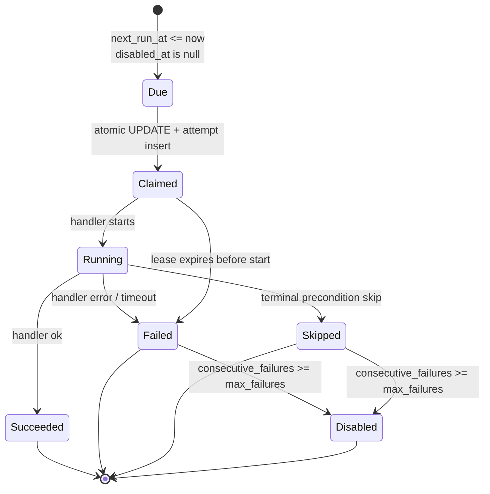
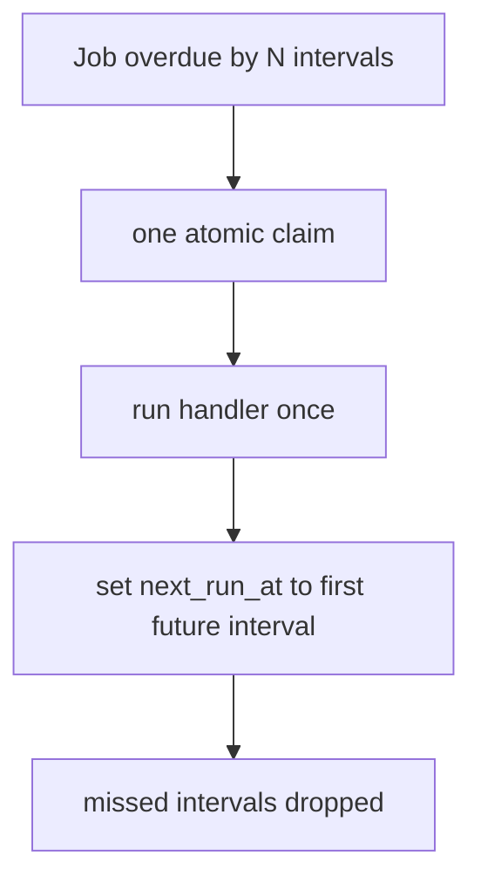
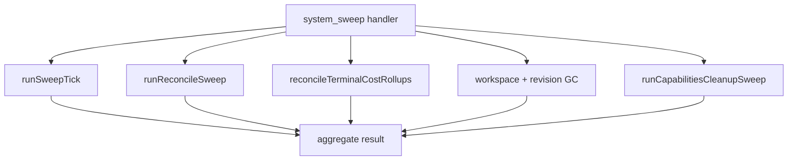
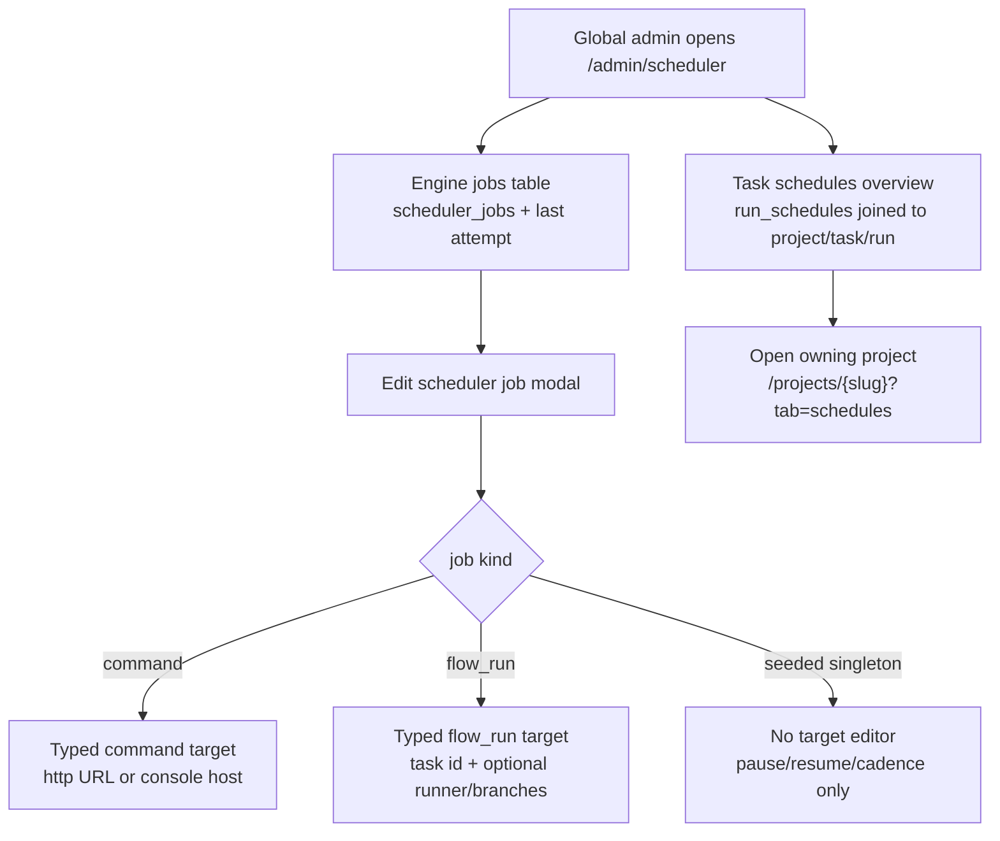

# Scheduler service domain

## Purpose

This domain (**Implemented, M24**) covers MAIster's unified background clock: a
stateless, authorized Next.js tick route that claims due jobs, runs bounded
handlers, and records attempts. It generalizes the existing GC cron route into
one polymorphic scheduler without moving scheduling into the supervisor and
without turning recovery sweeps into live-path polling.

## Domain entities

- **Scheduler job** (`scheduler_jobs`, Implemented, M24) — durable schedule
  definition for one `job_kind`, fixed interval, target payload, next fire time,
  failure counters, and disable state.
- **Scheduler job run** (`scheduler_job_runs`, Implemented, M24) — attempt ledger
  with claim token, terminal status, lease expiry, summary, and error fields.
- **Agent trigger bindings** (`agent_schedules`, M34 — Implemented rework of the
  dead M24 bridge) — per-(agent, project) trigger rows: cron rows
  (`cron_expr` + `timezone` + `next_fire_at`, claimed atomically by the
  dispatcher below) and event rows (`event_match.kinds` consumed by the
  `agent_triggers` outbox consumer). The M24 columns `agent_ref` (text),
  `scheduler_job_id`, and `desired_state` are dropped. See
  [agents.md](agents.md).
- **`agent_tick` dispatcher** (`agent_tick.dispatcher` job, M34 — Implemented,
  ADR-089) — the ONE seeded `agent_tick` job (60s cadence, attempt budget
  hardcoded 1 — singleton like the other dispatchers; the
  `MAISTER_MAX_CONCURRENT_AGENTS` env var is repurposed as the agent-RUN
  budget enforced at `tryStartRun`) whose handler finally gets its
  launcher: it claims due `agent_schedules` cron rows
  (`UPDATE … SET next_fire_at = <next> WHERE id = ? AND next_fire_at <=
  now() RETURNING` — one winner, one catch-up fire, no backfill) and fires
  `launchAgentRun`, then runs `promoteNextPending(kind='agent')` as the
  sanctioned recovery sweep for stranded `Pending` agent runs.
  `createSchedulerJobSchema` now rejects `agent_tick` (seeded-singleton
  precedent: `run_schedule`, `domain_event_dispatch`).
- **Tick route** (`GET`/`POST /api/cron/tick`, Implemented, M24) — token-guarded
  clock entry point. It may filter by `jobKind`.
- **GC compatibility route** (`GET`/`POST /api/cron/gc`, Implemented M19,
  compatibility extension Implemented M24) — keeps current response semantics and
  runs the GC bundle (workspace + revision GC + capabilities cleanup) only. It
  does NOT run the keepalive or reconcile sweeps, so the GC cron never transitions
  runs to `Crashed`; that live composition belongs to the `system_sweep` job kind.
- **`webhook_delivery` job kind** (Implemented, ADR-077) — singleton outbound-webhook
  drainer (one `webhook_delivery.default` job, 60s cadence, budget `webhookDelivery: 1`)
  whose handler does fanout + drain + prune each tick. See
  [outbound-webhooks.md](outbound-webhooks.md).
- **`domain_event_dispatch` job kind** (Implemented, ADR-086) — singleton
  domain-event dispatcher (one `domain_event_dispatch.default` job, 60s
  cadence, budget `domainEventDispatch: 1`) whose handler advances
  per-consumer cursors over the `domain_events` outbox each tick. Not
  user-creatable — `createSchedulerJobSchema` rejects it (`run_schedule`
  precedent). See [domain-events.md](domain-events.md).
- **`auto_launch_triaged` job kind** (Implemented, ADR-112) — singleton
  triaged-task launcher (one `auto_launch_triaged.default` job, 60s cadence,
  budget `autoLaunchTriaged: 1`) whose handler each tick sweeps tasks that are
  `triage_status='triaged'` AND `launch_mode='auto'` AND have a `flow_id` AND
  classify launchable (no live run, dependency blockers cleared), then launches
  each through the standard `launchRun` path (global cap → `Pending` if full).
  `systemManaged`, not user-creatable — `createSchedulerJobSchema` rejects it
  (`run_schedule` precedent). Its predicate is **disjoint** from the orchestrator
  `auto_launch_run_plan` domain-event consumer (ADR-098), which fires only on
  `parent_of`-under-orchestrator tasks carrying a `delegation_spec.agentId` and
  launches agent runs — this kind launches ordinary triaged FLOW tasks. See
  [triage.md](triage.md).
- **Scheduler admin** (`/admin/scheduler` page + `/api/admin/scheduler-jobs[/{jobId}]`,
  Implemented, M24/M28) — admin-only scheduler
  management. The refined surface separates Engine jobs from Task schedules,
  keeps task schedules read-only with project links, and edits scheduler
  targets through typed fields instead of a primary raw-JSON textarea.
- **Run-schedule dispatcher** (`run_schedule.dispatcher` job, `job_kind =
  'run_schedule'`, Implemented, M28) — the ONE seeded job whose handler claims due
  `run_schedules` rows and fires them through `launchRun`. Cron expressions and
  overlap policy live in the `run_schedules` table, NOT in `scheduler_jobs` —
  see [`run-schedules.md`](run-schedules.md). `createSchedulerJobSchema`
  deliberately rejects this kind (the seeded singleton is the only instance;
  disabling it on `/admin/scheduler` is the global kill switch).
- **Target payloads** (`scheduler_jobs.target`, Implemented, M24/M28) —
  per-kind JSON payload persisted for engine handlers. `command`
  targets are either `http_ping` (`url`, optional `timeoutMs`) or
  `console_ping` (`host`, optional `timeoutMs`). `flow_run` targets use a
  required task id plus optional `runnerId`, `baseBranch`, and `targetBranch`.
  `system_sweep`, `run_schedule`, `webhook_delivery`,
  `domain_event_dispatch`, `agent_tick`, and `auto_launch_triaged` use `{}`
  in the seeded rows.

## State machine

## Process flows

### Authorized tick

### Catch-up without backfill

### System sweep composition

**Cost-rollup backstop reconcile (ADR-117 — Implemented).**
`reconcileTerminalCostRollups` is the completeness
guarantee for `run_cost_rollups`: it keys on `runs.ended_at` (set on every
terminal transition), **not** a status allow-list and **not** a domain event,
because scratch success emits no terminal event and would otherwise never get a
rollup. Progress is tracked by the durable `runs.cost_reconciled_at` marker
(migration `0084`), stamped on every attempt (reconciled / missing-cost / error)
so an unreconcilable run is attempted once and settled instead of monopolizing
the bounded scan, and a pre-`0083` rollup with empty `by_runner` is re-reconciled
once to backfill it. Candidate predicate: `ended_at IS NOT NULL AND ended_at >
now − lookback AND (cost_reconciled_at IS NULL OR cost_reconciled_at < ended_at +
SETTLE_GRACE)`, ordered by `ended_at` and bounded by a per-tick limit (reuses the
existing sweep limit; no new var). `SETTLE_GRACE` (~2 min, a module constant)
forces one extra re-reconcile so the supervisor's async final `cost.jsonl` flush
is captured; once the marker passes `ended_at + SETTLE_GRACE` the run is skipped
(no disk thrash). Lookback comes from
`MAISTER_COST_RECONCILE_LOOKBACK_HOURS` (default 168h = 7-day GC horizon; see
[configuration.md](../configuration.md)). The supported `runs_ended_at_idx`
partial index backs the bounded scan. The `cost-rollup-reconcile` domain-event
consumer (see [domain-events.md](domain-events.md)) is a separate low-latency
fast-path over event-emitting terminals; the sweep owns historical backfill and
every no-event terminal.

### Admin cockpit and typed target editing

The admin screen is an operator cockpit over two related but distinct stores:
fixed-interval engine jobs and user-facing cron schedules.

## Expectations

- The tick route MUST be stateless; all idempotence comes from DB claims and
  attempt leases.
- `scheduler_jobs.cadence_interval_seconds` MUST be the only `scheduler_jobs`
  cadence model — cron expressions live exclusively in `run_schedules`
  (Implemented, M28; see [`run-schedules.md`](run-schedules.md)).
- A due job MUST produce at most one unexpired `Claimed` or `Running` attempt.
- Clock outage catch-up MUST run one attempt only and never backfill missed
  fixed-interval periods.
- The tick service MUST idempotently seed `system_sweep.default` with a 60-second
  cadence so the recovery sweep is live after migration without hand-authored
  SQL; it MUST likewise seed `run_schedule.dispatcher` (60-second cadence,
  `max_failures` 3; Implemented, M28), `webhook_delivery.default`
  (60-second cadence; Implemented, ADR-077), `domain_event_dispatch.default`
  (60-second cadence; Implemented, ADR-086), `agent_tick.dispatcher`
  (60-second cadence; M34 — Implemented, ADR-089), and
  `auto_launch_triaged.default` (60-second cadence; Implemented, ADR-112).
- Atomic claim MUST enforce per-kind budgets in SQL before an attempt is created:
  `command` uses `MAISTER_MAX_CONCURRENT_COMMANDS`; `agent_tick` is a hardcoded
  budget of 1 (singleton dispatcher; M34 — Implemented — its former
  `MAISTER_MAX_CONCURRENT_AGENTS` attempt budget is repurposed as the
  agent-run budget at `tryStartRun`, see [agents.md](agents.md)); `flow_run`
  remains delegated to the existing
  Flow run launch/concurrency path; `run_schedule` is a hardcoded budget of 1
  (serial dispatcher, like `system_sweep`; Implemented, M28); `webhook_delivery`
  is a hardcoded budget of 1 (singleton drainer; Implemented, ADR-077);
  `domain_event_dispatch` is a hardcoded budget of 1 (singleton dispatcher;
  Implemented, ADR-086); `auto_launch_triaged` is a hardcoded budget of 1
  (singleton launcher; Implemented, ADR-112).
- `agent_tick` MUST be the seeded `agent_tick.dispatcher` singleton only —
  `createSchedulerJobSchema` rejects the kind (M34 — Implemented; the M24
  "stub without a launcher records `Skipped`/`PRECONDITION`" seam is
  superseded by the real launcher). A claimed cron row MUST fire exactly
  once per due window (atomic `next_fire_at` claim) and a missed window
  MUST fire once, never backfill.
- Terminal attempt writes MUST be fenced by attempt status so a handler that
  returns after lease expiry cannot turn a reaped `Failed` attempt into
  `Succeeded`.
- `system_sweep` MUST remain a recovery/cleanup sweep and NEVER a live
  state-transition poller.
- The fallback timer MUST be off unless `MAISTER_SCHEDULER_TIMER_ENABLED=true`.
- `/api/cron/gc` MUST keep its existing auth and response contract and run the
  shared GC bundle (workspace + revision GC + capabilities cleanup) only; it MUST
  NOT run the keepalive or reconcile sweeps that `system_sweep` performs.
- `/admin/scheduler` MUST treat `scheduler_jobs` and `run_schedules` as
  separate concepts: Engine jobs are fixed-interval clock work; Task schedules
  are cron rows owned by projects and fired through the single
  `run_schedule.dispatcher` job.
- Scheduler job kind lists MUST share one catalog across parsing, filtering,
  creation, and editing. All DB-supported kinds are visible/filterable:
  `system_sweep`, `command`, `agent_tick`, `flow_run`, `run_schedule`,
  `webhook_delivery`, `domain_event_dispatch`, and `auto_launch_triaged`
  (the last Implemented, ADR-112).
- Custom job creation MUST match the admin API schema. The seeded singleton
  kinds `agent_tick`, `run_schedule`, `domain_event_dispatch`, and
  `auto_launch_triaged` are not creatable as duplicates. `webhook_delivery`
  policy MUST stay consistent across schema, catalog, docs, and UI.
- The admin editor MUST build `scheduler_jobs.target` from typed fields.
  Raw JSON MUST NOT be the primary write UI; a read-only advanced preview is
  acceptable for diagnostics.
- Engine `flow_run` jobs use a required task id field. Friendly task selection
  stays on the user-facing project schedules tab.
- Seeded singleton rows MUST NOT expose destructive delete in the admin UI.
  Custom/deletable rows require delete confirmation.
- Operator-visible execution failures on the screen MUST come from the last
  `scheduler_job_runs` status/error and existing structured scheduler logs;
  the UI should not invent a second error channel.
- (ADR-121, Implemented) `promoteNextPending` is the unified priority-ordered
  admission gate. On a freed slot it admits the single most-critical eligible unit
  across THREE sources — C1 Pending runs, C3 answered-idle resumables
  (`NeedsInputIdle` + `resume_requested_at`), and C2 eligible fresh Backlog tasks
  (flow pool only, via the `tasks.queue_claimed_at` two-phase claim) — strictly by
  (`weightOf` weight DESC, classRank, FIFO), NOT a blind `started_at` FIFO. The cap
  invariant is unchanged (one admission per call). The 60s `auto_launch_triaged`
  poll is the C2 BACKSTOP (shares `lib/scheduler/c2-eligibility` with the gate), and
  resume is cap-safe (the D2 bypass is removed) — see [`task-queue.md`](task-queue.md).
  Both apply the `MAISTER_TASK_QUEUE_AUTO_RESERVE` / per-project `maxInFlightAuto`
  capacity guards to C2.

## Edge cases

- Missing `MAISTER_CRON_TOKEN` returns `CONFIG`/503 and runs no jobs.
- Token mismatch returns `UNAUTHENTICATED`/401 and never logs the token value.
- Active attempt lease overlap returns no duplicate claim and is not an error.
- Expired attempt lease is reaped as `Failed` before the next claim.
- Budget exhaustion records a bounded refusal/skip result for the affected job
  kind and never consumes a different kind's cap.
- Handler failure records `Failed` with bounded error context and contributes to
  the route's 207 summary.
- Invalid per-kind admin target payloads return `MaisterError("CONFIG")` as a
  422 route response. The typed editor should prevent common shape errors, but
  `web/lib/scheduler/job-admin.ts` remains the server boundary.
- Attempting to create seeded-only dispatcher kinds through the admin API
  returns `CONFIG`/422; the UI should not present those options.
- Deleting a seeded row through a non-UI client removes the row under the
  current route contract; the tick re-seeds known default jobs. The designed UI
  avoids that sharp path by hiding destructive actions on seeded singletons.

## Linked artifacts

- Spec: [`../../.ai-factory/specs/feature-m24-scheduler-service.md`](../../.ai-factory/specs/feature-m24-scheduler-service.md).
- API: [`../api/web.openapi.yaml`](../api/web.openapi.yaml).
- DB: [`../database-schema.md`](../database-schema.md),
  [`../db/scheduler-domain.md`](../db/scheduler-domain.md), and
  [`../db/erd.md`](../db/erd.md).
- ADR: [ADR-060](../decisions.md#adr-060-unified-scheduler-clock-and-polymorphic-job-budgets).
- User-facing run schedules (Implemented, M28): [`run-schedules.md`](run-schedules.md) +
  [ADR-071](../decisions.md#adr-071-user-facing-run-schedules-on-the-m24-clock).
- Domain-event dispatcher (Implemented, ADR-086): [`domain-events.md`](domain-events.md).
- Triaged-task launcher (Implemented, ADR-112): [`triage.md`](triage.md).
- Platform-agent triggers (M34 — Implemented, ADR-089): [`agents.md`](agents.md).
- Existing recovery/GC domain: [`reconciliation-gc.md`](reconciliation-gc.md).
- Source seams: `web/app/api/cron/gc/route.ts`, `web/lib/scheduler.ts`,
  `web/lib/reconcile.ts`, `web/lib/gc/sweeper.ts`,
  `web/lib/runs/keepalive-sweeper.ts`,
  `web/lib/capabilities/cleanup.ts`, `web/lib/scheduler/job-admin.ts`,
  `web/lib/scheduler/job-admin-schema.ts`, and
  `web/app/(app)/admin/scheduler/page.tsx`.
