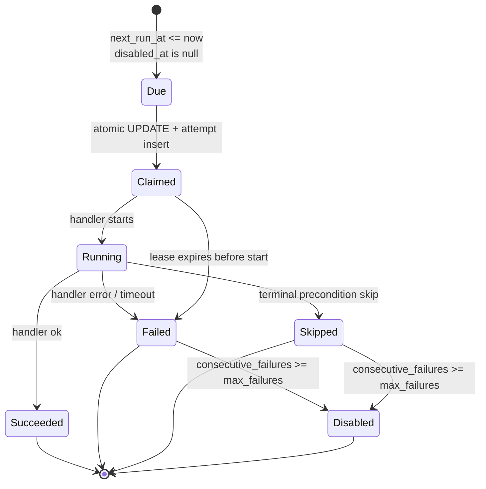
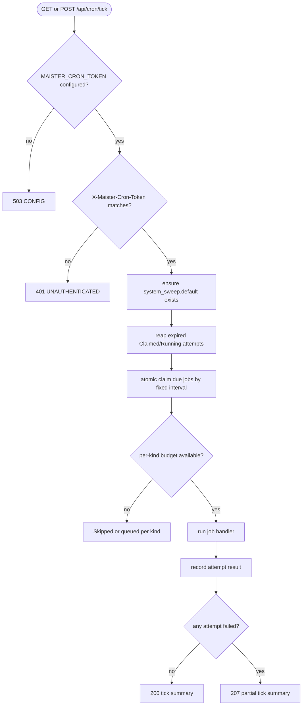
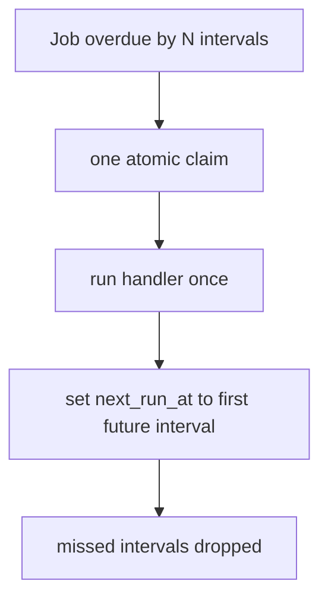
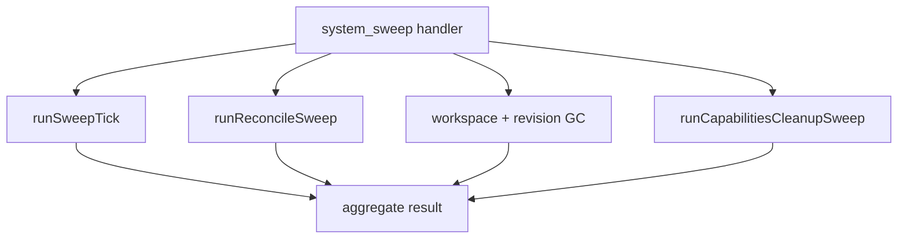

# Scheduler service domain

## Purpose

This domain (**Implemented, M24**) covers MAIster's unified background clock: a
stateless, authorized Next.js tick route that claims due jobs, runs bounded
handlers, and records attempts. It generalizes the existing GC cron route into
one polymorphic scheduler without moving scheduling into the supervisor and
without turning recovery sweeps into live-path polling.

## Domain entities

- **Scheduler job** (`scheduler_jobs`, Implemented, M24) — durable schedule
  definition for one `job_kind`, fixed interval, target payload, next fire time,
  failure counters, and disable state.
- **Scheduler job run** (`scheduler_job_runs`, Implemented, M24) — attempt ledger
  with claim token, terminal status, lease expiry, summary, and error fields.
- **Agent schedule** (`agent_schedules`, Implemented, M24) — narrow bridge from a
  project-local `agent_ref` text value to a scheduler job; no FK to the authored
  catalog in M24.
- **Tick route** (`GET`/`POST /api/cron/tick`, Implemented, M24) — token-guarded
  clock entry point. It may filter by `jobKind`.
- **GC compatibility route** (`GET`/`POST /api/cron/gc`, Implemented M19,
  compatibility extension Implemented M24) — keeps current response semantics and
  runs the GC bundle (workspace + revision GC + capabilities cleanup) only. It
  does NOT run the keepalive or reconcile sweeps, so the GC cron never transitions
  runs to `Crashed`; that live composition belongs to the `system_sweep` job kind.
- **Scheduler admin** (`/admin/scheduler` page + `/api/admin/scheduler-jobs[/{jobId}]`,
  Implemented, M24) — admin-only CRUD (create / list / update / enable-disable /
  delete) for scheduler jobs.
- **Run-schedule dispatcher** (`run_schedule.dispatcher` job, `job_kind =
  'run_schedule'`, Designed, M28) — the ONE seeded job whose handler claims due
  `run_schedules` rows and fires them through `launchRun`. Cron expressions and
  overlap policy live in the `run_schedules` table, NOT in `scheduler_jobs` —
  see [`run-schedules.md`](run-schedules.md). `createSchedulerJobSchema`
  deliberately rejects this kind (the seeded singleton is the only instance;
  disabling it on `/admin/scheduler` is the global kill switch).

## State machine

## Process flows

### Authorized tick

### Catch-up without backfill

### System sweep composition

## Expectations

- The tick route MUST be stateless; all idempotence comes from DB claims and
  attempt leases.
- `scheduler_jobs.cadence_interval_seconds` MUST be the only `scheduler_jobs`
  cadence model — cron expressions live exclusively in `run_schedules`
  (Designed, M28; see [`run-schedules.md`](run-schedules.md)).
- A due job MUST produce at most one unexpired `Claimed` or `Running` attempt.
- Clock outage catch-up MUST run one attempt only and never backfill missed
  fixed-interval periods.
- The tick service MUST idempotently seed `system_sweep.default` with a 60-second
  cadence so the recovery sweep is live after migration without hand-authored
  SQL; it MUST likewise seed `run_schedule.dispatcher` (60-second cadence,
  `max_failures` 3; Designed, M28).
- Atomic claim MUST enforce per-kind budgets in SQL before an attempt is created:
  `command` uses `MAISTER_MAX_CONCURRENT_COMMANDS`; `agent_tick` uses
  `MAISTER_MAX_CONCURRENT_AGENTS`; `flow_run` remains delegated to the existing
  Flow run launch/concurrency path; `run_schedule` is a hardcoded budget of 1
  (serial dispatcher, like `system_sweep`; Designed, M28).
- `agent_tick` without a launcher MUST record terminal `Skipped` with
  `PRECONDITION` and auto-disable after
  `MAISTER_SCHEDULER_AGENT_TICK_MAX_FAILURES`. This is an explicit M24 dispatch
  seam, not a hidden actor runtime.
- Terminal attempt writes MUST be fenced by attempt status so a handler that
  returns after lease expiry cannot turn a reaped `Failed` attempt into
  `Succeeded`.
- `system_sweep` MUST remain a recovery/cleanup sweep and NEVER a live
  state-transition poller.
- The fallback timer MUST be off unless `MAISTER_SCHEDULER_TIMER_ENABLED=true`.
- `/api/cron/gc` MUST keep its existing auth and response contract and run the
  shared GC bundle (workspace + revision GC + capabilities cleanup) only; it MUST
  NOT run the keepalive or reconcile sweeps that `system_sweep` performs.

## Edge cases

- Missing `MAISTER_CRON_TOKEN` returns `CONFIG`/503 and runs no jobs.
- Token mismatch returns `UNAUTHENTICATED`/401 and never logs the token value.
- Active attempt lease overlap returns no duplicate claim and is not an error.
- Expired attempt lease is reaped as `Failed` before the next claim.
- Budget exhaustion records a bounded refusal/skip result for the affected job
  kind and never consumes a different kind's cap.
- Handler failure records `Failed` with bounded error context and contributes to
  the route's 207 summary.

## Linked artifacts

- Spec: [`../../.ai-factory/specs/feature-m24-scheduler-service.md`](../../.ai-factory/specs/feature-m24-scheduler-service.md).
- API: [`../api/web.openapi.yaml`](../api/web.openapi.yaml).
- DB: [`../database-schema.md`](../database-schema.md),
  [`../db/scheduler-domain.md`](../db/scheduler-domain.md), and
  [`../db/erd.md`](../db/erd.md).
- ADR: [ADR-060](../decisions.md#adr-060-unified-scheduler-clock-and-polymorphic-job-budgets).
- User-facing run schedules (Designed, M28): [`run-schedules.md`](run-schedules.md) +
  [ADR-071](../decisions.md#adr-071-user-facing-run-schedules-on-the-m24-clock).
- Existing recovery/GC domain: [`reconciliation-gc.md`](reconciliation-gc.md).
- Source seams: `web/app/api/cron/gc/route.ts`, `web/lib/scheduler.ts`,
  `web/lib/reconcile.ts`, `web/lib/gc/sweeper.ts`,
  `web/lib/runs/keepalive-sweeper.ts`,
  `web/lib/capabilities/cleanup.ts`.
