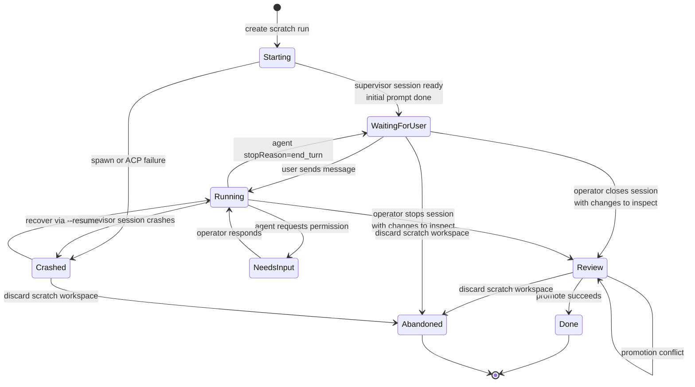
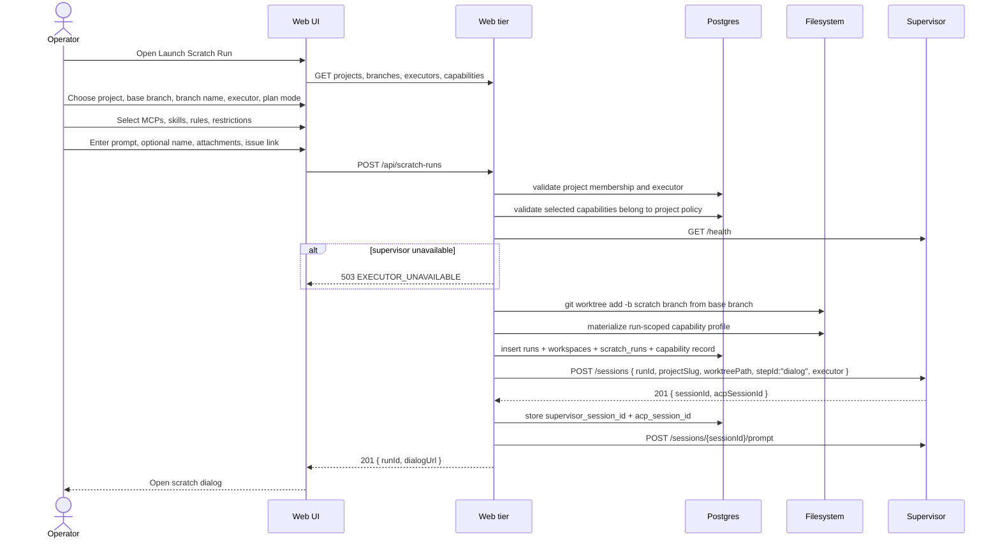
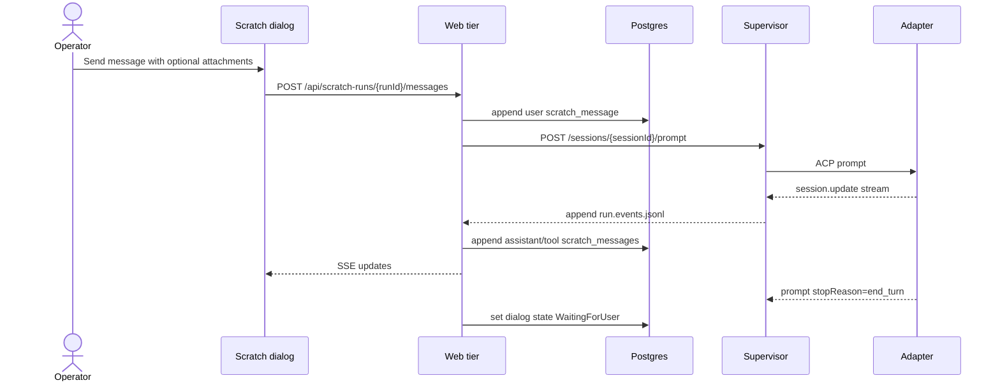
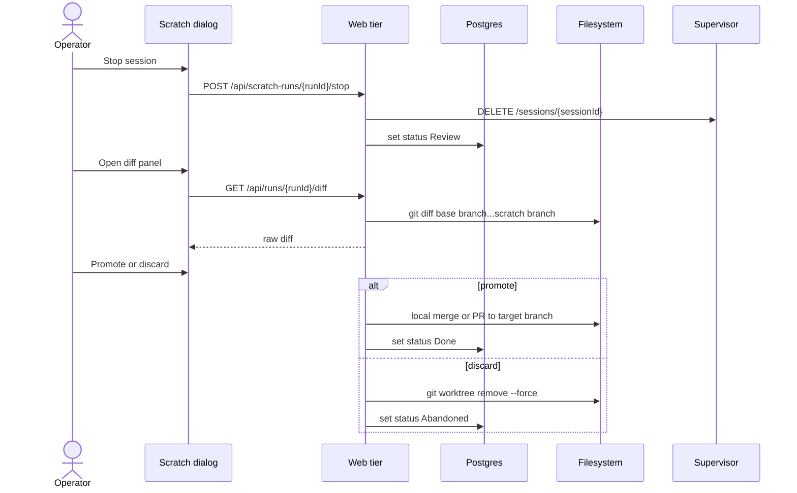

# Scratch runs domain

## Purpose

A **scratch run** is a manually started coding-agent workspace that does not
require a board task or Flow. It gives the operator a Codex or Claude-style
dialog inside a MAIster-managed worktree, while keeping the workspace visible in
Portfolio, auditable in run history, and controlled by the same supervisor,
executor, worktree, HITL, diff, and cleanup contracts as normal runs.

## Domain entities

- **Scratch run** - a `runs` row with `run_kind = "scratch"` (Designed).
  It belongs to one project and one executor but has no task or Flow unless the
  operator links it later.
- **Scratch workspace** - one `workspaces` row and one git worktree for the
  scratch run. The run is outside the task board but must appear in active
  workspace lists.
- **Scratch metadata** - `scratch_runs` row (Designed) keyed by `run_id`.
  Fields: `name`, `initial_prompt`, `plan_mode`, `linked_task_id`,
  `linked_issue_url`, `supervisor_session_id`, `created_by_user_id`,
  `last_user_message_at`, `last_agent_message_at`.
- **Scratch message** - append-only `scratch_messages` row (Designed) with
  `run_id`, monotonic `sequence`, `role`, `content`, optional
  `supervisor_event_id`, and timestamps. Roles are `user | assistant | tool |
  system`.
- **Scratch attachment** - optional `scratch_attachments` row (Designed) linked
  to a scratch message or run. Initial kinds are `issue_url`, `file_path`, and
  `text_note`. Binary upload storage is out of the first implementation.
- **Scratch capability profile** - run-scoped selection of MCP servers, skills,
  rules, agent settings, and restrictions. It is resolved from platform
  capability catalogs, project defaults, and installed Flow package assets, then
  materialized for this one supervisor session.
- **Platform MCP selection** - checkbox dropdown in the scratch launcher. It
  lists MCP servers available to the chosen project and defaults to all
  project-enabled platform MCPs selected; unchecked servers are omitted from the
  run.
- **Skill and rule selection** - checkbox dropdowns in the scratch launcher.
  They list project rules, platform rules, project skills, and skills shipped by
  installed Flow packages. Defaults come from the project capability policy.
- **Plan mode** - launch setting that tells the agent to produce and wait on a
  plan before editing. In the first implementation this is prompt-level policy,
  not a hard tool sandbox.
- **Active workspace card** - Portfolio and project workspace list entry for a
  scratch run. It shows project, scratch name, branch, executor, status, last
  activity, and an Open dialog action.

## State machine - scratch run axis

Status mapping is Designed. If the implementation reuses `runs.status`, add
`WaitingForUser` or store scratch-only dialog state in `scratch_runs.status`
while keeping `runs.status` in a compatible active value. Do not overload
`NeedsInput`; reserve it for explicit HITL or permission waits.

## Process flows

### Start scratch run (Designed)

### Dialog turn (Designed)

The web tier must reject a second user message while a prompt is already
running for the same scratch run. The UI keeps the composer disabled until the
current prompt reaches `end_turn`, HITL, crash, or cancellation.

### Permission HITL in scratch dialog (Designed)

### Close, review, and promote (Designed)

## Expectations

- A scratch run without `linked_task_id` MUST NOT create or display a task board
  card.
- Active workspace lists MUST include scratch runs while their workspace is not
  removed and their status is not terminal.
- Scratch run launch MUST create a separate git worktree from the selected base
  branch before the supervisor session starts.
- Scratch run launch MUST create a named branch; detached worktrees are out of
  the first implementation because promotion, recovery, and active-workspace
  display depend on a stable branch name.
- Scratch run launch MUST check supervisor readiness before `git worktree add`
  and before DB side effects, matching the normal run launch contract.
- Scratch run launch MUST persist the resolved capability profile before
  starting the supervisor session.
- Platform MCPs MUST default to all project-enabled MCPs selected and allow the
  operator to uncheck any server before launch.
- Skills and rules MUST come only from platform catalogs, project settings, or
  installed Flow package assets visible to the selected project.
- Scratch dialogs MUST send prompts through `POST /sessions/:id/prompt`; the web
  tier must not spawn agent processes.
- Scratch dialogs MUST allow at most one active prompt per scratch run, and
  scratch messages MUST be append-only with monotonic sequence per run.
- Permission requests MUST render inside the scratch dialog and resolve through
  the supervisor `POST /sessions/:id/input` path.
- Task boards MUST query only `run_kind = "flow"` runs; Portfolio and project
  workspace views MUST query both `flow` and `scratch` runs.
- Plan mode and capability selections MUST be visible on the scratch run detail
  page as the exact settings materialized for the session.

## Edge cases

- **`EXECUTOR_UNAVAILABLE`** - supervisor readiness fails, selected executor is
  not registered for the project, or the adapter cannot be reached.
- **`PRECONDITION`** - base branch does not exist, scratch branch already exists,
  parent repo is dirty, worktree path is occupied, prompt is empty, or the user
  sends a second message while a prompt is running.
- **`CONFIG`** - launch body references a project, executor, task, or attachment
  kind that does not match the schema.
- **`CONFIG`** - selected MCP, skill, rule, or restriction is not visible to the
  selected project.
- **`HITL_TIMEOUT`** - a permission request expires before the operator answers.
- **`CRASH`** - the supervisor session exits unexpectedly or the web tier cannot
  persist a permission request.
- **`CONFLICT`** - promotion cannot merge the scratch branch into the target
  branch. The run stays in Review and keeps the worktree.

## Linked artifacts

- Product model: [`../PRODUCT_VIEW.md`](../PRODUCT_VIEW.md).
- Run lifecycle: [`runs.md`](runs.md).
- Workspace lifecycle: [`workspaces.md`](workspaces.md).
- Supervisor API: [`../supervisor.md`](../supervisor.md),
  [`../api/supervisor.openapi.yaml`](../api/supervisor.openapi.yaml).
- Web API to extend: [`../api/web.openapi.yaml`](../api/web.openapi.yaml).
- DB references to update: [`../db/runs-domain.md`](../db/runs-domain.md),
  [`../database-schema.md`](../database-schema.md).
- Source areas: `web/app/api/runs/route.ts`,
  `web/app/api/runs/[runId]/stream/route.ts`, `web/lib/worktree.ts`,
  `web/lib/supervisor-client.ts`, `supervisor/src/http-api.ts`,
  `supervisor/src/acp-client.ts`, planned capability-profile modules under
  `web/lib/capabilities/`.
