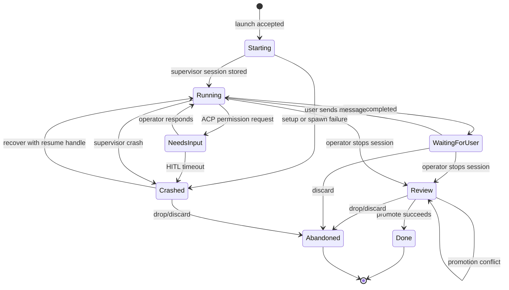
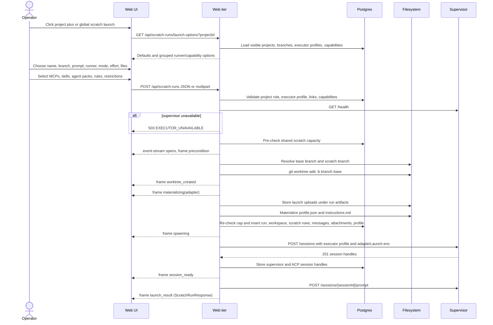
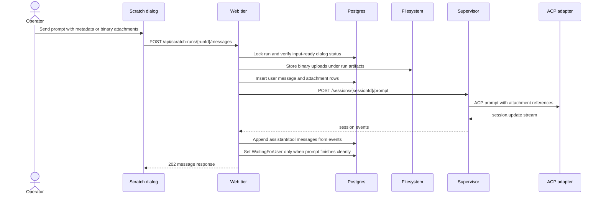
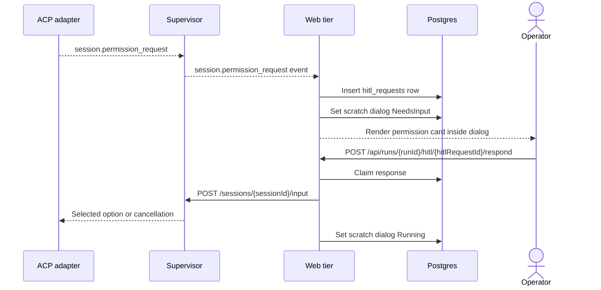
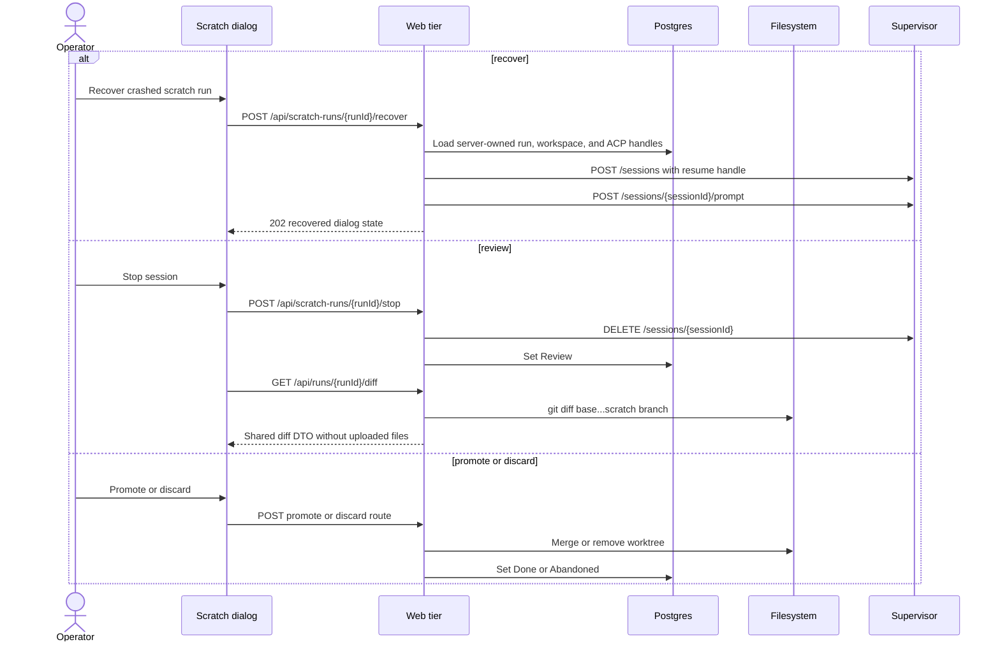
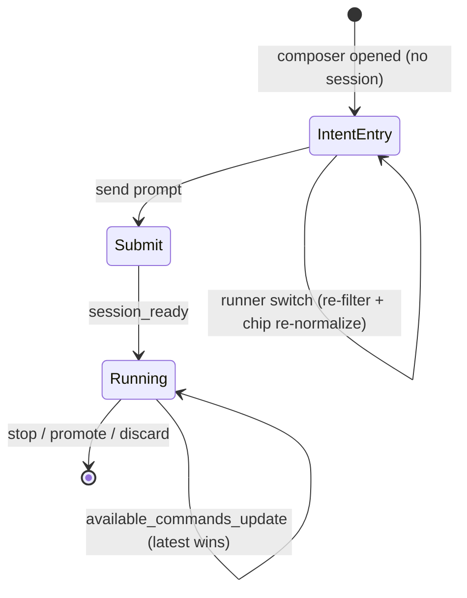

# Scratch runs domain

## Purpose

A **scratch run** is a manually started coding-agent workspace outside the task
board. It gives the operator a conversation-style ACP runner session inside a
MAIster-managed worktree, while keeping branch state, uploaded context,
capability choices, HITL, diff review, and active workspace visibility under
the same web, database, supervisor, and worktree contracts as Flow runs.

## Domain entities

- **Run substrate** - Implemented. Scratch uses `runs`,
  `workspaces`, supervisor sessions, HITL rows, diff/promote routes, and active
  workspace queries already shared with Flow runs.
- **Scratch run** - Implemented. A `runs` row with
  `run_kind = "scratch"`, one project, one effective platform runner, nullable
  `task_id`, nullable `flow_id`, nullable `flow_revision_id`,
  `flow_version = "scratch"`, `flow_revision = "manual"`, and
  `created_by_user_id`.
- **Runner profile** - Implemented. The selected runner is a
  `platform_acp_runners.id`, not the adapter/capability agent family. Multiple
  runners may use the same ACP adapter with different model, provider,
  permission policy, or sidecar settings.
- **Scratch workspace** - Implemented. One `workspaces` row and one
  MAIster-created git worktree for the scratch branch. The workspace stays
  outside board attempts and appears in project-grouped active workspace views.
- **Scratch metadata** - Implemented. `scratch_runs` is keyed by `run_id` and
  stores name, initial prompt, legacy `plan_mode`, `work_mode`,
  `reasoning_effort`, optional links, base/target branch metadata,
  `dialog_status`, supervisor session id, legacy creator fallback, error fields,
  and last message timestamps.
- **Scratch message** - Implemented. `scratch_messages` is an append-only dialog
  ledger with monotonic `sequence`, `role`, `content`,
  optional `supervisor_event_id`, and timestamps.
- **Scratch attachment** - Implemented. `scratch_attachments` stores metadata
  attachments (`issue_url`, `file_path`, `text_note`) and uploaded files
  (`uploaded_file`) attached to either launch context or a specific message.
  Uploaded-file rows store display metadata, SHA-256, a rootless artifact
  reference in `value`, and a server-only `storage_path`.
- **Uploaded file artifact** - Implemented. Binary uploads are stored under the
  run artifact tree at
  `.maister/<projectSlug>/runs/<runId>/uploads/<launch-or-message>/<safeName>`,
  never inside the git worktree.
- **Command-box launcher** - Implemented. Scratch intake is a prompt-first
  command box, not a constantly expanded setup form. Optional workspace/branch
  names sit above the prompt; machine, project, base branch, and submit sit in
  the footer; executor, attachments, work policy, and capabilities live in
  compact expandable controls.
- **Scratch capability profile** - Implemented. Selected platform/project/
  Flow-package MCPs, skills, rules, agent definitions, and restrictions resolve
  through the capability catalog, then snapshot into
  `scratch_capability_profiles`, `profile.json`, and `instructions.md`.
- **Native runner provisioning** - Designed. Merged per-run `.mcp.json`,
  adapter settings such as `settings.local.json`, worktree-visible skill/agent
  directories, and native tool policy files are future provisioning work.
  Current V1 is a profile/instructions handoff through `adapterLaunch.env`.
- **Work mode** - Implemented. `auto`, `plan_first`, and `manual_approval` are
  launch policy metadata. `plan_first` maps to legacy
  `plan_mode = "plan-first"`; other modes map to `plan_mode = "off"`.
  `manual_approval` is prompt policy, not a new ACP permission gate.
- **Active workspace group** - Implemented. The left rail groups active Flow and
  scratch workspaces by project and each project header exposes a `+` launcher
  action preselecting that project.
- **Shared workbench lifecycle actions** - Implemented (M27). Scratch detail
  uses the same visible lifecycle component as Flow workbenches for stopped and
  terminal workspaces. Live scratch stop still uses the scratch stop route;
  stopped scratch drop goes through the shared preserve-first run workbench
  drop route.

## Scratch detail UI hierarchy (Planned M35)

The scratch detail rework keeps the conversation as the primary surface and
adds the same run shell, inspector, and secondary workbench used by
workspace-backed Flow and agent runs:

- **Conversation center** owns the transcript, composer, permission/HITL cards,
  recover prompt, attachments, and latest tool activity.
- **Right inspector** shows scratch run facts, branch/worktree context, change
  size, Session summary, capability profile, and server-derived lifecycle or
  delivery actions.
- **Workbench tabs** provide Files, Diff, Evidence, and Timeline without
  replacing the conversation as the landing view.
- **Diff** uses `GET /api/runs/{runId}/diff` and the shared prepared diff
  renderer once the scratch route exposes `files`/`perFile`, while preserving
  the raw `diff` string during migration.

## State machine

Scratch dialog status lives on `scratch_runs.dialog_status`; shared lifecycle
status remains on `runs.status`.

| `scratch_runs.dialog_status` | `runs.status` | Active workspace label | Meaning |
| --- | --- | --- | --- |
| `Starting` | `Running` | `Running` | Setup, worktree, session, or first prompt is in flight. |
| `Running` | `Running` | `Running` | A prompt is actively running in the supervisor session. |
| `WaitingForUser` | `Running` | `WaitingForUser` | Session is live and idle between dialog turns. |
| `NeedsInput` | `NeedsInput` | `NeedsInput` | ACP permission or HITL input is waiting for the operator. |
| n/a | `NeedsInputIdle` | `NeedsInputIdle` | Shared idle checkpoint state; scratch resumes through recovery/HITL paths. |
| n/a | `HumanWorking` | `HumanWorking` | Manual takeover state from the shared run lifecycle. |
| `Review` | `Review` | `Review` | Session is stopped and changes are ready for diff, promote, or discard. |
| `Crashed` | `Crashed` | `Crashed` | Supervisor, event projection, or delivery failed and recovery is required. |
| `Done` | `Done` | hidden | Scratch work was promoted or completed. |
| `Abandoned` | `Abandoned` | hidden | Scratch workspace was discarded. |

## Process flows

### Start scratch run (Implemented)

If `branchName` is omitted or blank, the web tier derives the existing generated
scratch branch fallback from server state. If it is provided, launch creates
that branch and its worktree on submit.

### Dialog turn with uploads (Implemented)

File-write failure happens before the message row is visible and returns a
retryable `EXECUTOR_UNAVAILABLE`. Prompt-delivery failure after the DB commit
keeps the user message visible and uses the existing retryable/crashed dialog
status handling.

### Permission HITL in scratch dialog (Implemented)

### Recover, review, promote, or discard (Implemented)

Discard removes the worktree but does not delete uploaded run artifacts in V1.
Uploaded artifact retention is part of future typed artifact/blob-store policy.

## Capability composer lifecycle (Designed — FR-A/C/D/F)

The unified capability composer replaces the scratch prompt `<textarea>` with a
token-aware editor and threads a single autocomplete contract through three
phases. The cross-runner token grammar (`@skill:<slug>` / `@agent:<slug>`), the
per-adapter materialization-target table, and the normalizer/matcher truth table
are frozen elsewhere and are **not** restated here: see
[acp-runners.md](acp-runners.md) (materialization targets per adapter) and
[flow-settings.md](flow-settings.md) (canonical-token normalizer + raw-text
matcher).

### Three-phase autocomplete source (Designed)

- **Intent entry (no session) (Designed).** Autocomplete is the **static
  enriched catalog** from `getProjectCapabilityCatalog`, filtered to the
  project's enabled+trusted packages and to the chosen runner's support. A
  runner switch during entry is an **instant client-side re-filter plus chip
  re-normalization** to the new runner's wire form — **no materialization, no
  spawn** happens during entry (D1, D10). Native/global agent commands are not
  shown yet because no session exists.
- **Submit (Implemented).** Materialization runs for the **final** chosen runner
  (broad policy below) and the supervisor session is spawned. Launch progress
  streams on the launch POST's OWN `text/event-stream` response (NOT the run
  SSE — the run row and its stream do not exist until launch finishes; sub-plan
  2026-06-17, Option 2) as staged frames `precondition → worktree_created →
  materializing(<adapter>) → spawning → session_ready`, then a terminal
  `scratch.launch_result` frame; the launcher renders a live loader instead of
  freezing, and cancelling (client disconnect) GCs the worktree/session
  pre-commit or marks the run Crashed post-commit (D9, FR-F1/FR-F2).
- **Running (Designed).** Autocomplete switches to the live ACP
  `available_commands_update` snapshot (latest-wins per session — the feature
  stops discarding this event) **unioned with static subagents** (claude-only;
  subagents never appear in the `availableCommands` stream). The snapshot is
  exposed scratch-only via `GET /api/scratch-runs/[runId]/commands`, returning
  `[{ name, description, hint? }]` (FR-A2). Names are surfaced **as emitted**
  (codex `$x`, claude bare / `mcp:`); the composer maps them to canonical refs
  through the catalog.

### Scratch materialization policy (Designed — broad)

Scratch materialization is **broad**, unlike per-node Flow selection (which is
unchanged): on submit, MAIster materializes **all** enabled+trusted+runner-
supported **skills + subagents** as **files** for the final runner (per the
adapter materialization target in [acp-runners.md](acp-runners.md)). Skill and
subagent files are **lazy-loaded by the agent** — MAIster materializes the files
and does **not** dump their instructions into the prompt. **MCP stays
selected/defaults** because each stdio MCP is a live process (D7, FR-C3).

## Structured logs

Scratch implementation logs are structured application logs, not user-visible
dialog messages. Logs MUST include stable identifiers and MUST NOT include file
contents, uploaded file bytes, API tokens, executor environment values, or
secret material.

| Event | Level | Required context |
| --- | --- | --- |
| `scratch_run.launch.requested` | INFO | `projectId`, `userId`, effective `runnerId`, resolution tier, `baseBranch`, optional branch presence, work mode, reasoning effort, attachment counts and bytes |
| `scratch_run.launch.rejected` | WARN | `projectId`, `userId`, `code`, field/reason, proof no later side effect occurred when applicable |
| `scratch_run.upload.stored` | INFO | `runId`, `messageId` or `launch`, `projectId`, `userId`, `fileName`, `byteSize`, `sha256` |
| `scratch_run.upload.rejected` | WARN | `runId` when available, `projectId`, `userId`, `code`, limit/path reason |
| `scratch_run.prompt.sent` | INFO | `runId`, `messageId`, `sequence`, `attachmentCount`, `uploadedByteSize` |
| `scratch_run.prompt.completed` | INFO | `runId`, `messageId`, stop reason, next dialog status |
| `scratch_run.capabilities.materialized` | INFO | `runId`, selected ids by kind, profile digest, downgrade count |
| `scratch_run.workspace_groups.query_failed` | WARN | project ids or run ids involved, error code/message only |

## Expectations

- Scratch launch MUST select an effective platform ACP runner and MUST NOT
  collapse runners that share the same ACP adapter or capability agent.
- Scratch launch UI MUST keep the prompt as the primary surface and MUST NOT
  expose runner, file, policy, and capability selectors as one large always-open
  form.
- Scratch launch MUST accept an empty `branchName` and derive the generated
  scratch branch fallback from server state.
- Scratch launch MUST reject invisible projects, missing/unready runner
  overrides, invalid branches, existing scratch branches, full capacity, empty
  prompts, invalid capability ids, and upload limit violations before unsafe
  side effects.
- Scratch launch MUST store uploaded files under the run artifact tree and MUST
  never write them under `workspaces.worktree_path`.
- Scratch uploaded-file API responses MUST expose client-safe metadata and a
  rootless `artifactRef`; absolute `storage_path` is server-only.
- Scratch dialog message sends MUST be serialized by row lock and dialog
  status, allowing at most one active prompt per run.
- Scratch messages MUST be append-only with monotonic sequence per run.
- Scratch capability selection MUST snapshot platform/project/Flow-package
  capability choices before the supervisor session starts.
- Scratch V1 MUST describe selected MCPs, skills, rules, agent definitions, and
  restrictions through profile/instructions handoff, not claim native adapter
  provisioning.
- Project members MAY operate scratch runs in V1; `created_by_user_id` is audit
  and display metadata, not an ownership gate.
- Project-grouped active workspace views MUST include both Flow and scratch
  runs, while task boards MUST filter to `runs.run_kind = "flow"`.
- Active workspace status labels MUST distinguish `Running`,
  `WaitingForUser`, `NeedsInput`, `NeedsInputIdle`, `HumanWorking`, `Review`,
  and `Crashed`.
- Stopped/terminal scratch detail MUST render workbench lifecycle actions from
  [`workbench-lifecycle.md`](workbench-lifecycle.md) and keep scratch messages,
  recover, diff, and promote controls adjacent.
- Scratch detail MUST keep the transcript and composer as the landing surface;
  Files, Diff, Evidence, and Timeline are secondary workbench tabs.
- Scratch Diff MUST use the shared run diff renderer after the route returns the
  prepared `files`/`perFile` shape; uploaded artifacts remain outside the git
  diff because they are stored under the run artifact tree.

## Edge cases

| Case | Response / behavior |
| --- | --- |
| Invisible project or project without membership | `409 PRECONDITION`; no filesystem or supervisor side effects. |
| Missing/unready runner override or unsupported runner profile | `409 PRECONDITION` or `503 EXECUTOR_UNAVAILABLE` depending on validation vs runtime availability. |
| Empty prompt or malformed JSON/multipart payload | `400 CONFIG`; no launch/message side effects. |
| Invalid base branch or branch name | `409 PRECONDITION`; no worktree is created. |
| Scratch branch already exists or worktree path is occupied | `409 PRECONDITION` or `409 CONFLICT`; no supervisor session is started. |
| Shared live-session capacity is full | `409 CONFLICT` or `409 PRECONDITION`; scratch V1 does not queue. |
| Too many files, oversized file, or oversized multipart payload | `409 PRECONDITION`; no DB attachment row is committed. |
| Unsafe upload filename/path after sanitization | `409 PRECONDITION`; no file is written outside the run artifact tree. |
| File write failure | `503 EXECUTOR_UNAVAILABLE`; launch cleanup is best effort and message rows remain invisible. |
| Second prompt while `Running` or terminal dialog state | `409 PRECONDITION`; the existing prompt/session is left untouched. |
| Supervisor unavailable before launch | `503 EXECUTOR_UNAVAILABLE`; no worktree, DB run, or upload side effect occurs. |
| Supervisor prompt delivery fails after message commit | Retryable or crashed dialog status follows existing scratch service behavior; the user message stays visible. |
| Permission deferred times out | `HITL_TIMEOUT`; scratch transitions to `Crashed` with error metadata. |
| Promote merge conflict | `409 CONFLICT`; run remains `Review` and the worktree stays available. |
| Shared lifecycle drop from scratch detail | Preserve first, remove only a MAIster-owned worktree, set `removed_at`, and mark non-`Done` runs/dialog metadata `Abandoned`. |
| Composer launch canceled mid-stream (Implemented — FR-F2) | A client disconnect aborts at the next stage boundary: pre-commit (during `materializing`) it GCs the worktree+branch; post-commit it marks the run `Crashed` (a tracked row, not an orphan). No orphan worktree/session remains. |

## Acceptance Criteria

- Command-box scratch launch shows optional name/branch fields above the
  prompt, machine label plus project/base-branch selectors in the footer, and a
  launch button in the same composer surface.
- Runner selector, attachment controls, work mode, reasoning effort, and
  capability selections are reachable through compact expandable controls and
  are not all expanded by default.
- Launch from a project-group `+` opens scratch launch with that project
  preselected.
- A blank branch name launches with the generated scratch branch fallback; an
  explicit branch name creates that branch and worktree on submit.
- Launch and message routes accept JSON for metadata-only requests and
  multipart for mixed metadata plus binary files.
- Uploaded launch files and message files appear in scratch detail with
  filename, MIME type, byte size, SHA-256, and rootless artifact reference.
- Uploaded files do not appear in git diff or promote output because they are
  outside the worktree.
- Work mode and reasoning effort are persisted and visible in scratch detail.
- The selected executor profile, launched-by user, and status label appear in
  active workspace rows.
- Project-grouped active workspace queries return Flow and scratch rows grouped
  by visible project with truthful active counts.
- Native runner provisioning remains explicitly Designed until a later milestone
  implements adapter-native MCP/settings/skills/restrictions files.

## Linked artifacts

- Product model: [`../PRODUCT_VIEW.md`](../PRODUCT_VIEW.md).
- Run lifecycle: [`runs.md`](runs.md).
- Workspace lifecycle: [`workspaces.md`](workspaces.md).
- Capability registry: [`../configuration.md`](../configuration.md).
- Error taxonomy: [`../error-taxonomy.md`](../error-taxonomy.md).
- Web API contract: [`../api/web.openapi.yaml`](../api/web.openapi.yaml).
- SSE contract: [`../api/async/web-runs.asyncapi.yaml`](../api/async/web-runs.asyncapi.yaml).
- DB references: [`../db/runs-domain.md`](../db/runs-domain.md),
  [`../database-schema.md`](../database-schema.md).
- **Reused by (M30 — Implemented, ADR-078):** gate-chat at HITL pauses reuses this
  chat/projector substrate (`web/lib/scratch-runs/events.ts` table-agnostic seam)
  bound to `gate_chat_messages`; see [`hitl.md`](hitl.md) §Gate-chat.
- Source areas: `web/app/api/scratch-runs/*`,
  `web/components/scratch/*`, `web/lib/scratch-runs/*`,
  `web/lib/capabilities/*`, `web/lib/queries/portfolio.ts`,
  `web/lib/db/schema.ts`, `web/lib/supervisor-client.ts`, and
  `supervisor/src/http-api.ts`.
