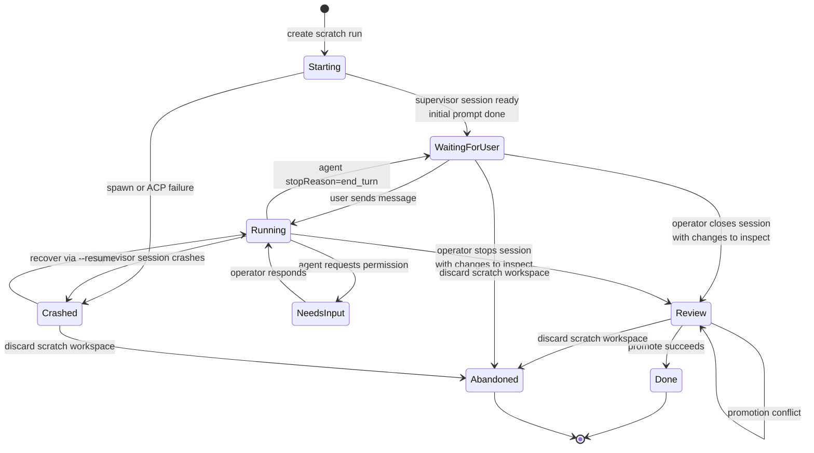
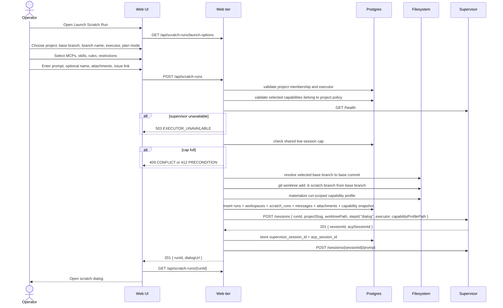
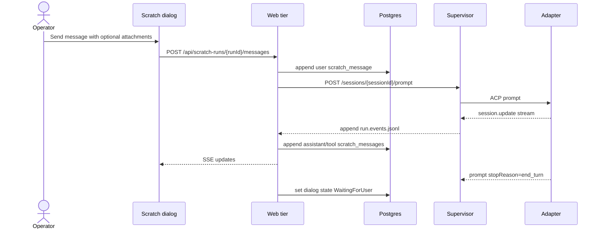
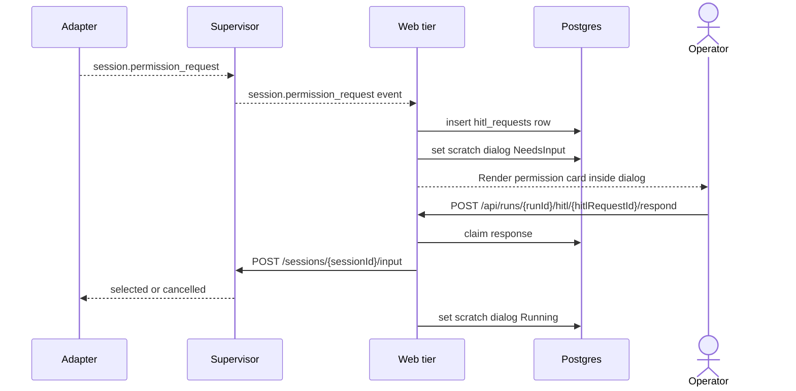
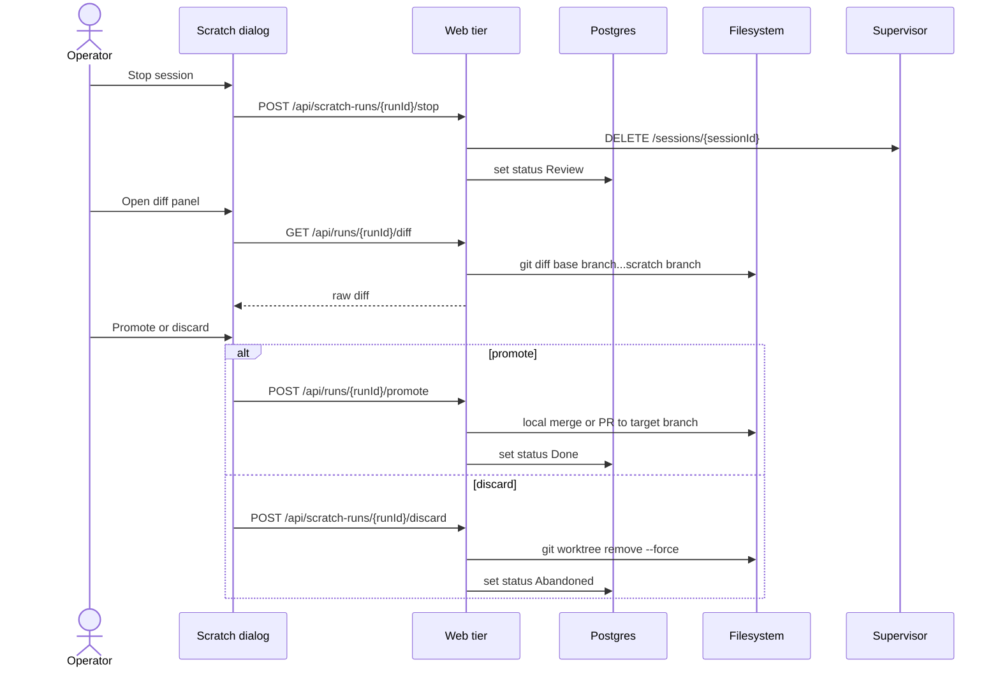

# Scratch runs domain

## Purpose

A **scratch run** is a manually started coding-agent workspace that does not
require a board task or Flow. It gives the operator a Codex or Claude-style
dialog inside a MAIster-managed worktree, while keeping the workspace visible in
Portfolio, auditable in run history, and controlled by the same supervisor,
executor, worktree, HITL, diff, and cleanup contracts as normal runs.

## Domain entities

- **Run substrate** - `runs`, `workspaces`, supervisor sessions, HITL rows, and
  active workspace views are Implemented for Flow runs and extended here for
  scratch runs.
- **Scratch run** - Designed. A `runs` row with `run_kind = "scratch"`, one
  project, one executor, nullable `task_id`, nullable `flow_id`, nullable
  `flow_revision_id`, `flow_version = "scratch"`, and
  `flow_revision = "manual"`.
- **Scratch workspace** - Designed. One `workspaces` row and one MAIster-created
  git worktree for the scratch run. The run stays outside the task board and
  appears in Portfolio and project active workspace lists.
- **Scratch metadata** - Designed. `scratch_runs` row keyed by `run_id` with
  `name`, `initial_prompt`, `plan_mode`, `linked_task_id`,
  `linked_issue_url`, `base_branch`, `base_commit`, `target_branch`,
  `dialog_status`, `supervisor_session_id`, `created_by_user_id`,
  `last_user_message_at`, and `last_agent_message_at`.
- **Scratch message** - Designed. Append-only `scratch_messages` row with
  `run_id`, monotonic `sequence`, `role`, `content`, optional
  `supervisor_event_id`, and timestamps. Roles are `user | assistant | tool |
  system`.
- **Scratch attachment** - Designed. Optional `scratch_attachments` row linked
  to a scratch message or run. Initial kinds are `issue_url`, `file_path`, and
  `text_note`. Binary upload storage is Phase 2.
- **Scratch capability profile** - Designed. Run-scoped selection of MCP
  servers, skills, rules, agent settings, and restrictions resolved from
  platform capability catalogs, project defaults, and installed Flow package
  assets, then materialized for exactly one supervisor session.
- **Platform MCP selection** - Designed. Checkbox dropdown in the scratch
  launcher. It lists MCP servers visible to the chosen project, defaults all
  project-enabled platform MCPs to selected, and omits unchecked servers from
  the run profile.
- **Skill and rule selection** - Designed. Checkbox dropdowns in the scratch
  launcher. They list project rules, platform rules, project skills, and skills
  shipped by installed Flow packages. Defaults come from project capability
  policy.
- **Plan mode** - Designed. Launch setting that tells the agent to produce and
  wait on a plan before editing. In v1 this is prompt-level policy plus
  persisted capability metadata, not a hard tool sandbox.
- **Active workspace card** - Designed. Portfolio and project workspace list
  entry showing project, scratch name, branch, executor, status, last activity,
  and an Open dialog action.

## State machine - scratch run axis

Scratch dialog status is Designed and lives on `scratch_runs.dialog_status`.
`runs.status` remains the existing shared lifecycle:
`Pending | Running | NeedsInput | NeedsInputIdle | Review | Crashed | Done |
Abandoned | Failed`. The implementation MUST NOT add `WaitingForUser` to
`runs.status` in v1.

| `scratch_runs.dialog_status` | `runs.status` | Meaning |
| --- | --- | --- |
| `Starting` | `Running` | Launch accepted, shared live-session capacity claimed, and setup is in progress. |
| `WaitingForUser` | `Running` | Supervisor session is live and idle between turns. It still consumes one live-session slot. |
| `Running` | `Running` | A user prompt is active in the supervisor session. |
| `NeedsInput` | `NeedsInput` | The agent is blocked on explicit HITL or permission input. |
| `Review` | `Review` | Supervisor session is stopped and workspace changes are ready for diff, promote, or discard. |
| `Crashed` | `Crashed` | Supervisor session or event projection failed and recovery is required. |
| `Done` | `Done` | Scratch changes were promoted or explicitly completed. |
| `Abandoned` | `Abandoned` | Scratch workspace was discarded. |

Scratch v1 checks the same shared live-session cap as Flow launch before
worktree, DB, or supervisor side effects. It does not enqueue `Pending` scratch
runs. When the cap is full, launch returns a typed `CONFLICT` or
`PRECONDITION` response and leaves no scratch artifacts behind.

## Process flows

### Start scratch run (Designed)

### Dialog turn (Designed)

The web tier must reject a second user message while a prompt is already
running for the same scratch run. The UI keeps the composer disabled until the
current prompt reaches `end_turn`, HITL, crash, or cancellation.

### Permission HITL in scratch dialog (Designed)

### Close, review, and promote (Designed)

## Structured events (Designed)

Scratch runs use structured application logs and persisted run events so launch,
dialog, and cleanup can be audited without reading free-form text. Each event
MUST include `run_id`, `project_id`, `executor_id`, `run_kind = "scratch"`,
`workspace_id` when available, and the authenticated actor id when the event is
user-triggered. Capability events MUST include the materialized profile id and
MUST NOT log secret values.

| Event | Required context |
| --- | --- |
| `scratch_run.launch.requested` | requested project, base branch, branch name, executor, plan mode, attachment counts, selected capability ids |
| `scratch_run.launch.rejected` | rejection code, validation field, readiness or capacity reason, and proof no worktree/session was created |
| `scratch_run.worktree.created` | worktree path, scratch branch, base branch, base commit |
| `scratch_run.capabilities.materialized` | profile id, selected MCP ids, selected skill ids, selected rule ids, downgraded optional capability ids |
| `scratch_run.session.started` | supervisor session id, ACP session id, adapter, capability profile path |
| `scratch_run.prompt.sent` | message id, message sequence, attachment count |
| `scratch_run.prompt.completed` | message id, stop reason, token/cost summary when available |
| `scratch_run.permission.waiting` | HITL request id, ACP request id, timeout, permission kind |
| `scratch_run.permission.resolved` | HITL request id, selected option or response kind, delivery status |
| `scratch_run.stop.requested` | previous dialog status, previous run status, supervisor session id |
| `scratch_run.discard.completed` | worktree path, branch, removed artifact ids |
| `scratch_run.promote.requested` | source branch, target branch, base commit, promotion mode |
| `scratch_run.promote.completed` | target branch, resulting commit or PR URL, conflict status |
| `scratch_run.recovery.attempted` | previous supervisor session id, ACP session id, resume outcome |

## Expectations

- A scratch run without `linked_task_id` MUST NOT create or display a task board
  card.
- Active workspace lists MUST include scratch runs while their workspace is not
  removed and their status is not terminal.
- Scratch run launch MUST create a separate named-branch git worktree from the
  selected base branch before the supervisor session starts. Detached worktrees
  are Phase 2.
- Scratch run launch MUST check supervisor readiness and shared live-session
  capacity before `git worktree add`, DB writes, capability materialization, or
  supervisor session creation. V1 MUST reject when full and MUST NOT queue
  scratch runs.
- Scratch run launch MUST persist the resolved capability profile before
  starting the supervisor session.
- Platform MCPs MUST default to all project-enabled MCPs selected, while skills
  and rules MUST come only from platform catalogs, project settings, or
  installed Flow package assets visible to the selected project.
- Scratch dialogs MUST send prompts through `POST /sessions/:id/prompt`; the web
  tier must not spawn agent processes.
- Scratch dialogs MUST allow at most one active prompt per scratch run, and
  scratch messages MUST be append-only with monotonic sequence per run.
- Permission requests MUST render inside the scratch dialog and resolve through
  the supervisor `POST /sessions/:id/input` path.
- Task boards MUST query only `run_kind = "flow"` runs; Portfolio and project
  workspace views MUST query both `flow` and `scratch` runs.
- Plan mode and capability selections MUST be visible on the scratch run detail
  page as the exact settings materialized for the session.

## Edge cases

- **`EXECUTOR_UNAVAILABLE`** - supervisor readiness fails, selected executor is
  not registered for the project, or the adapter cannot be reached.
- **`PRECONDITION`** - base branch does not exist, scratch branch already exists,
  parent repo is dirty, worktree path is occupied, prompt is empty, or the user
  sends a second message while a prompt is running.
- **`CONFIG`** - launch body references a project, executor, task, or attachment
  kind that does not match the schema.
- **`CONFIG`** - selected MCP, skill, rule, or restriction is not visible to the
  selected project.
- **`HITL_TIMEOUT`** - a permission request expires before the operator answers.
- **`CRASH`** - the supervisor session exits unexpectedly or the web tier cannot
  persist a permission request.
- **`CONFLICT`** - promotion cannot merge the scratch branch into the target
  branch. The run stays in Review and keeps the worktree.

## Linked artifacts

- Product model: [`../PRODUCT_VIEW.md`](../PRODUCT_VIEW.md).
- Run lifecycle: [`runs.md`](runs.md).
- Workspace lifecycle: [`workspaces.md`](workspaces.md).
- Supervisor API: [`../supervisor.md`](../supervisor.md),
  [`../api/supervisor.openapi.yaml`](../api/supervisor.openapi.yaml).
- Web API contract: [`../api/web.openapi.yaml`](../api/web.openapi.yaml).
- DB references to update: [`../db/runs-domain.md`](../db/runs-domain.md),
  [`../database-schema.md`](../database-schema.md).
- Source areas: `web/app/api/runs/route.ts`,
  `web/app/api/runs/[runId]/stream/route.ts`, `web/lib/worktree.ts`,
  `web/lib/supervisor-client.ts`, `supervisor/src/http-api.ts`,
  `supervisor/src/acp-client.ts`, planned capability-profile modules under
  `web/lib/capabilities/`.
