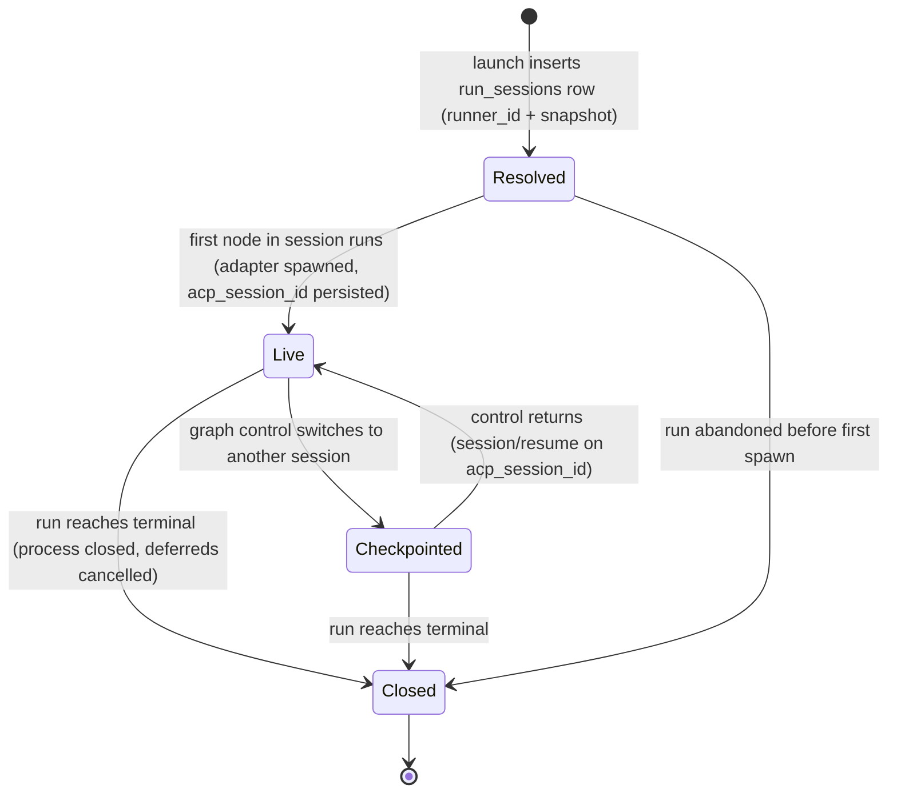
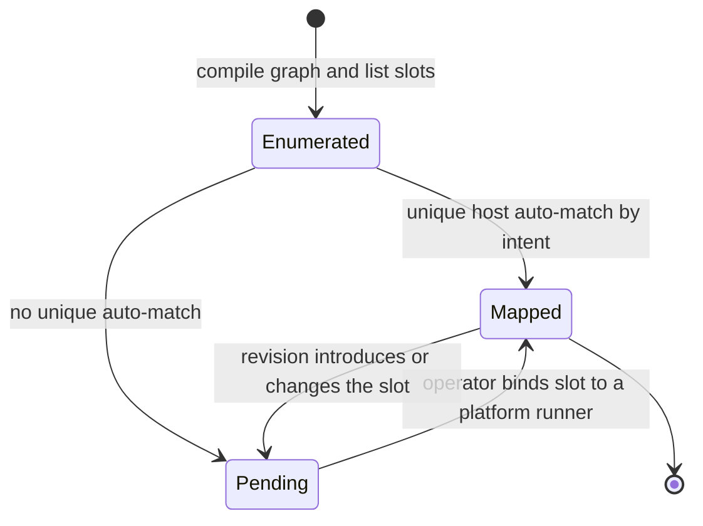
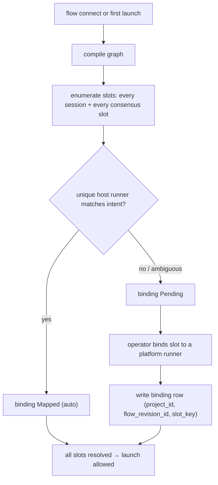
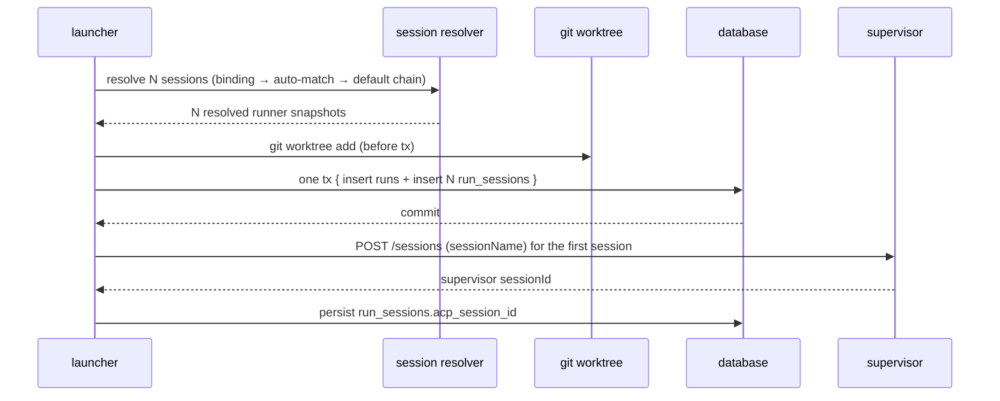
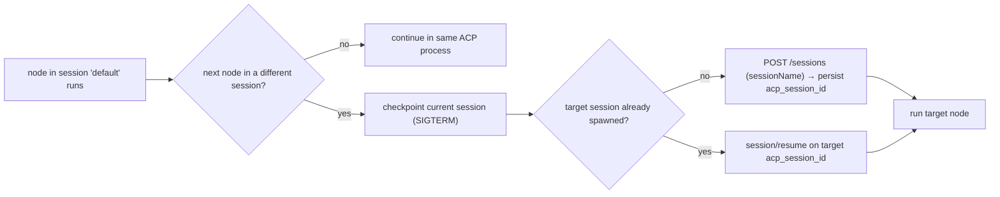

# Flow runner & session model domain

> **Status: Implemented (M42).** Decision:
> [ADR-114](../decisions.md#adr-114-unified-flow-runner-config-first-class-sessions-per-project-connect-time-bindings-and-run_sessions-as-the-sole-run-runner-source-of-truth).
> Working spec: [`../../.ai-factory/plans/feature-unified-flow-runner-sessions.md`](../../.ai-factory/plans/feature-unified-flow-runner-sessions.md).

## Purpose

This domain owns the **unified runner config**, the flow-graph **session model**,
and the per-project **runner bindings** that make flow packages portable. It
answers: how graph nodes group into logical ACP **sessions** (`default` / solo /
named), how each session and each consensus slot resolves to a concrete host
runner via author-declared intent plus a per-project binding, how a run's runner
state persists in `run_sessions` (the **sole** source of truth), and how a session
switch reuses checkpoint → `session/resume`. It does **not** own the base run state
machine ([runs.md](runs.md)), generic graph traversal
([flow-graph.md](flow-graph.md)), the platform runner catalog
([acp-runners.md](acp-runners.md)), consensus fan-out/tally
([consensus.md](consensus.md)), or crash reconciliation
([reconciliation-gc.md](reconciliation-gc.md)).

## Domain entities

- **Unified runner config** (Designed) — `flowRunnerConfigSchema`: `runner_type`,
  `capability_agent`, `adapter?`, `model?`, `model_family?`, `provider?`,
  `permission_policy`, `sidecar?`, **`effort?`** (the `thinkingEffort` enum), and
  **`env?`** (a passthrough NAME → `env:NAME` map, never secret literals). Used for
  `runner_profiles` values, `sessions[].runner`, node `settings.runner`
  (ai_coding / orchestrator / judge), and consensus participant/synthesizer
  `runner`. Any runner slot accepts a profile-ref **string** or an inline
  **object**.
- **Session** (Designed) — a logical group of one or more graph nodes that share
  one ACP process and one continuous `acp_session_id`. Three kinds:
  - **`default`** — implicit; a node with neither `session:` nor `runner:` joins it
    (zero-ceremony, preserves single-session behavior);
  - **solo** — a node with `runner:` and no `session:` gets its own one-node
    session;
  - **named** — a top-level `sessions:` entry that one or more nodes opt into via
    `session: <name>`.
- **`run_sessions` row** (Designed) — the per-`(run, session)` runner state record
  and the sole source of truth: `id, run_id, session_name, runner_id,
  runner_resolution_tier, capability_agent, runner_snapshot, acp_session_id,
  resolution_source`, timestamps, `UNIQUE(run_id, session_name)`. A non-flow run
  (scratch / agent) has exactly one `default` row. (See
  [db/runs-domain.md](../db/runs-domain.md).)
- **Runner slot** (Designed) — the unit of binding, addressed by `slot_key ∈
  {session:<name>, consensus:<nodeId>:<participantId>,
  consensus:<nodeId>:synthesizer}`. Slot enumeration never dedups by intent.
- **Per-project binding** (Designed) — a `(project_id, flow_revision_id, slot_key)`
  → `mapped_runner_id` (`platform_acp_runners`) mapping with status `Pending |
  Mapped`, written at flow-connect or first launch (the generalized successor of
  the per-step `flow_runner_remaps`).
- **Ephemeral per-run override** (Designed) — an optional per-session runner
  override offered at the Launch dialog for a single run; it does **not** persist
  (the successor of the old `launchOverride` resolution tier).

## State machine

A session's runtime lifecycle within one run. The runner is resolved at launch
(row present, no process yet); the adapter is spawned when the session's first node
runs; control parks the session on a switch to another session and resumes it via
`session/resume`; terminal closes every session.

A binding slot's lifecycle across connect/launch.

## Process flows

### Slot enumeration and per-project binding (connect-time or first launch)

### Multi-session launch (atomic)

### Sequential session dispatch and switch

## Expectations

- Every run MUST have at least one `run_sessions` row; a non-flow run
  (`run_kind ∈ {scratch, agent}`) MUST have exactly one `default` row, and
  `UNIQUE(run_id, session_name)` MUST hold.
- `run_sessions` MUST be the sole source of truth for run runner state; the dropped
  `runs.{runner_id, runner_resolution_tier, capability_agent, runner_snapshot,
  acp_session_id}` columns MUST NOT be reintroduced, and `step_runs.acp_session_id`
  MUST stay (it records which session a step used).
- A node with neither `session:` nor `runner:` MUST join the implicit `default`
  session; a node with `runner:` and no `session:` MUST get its own solo session; a
  node with `session:` MUST join that named group.
- Nodes sharing a `session:` name MUST share one ACP process and one continuous
  `acp_session_id` resumed in graph order; all sessions in a run MUST share the
  run's single worktree and MUST execute sequentially (never in parallel).
- A session switch MUST reuse checkpoint → `session/resume`; resume MUST use the ACP
  `session/resume` protocol call and MUST fail loud (`MaisterError("CHECKPOINT")`),
  never `session/new`, when the adapter lacks `sessionCapabilities.resume`.
- Every runner slot whose config lacks a unique host auto-match MUST be bound
  (`Pending → Mapped`) before the run can launch; slot enumeration and the binding
  UI MUST NOT dedup by intent (identical-intent consensus participants are distinct
  slots).
- Binding rows MUST be keyed `(project_id, flow_revision_id, slot_key)` with
  `slot_key` one of the declared forms; a revision that introduces a new slot MUST
  re-prompt rather than silently inherit.
- Per-session resolution MUST follow: binding → auto-match → (for the `default`
  session with no explicit runner only) project-flow → platform-flow → project →
  platform default; the ephemeral per-run override MUST NOT persist.
- `judge` MUST be an ordinary runner-bearing node resolved through its session
  runner; `judge.settings.model` MUST NOT exist (removed clean-cutover).
- `POST /sessions` MUST carry `sessionName` so `cost.jsonl` and `run.events.jsonl`
  are attributable per logical session.
- A terminal or abandon transition MUST close EVERY `run_sessions` live process and
  cancel its deferreds in the same status-guarded transaction; HITL/gate
  live-delivery MUST target the ACTIVE session's `acp_session_id`.
- An invalid or unbound session graph MUST surface `MaisterError("CONFIG")`; a slot
  with no resolvable concrete host runner MUST surface
  `MaisterError("EXECUTOR_UNAVAILABLE")` — no new error code is introduced.

## Edge cases

- **Undefined session reference** — a node `session:` names a session absent from
  top-level `sessions:` → `MaisterError("CONFIG")` at manifest load.
- **Consensus inside `sessions:`** — a `consensus` node assigned to a named session
  → `MaisterError("CONFIG")` (consensus is excluded from `sessions:`).
- **Unbound slot at launch** — a slot with no auto-match and no binding blocks
  launch with `MaisterError("EXECUTOR_UNAVAILABLE")`.
- **Auto-match ambiguity** — more than one host runner matches a slot's intent →
  treated as no-unique-match → the slot requires an explicit binding.
- **Adapter without resume on switch** — a session switch targeting an adapter that
  does not advertise `sessionCapabilities.resume` fails loud
  (`MaisterError("CHECKPOINT")`), never silently `session/new`.
- **Partial `run_sessions` insert** — a launch crash before commit yields no run
  (clean retry); a crash after commit before spawn is recoverable by the reconcile
  sweep ([reconciliation-gc.md](reconciliation-gc.md)).
- **Spawned-but-unpersisted `acp_session_id`** — a crash after adapter spawn but
  before the persist write reconciles to `Crashed`; resume re-derives from the
  `run_sessions` snapshot, never a mutable catalog row.
- **Runner deleted while bound/in-use** — the runner delete guard refuses while a
  binding or a live `run_sessions` row references it
  (`MaisterError("CONFLICT")` / `PRECONDITION`).

## Linked artifacts

- Decision: [ADR-114](../decisions.md#adr-114-unified-flow-runner-config-first-class-sessions-per-project-connect-time-bindings-and-run_sessions-as-the-sole-run-runner-source-of-truth).
- Working spec: [`../../.ai-factory/plans/feature-unified-flow-runner-sessions.md`](../../.ai-factory/plans/feature-unified-flow-runner-sessions.md).
- DSL/config: [`../flow-dsl.md`](../flow-dsl.md), [`../configuration.md`](../configuration.md).
- Runner catalog & resolution: [`acp-runners.md`](acp-runners.md),
  [`executors.md`](executors.md).
- Graph/runtime domains: [`flow-graph.md`](flow-graph.md),
  [`consensus.md`](consensus.md), [`runs.md`](runs.md),
  [`reconciliation-gc.md`](reconciliation-gc.md), [`flow-settings.md`](flow-settings.md),
  [`hitl.md`](hitl.md).
- Wire contracts: [`../api/web.openapi.yaml`](../api/web.openapi.yaml),
  [`../api/supervisor.openapi.yaml`](../api/supervisor.openapi.yaml),
  [`../supervisor.md`](../supervisor.md).
- DB docs: [`../database-schema.md`](../database-schema.md),
  [`../db/runs-domain.md`](../db/runs-domain.md), [`../db/erd.md`](../db/erd.md).
- Source (Designed): `web/lib/config.schema.ts`, `web/lib/config.ts`,
  `web/lib/flows/compile.ts`, `web/lib/flows/graph/runner-graph.ts`,
  `web/lib/runs/resolve.ts`, `web/lib/acp-runners/flow-reconfiguration.ts`,
  `web/lib/db/schema.ts`, `web/lib/reconcile.ts`, `supervisor/src/*`.
</content>
</invoke>
