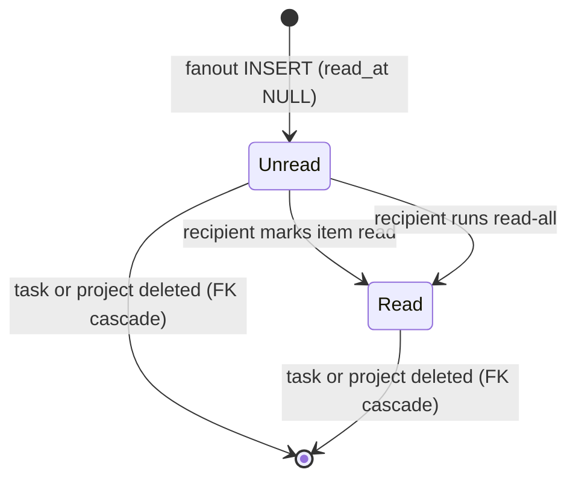
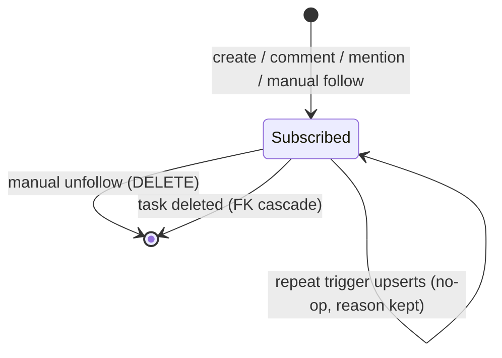
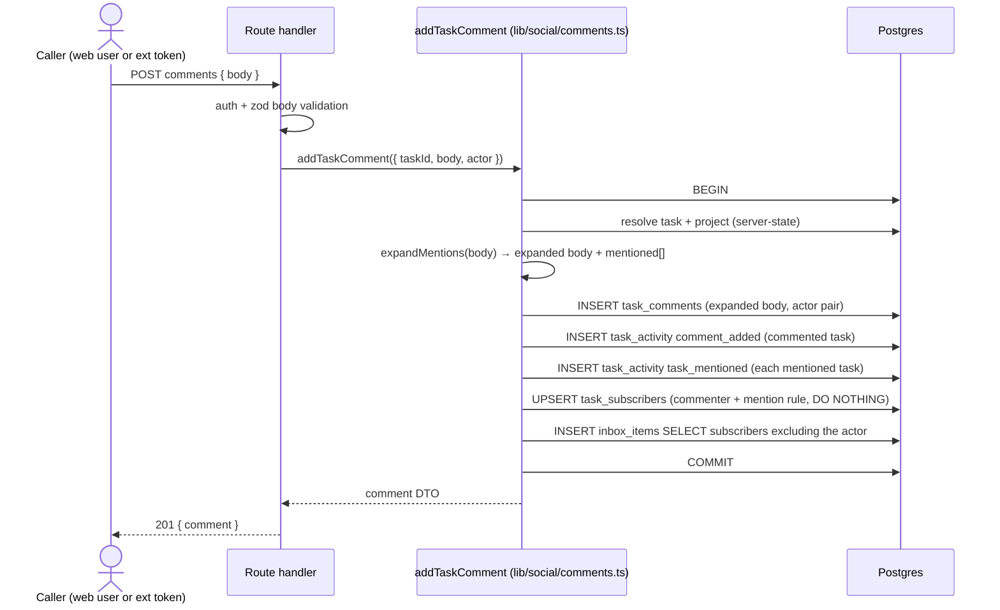
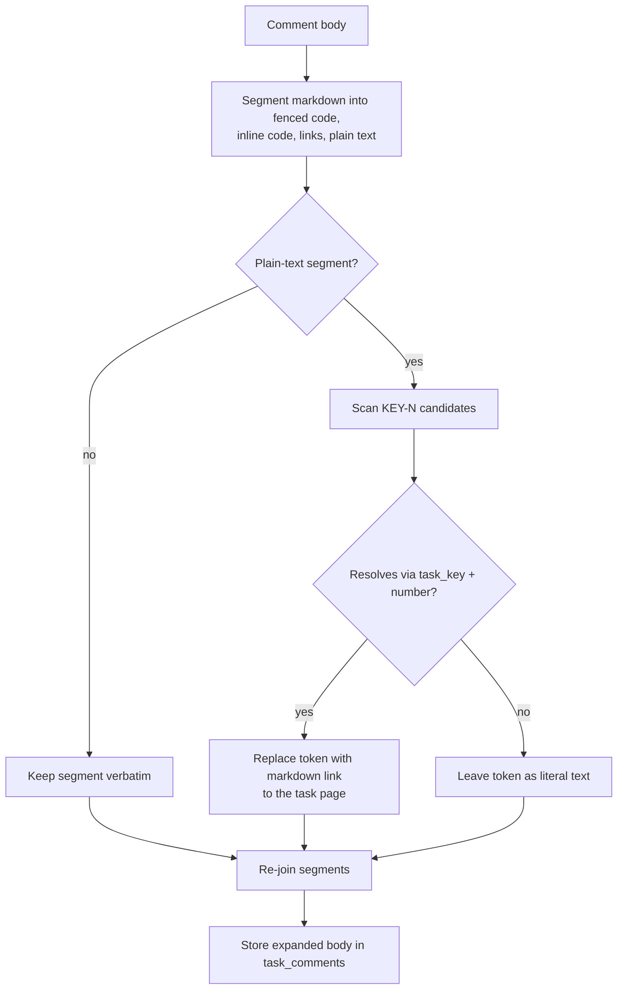
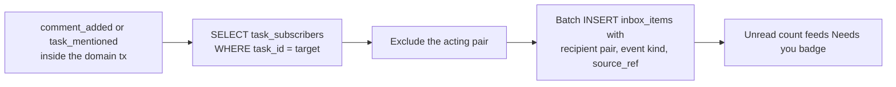

# Social board domain

## Purpose

The social board layer (Stage 1, ADR-075) gives every task a stable
per-project identity (`KEY-N`) and a social substrate around it: markdown
comments with task mentions, domain-written activity, auto-subscriptions,
and a per-recipient inbox. All four social tables
(`task_comments`, `task_activity`, `task_subscribers`, `inbox_items`)
carry a polymorphic actor model (`user | agent | system`); Stage 1 writes
only `user`/`system` actors — `agent` is schema-supported for the later
platform-agents stages and never written today. Task numbering, typed
relations, and the `"blocked"` launchability gate are documented in
[`tasks.md`](tasks.md); this file owns the comment/activity/subscription/
inbox substrate. (Designed)

## Domain entities

- **Task key** — `projects.task_key`, platform-wide unique, matches
  `^[A-Z][A-Z0-9]{1,9}$`. Set at registration (explicit or derived from the
  project name), immutable in Stage 1. See [`tasks.md`](tasks.md).
- **Task number** — `tasks.number`, per-project monotonic, allocated from
  `projects.next_task_number` in the `createTask` transaction. `KEY-N` =
  `task_key` + `number`. See [`tasks.md`](tasks.md).
- **Actor pair** — `(actor_type, actor_id)` columns on every social table:
  `actor_type ∈ {user, agent, system}`,
  `CHECK ((actor_type = 'system') = (actor_id IS NULL))`, no FK to `users`
  (a deleted user renders as a "former user" fallback).
- **Comment** — `task_comments` row: markdown body stored with mentions
  already expanded, actor pair, append-only (no edit/delete/threading in
  Stage 1).
- **Activity event** — `task_activity` append-only row with
  `event_kind ∈ {task_created, comment_added, task_mentioned,
  relation_added, relation_removed, run_launched}` and a jsonb `payload`.
  Written only by the domain layer (`web/lib/social/*` via
  `recordTaskActivity` plus the named service write-sites).
- **Subscriber** — `task_subscribers` row: `(task_id, subscriber_type,
  subscriber_id, reason)` with `reason ∈ {creator, commenter, mentioned,
  manual}` and `subscriber_type ∈ {user, agent}` (`system` never
  subscribes).
- **Inbox item** — `inbox_items` row: recipient pair, `project_id`,
  `task_id`, `event_kind`, `source_ref` jsonb
  (`{kind, taskId, commentId, activityId}`), nullable `read_at`.

## State machine

Comments and activity events are append-only and immutable in Stage 1 —
their only lifecycle is FK cascade on task/project deletion. The stateful
pieces are the inbox item read marker and the per-task subscriber set.

Inbox item lifecycle (Designed):

Subscription lifecycle (Designed) — one row per `(task, subscriber pair)`,
first reason wins:

## Process flows

### Comment pipeline (Designed)

One `db.transaction` covers all five steps; no external side-effect runs
inside it (no supervisor call, no filesystem write).

### Mention expansion (Designed)

Mentions expand at write time; the expanded body is what `task_comments.body`
stores. Rendering never re-resolves (single render path, immutable history;
stale links after a project slug rename are accepted).

### Inbox fanout (Designed)

Fanout runs inside the same transaction as the triggering write, as one
batch `INSERT … SELECT` per target task. Stage-1 triggers: `comment_added`
(the commented task's subscribers) and `task_mentioned` (each mentioned
task's subscribers). `task_created`, `relation_*`, and `run_launched` do
NOT fan out — the project Log page covers them; the inbox stays
high-signal.

### Reading the inbox (Designed)

`GET` surfaces (portfolio panel + board section) list items for the session
user. `PATCH /api/inbox/[itemId]/read` and `POST /api/inbox/read-all`
mutate only rows whose recipient equals the session user; other users'
items answer 404. The "Needs you (N)" badge equals pending HITL count +
unread inbox count in both scopes (portfolio = cross-project, board =
project-scoped). See [`hitl.md`](hitl.md) for the HITL half.

## Expectations

- Every `task_activity` row MUST be written by the domain layer
  (`recordTaskActivity` from `web/lib/social/*` or a named service
  write-site) inside the same transaction as its triggering domain write;
  route handlers MUST NOT insert activity directly. (Designed)
- `task_activity.event_kind` MUST be one of `task_created | comment_added |
  task_mentioned | relation_added | relation_removed | run_launched`;
  `run_finished` joins only when a `setRunStatus` choke point exists
  (Phase 2). (Designed)
- Every social-table row MUST satisfy `actor_type ∈ {user, agent, system}`
  and `(actor_type = 'system') = (actor_id IS NULL)`; Stage 1 MUST NOT
  write `actor_type = 'agent'` or `recipient_type = 'agent'` rows. (Designed)
- `addTaskComment` MUST run resolution, comment insert, activity writes,
  subscription upserts, and inbox fanout in exactly ONE `db.transaction`,
  with no external side-effect inside it. (Designed)
- Comment bodies MUST be stored with mentions already expanded; renderers
  MUST NOT re-resolve `KEY-N` tokens at read time. (Designed)
- Mention candidates inside fenced code blocks, inline code spans, and
  existing markdown links MUST NOT be expanded; unresolved candidates MUST
  stay literal text. (Designed)
- Subscription writes MUST be `ON CONFLICT DO NOTHING` against
  `UNIQUE(task_id, subscriber_type, subscriber_id)` — the first reason
  wins and is never overwritten. (Designed)
- Inbox fanout MUST exclude the acting pair and MUST fire only for
  `comment_added` and `task_mentioned` in Stage 1. (Designed)
- Inbox read mutations MUST be recipient-owned: a session user can mark
  only their own items; foreign `itemId`s answer 404. (Designed)
- The "Needs you (N)" badge MUST equal pending HITL + unread inbox in both
  the portfolio (cross-project) and project board scopes. (Designed)
- Comment markdown MUST render through the shared remark-only wrapper
  (no `rehype-raw`): raw HTML in a body renders as text, never as markup.
  (Designed)
- Ext comment routes MUST reuse `addTaskComment`/`listTaskComments` and
  write a `token_audit_log` row in-tx; user-owned tokens act as
  `('user', ownerUserId)`, ownerless tokens as `('system', NULL)` with
  `{via: 'ext', tokenId}` in the activity payload. (Designed)

## Edge cases

- **Dangling `actor_id` (user deleted)** — rows survive (no FK); UI renders
  a "former user" fallback label. Not an error.
- **Mention of a since-deleted task** — write-time resolution fails, the
  token stays literal. A previously expanded link to a now-deleted task
  404s on click; the comment body is never rewritten.
- **Unresolved `KEY-N`** (typo, foreign project key) — literal text,
  logged at DEBUG, no error.
- **Empty or whitespace comment body** — route zod validation rejects →
  `MaisterError("CONFIG")` → 400.
- **Comment POST against a missing task/number** — server-state resolution
  fails → `MaisterError("PRECONDITION")` → 404-equivalent.
- **Concurrent identical subscriptions** — `ON CONFLICT DO NOTHING`; no
  error, single row, first reason kept.
- **Mutual blocks (`A blocks B` + `B blocks A`)** — both unlaunchable until
  one relation is removed; always recoverable in UI. Owned by
  [`tasks.md`](tasks.md).
- **Hole-y numbering** — task deletion leaves a permanent hole;
  `next_task_number` never decrements. Owned by [`tasks.md`](tasks.md).
- **Foreign inbox item id** — `PATCH …/read` on another user's item → 404
  (`PRECONDITION`), no information leak about existence.

## Linked artifacts

- ADR: [ADR-075](../decisions.md#adr-075-social-board-substrate--per-project-task-numbering-typed-relations-polymorphic-actor).
- Sibling domains: [`tasks.md`](tasks.md) (numbering, relations,
  launchability gate), [`hitl.md`](hitl.md) (the HITL half of "Needs you"),
  [`run-schedules.md`](run-schedules.md) (dispatcher skip-on-blocked),
  [`external-operations.md`](external-operations.md) (ext comment routes,
  scopes, MCP tools).
- ERD: [`../db/runs-domain.md`](../db/runs-domain.md) and
  [`../db/erd.md`](../db/erd.md).
- API: [`../api/web.openapi.yaml`](../api/web.openapi.yaml).
- Source (Designed): `web/lib/social/*`, `web/lib/queries/inbox.ts`,
  `web/lib/queries/activity.ts`, `web/app/api/projects/[slug]/tasks/[number]/*`,
  `web/app/api/inbox/*`.
