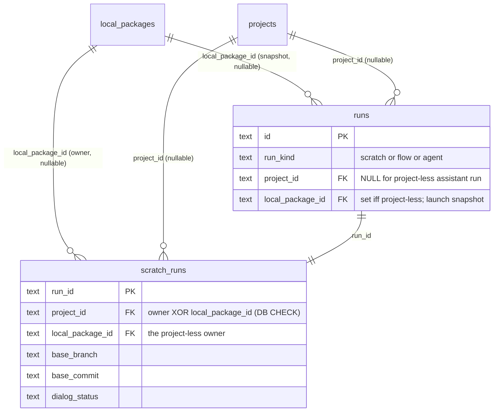
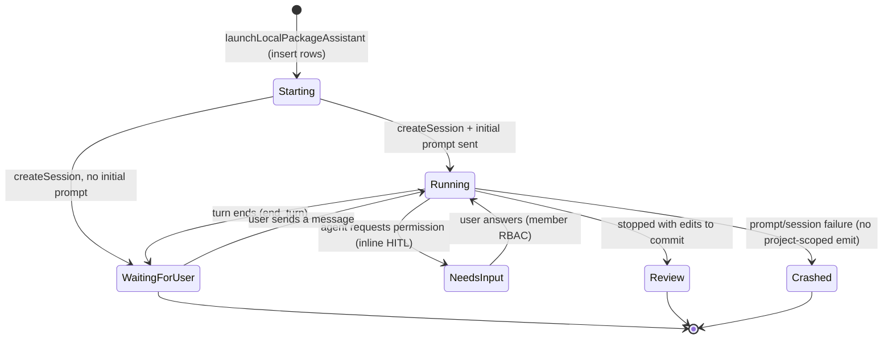
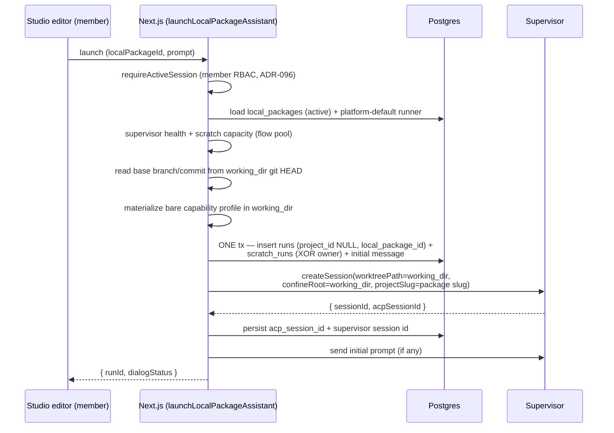

# Docked AI authoring assistant (Flow Studio — M36 Phase 5)

> Behavior SSOT for the **docked AI authoring assistant**: a **project-less
> scratch-run ACP session rooted at a local-package working dir**. It reuses the
> scratch-run substrate end-to-end but has **no project and no managed git
> worktree** — the session's cwd and sole confinement root is the local
> package's `working_dir`. **Status: Implemented (ADR-097) — backend foundation
> + the right-panel Properties⇆AI tab, live refresh, inline HITL, the
> flow-authoring skill, and editor↔assistant lock coordination.** Related:
> [`local-packages.md`](local-packages.md), [`scratch-runs.md`](scratch-runs.md),
> [`runs.md`](runs.md), [`../decisions.md#adr-096`](../decisions.md).

## Purpose

The assistant lets a member, while editing a local package in Flow Studio, hand
authoring work to a coding agent: it edits the working-dir files directly
(`flows/ agents/ skills/ mcps/ rules/ schemas/`), the canvas/files live-refresh,
and permission/HITL prompts stream inline in the chat. It is **one ACP run per
editor tab**, lives while the tab is open, and surfaces its edits through the
same git diff → Commit/Discard the editor already exposes.

The hard constraint it introduces: a local package is platform-scoped — a
package-level fork has `project_id = NULL`; a per-project default fork carries a
`project_id`; the editor opens either. So the assistant run is **project-less**:
it cannot assume a project exists.

## Domain entities

- **Local package** — `local_packages` row (ADR-096). `working_dir` is the
  git-backed directory under `localPackagesRoot()`; server-only, never sent to
  the client. The assistant launches against an `active` package.
- **Assistant run** — a `runs` row with `run_kind = "scratch"`,
  **`project_id = NULL`**, **`local_package_id`** set (the launch snapshot),
  `flow_id`/`task_id`/`flow_revision_id` NULL, `flow_version = "scratch"`,
  `flow_revision = "manual"`. **No `workspaces` row.**
- **Scratch metadata** — a `scratch_runs` row with `project_id = NULL`,
  `local_package_id` set, `base_branch`/`base_commit`/`target_branch` read from
  the working dir's git HEAD, the usual `dialog_status`, supervisor session id,
  prompt/policy fields. The owner XOR is DB-enforced (see Data model).
- **Supervisor session** — a normal ACP session whose `cwd = working_dir` and
  whose content-block file-URI **confinement root is `working_dir`** (passed as
  `confineRoot`).
- **Capability profile** — a `scratch_capability_profiles` row materialized from
  a **bare** profile (no project capability catalog). The launch additionally
  seeds the **`flow-authoring`** skill into the session's per-adapter target
  (`materializeFlowAuthoringSkill`): claude gets `working_dir/.claude/skills/
  flow-authoring/`, codex/gemini/… get the skill in a composed home + the
  redirect env. The skill content is in-memory (`lib/flows/authoring-skill.ts`),
  not read from a bundled asset path.

## Data model (migration 0059, ADR-097)

- `scratch_runs_owner_xor_check`:
  `(project_id IS NOT NULL) <> (local_package_id IS NOT NULL)` — exactly one
  owner, never both, never neither.
- `scratch_runs_project_status_idx` is **partial** (`WHERE project_id IS NOT
  NULL`); `scratch_runs_local_package_idx` is the partial twin
  (`WHERE local_package_id IS NOT NULL`).
- `runs.project_id` nullable lets the project-less run exist; every project-scoped
  consumer narrows it through `requireRunProjectId` (throws `CONFIG` on a null) or
  excludes the run by query construction. See the consumer checklist in
  [`../decisions.md#adr-096`](../decisions.md).

## State machine

The assistant uses the existing scratch `dialog_status` machine unchanged — it
adds no status. A launch with an initial prompt lands `Running`; with no prompt
it lands `WaitingForUser`.

## Process flow — launch

Key launch invariants:
- **No `git worktree add`, no `workspaces` row.** The run executes in the
  existing git-backed working dir.
- **`runs.local_package_id` is written at the single launch insert** and is the
  decisive field every terminal/read path reads.
- **`projectSlug = local package slug`** names the runtime/cost subtree
  (`.maister/<slug>/runs/<runId>`); it is kebab-case + unique by construction
  and is NOT a project reference.
- The runner chain is launch-override → **platform default** (no project-default
  tier, since there is no project).

## Supervisor confinement

A `file:` content-block URI is confined to `confineRoot` (the working dir) ∪ the
run dir (uploads). `confineRoot`, when set, **replaces** the worktree ∪ repo
allow-set used by project runs. A URI outside the working dir — including a path
inside any project repo — is rejected with `PRECONDITION`. The web tier confines
too (defense in depth). Source: `supervisor/src/prompt-confinement.ts`,
`StartSessionRequestSchema.confineRoot`.

## Right-panel AI tab (T5.7)

The editor (`local-package-editor.tsx`) exposes a **Properties ⇆ AI** toggle.
The AI tab (`studio-ai-tab.tsx`):
- launches via `POST /api/studio/local-packages/{id}/assistant` (body
  `{ sessionId, prompt }`) — the route `assertHoldsLock(id, sessionId)` so only
  the working-dir lock holder may spawn it (the run writes **as the holder**);
- once a run exists, renders the shared **`ScratchConversation`** (transcript +
  composer + **inline HITL** permission panel) verbatim — same SSE stream
  (`/api/runs/{runId}/stream`), same `GET /api/scratch-runs/{runId}` detail, same
  `POST /api/runs/{runId}/hitl/{id}/respond`. Secrets never reach the client: the
  reused scratch SSE/detail projections already exclude them;
- subscribes to the run's stream (`useRunStream`, change-tick only) to **live
  refresh** the editor on each assistant event — it bumps the editor's
  `diffRefresh` signal and `router.refresh()`, so the T4 changed-count + git-diff
  drawer and the server-compiled canvas re-read the working dir the assistant
  just wrote;
- while a turn is in flight (`dialog_status = Running/Starting`) it lifts an
  **"AI working"** read-only state into the editor (the human editor stops
  writing until the turn ends — no concurrent web-tier writer).

## Lock coordination + deferred release (T5.6)

- **Run ↔ lock.** The launch route asserts the editor's working-dir lock, tying
  the run to the holder. The assistant's file writes go through the
  supervisor (confined to `working_dir`), NOT the lock-guarded PUT/DELETE file
  routes; the lock's job is to guarantee a single writer — while the assistant
  holds a turn the editor is read-only, so the holder is never racing it.
- **Deferred release.** Every assistant failure path that may have created an
  ACP/HITL permission deferred releases it by tearing down the supervisor
  session (`deleteSession` → supervisor `purgeSession` cancels all open
  deferreds), then marks the run Crashed: the launch turn-failure catch in
  `launchLocalPackageAssistant`, and the non-retryable turn-failure catch in
  `sendScratchUserMessage` (assistant runs only — project scratch runs keep
  their prior behavior). The DB-persist-failure release in the event consumer
  (`persistPermissionRequest` → `cancelPermission`) is unchanged. The
  `EXECUTOR_UNAVAILABLE` retryable path deliberately keeps the session.
- **Turn-path project-less fix.** `loadScratchRows` synthesizes a
  workspace-shaped value from the local package `working_dir` (no `workspaces`
  row) so a turn on the assistant run does not crash.

## Expectations

- Sending a message starts/continues an ACP session whose cwd is the working
  dir; agent file writes land in the working dir and the editor live-refreshes.
- The run carries `project_id = NULL` and `local_package_id` set; the
  `scratch_runs` XOR CHECK guarantees exactly one owner.
- A terminal transition (Crashed/Review/Abandoned) writes the `runs` +
  `scratch_runs` terminal rows but emits **no** project-scoped domain/webhook
  event (there is no project to attribute it to).
- No assistant session can write outside the working dir.

## Concurrency & GC (T5.8)

- **Concurrency pool.** The assistant run is `run_kind = "scratch"`, so it counts
  against the **flow/scratch** concurrency pool — cap
  `MAISTER_MAX_CONCURRENT_RUNS` (default 6), enforced at launch by
  `assertScratchCapacityAvailable`. It does **not** use the separate platform-
  agent budget (`MAISTER_MAX_CONCURRENT_AGENTS`).
- **One ACP run per editor tab.** The run id is held in the AI tab's component
  state for the editor mount's lifetime, so toggling Properties⇆AI never
  relaunches. A **second** browser tab generates a fresh client lock session
  that does **not** hold the working-dir lock, so its launch is refused server-
  side (`assertHoldsLock`) — there is no second assistant for the same holder.
- **No auto-GC of the working dir.** Consistent with the Phase C local-package
  model (ADR-096): a local package's `working_dir` is removed only on explicit
  delete; there is no background GC. The assistant run's rows cascade away when
  the local package is deleted (`local_package_id ON DELETE CASCADE`).

## Edge cases

- **Project-less run reaching a project-scoped path.** It cannot via any
  automatic sweep or project query (excluded by construction); a coding
  regression that routed one there throws `CONFIG` (`requireRunProjectId`)
  rather than NULL-dereferencing.
- **Reconcile.** A project-less run has `project_id = NULL`, so the per-project
  candidate scan never selects it — it is never marked Crashed for a missing
  project worktree (it has none). A live session is `skip`ped; reattach is
  refused for non-flow runs (so the resume-driver never drives it).
- **Diff / change-summary.** The project-scoped run diff + change-summary routes
  return 404 for a project-less run; the assistant's diff is the Studio editor's
  git-working-tree view (Phase 4).
- **Local package deleted.** `runs.local_package_id` / `scratch_runs.
  local_package_id` are `ON DELETE CASCADE`, so deleting a local package removes
  its assistant run history.
- **Lock coordination.** The assistant runs under the editor's working-dir lock
  (the editor is the lock holder; turn-based, so no concurrent writer). The
  launch route asserts the lock; a lost/foreign lock refuses the launch with
  `CONFLICT` (the editor surfaces its reload banner).
- **HITL on a project-less run.** The permission respond path
  (`respondToHitl`) skips the project authz gate when `project_id IS NULL`
  (member RBAC, ADR-096) and skips the project-scoped webhook/domain emits;
  delivery to the supervisor (`deliverPermission`) is unchanged. Form/human HITL
  never occurs on an assistant run (scratch sessions only raise `permission`).

## Sources

- `web/lib/scratch-runs/service.ts` — `launchLocalPackageAssistant`,
  `loadScratchRows` (project-less variant), `sendScratchUserMessage` deferred
  release.
- `web/lib/capabilities/adapter-home.ts` — `materializeFlowAuthoringSkill`;
  `web/lib/flows/authoring-skill.ts` — the skill content.
- `web/components/studio/{local-package-editor,studio-ai-tab}.tsx` — the
  Properties⇆AI tab + the docked assistant.
- `web/app/api/studio/local-packages/[id]/assistant/route.ts` — the lock-gated
  launch route.
- `web/lib/services/hitl.ts` — the project-less HITL respond guards.
