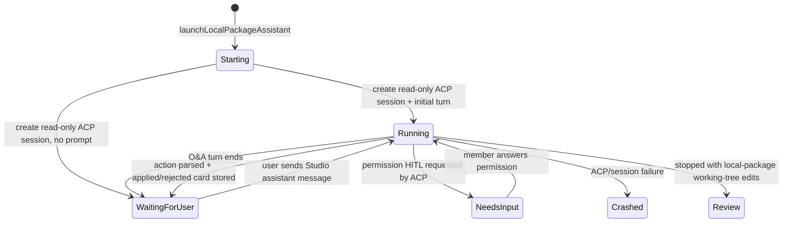
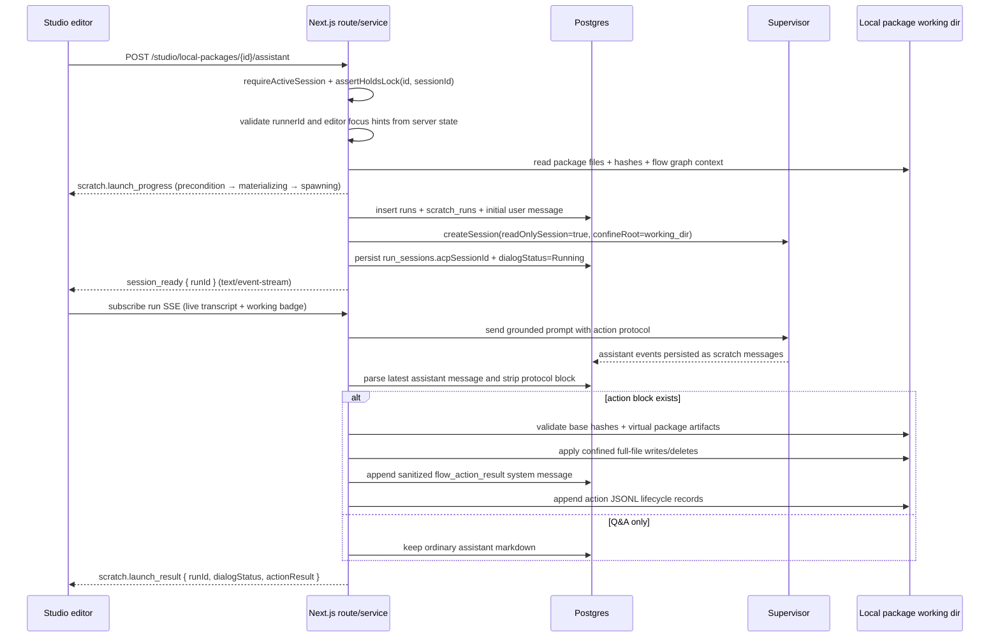

# Flow Studio AI authoring assistant

> Behavior SSOT for the **Flow Studio AI authoring assistant**: a
> project-less scratch-run ACP session rooted at a local-package working dir.
> The assistant is now an authoring copilot with a read-only ACP session plus a
> server-applied structured action protocol. Related:
> [`local-packages.md`](local-packages.md), [`scratch-runs.md`](scratch-runs.md),
> [`runs.md`](runs.md),
> [ADR-097](../decisions.md#adr-097-docked-ai-authoring-assistant--project-less-scratch-at-local-package-run-m36-phase-5),
> [ADR-110](../decisions.md#adr-110-flow-studio-ai-assistant-read-only-acp--structured-server-applied-actions).

## Purpose

The assistant lets a member ask questions about the current local package and
request Flow/package edits without leaving the editor. It runs as one docked
conversation per editor tab, under the same local-package lock as the human
editor.

V1 deliberately splits intelligence from mutation:

- ACP runs are **read-only** (`readOnlySession: true`). Agents may inspect the
  local package and answer questions, but they must not write files directly.
- Edit requests produce a `maister_flow_assistant_action.v1` structured action
  block in the assistant response.
- The web tier parses that block, hides it from the primary transcript,
  validates it against the current working-dir files, and applies it in-place
  only through existing local-package write helpers.
- The local package working tree and the existing git diff drawer are the
  review/revert buffer. Commit/Discard stays the durable accept/revert boundary.

There is no proposal table. Redacted action metadata and apply lifecycle records
live in run-scoped JSONL artifacts under
`.maister/<local-package-slug>/runs/<runId>/`; the database stores only the
normal scratch transcript plus sanitized `flow_action_result` system messages
for reload-stable UI cards.

## Domain entities

- **Local package** - `local_packages` row (ADR-096). `working_dir` is
  server-only. All action paths are relative to that working dir and are
  re-confined before every read/write/delete.
- **Assistant run** - `runs.run_kind = "scratch"`, `project_id = NULL`,
  `local_package_id` set, no `workspaces` row. This remains the ADR-097
  project-less scratch-at-local-package substrate.
- **Scratch metadata** - `scratch_runs` row with `project_id = NULL`,
  `local_package_id` set, the existing dialog state, runner snapshot, and
  supervisor session handles.
- **Read-only supervisor session** - ACP session created with `cwd =
working_dir`, `confineRoot = working_dir`, and `readOnlySession = true`.
- **Flow assistant context snapshot** - server-built prompt context containing
  current package manifest data, selected flow YAML, compiled graph summary,
  validation issues, capability inventory (`skills`, `agents`, `mcps`, `rules`,
  `schemas`), file inventory with hashes, optional editor focus hints, and
  runner summary.
- **Assistant action** - full-file operations (`upsert_file`, `delete_file`)
  with relative paths and base hashes copied from the server-provided context.
- **Action audit log** - append-only JSONL under the run artifact dir. It is
  diagnostic evidence only; the working dir is the source of truth.
- **Action result payload** - sanitized scratch system message kind
  `flow_action_result`, rendered as a friendly status/change card. It never
  contains raw action JSON, absolute paths, or file contents.

## State machine

The assistant uses the existing scratch `dialog_status` machine unchanged. The
structured action lifecycle is internal to a turn and does not add a run status.



## Process flow - launch and follow-up



Follow-up sends use
`POST /api/studio/local-packages/{id}/assistant/{runId}/messages`, not the
generic scratch message route. The route joins `runs.local_package_id = id`,
`scratch_runs.run_id = runId`, and `runs.created_by_user_id = current user`
before it sends anything to the supervisor.

The **heavy** grounding context (editing contract, file inventory, full flow
dump) is sent **only on the launch (first) prompt** — the assistant runs in one
persistent ACP session that retains it in history. Follow-up turns send a slim
grounding: the drift-guarded Flow DSL grammar (kept on every turn so
`consensus`/etc. author correctly) plus a one-line editor-focus hint and the
user's message. Re-sending the whole ~28k-token block on every turn previously
made the model re-anchor on the original framing and repeat its first answer.

Event projection resumes from the highest already-projected supervisor event id
(`Last-Event-ID`), so a follow-up turn does not re-stream and re-persist the
whole session history (which previously duplicated prior thoughts/answers in the
transcript).

### Streaming launch contract (ADR-110 staged-stream addendum, Implemented)

The launch (`POST /studio/local-packages/{id}/assistant`) responds `200
text/event-stream`, reusing the scratch FR-F1/F2 staged-stream pattern
(`launchLocalPackageAssistantStaged` + `readLaunchStream`). It emits
`scratch.launch_progress` frames in order `precondition → materializing →
spawning → session_ready` (no `worktree_created` — the assistant has no managed
worktree), then a terminal `scratch.launch_result` frame wrapping the narrow
`{ runId, dialogStatus, actionResult }`. The route maps the service's
`ScratchRunResponse` down to that shape before framing; the wire schema is
unchanged, only the transport (was `202` JSON).

`session_ready` carries the `runId` **before** the first turn runs — this is
what unblocks the editor's live view: the client sets `runId` on the
`session_ready` frame, so the conversation surface mounts and subscribes to the
run SSE (incremental transcript + working badge) while turn 1 is still
streaming, instead of only after the whole turn completes (the bug this
addendum fixes — the first turn previously sat on "Запускается…" with no output
until it finished).

Pre-stream gate boundary: the cheap sync gates (`requireGlobalRole`, body parse,
`getLocalPackage`, `assertHoldsLock`) and the generator-head service-level
preconditions (runner resolution, supervisor health, capacity) run **before**
the first `precondition` yield, so a gate failure stays a JSON `MaisterErrorBody`
with its HTTP status (`401/403/404/409/422/503`) and never a stream. A failure
**after** the stream opens is an in-stream `data: {"type":"error",…}` frame, and
the existing launch-failure compensation (`deleteScratchSupervisorSessionIfLive`
+ `markScratchCrashed`) tears the session down. A client disconnect after
`session_ready` is one such post-open failure: the request `AbortSignal` is
checked at the turn boundary and forwarded into the supervisor prompt fetch, so
a mid-turn disconnect aborts the in-flight turn and runs the same compensation —
no orphaned session or leaked capacity slot. The follow-up `messages` route is
unchanged.

## Structured action protocol

The model may answer ordinary questions with plain markdown. For edit requests,
it must include exactly one fenced action block:

````markdown
```maister-flow-assistant-action
{
  "schemaVersion": "maister_flow_assistant_action.v1",
  "actionId": "optional-stable-id",
  "summary": "Add a manual approval gate after implementation.",
  "operations": [
    {
      "op": "upsert_file",
      "path": "flows/default/flow.yaml",
      "baseHash": "sha256:...",
      "content": "..."
    }
  ]
}
```
````

Protocol rules:

- `path` is relative to the package root and is treated as model-controlled
  data. It is validated through the same confinement code as manual Studio
  writes. Absolute paths, `..`, NUL bytes, symlinks that escape the working dir,
  and `.git` paths are rejected before writes.
- `baseHash` is the hash supplied in the server context snapshot. Existing-file
  upserts/deletes must match the current file hash. New-file upserts use
  `baseHash: null`.
- Operations are full-file only in V1. Hunk/patch operations are deferred.
- The server applies operations to an in-memory virtual package first and runs
  existing local-package validation. Invalid manifests, Flow YAML, skill/agent
  frontmatter, schema files, or graph compile state fail before writes.
- Malformed JSON or schema-invalid action blocks become an invalid-action result
  card. Raw protocol text is stripped from stored assistant markdown.
- `intent` (`auto`, `ask`, `edit`) is prompt-only in V1. It changes the
  instructions and logs, but it does not suppress structured action parsing or
  apply. Lock ownership plus structured action validation is the apply
  authority.

## User-visible turn outcomes

- **Q&A turn** - no action block. The assistant markdown is shown normally and
  grounded by the current context snapshot.
- **Applied action** - hashes and validation pass, writes/deletes complete, the
  editor refreshes canvas/properties/diff, and a `flow_action_result` card lists
  the summary, status, and touched files.
- **Invalid action** - the action parses but fails schema, path, or virtual
  package validation. No writes occur. The card shows a friendly validation
  summary without raw JSON.
- **Stale action** - one or more base hashes no longer match current server
  files, usually because the user has unsaved or recently saved changes. No
  writes occur. The route responds as a conflict and the card tells the user to
  save/refresh and retry.
- **Malformed action** - the model emitted a protocol-looking block that cannot
  be parsed. No writes occur; the transcript hides the malformed raw block and
  shows an invalid-action card.
- **Interrupted apply** - an unexpected write failure after apply starts. The
  action log records the operation index and status `interrupted`; the working
  tree remains the source of truth and the existing diff drawer is the recovery
  surface.
- **Assistant crash/recover** - supervisor/session failures use the existing
  scratch crash/recover behavior. Recovery does not replay JSONL actions
  automatically; the user can inspect the working-tree diff and continue the
  conversation.

## AI assistant drawer

The assistant lives in a right-hand drawer that shares the editor's single right
slot with the node-properties inspector — the two are **mutually exclusive**:

- an "AI" toolbar toggle (sparkles icon, top-right next to Commit/Publish/End
  edit) opens the drawer; it is only shown once a flow file is open;
- opening the drawer hides the properties inspector; selecting a node in the
  graph closes the drawer and hands the slot back to the inspector. Re-open with
  the toolbar toggle. This keeps the graph canvas at full height instead of
  competing with a docked panel for vertical space;
- both subtrees stay mounted and toggle via `hidden`, so the chat keeps its live
  run + unsent composer text across open/close, and React Flow's inspector
  portal target is never torn down;
- the transcript/composer owns its own scroll region;
- Enter sends the message (chat convention); Shift+Enter inserts a newline,
  Cmd/Ctrl+Enter also sends, and IME-composition Enter does not send. While the
  `/`,`@` capability autocomplete is open, Enter picks the highlighted item;
- a compact runner selector lists enabled Ready platform ACP runners plus the
  platform default;
- follow-up turns post to the Studio assistant route with `sessionId`, `intent`,
  and validated focus hints;
- recover controls are hidden for the drawer assistant until a Studio-specific
  structured recovery route exists;
- action result cards are rendered from sanitized scratch system messages and
  survive `router.refresh()` / page reload;
- the UI blocks assistant sends while editor buffers have unsaved canvas/YAML or
  package-file edits, so server-side apply never races stale files.

## JSONL action audit artifact

Action audit records are appended under:

```text
.maister/<local-package-slug>/runs/<runId>/flow-assistant-actions.jsonl
```

Record kinds:

- `received` - structured action metadata captured after parsing. File contents
  are redacted to content hashes and byte counts.
- `validated` - base hashes and virtual package validation passed.
- `rejected` - stale, invalid, malformed, or path-confined rejection before
  writes.
- `applied` - all operations completed.
- `interrupted` - writes began and an unexpected failure occurred.

The UI never reads this artifact in V1. A future debug-only route may expose a
redacted view, but product rendering must continue to use sanitized
`scratch_messages`.

## Logging boundaries

Server logs are structured and never include prompt text, file contents, raw
action JSON, absolute working dirs, or secrets.

- Launch/send INFO: `localPackageId`, `runId`, `intent`, `runnerId`,
  `readOnlySession: true`.
- Context DEBUG: file count, capability counts, node/edge counts, focus path,
  truncation flags.
- Focus rejection WARN: `localPackageId`, `runId`, rejected hint kind/value.
- Parse DEBUG/INFO/WARN: assistant byte length, action id, operation count, zod
  issue summary.
- Apply INFO: begin/success with `actionId`, `operationCount`, touched paths.
- Reject WARN: status, validation issue count, stale/path-invalid reason.
- Interrupted ERROR/WARN: operation index, relative path, status.
- JSONL WARN: audit append failure after successful apply; user-visible file
  state still wins.

## Deployment and persistence

This feature adds no env vars, sidecars, ports, package dependencies, DB tables,
or migrations. `.env.example`, `compose.yml`, and `compose.production.yml` do
not need changes. Persistence remains:

- `runs`, `scratch_runs`, `scratch_messages` for conversation and UI state;
- local package working dir for the current editable package;
- `.maister/<slug>/runs/<runId>/flow-assistant-actions.jsonl` for server-only
  action audit evidence;
- existing git diff/Commit/Discard as the human review boundary.
