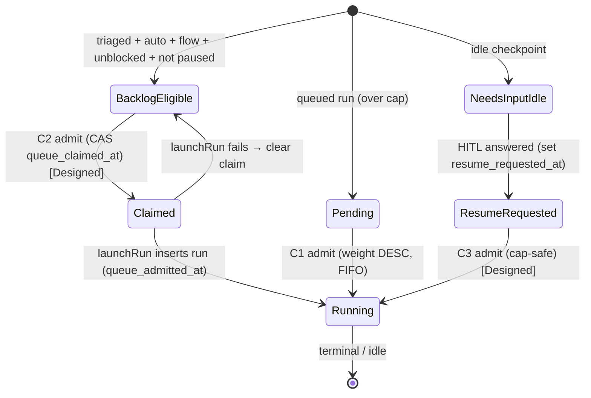
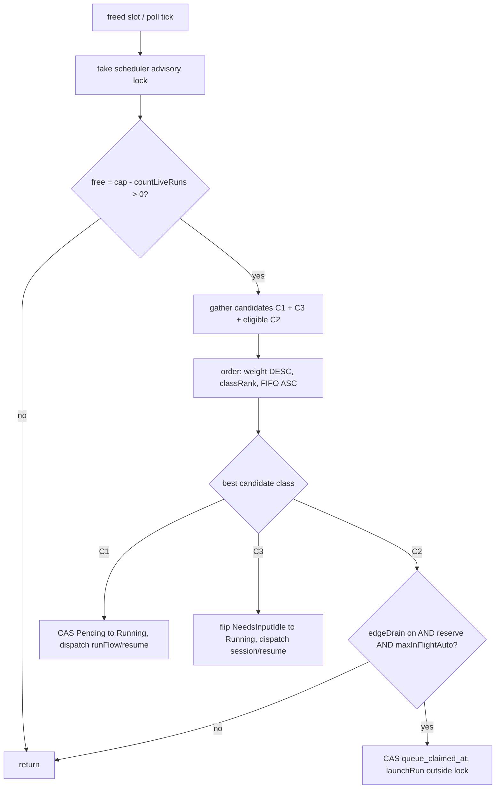

# Task queue (priority-ordered dependency-draining admission)

## Purpose

This domain (**ADR-121**) covers the **activating layer** over the shipped
operator→triager→auto-drain loop (ADR-111/112): cycle-safe relation authoring,
first-class task **priority** backed by a criticality dictionary, a single
**priority-ordered admission funnel** shared by the slot-free scheduler gate and
the 60s poll backstop, **cap-safe resume**, advisory **triage confidence**, and an
operator **pause/dequeue** valve. It does not rebuild the triage/relations/launch
substrate — it orders and bounds admission and closes the resume over-cap bug.

## Domain entities

- **Task priority** (`tasks.priority`, Implemented) — closed set
  `{low, normal, high, urgent}` (default `normal`), the live input to the
  criticality dictionary. Read LIVE at admission, never snapshotted onto a run.
- **Criticality dictionary** (`web/lib/tasks/criticality.ts`, Implemented) — the
  single ordering source, enum→weight `{low:100, normal:200, high:300, urgent:400}`.
- **Triage confidence** (`tasks.triage_confidence` `numeric(4,3)`, Implemented) —
  advisory only, DB-CHECK-bounded to `[0,1]`; Observatory-fed; never a routing input.
- **Queue pause** (`tasks.queue_paused`, Implemented) — operator valve excluding a
  task from auto-admission, auto-resume, and the poll backstop; reversible.
- **Project queue settings** (`projects.task_queue_settings` jsonb, Implemented) —
  `{ edgeDrain?, maxInFlightAuto? }`; NULL ⇒ env defaults.
- **Admission claim** (`tasks.queue_claimed_at`, Implemented column; the slot-free
  CAS claim is **Designed**) — the task-level C2 claim, because `launchRun` is
  worktree-first and no run row exists at claim time.
- **Auto-drain origin** (`runs.queue_admitted_at`, Implemented) — set at the
  run-INSERT for funnel-minted runs; the precise per-project `liveAuto` counter.
- **Resume request** (`runs.resume_requested_at`, Implemented column; the resume
  re-routing through the gate is **Designed**) — the C3 FIFO key.

See ERDs: [`db/runs-domain.md`](../db/runs-domain.md),
[`db/projects-domain.md`](../db/projects-domain.md), and the consolidated
[`db/erd.md`](../db/erd.md). Decision: [ADR-121](../decisions.md#adr-121-priority-ordered-dependency-draining-task-queue-unified-admission-gate).

## State machine

The admission state of one eligible unit of work (Implemented for C1/C2-via-poll;
the slot-free C2 claim transition and C3 resume re-routing are **Designed**):

## Process flows

The unified admission funnel on a freed slot. The C1 (Pending promote) path and the
poll-backstop C2 path are Implemented; the slot-free C2 mint and the C3 resume
re-route are **Designed** (the 60s poll is the current C2 driver):

## Expectations

- A pool's live count NEVER exceeds `capForPool(pool)`, including under a resume
  burst (INV-1; the resume re-route that closes the D2 bypass is **Designed**).
- A blocked task (`getOpenRelationBlockers` ≠ ∅) is NEVER admitted; priority is a
  tiebreak WITHIN eligibility, never an override of a blocker or the cap (INV-2).
- Admission ordering uses ONLY the criticality dictionary
  (`weightOf`) as the primary key — no module computes an ad-hoc weight (INV-4).
- `triage_confidence` is NEVER read by any admission/launch/scheduler/routing path;
  it is read only by the read-only Observatory surface (INV-5).
- A gating-kind (`blocks|depends_on|requires`) relation graph is acyclic at all
  times — a cycle-closing write is refused with `MaisterError("CONFLICT")` inside
  the insert transaction (INV-6).
- `edgeDrain` disabled turns OFF only the C2 fresh-Backlog-task source; C1 (Pending
  promote) and C3 (resume) still flow cap-safe and priority-ordered (INV-7).
- Auto-drain's aggregate flow-pool footprint NEVER exceeds `flowCap − reserve`
  (`MAISTER_TASK_QUEUE_AUTO_RESERVE`), keeping headroom for scratch/manual/resume
  (INV-8).
- Per-project live auto-drained flow runs (counted off `runs.queue_admitted_at`,
  excluding manual/scratch/ADR-119 force-relaunch runs) NEVER exceed
  `maxInFlightAuto` when set (INV-9).
- A `queue_paused` task is NEVER admitted (C2), NEVER auto-resumed (C3), and NEVER
  picked by the 60s poll backstop, until unpaused; pause/unpause preserve all task
  config — flow, runner, priority, relations (INV-10).
- Priority is read LIVE at selection from `tasks.priority` (never snapshotted onto a
  run), so a re-prioritization takes effect for not-yet-admitted work.
- Exactly-once admission per eligible unit across {edge, poll, direct launch,
  resume} via the task-level claim (INV-3, **Designed** for the slot-free path; the
  poll backstop is a budget-1 singleton today).

## Edge cases

- Relation write closes a gating cycle → `MaisterError("CONFLICT")` (HTTP 409),
  evaluated under a per-project advisory lock (no TOCTOU).
- Out-of-set priority / out-of-range confidence on a write → `MaisterError("CONFIG")`
  (HTTP 422); the DB CHECK is the final backstop.
- `launchRun` failure after a C2 claim → clear `queue_claimed_at`, task re-eligible
  next tick; a repeatedly-failing flow is given up (`flagged`) by the existing
  ADR-112 cap (**Designed** for the slot-free claim; the poll path already gives up).
- A just-answered low-criticality resume can be starved by higher-criticality fresh
  tasks (accepted v1; priority aging is future — NG5).

## Linked artifacts

- ADR: [ADR-121](../decisions.md#adr-121-priority-ordered-dependency-draining-task-queue-unified-admission-gate)
- Code: `web/lib/tasks/{criticality,admission-selector,queue-fields,queue-settings}.ts`,
  `web/lib/scheduler.ts`, `web/lib/scheduler/handlers/auto-launch-triaged.ts`,
  `web/lib/social/relations.ts`, `web/lib/queries/observatory-confidence.ts`.
- Related domains: [`scheduler.md`](scheduler.md), [`tasks.md`](tasks.md),
  [`triage.md`](triage.md), [`social-board.md`](social-board.md),
  [`hitl.md`](hitl.md), [`runs.md`](runs.md), [`observatory.md`](observatory.md).
- Config: [`../configuration.md`](../configuration.md) (env vars);
  [`../error-taxonomy.md`](../error-taxonomy.md) (CONFLICT relation-cycle).
- API: [`../api/web.openapi.yaml`](../api/web.openapi.yaml),
  [`../api/external/operations.openapi.yaml`](../api/external/operations.openapi.yaml).
