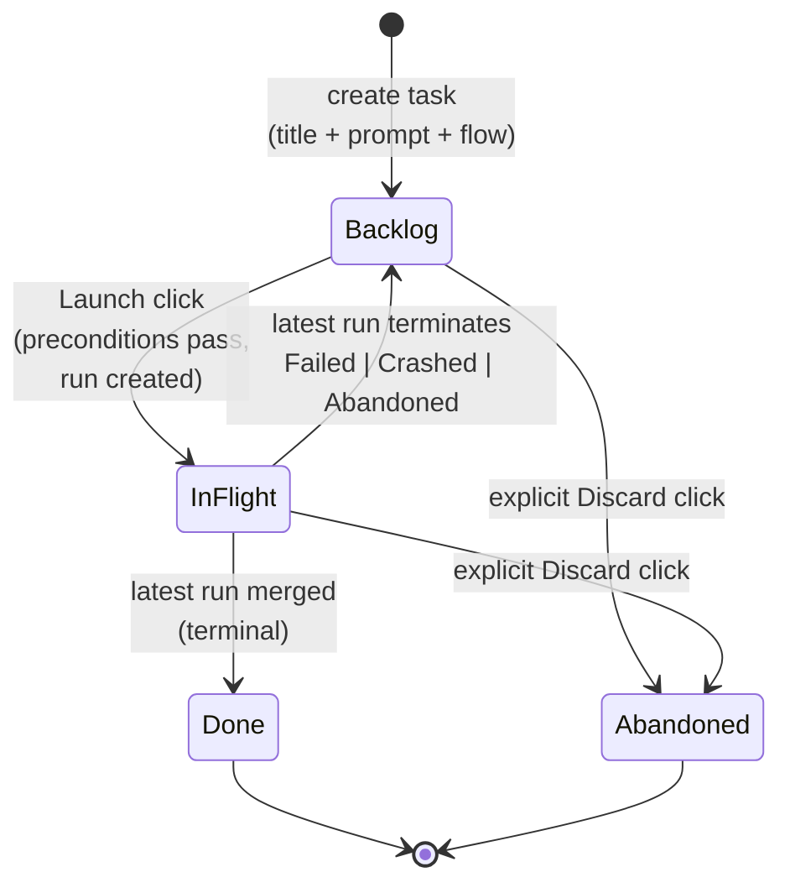
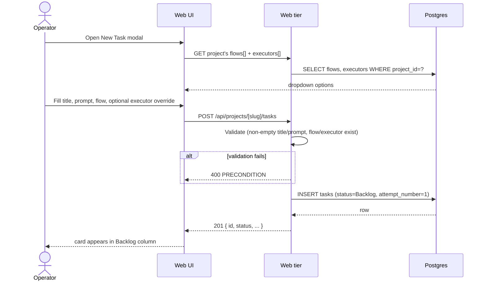
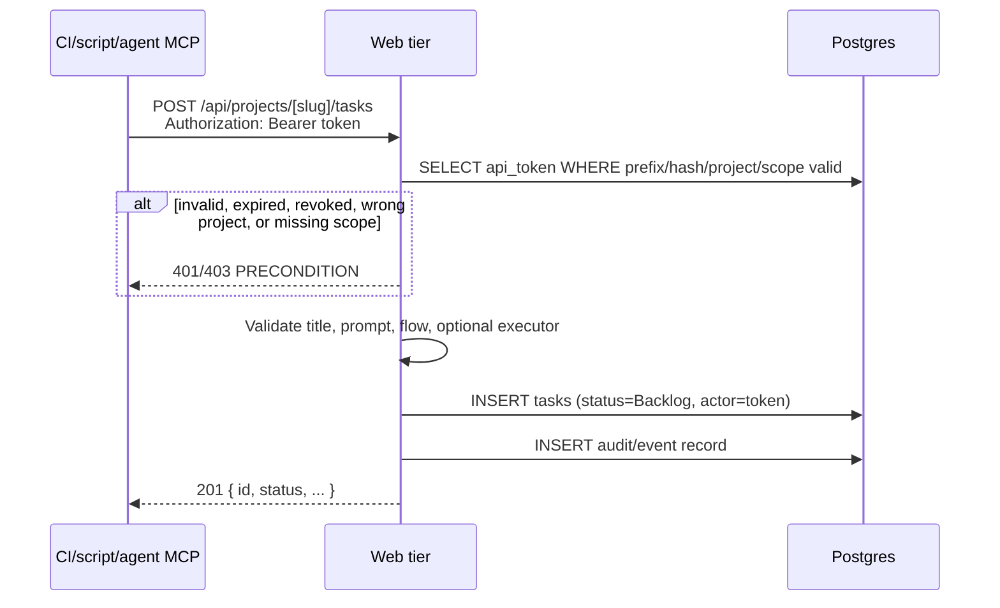
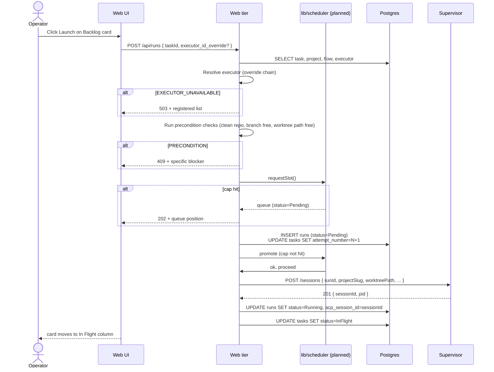
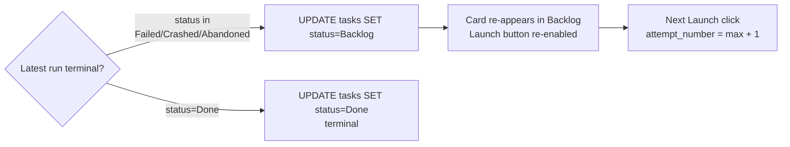
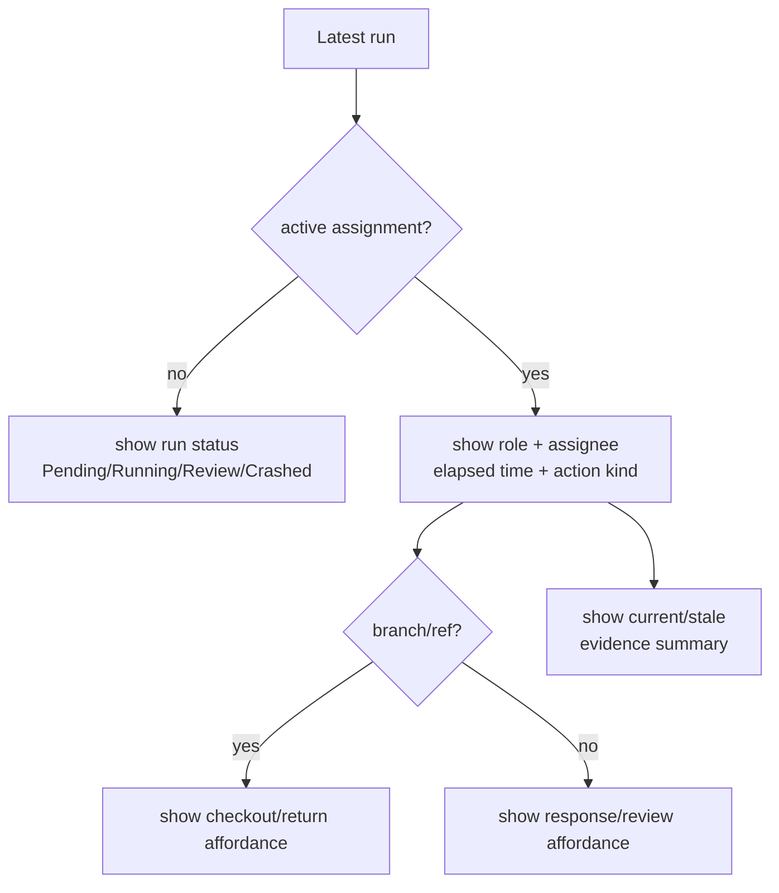

# Tasks domain

## Purpose

A **task** is the operator's unit of intent — one card on a project's
board with a title, prompt, and Flow assignment. Tasks have a simple
board state (`Backlog | InFlight | Done | Abandoned`) and a **1:N**
relationship to runs ([ADR-018](../decisions.md#adr-018-task--run-cardinality-is-1n)).

## Domain entities

- **Task** — board card. Persisted as `tasks` row.
- **Run** — execution attempt. See [`runs.md`](runs.md).
- **Assignment** — claimable human work item attached to the latest run,
  planned for role-owned waits such as permission, form, review, manual
  takeover, and conflict resolution.
- **External operation** — planned token-authenticated API or MCP action that
  can create/read/update tasks, launch runs, or report evidence without using
  the web UI.
- **Attempt number** — monotonic counter per task, starting at 1. Current code
  stores it as a **mutable high-water mark** on `tasks.attempt_number`
  bumped inside the Launch transaction; there is no DB-level guarantee
  that a given attempt was actually persisted on a run. The
  `tasks_id_attempt_uq` UNIQUE on `(tasks.id, attempt_number)` is
  vacuous (PK already enforces unique `id`) and provides no
  per-attempt guard. The designed run-attempt schema moves the stamp onto
  `runs.attempt_number` with a real UNIQUE `(task_id, attempt_number)`
  so every run row is immutably tagged and duplicates are rejected at
  the DB.

## State machine — board axis

Notes:

- The InFlight bucket contains runs in any of `Pending | Running |
NeedsInput | NeedsInputIdle | HumanWorking | Review | Crashed`.
- Planned assignment-aware board cards show the latest active assignment:
  role, assignee or unclaimed state, elapsed time, action kind, branch/ref when
  relevant, and stale-evidence summary.
- "Latest run" on the card today is `runs ORDER BY started_at DESC
LIMIT 1 WHERE task_id = ?`. Once `runs.attempt_number`
  lands this becomes `MAX(attempt_number) WHERE task_id = ?`.
- Auto-return to `Backlog` on `Failed | Crashed | Abandoned` enables
  ralph-loop retry without recreating the task.

## Process flows

### Create a task (Designed)

### Create a task from external operations (Planned M16)

### Launch a task — retry loop (Implemented launch, UI designed)

### Failure auto-return to Backlog

### Assignment-aware board card (Planned)

## Expectations

- Task ↔ Run cardinality is 1:N; a task can spawn many runs over its
  lifetime via the retry loop.
- Current code: per-task attempt counter lives on `tasks.attempt_number` as a
  mutable high-water mark, monotonic starting at 1, bumped by the
  Launch transaction. The DB has **no** per-attempt uniqueness guard
  (`tasks_id_attempt_uq` is vacuous because `tasks.id` is the PK);
  `runs` rows carry no attempt stamp at all, so duplicate or missing
  attempts are not detectable from a single table.
- **(Designed)** `runs.attempt_number` becomes the immutable
  per-attempt stamp, monotonic per `task_id` starting at 1, with the
  real DB-enforced UNIQUE `(task_id, attempt_number)` on `runs`.
- "Latest run" displayed on a card is the row with `MAX(started_at)`
  for the `task_id`. Designed run-attempt schema switches to
  `MAX(attempt_number) WHERE task_id = ?` on `runs`.
- Board state is exactly `Backlog | InFlight | Done | Abandoned`.
- `InFlight` is a derived bucket; it contains tasks whose latest run is
  in `Pending | Running | NeedsInput | NeedsInputIdle | HumanWorking |
  Review | Crashed`.
- **(Planned)** Human-owned waits create assignments. The latest active
  assignment is rendered directly on the task card and in the portfolio inbox;
  the card must make clear that the task is waiting on a role/person, not just
  "running".
- **(Planned)** Roles are routing labels and audit context, not permission
  boundaries. Any project teammate can claim, respond, return, or merge in the
  current target; MAIster records who acted without blocking on role mismatch.
- **(Planned)** Assignment statuses are
  `Open | Claimed | Working | Returned | Responded | Cancelled | Superseded`.
  Only `Open | Claimed | Working` appear as actionable inbox items.
- **(Planned)** Manual takeover assignments include branch/ref, checkout
  affordance, return action, elapsed time, and stale-evidence summary.
- Latest run terminates in `Failed | Crashed | Abandoned` → task auto-
  returns to `Backlog` and Launch button re-appears.
- `Done` is terminal for the task; Done tasks NEVER return to `Backlog`.
- Title and prompt are non-empty at creation.
- **(Planned M16)** External task creation uses the same validation as the UI
  and records the API token or MCP actor as the creator/audit subject.
- **(Planned M16)** The thin MCP facade can create/list/get/update tasks only
  through the same domain path as the API; it cannot bypass token scopes,
  assignment rules, or run launch preconditions.
- Launch runs precondition checks (clean repo, branch free, worktree
  path free, executor registered) BEFORE inserting the `runs` row.
- Global concurrency cap exceeded on Launch → run inserted as
  `Pending`, UI shows queue position; this is NOT an error.
- Discarding a task with a live run MUST terminate the supervisor
  session (`DELETE /sessions/<id>`) before the task transition; failure
  to terminate does NOT block the transition (reconciliation cleans up).

## Edge cases

- **Empty title or prompt** → `PRECONDITION` (400).
- **`flow_id` not registered for this project** → `PRECONDITION`.
- **`executor_override_id` not registered** → `EXECUTOR_UNAVAILABLE`
  (503).
- **Dirty parent repo on Launch** → `PRECONDITION` ("commit or stash
  changes in `{repo_path}`").
- **Branch name `<branch_prefix><task_slug>` already exists** →
  `PRECONDITION` ("branch exists; abandon prior run or pick a different
  name").
- **Worktree path collision** → `PRECONDITION`.
- **Global concurrency cap hit** → run created as `Pending`, UI shows
  queue position. Not an error.
- **Discard a task that has a live run** — supervisor `DELETE
/sessions/<id>`, then mark worktree stale, then `tasks.status =
Abandoned`. Failure to terminate the session does NOT block the task
transition (the run reconciles to `Crashed` on next heartbeat tick).

## Linked artifacts

- ADRs: [ADR-018 Task ↔ Run 1:N](../decisions.md#adr-018-task--run-cardinality-is-1n).
- ERD: [`../db/runs-domain.md`](../db/runs-domain.md) (tasks + runs tables).
- Related domains: [`runs.md`](runs.md), [`workspaces.md`](workspaces.md),
  [`executors.md`](executors.md).
- Source: `web/lib/db/schema.ts` (tasks + runs tables).
