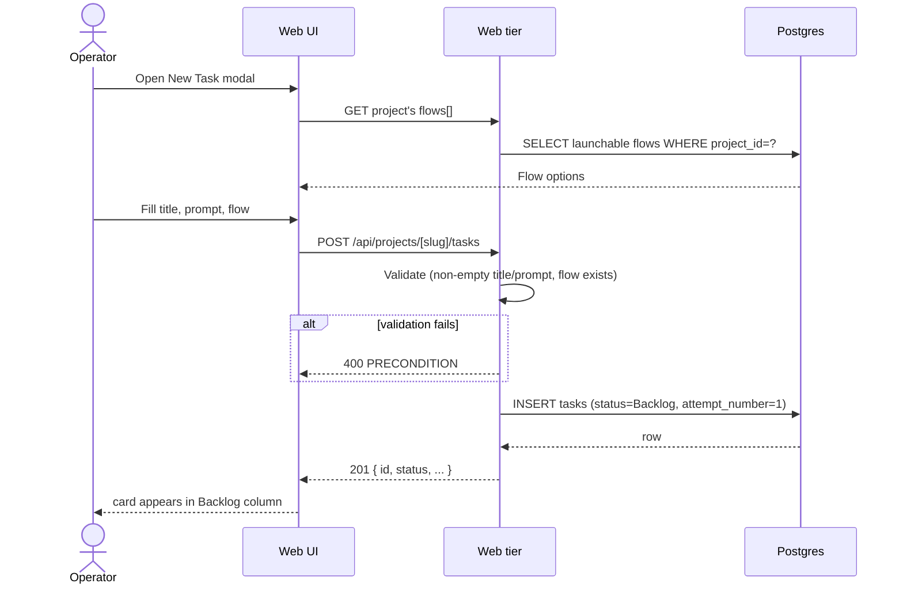
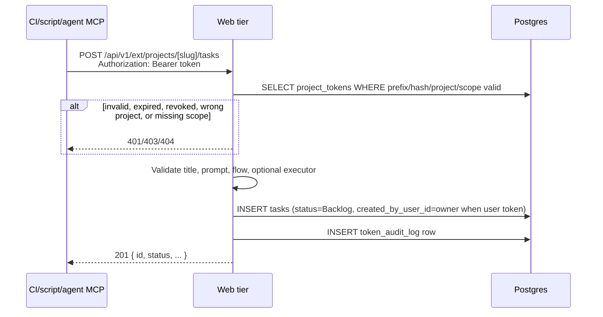
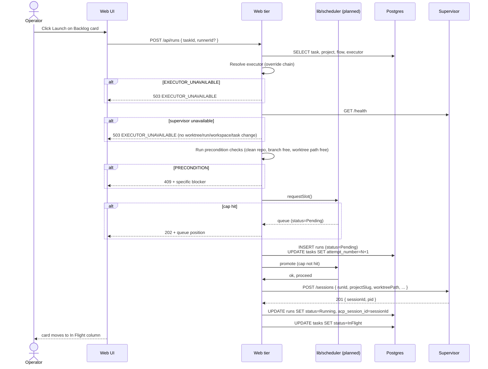
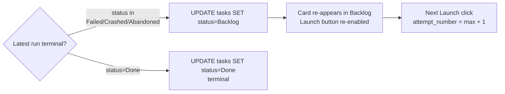
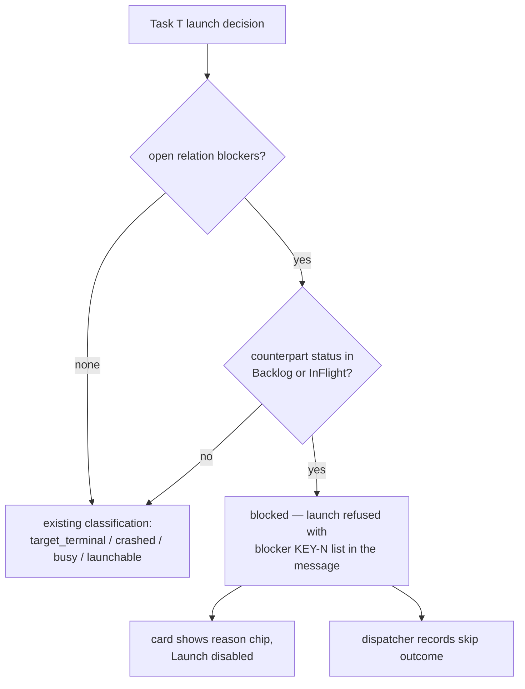
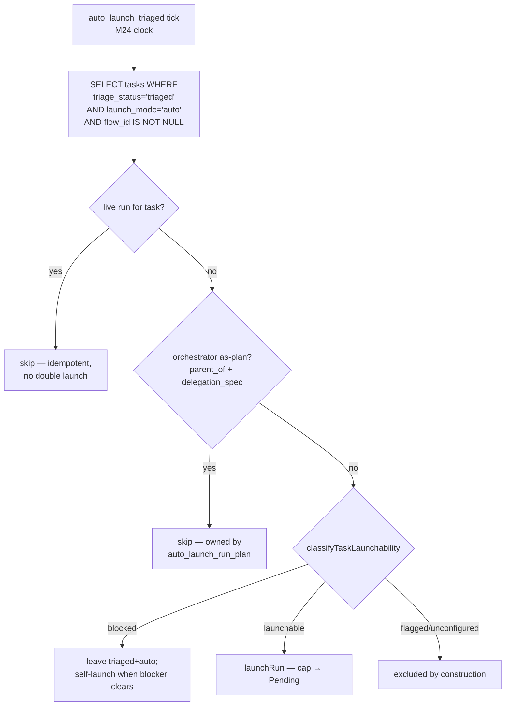
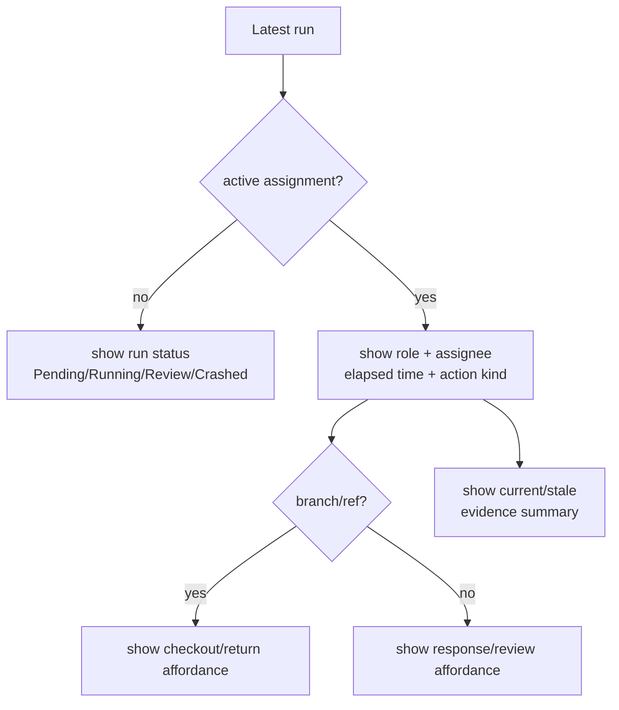

# Tasks domain

## Purpose

A **task** is the operator's unit of intent — one card on a project's
board with a title, prompt, and Flow assignment. Tasks have a simple
board state (`Backlog | InFlight | Done | Abandoned`) and a **1:N**
relationship to runs ([ADR-018](../decisions.md#adr-018-task--run-cardinality-is-1n)).
With ADR-078 (Designed) every task additionally carries a stable
human-readable identity `KEY-N` (`projects.task_key` + `tasks.number`) and
may participate in typed inter-task relations that gate launching; the
comment/activity/subscription/inbox substrate around tasks is owned by
[`social-board.md`](social-board.md).

## Domain entities

- **Task** — board card. Persisted as `tasks` row.
- **Run** — execution attempt. See [`runs.md`](runs.md).
- **Assignment** — claimable human work item attached to the latest run,
  planned for role-owned waits such as permission, form, review, manual
  takeover, and conflict resolution.
- **External operation** — implemented token-authenticated API or MCP action that
  can create/read/update tasks, launch runs, or report evidence without using
  the web UI.
- **Attempt number** — monotonic counter per task, starting at 1. Current code
  stores it as a **mutable high-water mark** on `tasks.attempt_number`
  bumped inside the Launch transaction; there is no DB-level guarantee
  that a given attempt was actually persisted on a run. The
  `tasks_id_attempt_uq` UNIQUE on `(tasks.id, attempt_number)` is
  vacuous (PK already enforces unique `id`) and provides no
  per-attempt guard. The designed run-attempt schema moves the stamp onto
  `runs.attempt_number` with a real UNIQUE `(task_id, attempt_number)`
  so every run row is immutably tagged and duplicates are rejected at
  the DB.
- **Task key** (Implemented, ADR-078) — `projects.task_key`: platform-wide
  unique, matches `^[A-Z][A-Z0-9]{1,9}$`, set at registration (optional
  explicit `taskKey` or derived from the project name; collision →
  `CONFLICT`), immutable in Stage 1 (comment bodies store expanded `KEY-N`
  links). Migration backfill auto-uniquifies deterministically.
- **Task number** (Implemented, ADR-078) — `tasks.number`: per-project
  monotonic integer allocated from `projects.next_task_number` inside the
  `createTask` transaction (`UPDATE … RETURNING`; the projects-row lock
  serializes concurrent creates), backstopped by
  `UNIQUE(project_id, number)`. Numbers are never reused — deletion leaves
  a hole. `KEY-N` = `task_key` + `-` + `number`.
- **Relation** (Implemented, ADR-078) — `task_relations` row: canonical
  one-direction `(from_task_id, kind, to_task_id)` with
  `kind ∈ {blocks, depends_on, parent_of}`,
  `UNIQUE(from_task_id, kind, to_task_id)`, no self-relations,
  same-project only in Stage 1 (`CONFIG` on violation). Inverse labels
  ("blocked by", "required by", "child of") are render-time only.
- **Launch verdict** (M34 — Implemented, ADR-089) — `tasks.flow_id` becomes
  NULLABLE (simple-intent creation: title + prompt suffice on both the web
  form and ext/MCP `task_create`) plus four verdict columns the triager or a
  human fills: `runner_id` (FK SET NULL — board Launch passes it as the
  `launchOverride` tier), `target_branch`, `promotion_mode`
  (`local_merge|pull_request`), and `triage_status` (`'triaged'` | `'flagged'` | NULL =
  untriaged; stamped by the ext triage op, cleared by "Send to triage").
  **(ADR-112 — Implemented)** the triager's `flag` op writes `'flagged'` (a
  duplicate, or unroutable in `triage_only` intake) — a **launch-held**
  state cleared by a human (remove the `duplicate_of` relation / re-send to
  triage); see [`triage.md`](triage.md).
  Flowless tasks classify as **`unconfigured`** (not launchable); the
  board card's launch popover collects and persists the missing fields via
  `PATCH /api/projects/{slug}/tasks/{number}` (one aggregating endpoint,
  explicit `null` clears a field) before launching.

## State machine — board axis

```mermaid
stateDiagram-v2
    [*] --> Backlog: create task<br/>(title + prompt; flow optional — M34)
    Backlog --> InFlight: Launch click<br/>(preconditions pass,<br/>run created)
    InFlight --> Backlog: latest run terminates<br/>Failed | Crashed | Abandoned
    InFlight --> Done: latest run merged<br/>(terminal)
    Backlog --> Abandoned: explicit Discard click
    InFlight --> Abandoned: explicit Discard click
    Done --> [*]
    Abandoned --> [*]
```



Notes:

- The InFlight bucket contains runs in any of `Pending | Running |
NeedsInput | NeedsInputIdle | HumanWorking | Review | Crashed`.
- Planned assignment-aware board cards show the latest active assignment:
  role, assignee or unclaimed state, elapsed time, action kind, branch/ref when
  relevant, and stale-evidence summary.
- **(Implemented)** The in-flight flight card is **identity-first and compact**:
  row 1 is `KEY-N` (linking to the task page) + task title + time + flow chip +
  agent; row 2 (non-done) is a slim progress spine + current node label. The
  worktree branch and the inline HITL form are **not** on the card — a `needs`
  card shows a needs-attention badge and the response is given on the run page
  (diff visible) or in the HITL Inbox. Click-anywhere opens the run via a
  stretched-link overlay; the `KEY-N` link and lifecycle/launch buttons stay
  independently clickable above it.
- "Latest run" on the card today is `runs ORDER BY started_at DESC
LIMIT 1 WHERE task_id = ?`. Once `runs.attempt_number`
  lands this becomes `MAX(attempt_number) WHERE task_id = ?`.
- Auto-return to `Backlog` on `Failed | Crashed | Abandoned` enables
  ralph-loop retry without recreating the task.

## Process flows

### Create a task (Designed)



### Create a task from external operations (M16 — Implemented)



### Launch a task — retry loop (Implemented launch, UI designed)



### Failure auto-return to Backlog



### Launch progress streaming (Implemented, FR-F1/F2, T6.3)

`POST /api/runs` is content-negotiated. A board client sending
`Accept: text/event-stream` receives staged progress on the response
(`precondition → worktree_created → materializing(<adapter>)` — flow launch has
no synchronous session spawn, so the `spawning`/`session_ready` stages are
scratch-only) then a terminal `scratch.launch_result` frame, and the Launch
button shows a live stage label. Every other caller (programmatic, the
run-schedules dispatcher) gets the unchanged JSON 202. Preconditions throw
before the stream opens → JSON error with the HTTP status; cancelling mid-launch
(client disconnect) GCs the worktree pre-commit. The streaming seam is shared
with scratch — see [`scratch-runs.md`](scratch-runs.md) and `web.openapi.yaml`.

### Relations gate launching (Implemented, ADR-078)

`classifyTaskLaunchability` gains optional relation context and a
`"blocked"` classification with precedence
`target_terminal > crashed > busy > blocked > launchable` — relations gate
*launching* only, they never mask an active run's state. (M34 — Implemented,
ADR-089) a flowless task adds the `"unconfigured"` classification between
`blocked` and `launchable` (`… > blocked > unconfigured > launchable`):
launch is refused with `PRECONDITION` at every entry point, the schedules
dispatcher records `skipped_unconfigured`, ext `run_launch` returns 409, and
the board card swaps Launch for the popover that collects the missing
fields. **(ADR-112 — Implemented)** a `flagged` task (the triager bailed on a
duplicate or an unroutable `triage_only` intake — see [`triage.md`](triage.md))
adds the `"flagged"` classification between `busy` and `blocked`, so the full
precedence is
`target_terminal > crashed > busy > flagged > blocked > unconfigured > launchable`.
`flagged` is non-launchable **even when `flow_id` is set** (a human could set
a flow on a flagged duplicate — it stays held); it is gated as an allow-list
arm in BOTH `classifyTaskLaunchability` and `classifyManualTaskLaunchability`,
reached via the triage `flag` op and cleared by a human (remove `duplicate_of`
/ re-send to triage). The board shows a "needs review" chip. Every consumer
threads the context: `launchRun` (single choke point for internal AND ext
launches), the run-schedules dispatcher (skip with reason —
[`run-schedules.md`](run-schedules.md)), and the board/portfolio read
models (launch disabled + blocker chips on the card).



Blocking predicate: task T is blocked iff there exists a relation
`(X blocks T)` or `(T depends_on Y)` whose counterpart task status is in
{`Backlog`, `InFlight`} — `Done` AND `Abandoned` both release, so a
discarded blocker cannot deadlock its dependents. `parent_of` never gates.
No cycle detection: a mutual block makes both tasks unlaunchable until one
relation is removed; the UI always renders blockers as removable chips.

### Auto-launch of triaged tasks (Implemented, ADR-112)

The triager never launches a run itself; it sets the enqueue *intent*
(`tasks.launch_mode = 'auto'`), and a system-authority sweep job
(`auto_launch_triaged`) on the M24 polymorphic scheduler clock performs the
launch through the standard `launchRun` choke point. Each tick finds and
launches every candidate that is `triaged` + `launch_mode = 'auto'` + has a
`flow_id` + classifies `launchable` (no live run, not an orchestrator
as-plan task); a full cap sends the run to `Pending` exactly like a manual
launch. Because the tick reuses `classifyTaskLaunchability` +
`getOpenRelationBlockers`, a dependency-blocked candidate stays
`triaged + blocked` and **self-launches on a later tick once the blocker
clears** — "wait in queue for predecessors, then fly" with no extra wiring.
The predicate is **disjoint** from the orchestrator's `auto_launch_run_plan`
(which requires `parent_of`-under-orchestrator + `delegation_spec.agentId`
and launches *agent* runs, see [`orchestrator.md`](orchestrator.md)), so the
two never collide. See [`triage.md`](triage.md) for the full intent → tick →
dependency-release → give-up state machine.



### Manual launchability v2 and "Run again" surfaces (Designed, ADR-085)

Manual launchability is an operator-facing intent, separate from scheduled
dispatch. The manual classifier returns:

| Task/latest-run condition | Manual result | Required UI surface |
| --- | --- | --- |
| Latest run or task is `Done` | `launchable` | Task card and task page show `Run again`. |
| Latest run is `Review` | `launchable` | Task card and task page show `Run again`; existing promote controls remain on the run detail. |
| Latest run is `Failed` or `Abandoned` | `launchable` | Existing retry behavior plus launch dialog. |
| Latest run is `Crashed` | `launchable` | `Run again` is allowed; recover/discard controls for the crashed run stay visible on the run surface. |
| Latest run is `Pending`, `Running`, `NeedsInput`, `NeedsInputIdle`, or `HumanWorking` | `busy` | The action is disabled with a visible tooltip/reason, never hidden. |
| Task is `flagged` and no busy state wins **(ADR-112 — Implemented)** | `flagged` | Disabled action plus a "needs review" chip; held even when `flow_id` is set; cleared by a human (remove `duplicate_of` / re-send to triage). |
| Open relation blocker exists and no busy/flagged state wins | `blocked` | Disabled action plus blocker `KEY-N` chips. |
| Supervisor or runner readiness is unavailable | `executor_unavailable` | Disabled or failed launch state with `EXECUTOR_UNAVAILABLE`; no worktree/run/workspace/task side effect. |

Launching a terminal or review task reopens the board task to `InFlight` only
after `launchRun` has passed auth, flow, runner, branch, readiness, relation,
and worktree preconditions. Historical runs, workspaces, promotion artifacts,
and the prior run detail remain immutable and linkable. Done and Abandoned are
therefore no longer "cannot ever launch again" for the manual UI; they are
"not part of the automatic Backlog retry loop".

The launch dialog is the single manual surface for overrides:

- Flow selector defaults to the task's Flow and lists every project Flow, but
  only Flows with a launchable enablement state (`Enabled` or
  `UpdateAvailable`), an enabled revision, installed package state, completed
  setup, supported schema, and compatible engine bounds are selectable. Every
  disabled option carries `disabledReason` (`no_revision`, `not_enabled`,
  setup/schema/compat issue) so cards and task pages can explain why the Flow
  cannot be chosen for launch.
- Runner/model selector displays the resolved runner plus ADR-076 model
  application metadata.
- Base and target branch fields default from project/workspace policy and
  validate against server-derived branch lists.
- Delivery-policy editor is prefilled from the project default.
- Execution-policy controls expose preset, checks, human-gate, promotion, and
  budget ceilings. Empty budget inputs mean unlimited.
- Every value that differs from the default renders an override marker.
- The summary line names the branch that will be created and the base commit
  branch it forks from.

Task history on `/projects/[slug]/tasks/[number]` shows all attempts in a
view-only table: attempt/run link, Flow, runner/model, outcome, delivery status,
duration, and token total. Empty state says the task has no runs yet. Error
states render typed `MaisterError.code` copy. Every string exists in EN and RU.

Board cards keep latest-run semantics, but also show a run-count badge when the
task has more than one run so repeated attempts are recognizable without opening
the task page.

### Force-relaunch from the runs-history view (Implemented, ADR-119)

The manual classifier above blocks a new launch while any prior run is active
(`busy`). The runs-history header on `/projects/[slug]/tasks/[number]` adds a
**second** launch button — to the right of the runs-count chip — that uses a
**force-relaunch** classifier so an operator can start another run *alongside* a
still-running one (additive concurrency, ralph-loop). The existing page-header
launch button keeps the manual gate.

`classifyForceRelaunchLaunchability(task, latestRun, relationGate)` mirrors
`classifyManualTaskLaunchability`'s signature (no `flow_id` ⇒ no `unconfigured`
arm) and reuses its `flagged`/`blocked` predicates, but **never** returns the
`busy` run-status verdict — run status is deliberately not consulted. Force-mode
precedence, highest refusal first:

```
flagged   (task.triage_status === "flagged")
> blocked (any open blocking relation)
> launchable
```

`unconfigured` is unreachable from this entry point (the button only renders once
the task has ≥1 run, so it is already configured). The allow-list (only
`flagged`/`blocked` refuse) is the documented contract — a future `RunStatus`
must not silently change force behaviour.

Wire-up:
- `POST /api/runs` accepts `allowConcurrent` (boolean, default `false`). When
  `true`, `launchRunStaged` selects `classifyForceRelaunchLaunchability`;
  otherwise `classifyManualTaskLaunchability`. The throw-on-not-launchable
  behaviour is unchanged — a `blocked`/`flagged` task with
  `allowConcurrent:true` still gets `PRECONDITION`. The flag is gated behind the
  same `requireProjectAction(projectId,"launchRun")`; it widens only the
  run-status gate, never the task gates.
- `GET /api/runs/launch-options` returns an additive
  `relaunch: { launchable, reason }` (force verdict) next to the unchanged
  `launchability` (manual). One fetch serves both buttons; existing callers
  ignore the new field.

Extras beyond the global cap (`MAISTER_MAX_CONCURRENT_RUNS`) queue `Pending` with
a `queuePosition` via the existing scheduler. The running attempt is never
cancelled or superseded. A force-relaunch reuses `launchRun`, so it records the
same `run_launched` `task_activity` (ADR-078) and `inbox_items` fan-out — per
launch, even while the task is already `InFlight`; no new activity/event kind and
no `domain_events` outbox row. **Scheduled / auto-launch / run-schedule paths and
the board flight-card keep the `busy` gate** (they never set `allowConcurrent`),
so no automatic path fans out concurrent runs.

The runs-history table renders **at most the 10 newest runs** (no per-task run
cap; hundreds are allowed, full pagination is Phase 2). The count chip and the
token-total aggregates are computed over **all** runs via SQL aggregates, so the
display cap never makes the chip lie.

### Phase B UI and test ownership (Designed, ADR-085)

| User story | UI surface(s) | Acceptance and states | Test owner |
| --- | --- | --- | --- |
| Rerun a terminal or review task | Task card, task page `/projects/[slug]/tasks/[number]` | Run again is visible for `Done`, `Review`, `Failed`, `Abandoned`, and `Crashed`; click opens the launch dialog; success reopens task to `InFlight`; EN/RU labels exist. | `web/e2e/multi-run-cost-policy.spec.ts`; `web/lib/runs/__tests__/launchability.test.ts` |
| Understand why a task cannot launch | Task card, task page | Busy, relation-blocked, supervisor-unavailable, and runner-unavailable states show a disabled action with tooltip/reason; control is never hidden silently; error retry keeps the dialog state. | `web/e2e/multi-run-cost-policy.spec.ts`; launch-options route tests |
| Choose launch overrides deliberately | Launch dialog | Flow, runner/model, base/target branch, delivery policy, execution controls, and budget defaults are prefilled; every deviation from default is marked; empty branch/flow lists and non-launchable Flow states render disabled explanations; invalid server response renders typed error copy; EN/RU coverage. | `web/e2e/multi-run-cost-policy.spec.ts`; `/api/runs` integration tests |
| Recognize multiple attempts quickly | Board task card and task page history | Board preserves latest-run status placement and adds a run-count badge; task page table has empty state for no runs and columns for flow, runner/model, outcome, delivery status, duration, and token total. | `web/e2e/multi-run-cost-policy.spec.ts`; `web/lib/queries/__tests__/task-detail*.test.ts` |

### Assignment-aware board card (Planned)



## Expectations

- Task ↔ Run cardinality is 1:N; a task can spawn many runs over its
  lifetime via the retry loop.
- Current code: per-task attempt counter lives on `tasks.attempt_number` as a
  mutable high-water mark, monotonic starting at 1, bumped by the
  Launch transaction. The DB has **no** per-attempt uniqueness guard
  (`tasks_id_attempt_uq` is vacuous because `tasks.id` is the PK);
  `runs` rows carry no attempt stamp at all, so duplicate or missing
  attempts are not detectable from a single table.
- **(Designed)** `runs.attempt_number` becomes the immutable
  per-attempt stamp, monotonic per `task_id` starting at 1, with the
  real DB-enforced UNIQUE `(task_id, attempt_number)` on `runs`.
- "Latest run" displayed on a card is the row with `MAX(started_at)`
  for the `task_id`. Designed run-attempt schema switches to
  `MAX(attempt_number) WHERE task_id = ?` on `runs`.
- Board state is exactly `Backlog | InFlight | Done | Abandoned`.
- `InFlight` is a derived bucket; it contains tasks whose latest run is
  in `Pending | Running | NeedsInput | NeedsInputIdle | HumanWorking |
  Review | Crashed`.
- **(Planned)** Human-owned waits create assignments. The latest active
  assignment is rendered directly on the task card and in the portfolio inbox;
  the card must make clear that the task is waiting on a role/person, not just
  "running".
- **(Planned)** Roles are routing labels and audit context, not permission
  boundaries. Any project teammate can claim, respond, return, or merge in the
  current target; MAIster records who acted without blocking on role mismatch.
- **(Planned)** Assignment statuses are
  `Open | Claimed | Working | Returned | Responded | Cancelled | Superseded`.
  Only `Open | Claimed | Working` appear as actionable inbox items.
- **(Planned)** Manual takeover assignments include branch/ref, checkout
  affordance, return action, elapsed time, and stale-evidence summary.
- Latest run terminates in `Failed | Crashed | Abandoned` → task auto-
  returns to `Backlog` and Launch button re-appears.
- `Done` is terminal for the task; Done tasks NEVER return to `Backlog`.
- Title and prompt are non-empty at creation.
- **(M34 — Implemented)** A task without `flow_id` MUST classify as
  `unconfigured` and MUST be refused launch (`PRECONDITION`) at every entry
  point until a flow is set (triage verdict, card popover PATCH, or task
  update); `triage_status` MUST be written only by the ext triage op
  (`'triaged'`) and the "Send to triage" action (NULL + the
  `task.triage_requeued` emit in ONE transaction).
- **(ADR-112 — Implemented)** A `flagged` task MUST classify as `flagged`
  (non-launchable) in BOTH `classifyTaskLaunchability` and
  `classifyManualTaskLaunchability` — as an allow-list arm at precedence
  `target_terminal > crashed > busy > flagged > blocked > unconfigured >
  launchable`, held **even when `flow_id` is set** — and MUST be cleared only
  by a human (remove `duplicate_of` / re-send to triage); the
  `auto_launch_triaged` tick MUST NEVER launch a `flagged` task.
- **(M34 — Implemented)** `PATCH /api/projects/{slug}/tasks/{number}` MUST
  update verdict fields in ONE transaction with explicit-`null` CLEAR
  semantics, validating `flowId`/`runnerId` against server-state allow-lists.
- **(M16 + token actor-scope support — Implemented)** External task creation
  uses the same validation as the UI and records the API token in
  `token_audit_log`. User-owned tokens also set `tasks.created_by_user_id` to
  the token owner; project tokens leave it null.
- **(M16 — Implemented)** The thin MCP facade can create/list/get/update tasks only
  through the same domain path as the API; it cannot bypass token scopes,
  assignment rules, or run launch preconditions.
- **(Implemented, ADR-078)** `tasks.number` MUST be unique per project
  (`UNIQUE(project_id, number)`), allocated only inside the `createTask`
  transaction, and never reused; `projects.task_key` MUST be platform-wide
  unique and immutable in Stage 1.
- **(Implemented, ADR-078)** A task with an open relation blocker
  (`X blocks T` or `T depends_on Y`, counterpart ∈ {`Backlog`, `InFlight`})
  MUST be refused launch as `"blocked"` at EVERY entry point — internal
  `POST /api/runs`, ext `POST /api/v1/ext/runs`, and the schedules
  dispatcher — via the shared classifier, never via UI-only logic.
- **(Implemented, ADR-078)** Relations MUST be same-project in Stage 1
  (`MaisterError("CONFIG")` otherwise) and duplicate relation writes MUST
  be idempotent no-ops.
- Launch runs precondition checks (clean repo, branch free, worktree
  path free, executor registered) BEFORE inserting the `runs` row.
- Global concurrency cap exceeded on Launch → run inserted as
  `Pending`, UI shows queue position; this is NOT an error.
- Discarding a task with a live run MUST terminate the supervisor
  session (`DELETE /sessions/<id>`) before the task transition; failure
  to terminate does NOT block the transition (reconciliation cleans up).

## Edge cases

- **Empty title or prompt** → `PRECONDITION` (400).
- **`flow_id` not registered for this project** → `PRECONDITION`.
- **Launch attempt on a flowless (`unconfigured`) task** → `PRECONDITION`
  (M34 — Implemented); the schedules dispatcher records `skipped_unconfigured`.
- **Selected Flow has no enabled package revision** → launch options return
  `no_revision`; `POST /api/runs` fails fast before any worktree/run/workspace
  side effect.
- **Selected Flow package is installed/trusted but not enabled for launch** →
  launch options return `not_enabled`; `POST /api/runs` fails fast before any
  worktree/run/workspace side effect.
- **selected `runnerId` missing, disabled, or not ready** →
  `EXECUTOR_UNAVAILABLE`
  (503).
- **Dirty parent repo on Launch** → `PRECONDITION` ("commit or stash
  changes in `{repo_path}`").
- **Branch name `<branch_prefix><task_slug>` already exists** →
  `PRECONDITION` ("branch exists; abandon prior run or pick a different
  name").
- **Worktree path collision** → `PRECONDITION`.
- **Global concurrency cap hit** → run created as `Pending`, UI shows
  queue position. Not an error.
- **Discard a task that has a live run** — supervisor `DELETE
/sessions/<id>`, then mark worktree stale, then `tasks.status =
Abandoned`. Failure to terminate the session does NOT block the task
transition (the run reconciles to `Crashed` on next heartbeat tick).
- **(Implemented, ADR-078) Mutual block (`A blocks B` + `B blocks A`)** —
  both tasks classify `blocked` until one relation is removed; the UI
  renders blockers as removable chips, so the state is always recoverable.
  No cycle detection in Stage 1.
- **(Implemented, ADR-078) Cross-project or self relation** →
  `MaisterError("CONFIG")` (400).
- **(Implemented, ADR-078) Hole-y numbering** — deleting a task leaves a
  permanent gap in `KEY-N`; `next_task_number` never decrements. Not an
  error.

## Linked artifacts

- ADRs: [ADR-018 Task ↔ Run 1:N](../decisions.md#adr-018-task--run-cardinality-is-1n),
  [ADR-083 Social board substrate](../decisions.md#adr-083-social-board-substrate--per-project-task-numbering-typed-relations-polymorphic-actor).
- ERD: [`../db/runs-domain.md`](../db/runs-domain.md) (tasks + runs tables).
- Related domains: [`runs.md`](runs.md), [`workspaces.md`](workspaces.md),
  [`executors.md`](executors.md), [`social-board.md`](social-board.md)
  (comments, activity, subscriptions, inbox),
  [`run-schedules.md`](run-schedules.md) (dispatcher skip-on-blocked),
  [`triage.md`](triage.md) (Implemented — `flagged`, `auto_launch_triaged` tick,
  triager verdict/flag/enqueue ops).
- Source: `web/lib/db/schema.ts` (tasks + runs tables),
  `web/lib/runs/launchability.ts`, `web/lib/social/relations.ts` (Implemented).
