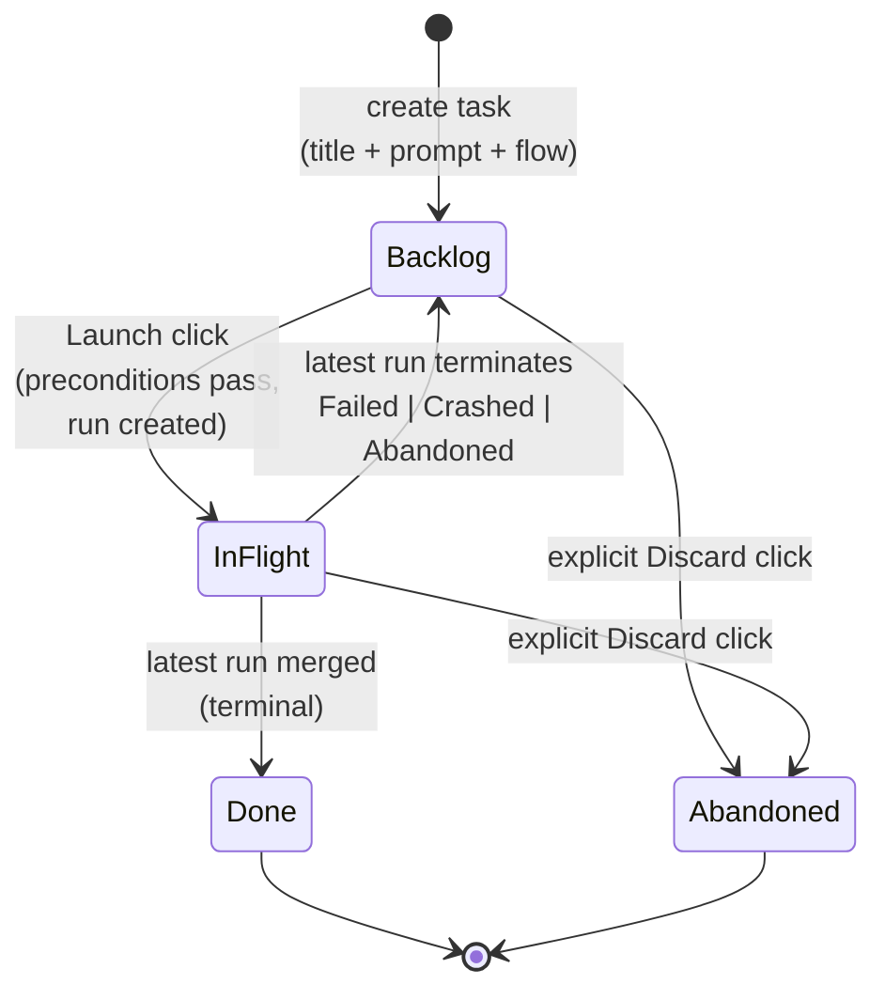
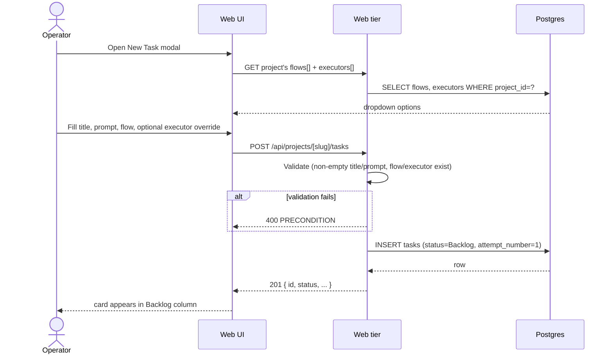
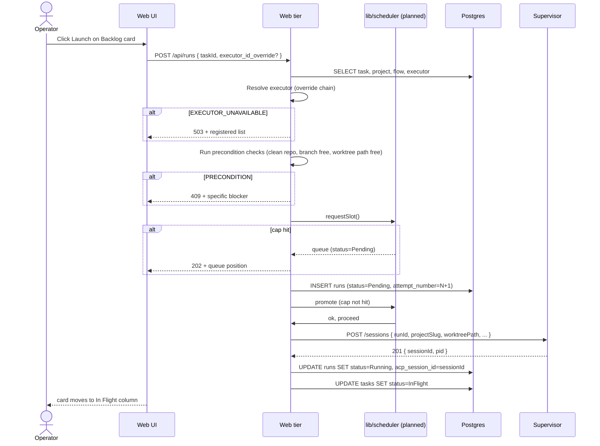
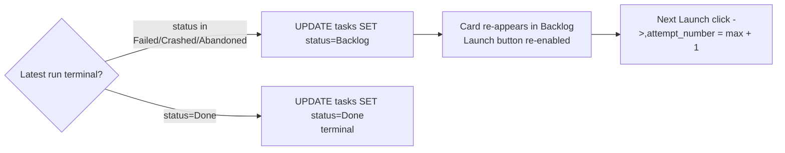

# Tasks domain

## Purpose

A **task** is the operator's unit of intent — one card on a project's
board with a title, prompt, and Flow assignment. Tasks have a simple
board state (`Backlog | InFlight | Done | Abandoned`) and a **1:N**
relationship to runs ([ADR-018](../decisions.md#adr-018-task--run-cardinality-is-1n)).

## Domain entities

- **Task** — board card. Persisted as `tasks` row.
- **Run** — execution attempt. See [`runs.md`](runs.md).
- **Attempt number** — monotonic counter per task, starting at 1.
  UNIQUE `(task_id, attempt_number)` on runs.

## State machine — board axis

Notes:

- The InFlight bucket contains runs in any of `Pending | Running |
NeedsInput | NeedsInputIdle | Review | Crashed`.
- "Latest run" is `MAX(attempt_number)` for the task; that's what the
  card shows.
- Auto-return to `Backlog` on `Failed | Crashed | Abandoned` enables
  ralph-loop retry without recreating the task.

## Process flows

### Create a task (Designed M4)

### Launch a task — retry loop (Designed M6)

### Failure auto-return to Backlog

## Edge cases

- **Empty title or prompt** → `PRECONDITION` (400).
- **`flow_id` not registered for this project** → `PRECONDITION`.
- **`executor_override_id` not registered** → `EXECUTOR_UNAVAILABLE`
  (503).
- **Dirty parent repo on Launch** → `PRECONDITION` ("commit or stash
  changes in `{repo_path}`").
- **Branch name `<branch_prefix><task_slug>` already exists** →
  `PRECONDITION` ("branch exists; abandon prior run or pick a different
  name").
- **Worktree path collision** → `PRECONDITION`.
- **Global concurrency cap hit** → run created as `Pending`, UI shows
  queue position. Not an error.
- **Discard a task that has a live run** — supervisor `DELETE
/sessions/<id>`, then mark worktree stale, then `tasks.status =
Abandoned`. Failure to terminate the session does NOT block the task
transition (the run reconciles to `Crashed` on next heartbeat tick).

## Linked artifacts

- ADRs: [ADR-018 Task ↔ Run 1:N](../decisions.md#adr-018-task--run-cardinality-is-1n).
- ERD: [`../db/runs-domain.md`](../db/runs-domain.md) (tasks + runs tables).
- Related domains: [`runs.md`](runs.md), [`workspaces.md`](workspaces.md),
  [`executors.md`](executors.md).
- Source: `web/lib/db/schema.ts` (tasks + runs tables).
