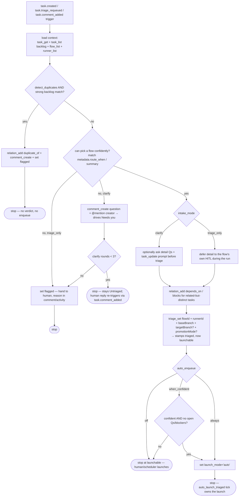
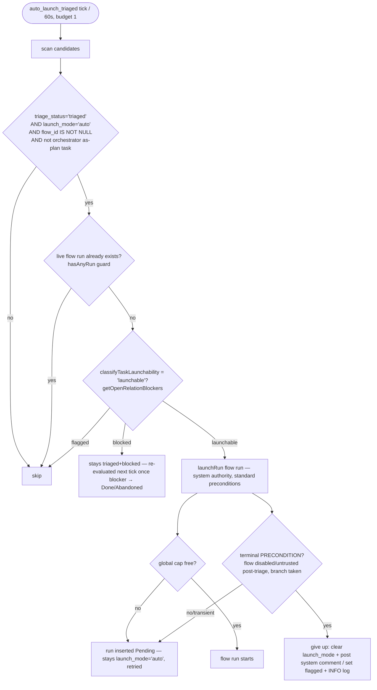
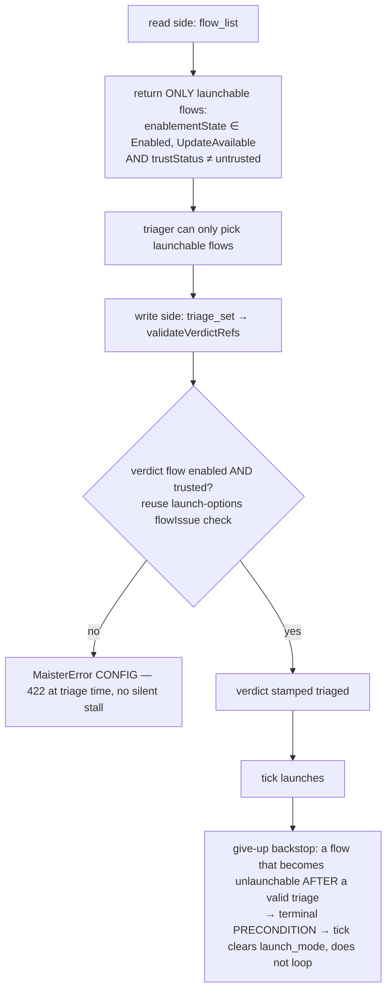

# Triage domain

> **Status: Implemented.** Frozen design source:
> [`../superpowers/specs/2026-06-24-triager-agent-design.md`](../superpowers/specs/2026-06-24-triager-agent-design.md).
> Decisions: ADR-110 (generic agent-config framework), ADR-111 (triager agent +
> `duplicate_of`/`flagged` substrate + `auto_launch_triaged` tick). Everything in
> this file is **Implemented** unless a bullet tags it otherwise. Live-agent
> end-to-end triage is exercised manually only (the substrate paths are covered
> in CI via the mock ACP adapter).

## Purpose

The triage domain owns the **triager agent** and the generic **agent-config
framework** it is the first consumer of. The triager reads a freshly created or
re-queued task, detects duplicates, picks a flow + runner + base branch, forms
inter-task dependencies, evaluates clarity over **two distinct thresholds**
(routing vs execution), and optionally records an enqueue *intent* — it never
launches a run itself. A system-authority tick (`auto_launch_triaged`) performs
the actual launch through the standard precondition choke point. Boundary: this
domain owns the triage decision surface (`tasks.triage_status` values
`triaged`/`flagged`, the enqueue intent on `tasks.launch_mode`), the
`duplicate_of` relation kind, the `auto_launch_triaged` scheduler job, the
discovery MCP tools (`flow_list`/`runner_list`), and the per-instance config
contract. It does NOT own the platform-agent catalog/launch/trust substrate it
runs on ([agents.md](agents.md)), the run state machine ([runs.md](runs.md)),
the board/launchability model it writes verdicts into ([tasks.md](tasks.md)),
the relations/comments/inbox substrate ([social-board.md](social-board.md)), the
clock ([scheduler.md](scheduler.md)), the outbox ([domain-events.md](domain-events.md)),
or the orchestrator task-DAG it stays disjoint from ([orchestrator.md](orchestrator.md)).

The triager itself is a single **platform agent** shipped as
`maister-agents/triager.md` in a core package inside the `maister-plugins` repo,
configured per project instance; ~80% of its substrate already exists from M34
(see [agents.md](agents.md)). This doc adds the three real gaps: discovery,
dedup modelling, and the flow-task auto-launcher.

## Domain entities

- **Triager agent** (Implemented) — a platform agent (`maister-agents/triager.md`):
  `workspace: none`, `mode: session`, `risk_tier: read_only`,
  `triggers: [domain_event, manual]`,
  `recommended.events: [task.created, task.triage_requeued, task.comment_added]`.
  No `flow:` field ⇒ standalone `run_kind='agent'` session on the agent budget.
  Catalogued and launched on the M34 substrate ([agents.md](agents.md)).
- **Agent-config declaration** (Implemented) — the optional `config:` array in an
  agent's `.md` frontmatter: typed params (`boolean | enum | string | number`)
  with `default`/`label`/`description`. Parsed + strictly validated in
  `web/lib/agents/definition.ts` (bad schema → `MaisterError("CONFIG")`, row not
  written). The triager declares
  `auto_enqueue` (`off|when_confident|always`, default `off`),
  `detect_duplicates` (boolean, default `true`), and
  `intake_mode` (`triage_only|clarify`, default `clarify`).
- **`agents.config_schema`** (Implemented) — jsonb projection of the declared
  `config:` schema, synced at install/resync so the UI renders a form without
  re-reading the package. Migration 0071. See
  [db/agents-domain.md](../db/agents-domain.md).
- **`agent_project_links.config`** (Implemented) — jsonb per-instance values; `null`
  ⇒ all defaults. Written through the existing aggregating PATCH. Migration 0071.
- **`runs.agent_config`** (Implemented) — jsonb immutable launch snapshot of the
  resolved effective config (mirrors `runs.execution_policy`); injected into the
  agent system prompt at spawn. Migration 0071. See
  [db/runs-domain.md](../db/runs-domain.md).
- **`tasks.triage_status`** (Implemented) — enum widened to
  `triaged | flagged | NULL` (migration 0072 adds `flagged`). `NULL` = untriaged
  (fresh, or a `clarify` task awaiting a human answer); `triaged` = verdict set,
  launchable; `flagged` = held, NOT launchable. See [tasks.md](tasks.md).
- **`tasks.launch_mode`** (Implemented) — the enqueue intent; `'auto'` is the only
  value the triager sets, and only the `auto_launch_triaged` tick consumes it.
  Disjoint from the orchestrator's `auto_launch_run_plan` producer.
- **`task_relations.kind = duplicate_of`** (Implemented) — informational relation
  kind added to the enum + `task_relations_kind_check` DB constraint (migration
  0072). NON-blocking by construction: `getOpenRelationBlockers` queries only
  `blocks`/`depends_on`/`requires`. See [social-board.md](social-board.md).
- **`auto_launch_triaged` job** (Implemented) — a `systemManaged` singleton sweep on
  the M24 polymorphic scheduler clock (budget 1, 60 s cadence) that launches
  triaged + auto-enqueued flow tasks once launchable. See
  [scheduler.md](scheduler.md).
- **Discovery MCP tools** (Implemented) — `flow_list` + `runner_list`, read-only
  facade tools backed by new ext GETs, gated by token scopes `flows:read` /
  `runners:read`. See [external-operations.md](external-operations.md).

## State machine

`tasks.triage_status` over the triage lifecycle. `NULL` doubles as
"awaiting-clarify-answer" (the open question lives in the comment thread + inbox,
no separate state). `flagged` is HELD — not launchable even if a human later
sets a `flowId`. `triaged` records the verdict; a separate enqueue intent
(`launch_mode='auto'`) is the signal the `auto_launch_triaged` tick acts on
(shown as a note, since the launch crosses into the run FSM in [runs.md](runs.md)).

```mermaid
stateDiagram-v2
    [*] --> Untriaged: task created (no flow)
    Untriaged --> Untriaged: clarify question asked<br/>(awaiting human reply; comment + inbox)
    Untriaged --> Triaged: triage_set verdict<br/>flowId + runnerId + baseBranch
    Untriaged --> Flagged: dedup hit OR triage_only unroutable<br/>OR clarify max-rounds (3)
    Triaged --> Untriaged: human "Send to triage"<br/>(task.triage_requeued, one tx)
    Flagged --> Untriaged: human clears flag<br/>(remove duplicate_of / re-send to triage)
    Triaged --> Triaged: enqueue intent set<br/>(launch_mode='auto' — auto_launch_triaged tick will launch when launchable)
    note right of Flagged
        HELD — classifyTaskLaunchability returns
        'flagged' (not launchable) even with flowId set
    end note
    note right of Triaged
        launchable; the tick launches only when
        launch_mode='auto' AND no live run AND
        relation-unblocked (else stays triaged+blocked)
    end note
```

## Process flows

### (a) Two-tier triage decision

The triager's per-run reasoning, executed entirely through the MCP facade
(`workspace: none`). Order: load context → dedup → routing-floor clarify/flag →
execution-clarity (mode-dependent) → dependencies → verdict → enqueue. The
**routing clarity floor is unconditional** (you cannot triage a black box); the
**execution clarity** threshold is configurable by `intake_mode`.

### (b) `auto_launch_triaged` tick — dependency release + give-up

A `systemManaged` singleton sweep on the M24 clock (budget 1, 60 s). Each tick
finds candidates and launches them through the standard `launchRun` choke point.
Reusing `classifyTaskLaunchability` + `getOpenRelationBlockers` means a task
blocked by a dependency stays `triaged + blocked` and **launches itself once the
blocker clears** — no extra wiring. The predicate is **disjoint** from
`auto_launch_run_plan` (which requires `parent_of`-under-orchestrator +
`delegation_spec.agentId` and launches *agent* runs).

### (c) No-silent-stall guard

`validateVerdictRefs` today validates a verdict `flowId` for existence + project
only. Without the two-sided guard, a triager could stamp `triaged + auto` on a
disabled/untrusted flow → the tick's `launchRun` refuses forever while WARN-spamming
every 60 s. The fix closes the read side, the write side, and the give-up backstop.

## Expectations

- The triager MUST run `workspace: none`, `mode: session`, `risk_tier: read_only`
  on the M34 platform-agent substrate, with NO `runs:launch` scope and NO
  `flow:` field (standalone `run_kind='agent'` session).
- An agent `config:` declaration MUST validate strictly in
  `web/lib/agents/definition.ts` (unknown type, enum without `values`, duplicate
  key, or `default ∉ values` → `MaisterError("CONFIG")`); the catalog row MUST
  NOT be written on a bad schema.
- `resolveAgentConfig` MUST merge instance value (`agent_project_links.config`)
  over declared default with exactly two tiers (no project/platform tier); a
  `null` instance value MUST yield all defaults and unknown instance keys MUST be
  ignored.
- The effective config MUST be snapshotted once at spawn into `runs.agent_config`
  and injected into the system prompt from that **snapshot**, never re-resolved
  from the mutable link/definition.
- `tasks.triage_status='flagged'` MUST be non-launchable in BOTH
  `classifyTaskLaunchability` AND `classifyManualTaskLaunchability` **even when
  `flow_id` is set**, with precedence
  `target_terminal > crashed > busy > flagged > blocked > unconfigured > launchable`.
- The `duplicate_of` relation kind MUST be informational only —
  `getOpenRelationBlockers` MUST query exactly `{blocks, depends_on, requires}`
  and MUST NEVER gate launch on `duplicate_of`.
- `triage_set` MUST write the verdict (or `flag`), the optional `enqueue` →
  `launch_mode='auto'`, the `triage_status`, the `task_activity`, and the token
  audit in ONE `db.transaction`.
- `triage_set` MUST reject a verdict whose `flowId` is not launchable
  (`enablementState ∉ {Enabled, UpdateAvailable}` OR `trustStatus = untrusted`)
  with `MaisterError("CONFIG")` (422) at triage time.
- `flag` MUST be mutually exclusive with verdict fields (`flag` + any verdict →
  `MaisterError("CONFIG")`), and `enqueue:true` MUST require a verdict that
  yields a `flowId`.
- `flow_list` MUST return only launchable flows (per the read-side guard) and
  `runner_list` MUST return only `enabled` runners; both MUST validate `slug`
  against the token's project and existence-hide cross-project access as 404.
- The `auto_launch_triaged` tick MUST be a `systemManaged` singleton (budget 1)
  whose candidate predicate is `triage_status='triaged' AND launch_mode='auto'
  AND flow_id IS NOT NULL AND launchable AND no live flow run AND not an
  orchestrator as-plan task`, and MUST be disjoint from `auto_launch_run_plan`.
- The tick MUST launch through the standard `launchRun` choke point (cap hit →
  `Pending`, NOT an error) and MUST give up (clear `launch_mode` + system comment
  / `flagged`) only on a terminal `PRECONDITION`, never on a transient cap-hit.
- A `clarify` loop MUST be bounded at 3 question rounds before falling back to
  `flagged`; the triager MUST reconstruct context statelessly per run from the
  task + its comment thread (`comment_list`).

## Edge cases

- **`clarify` exceeds max rounds (3)** → fall back to `tasks.triage_status='flagged'`
  (held); reason recorded in the comment + `task_activity`. No
  `MaisterError` (a domain outcome, not a fault).
- **Dedup hit** → `relation_add(duplicate_of)` + `comment_create` + `flagged`,
  NO verdict columns, NO enqueue; the task stays held until a human clears the
  flag.
- **`triage_only` cannot pick a flow** → `flagged` (no questions in this mode);
  reason in the comment/activity. No `MaisterError`.
- **`triage_set` with a disabled/untrusted verdict flow** →
  `MaisterError("CONFIG")` (422), no silent stall.
- **`flag` combined with verdict fields**, or **`enqueue:true` without a flow** →
  `MaisterError("CONFIG")` (422).
- **Triaged + auto task blocked by a `depends_on`/`blocks` predecessor** → the
  tick leaves it `triaged + blocked`; it **self-launches** on a later tick once
  the blocker reaches `Done`/`Abandoned`. No `MaisterError`.
- **Global concurrency cap hit on the tick launch** → run inserted `Pending`
  with a queue position; stays `launch_mode='auto'` and is retried. Not an error.
- **Orchestrator collision** → an `auto_launch_run_plan` task
  (`parent_of`-under-orchestrator + `delegation_spec.agentId`) is excluded from
  the `auto_launch_triaged` predicate by construction; the two producers are
  disjoint. No `MaisterError`.
- **Stale flow after a valid triage** (flow disabled/untrusted post-triage, or
  the target branch becomes taken) → the tick's `launchRun` returns a terminal
  `MaisterError("PRECONDITION")`; the tick gives up (clears `launch_mode`,
  records a system comment / `flagged`) instead of looping.
- **`flow_list`/`runner_list` for a slug outside the token's project** →
  `MaisterError("NOT_FOUND")` (404, existence-hide), failure audit written.
- **`triage_set` referencing a disabled-flow target via any path** →
  `MaisterError("CONFIG")` (the enablement/trust validation is the single guard).

## MCP facade

The triager reaches MAIster only through the thin MCP facade
([external-operations.md](external-operations.md)); it forwards the inbound
agent bearer verbatim to `/api/v1/ext`. Beyond the existing `task_get`,
`task_list`, `comment_create`/`comment_list`, `relation_add`/`relation_remove`,
and `triage_set` tools, this domain adds two read-only discovery tools and
extends the triage op.

| MCP tool | `inputSchema` | Backing ext route | Response (mirrors the ext GET) |
| --- | --- | --- | --- |
| `flow_list` (Implemented) | `{ slug }` | `GET /api/v1/ext/projects/{slug}/flows` | per project flow `{ id, ref, metadata: { title, summary, route_when, labels } }`, **launchable-only** (read-side guard) |
| `runner_list` (Implemented) | `{ slug }` | `GET /api/v1/ext/projects/{slug}/runners` | per enabled runner `{ id, adapter, model, provider }` |

- `flow_list` returns the "when/what to apply" the triager matches against
  (`metadata.route_when` / `metadata.summary`); all attached-package flows are
  available (no curation knob), filtered to `enablementState ∈ {Enabled,
  UpdateAvailable}` ∧ `trustStatus ≠ untrusted`.
- `runner_list` returns the global enabled-runner catalog (runners are
  platform-scoped → no project filter).
- The triage op (`POST /api/v1/ext/projects/{slug}/tasks/{taskId}/triage`, MCP
  `triage_set`) gains two boolean body fields: `flag` (set
  `triage_status='flagged'`, mutually exclusive with verdict fields) and
  `enqueue` (set `launch_mode='auto'`, requires a verdict yielding a `flowId`).

### HTTP identifier trust table

Locators are URL-params validated by `handleExt` against the token's project;
flag/enqueue are body booleans, not locators (safe).

| Surface | Identifier | Trust | On mismatch |
| --- | --- | --- | --- |
| `GET …/flows`, `GET …/runners` | `slug` | url-param, validated vs token project | 404 (existence-hide, cross-project) |
| `GET …/flows`, `GET …/runners` | `projectId` | server-state (`ctx.projectId`), never a body field | — |
| `POST …/tasks/{taskId}/triage` | `taskId` | url-param, re-validated vs token project | 404 (existence-hide, cross-project) |
| `POST …/tasks/{taskId}/triage` | `flag`, `enqueue` | body-controlled booleans (not locators) | — |

## Linked artifacts

- **Decisions:** ADR-110 (generic agent-config framework — declare → project →
  instance → resolve → inject → snapshot); ADR-111 (triager agent, two-tier
  clarity, `duplicate_of`/`flagged`, `auto_launch_triaged` tick disjoint from
  ADR-098, `flow_list`/`runner_list`, `flows:read`/`runners:read` scopes, triage
  `flag`/`enqueue`, the no-silent-stall contract). See [decisions.md](../decisions.md).
- **Substrate this builds on:** [agents.md](agents.md) (platform-agent catalog,
  per-project effective definition, trust gate, agent tokens, triage Q&A loop,
  `task.triage_requeued` emitter).
- **DB:** migration 0071 (`agents.config_schema`, `agent_project_links.config`,
  `runs.agent_config`), migration 0072 (`tasks.triage_status += flagged`,
  `task_relations.kind += duplicate_of` + check); narrative
  [database-schema.md](../database-schema.md), ERDs
  [db/agents-domain.md](../db/agents-domain.md),
  [db/runs-domain.md](../db/runs-domain.md).
- **Tasks + relations surface:** [tasks.md](tasks.md) (`flagged` launchability
  precedence, board chip), [social-board.md](social-board.md) (`duplicate_of`,
  non-blocking).
- **Scheduler:** [scheduler.md](scheduler.md) (`auto_launch_triaged` job kind on
  the M24 clock).
- **External surface + MCP:** [external-operations.md](external-operations.md)
  (`flow_list`/`runner_list`, scopes, triage `flag`/`enqueue`).
- **HTTP:** [`../api/external/operations.openapi.yaml`](../api/external/operations.openapi.yaml)
  (two GET paths, triage `POST` body `flag`/`enqueue`, scopes).
- **Source (Implemented):** `web/lib/agents/definition.ts` (config declaration +
  parse), `web/lib/agents/config.ts` (`resolveAgentConfig`),
  `web/lib/agents/launch.ts` (`runs.agent_config` snapshot + prompt injection),
  `web/lib/services/triage.ts` (`applyTriageVerdict`, `validateVerdictRefs`,
  `flag`/`enqueue`), `web/lib/runs/launchability.ts` (`flagged` arm in both
  classifiers), `web/lib/social/relations.ts` (`duplicate_of`,
  `getOpenRelationBlockers`), `web/lib/scheduler/handlers/auto-launch-triaged.ts`
  (the tick), `mcp/src/tools.ts` (`flow_list`/`runner_list`), and the new ext
  routes under `web/app/api/v1/ext/projects/[slug]/flows`/`runners`.
