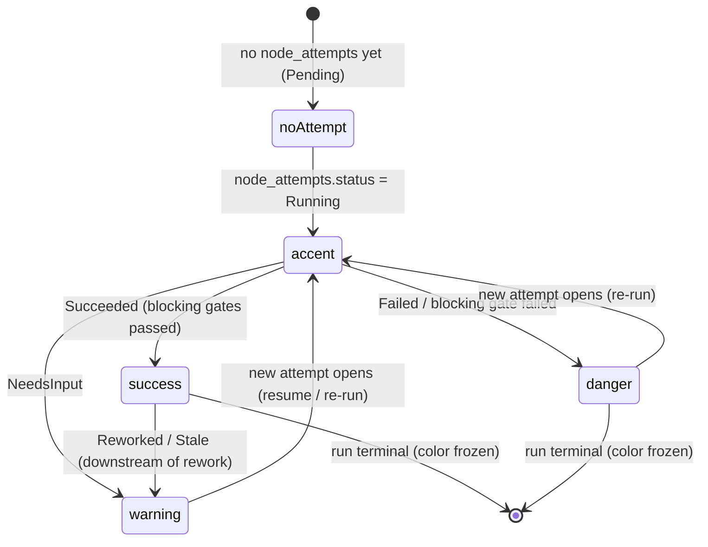
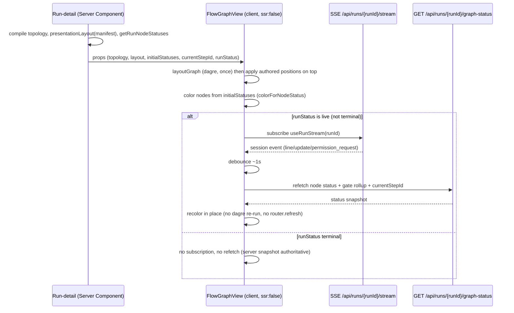
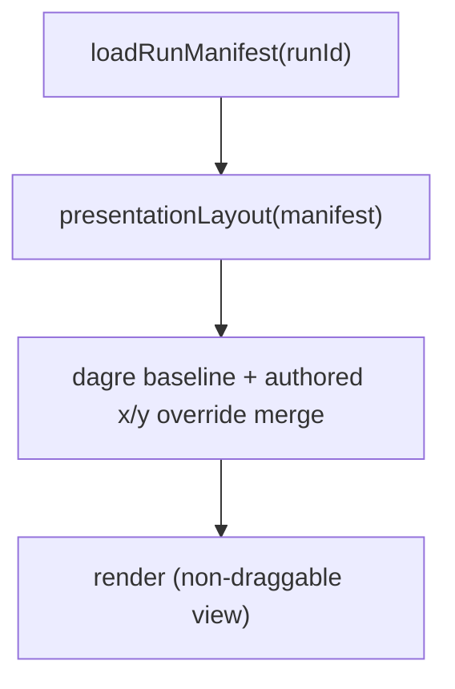
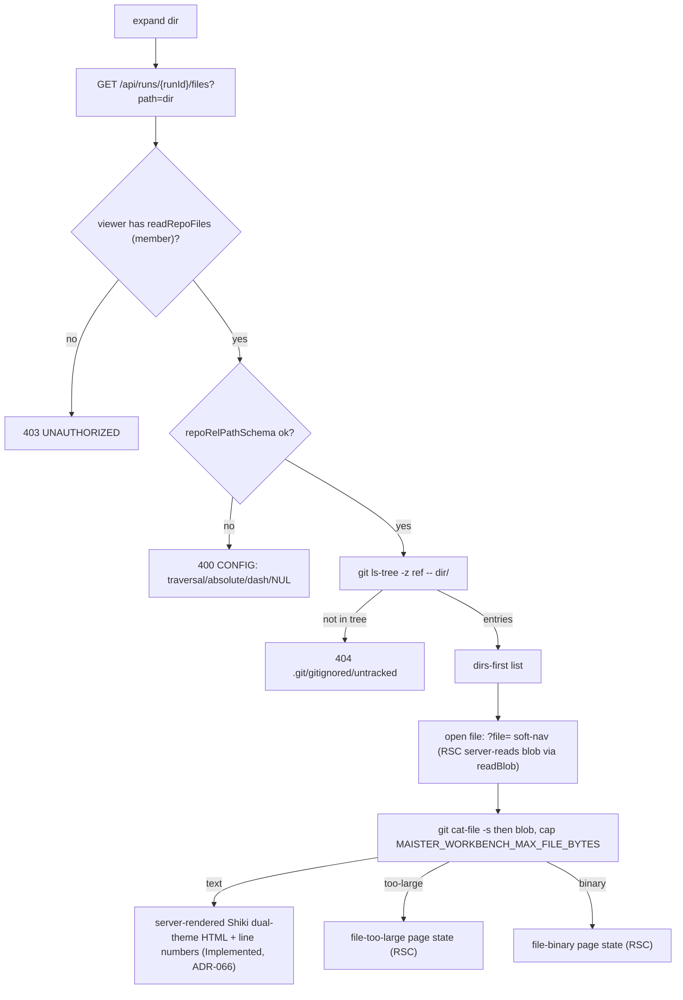
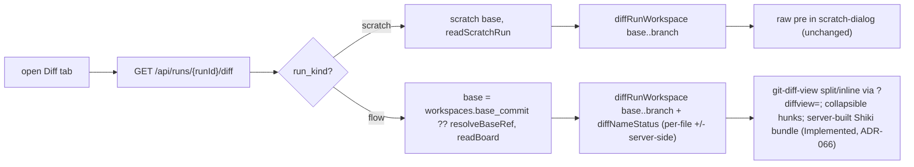

# Workbench visibility domain

> **Status: Implemented (M22).** This file is the M22 contract for the per-run
> **workbench**: a flow-graph VIEW with live node-status coloring, a read-only
> git-tracked file browser, and the base→run diff — all three tracks shipped.
> Three independent tracks:
> **A — flow-graph view** ([ADR-064](../decisions.md#adr-064-authored-flow-graph-layout-in-the-flowyaml-presentation-section),
> [ADR-052](../decisions.md#adr-052-live-node-status-coloring-via-sse-triggered-graph-status-refetch)),
> **B — file-tree** ([ADR-053](../decisions.md#adr-053-workbench-file-tree-git-tracked-only-member-gated-reads)),
> **C — diff** (reuses M18). Renderer: [ADR-039](../decisions.md#adr-039-xyflowreact--dagrejsdagre-as-the-evidence-graph-renderer).
> No-polling reaffirms [ADR #1 / ADR-007](../decisions.md#adr-007-sse-pipe-to-disk-for-step-output).

> **Diff rendering upgrade (Implemented, [ADR-066](../decisions.md#adr-066-editor-and-diff-rendering-stack-shiki-git-diff-view-codemirror)).**
> Track B's server-rendered Shiki file view with a `?file=` deep-link **shipped**
> and Track C diff now renders through `@git-diff-view/react` (split/inline via
> `?diffview=`, per-file `+`/`−` counts, server-built Shiki bundle); the `/diff`
> response carries `additions`/`deletions`. The read-only boundary and the
> `readBoard` gate are unchanged. (The authored-Flow CodeMirror editor slice
> remains Designed.)

## Purpose

The **workbench** domain is M22's run-inspection surface: it makes a run's
execution legible without leaving the control plane. Its boundary is
**read-only** — it visualizes the compiled flow graph and colors nodes by live
status (Track A), browses the run/project's **git-tracked** files (Track B), and
renders the base→branch diff for any run state (Track C). Node positions are
**authored in the `flow.yaml` `presentation` section** (ADR-064) and read at
render; the view owns **no write** — it never edits node logic or layout (the
graph *editor* is Wave-3), never mutates run state, and never reads
untracked/working-copy files.
The execution model it visualizes is [`flow-graph.md`](flow-graph.md); the run
state machine is [`runs.md`](runs.md); the worktree it reads is
[`workspaces.md`](workspaces.md). Lifecycle actions that stop, archive, drop,
or export the visible workbench live in
[`workbench-lifecycle.md`](workbench-lifecycle.md).

## Domain entities

- **Graph topology** — the logic-only graph from `compileManifest(pinnedManifest)`:
  nodes (`id`, `nodeType`, `label`, additive display metadata) + edges
  (`source`, `target`, `outcome`, additive display metadata), with **no x/y**.
  Source: `web/lib/flows/graph/compile.ts` (`FlowGraph`,
  `CompiledNode.transitions`) through `buildGraphTopology`.
- **Authored layout** — entries in the manifest's `presentation.nodes[]`
  (`{ id, x?, y?, width?, height?, color? }`), authored with the flow and shipped
  in the bundle (ADR-064). `presentationLayout(manifest)` projects entries with
  both coordinates into a `nodeId → {x, y}` map; dagre seeds the rest. No DB
  store, no runtime write. Source: `web/lib/flows/graph/presentation-layout.ts`.
- **Node-status snapshot** — per node, the highest-`attempt` `node_attempts.status`
  + a gate rollup over `gate_results.status`, plus `runs.current_step_id`. It
  also carries additive runtime gate-summary counts derived from the same gate
  list. Read model only; no new column. Source: `getRunTimeline`
  (`web/lib/queries/run.ts`) through `getRunNodeStatuses`.
- **Tracked file node** — a one-level `git ls-tree` entry (`name`,
  `type: file|dir`) under a server-resolved `ref`; never a raw `fs` entry.
- **Tracked blob** — a `git cat-file` read result:
  `{kind:"text", content} | {kind:"too-large", size} | {kind:"binary"}`, capped
  at `MAISTER_WORKBENCH_MAX_FILE_BYTES`.
- **Workbench diff** — the `base..branch` raw diff + a changed-files summary
  (`git diff --name-status`), for any run state (extends the M18 review surface).

## State machine — node color (view axis, derived)

A node's color is a **pure projection** of its highest-attempt status + gate
rollup; it is not a persisted state. The view recolors on each SSE tick and
freezes on a terminal run.

## Layout resolution (authored, read-only)

Layout is not a runtime persistence axis: positions are **authored in
`flow.yaml`** and read at render (ADR-064). Resolution is a pure merge with no
state to transition:

1. dagre computes the baseline for every node;
2. `presentationLayout(manifest)` overrides position for any node whose
   `presentation` entry declares both `x` and `y`;
3. a `presentation` entry whose `id` is absent from the compiled topology is
   ignored (no phantom node); a node with no entry keeps its dagre seed.

Editing the authored layout (drag-to-arrange) is a flow-editor concern on the
source `flow.yaml`, not a workbench write. **(Designed, M27)** ADR-064 is now
read+write: the M27 flow-graph editor authors the `presentation` section (node
`{id, x, y, width, height, color}`) as part of canvas edits serialized on save.
The workbench read path (rendering the authored layout) is unchanged. See
[`flow-studio.md`](flow-studio.md).

## Process flows

### Graph render + SSE-triggered recolor (no polling)

### Authored layout read (no write)

### Lazy tracked file-tree expand + open

The `…/files` tree expand and the file **open + render** path are both
Implemented (M22 + ADR-066): selecting a file is a `?file=` soft-navigation that
the server component validates (`repoRelPathSchema`), authorizes
(`readRepoFiles`), and reads via `readBlob`, then renders with server-side Shiki
— the standalone `…/files/content` route was retired. The size / binary /
not-found caps and the read-only boundary are unchanged, but an oversized or
binary blob now renders a **page state** (`file-too-large` / `file-binary`) on
the `?file=` RSC path rather than the retired route's HTTP `413` / `415`; a
not-in-tree path is still a `404`.

### Flow-run diff render (Track C)

Flow runs render through `@git-diff-view/react` (Implemented, ADR-066); the scratch
diff (`scratch-dialog`) stays a raw `pre` and is out of this slice's scope.
At an open review gate the same diff surface additionally hosts line-anchored
review-comment threads (composer, inline thread cards, collapsible Outdated
list — Implemented, ADR-072); see
[`review-comments.md`](review-comments.md).

## Expectations

- Node color is the **highest-`attempt` `node_attempts.status`** for each `node_id`
  (gate rollup over `gate_results.status`); a node with no attempt renders
  `Pending`/default.
- Static graph display metadata is additive and derived from the pinned manifest:
  `displayLabel`, `nodeTypeLabel`, `nodeRole`, and `declaredGateSummary` on
  nodes; `displayLabel` and `edgeRole` on edges. The compatibility fields
  (`id`, `nodeType`, `label`, `source`, `target`, `outcome`) stay stable.
- Runtime gate display metadata stays in `…/graph-status`, not topology:
  `gateSummary` counts total/blocking/advisory gates and exposes the worst
  blocking status used by the existing rollup. No per-node API calls are allowed.
- The graph topology is logic-only (`compileManifest`) and carries **no x/y**;
  authored positions live in the `flow.yaml` `presentation` section (ADR-064),
  additive and engine-ignored (no `compat`/engine bump, DSL stays logic-only).
- `presentationLayout(manifest)` positions only nodes whose `presentation` entry
  declares both `x` and `y`; every other node is dagre-seeded at render.
- A `presentation` entry whose `id` is absent from the compiled topology is
  ignored at render (no phantom node) — never an error.
- The flow-graph view is **read-only**: it wires no drag handlers and exposes no
  layout write route; editing authored layout is a flow-editor concern (§E1, Wave 3).
- Live recolor refetches `…/graph-status` ONLY on an SSE event tick (debounced),
  NEVER on a timer, and MUST NOT refetch once `runs.status` is terminal.
- File reads require the `readRepoFiles` action (min role `member`) — strictly
  above `readBoard` — on every git-tracked-file read: the `…/files` tree route
  and the `?file=` RSC blob read (Implemented, ADR-066; replaced `…/files/content`);
  a `viewer` is refused.
- File reads return ONLY git-tracked content via `git ls-tree` / `git cat-file`
  under a server-resolved `ref`; `.git/`, gitignored, `node_modules`, and
  untracked paths are unreachable and surface as `404`. Text blobs render as
  server-rendered Shiki dual-theme HTML (0 KB client), switched by the
  `.light`/`.dark` class (Implemented, ADR-066).
- An untrusted `?path=` MUST pass `repoRelPathSchema` (no `..`, not absolute, no
  leading `/` or `-`, no NUL); a violation is `400` (`CONFIG`), never a disclosed path.
- A blob over `MAISTER_WORKBENCH_MAX_FILE_BYTES` renders the `file-too-large`
  page state and a binary blob the `file-binary` page state on the `?file=` RSC
  path — never the raw bytes, and never an HTTP `413`/`415` (that `…/files/content`
  route was retired, ADR-066).
- The workbench diff is run-scoped (`base..branch` only) and gated `readBoard`
  (`viewer`) for flow runs / `readScratchRun` for scratch runs; it adds NO new
  `runs.status` value and reuses the M18 diff response shape plus a `files` summary.
  Flow runs render split/inline via `@git-diff-view/react` (`?diffview=`) with
  per-file `additions`/`deletions` computed server-side (Implemented, ADR-066); the
  scratch diff stays a raw `pre`.
- An oversized diff (over the `EXEC_MAX_BUFFER` 4 MiB bound) degrades to a bounded
  prefix carrying `truncated: true` on the `…/diff` response and the review-panel
  diff DTO — the diff readers (`diffRange`, `diffRunWorkspace`) NEVER throw on
  size. The review panel MUST block promotion behind an explicit acknowledgement
  when `truncated`, and both the workbench and review diff MUST render a
  truncation banner (Implemented, ADR-066).

## Edge cases

- **A `presentation` entry for an unknown `nodeId`** (not in the compiled
  topology) → ignored at render (no phantom node), never an error.
- **`…/graph` or `…/graph-status` for a run with no flow / no pinned manifest** → `404`.
- **File path traversal / absolute / leading `-` / NUL** (`repoRelPathSchema` reject) → `400` (`CONFIG`).
- **`.git/config`, a gitignored `.env`, or an untracked file path** → `404` (not in
  the tracked tree; never disclosed).
- **Blob over the size cap** → `file-too-large` page state; **binary blob** →
  `file-binary` page state (RSC `?file=` render; no HTTP `413`/`415` — ADR-066).
- **Cross-project `slug`/`runId`** (caller is not a member of the resource's
  project) → `403` (`UNAUTHORIZED`) via `requireProjectAction` against the
  server-derived project (the app-wide convention); a genuinely unknown
  `runId`/`slug` → `404`.
- **SSE refetch after a run goes terminal** → MUST NOT happen (the view freezes on
  the server snapshot); regression-asserted by the e2e.
- **Legacy run with null `workspaces.base_commit`** → diff base falls back to
  `resolveBaseRef(...)`; a run with no derivable base → `PRECONDITION` (409, the
  existing diff guard). No new `MaisterError` code.
- **Oversized diff** (over `EXEC_MAX_BUFFER`, 4 MiB) → bounded prefix +
  `truncated: true` on `…/diff`; the review panel blocks promotion until the
  reviewer acknowledges (ADR-066). NOT a `409`/throw, NOT a silent partial render.

## Linked artifacts

- ADRs:
  [ADR-039 renderer](../decisions.md#adr-039-xyflowreact--dagrejsdagre-as-the-evidence-graph-renderer),
  [ADR-064 authored layout](../decisions.md#adr-064-authored-flow-graph-layout-in-the-flowyaml-presentation-section)
  (supersedes [ADR-051](../decisions.md#adr-051-flow-graph-layout-metadata-store-project-scoped-flow_id-keyed)),
  [ADR-052 live coloring](../decisions.md#adr-052-live-node-status-coloring-via-sse-triggered-graph-status-refetch),
  [ADR-053 file-tree](../decisions.md#adr-053-workbench-file-tree-git-tracked-only-member-gated-reads),
  [ADR-066 editor/diff rendering](../decisions.md#adr-066-editor-and-diff-rendering-stack-shiki-git-diff-view-codemirror) (file view + diff Implemented; authored editor Designed).
- API: [`../api/web.openapi.yaml`](../api/web.openapi.yaml) (`…/graph`,
  `…/graph-status`, the `…/files?path=` and `/api/projects/{slug}/files?path=`
  tree routes, and the flow-run `…/diff` case; git-tracked blob reads are the
  `?file=` RSC render path, not an HTTP route).
- Config: [`../configuration.md`](../configuration.md) §Environment variables
  (`MAISTER_WORKBENCH_MAX_FILE_BYTES`).
- Errors: [`../error-taxonomy.md`](../error-taxonomy.md) (`CONFIG` / `PRECONDITION`
  caller rows; no new code).
- RBAC: [`../../web/CLAUDE.md`](../../web/CLAUDE.md) §RBAC model
  (`readRepoFiles`).
- Related: [`flow-graph.md`](flow-graph.md) (execution model the view renders),
  [`runs.md`](runs.md) (run state / diff), [`workspaces.md`](workspaces.md)
  (worktree the tree reads).
- Source (Implemented, M22; layout reworked per ADR-064):
  `web/lib/queries/flow-graph-view.ts`, `web/lib/queries/run-node-status.ts`,
  `web/lib/flows/graph/presentation-layout.ts`,
  `web/lib/board/flow-graph-view-layout.ts`,
  `web/components/board/flow-graph-view.tsx`,
  `web/components/workbench/*`, `web/lib/worktree.ts` (`listTree`/`readBlob`/`diffNameStatus`).
