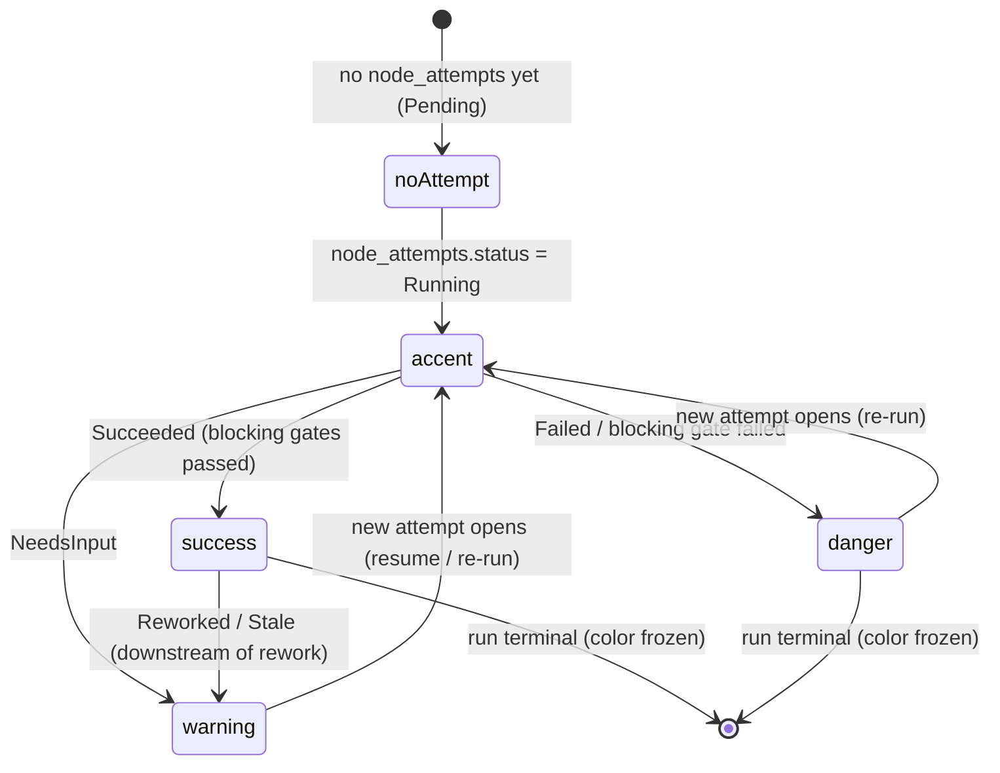
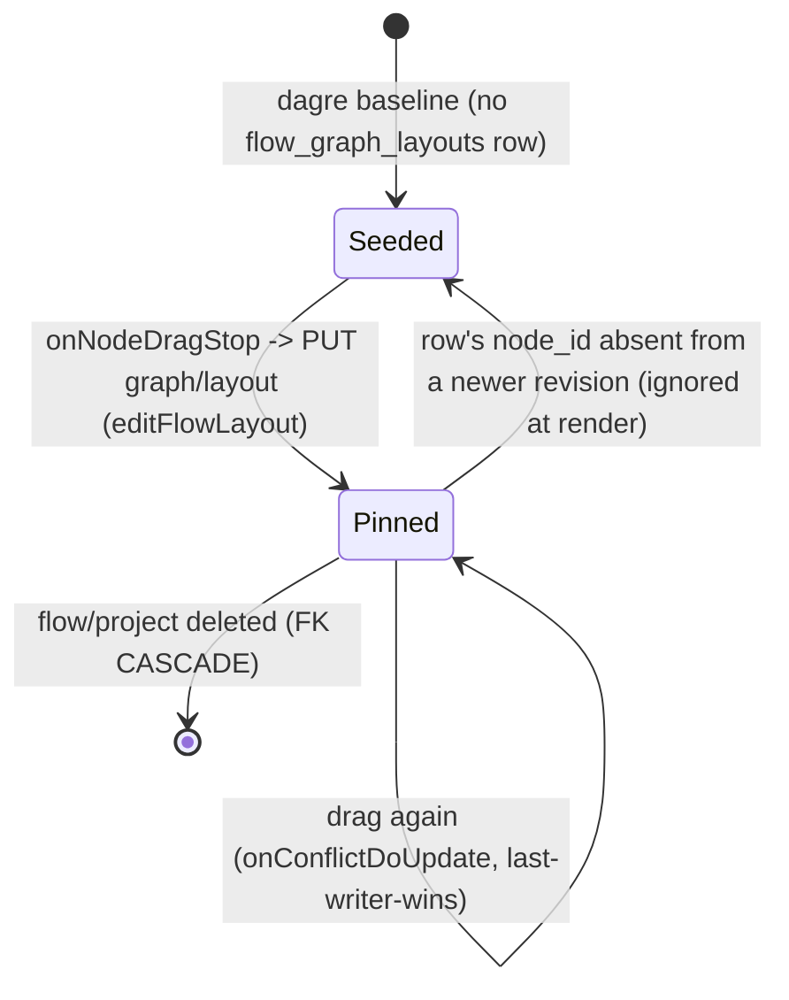
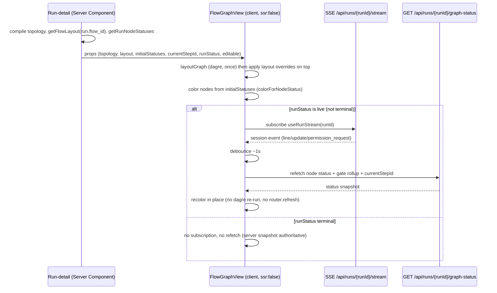
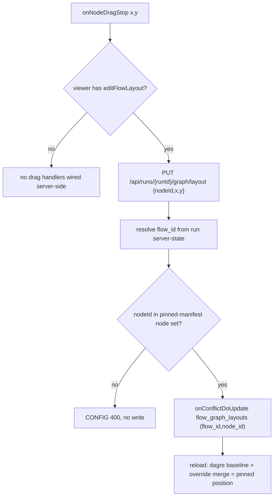
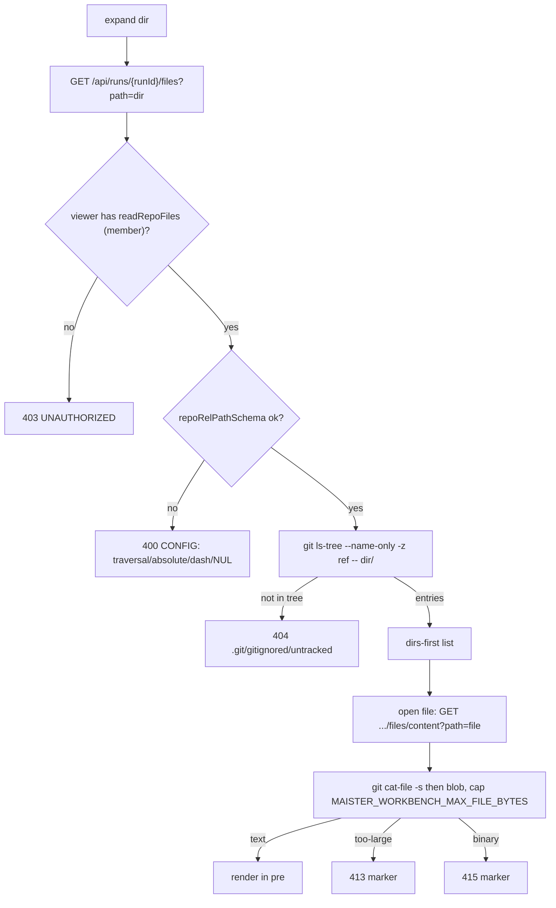
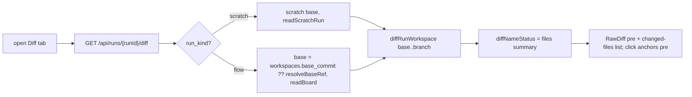

# Workbench visibility domain

> **Status: Implemented (M22).** This file is the M22 contract for the per-run
> **workbench**: a flow-graph VIEW with live node-status coloring, a read-only
> git-tracked file browser, and the base→run diff — all three tracks shipped.
> Three independent tracks:
> **A — flow-graph view** ([ADR-051](../decisions.md#adr-051-flow-graph-layout-metadata-store-project-scoped-flow_id-keyed),
> [ADR-052](../decisions.md#adr-052-live-node-status-coloring-via-sse-triggered-graph-status-refetch)),
> **B — file-tree** ([ADR-053](../decisions.md#adr-053-workbench-file-tree-git-tracked-only-member-gated-reads)),
> **C — diff** (reuses M18). Renderer: [ADR-039](../decisions.md#adr-039-xyflowreact--dagrejsdagre-as-the-evidence-graph-renderer).
> No-polling reaffirms [ADR #1 / ADR-007](../decisions.md#adr-007-sse-pipe-to-disk-for-step-output).

## Purpose

The **workbench** domain is M22's run-inspection surface: it makes a run's
execution legible without leaving the control plane. Its boundary is **read +
reposition only** — it visualizes the compiled flow graph and colors nodes by
live status (Track A), browses the run/project's **git-tracked** files (Track
B), and renders the base→branch diff for any run state (Track C). It owns one
new write — a node-position upsert into a **separate, project-scoped** layout
store — and nothing else: it never edits node logic (the graph *editor* is
Wave-3), never mutates run state, and never reads untracked/working-copy files.
The execution model it visualizes is [`flow-graph.md`](flow-graph.md); the run
state machine is [`runs.md`](runs.md); the worktree it reads is
[`workspaces.md`](workspaces.md).

## Domain entities

- **Graph topology** — the logic-only graph from `compileManifest(pinnedManifest)`:
  nodes (`id`, `nodeType`, `label`) + edges (`source`, `target`, `outcome`),
  with **no x/y**. Source: `web/lib/flows/graph/compile.ts` (`FlowGraph`,
  `CompiledNode.transitions`).
- **Layout override** — a `flow_graph_layouts` row: `(flow_id, node_id) → {x, y}`,
  the operator's pinned position. Persisted, project-scoped, keyed on the
  per-project `flow_id`. See ERD [`../db/projects-domain.md`](../db/projects-domain.md).
- **Node-status snapshot** — per node, the highest-`attempt` `node_attempts.status`
  + a gate rollup over `gate_results.status`, plus `runs.current_step_id`. Read
  model only; no new column. Source: `getRunTimeline` (`web/lib/queries/run.ts`).
- **Tracked file node** — a one-level `git ls-tree` entry (`name`,
  `type: file|dir`) under a server-resolved `ref`; never a raw `fs` entry.
- **Tracked blob** — a `git cat-file` read result:
  `{kind:"text", content} | {kind:"too-large", size} | {kind:"binary"}`, capped
  at `MAISTER_WORKBENCH_MAX_FILE_BYTES`.
- **Workbench diff** — the `base..branch` raw diff + a changed-files summary
  (`git diff --name-status`), for any run state (extends the M18 review surface).

## State machine — node color (view axis, derived)

A node's color is a **pure projection** of its highest-attempt status + gate
rollup; it is not a persisted state. The view recolors on each SSE tick and
freezes on a terminal run.

## State machine — layout override (persistence axis)

## Process flows

### Graph render + SSE-triggered recolor (no polling)

### Layout drag → upsert → reload round-trip

### Lazy tracked file-tree expand + open

### Flow-run diff render (Track C)

## Expectations

- Node color is the **highest-`attempt` `node_attempts.status`** for each `node_id`
  (gate rollup over `gate_results.status`); a node with no attempt renders
  `Pending`/default.
- The graph topology is logic-only (`compileManifest`) and carries **no x/y**;
  manual positions live ONLY in `flow_graph_layouts`, NEVER in `flow.yaml` (engine stays `1.2.0`).
- `flow_graph_layouts` is keyed `UNIQUE (flow_id, node_id)` on the per-project
  `flows.id`; a write authorized against one project MUST NOT alter another
  project's rows.
- A layout `PUT` MUST resolve `flow_id` from the run server-state and reject a
  `nodeId` absent from the run's pinned-manifest node set with `MaisterError("CONFIG")` (no write).
- Layout `PUT` requires the `editFlowLayout` action (min role `member`); a `viewer`
  is refused `UNAUTHORIZED` and the client wires no drag handlers.
- A stored layout row whose `node_id` is absent from the compiled topology is
  ignored at render (dagre seeds that node) — never an error.
- Live recolor refetches `…/graph-status` ONLY on an SSE event tick (debounced),
  NEVER on a timer, and MUST NOT refetch once `runs.status` is terminal.
- File reads require the `readRepoFiles` action (min role `member`) — strictly
  above `readBoard` — on every `…/files` and `…/files/content` route; a `viewer` is refused.
- File reads return ONLY git-tracked content via `git ls-tree` / `git cat-file`
  under a server-resolved `ref`; `.git/`, gitignored, `node_modules`, and
  untracked paths are unreachable and surface as `404`.
- An untrusted `?path=` MUST pass `repoRelPathSchema` (no `..`, not absolute, no
  leading `/` or `-`, no NUL); a violation is `400` (`CONFIG`), never a disclosed path.
- A blob over `MAISTER_WORKBENCH_MAX_FILE_BYTES` returns `413` and a binary blob
  returns `415` — never the raw bytes.
- The workbench diff is run-scoped (`base..branch` only) and gated `readBoard`
  (`viewer`) for flow runs / `readScratchRun` for scratch runs; it adds NO new
  `runs.status` value and reuses the M18 diff response shape plus a `files` summary.

## Edge cases

- **Layout `PUT` with an unknown `nodeId`** (not in the pinned manifest) → `CONFIG`
  (400), no write.
- **Layout `PUT` on a flow-less (scratch) run** (no `runs.flow_id`) → `CONFIG`
  (400); scratch runs have no flow graph.
- **`…/graph` or `…/graph-status` for a run with no flow / no pinned manifest** → `404`.
- **File path traversal / absolute / leading `-` / NUL** (`repoRelPathSchema` reject) → `400` (`CONFIG`).
- **`.git/config`, a gitignored `.env`, or an untracked file path** → `404` (not in
  the tracked tree; never disclosed).
- **Blob over the size cap** → `413`; **binary blob** → `415`.
- **Cross-project `slug`/`runId`** (caller is not a member of the resource's
  project) → `403` (`UNAUTHORIZED`) via `requireProjectAction` against the
  server-derived project (the app-wide convention); a genuinely unknown
  `runId`/`slug` → `404`.
- **Cross-project layout write** (a project-A member naming project-B's flow) →
  structurally impossible via `flow_id` keying; defense-in-depth refusal, not a leak.
- **SSE refetch after a run goes terminal** → MUST NOT happen (the view freezes on
  the server snapshot); regression-asserted by the e2e.
- **Legacy run with null `workspaces.base_commit`** → diff base falls back to
  `resolveBaseRef(...)`; a run with no derivable base → `PRECONDITION` (409, the
  existing diff guard). No new `MaisterError` code.

## Linked artifacts

- ADRs:
  [ADR-039 renderer](../decisions.md#adr-039-xyflowreact--dagrejsdagre-as-the-evidence-graph-renderer),
  [ADR-051 layout store](../decisions.md#adr-051-flow-graph-layout-metadata-store-project-scoped-flow_id-keyed),
  [ADR-052 live coloring](../decisions.md#adr-052-live-node-status-coloring-via-sse-triggered-graph-status-refetch),
  [ADR-053 file-tree](../decisions.md#adr-053-workbench-file-tree-git-tracked-only-member-gated-reads).
- ERD: [`../db/projects-domain.md`](../db/projects-domain.md) (`flow_graph_layouts`),
  [`../db/erd.md`](../db/erd.md); narrative [`../database-schema.md`](../database-schema.md).
- API: [`../api/web.openapi.yaml`](../api/web.openapi.yaml) (`…/graph`,
  `…/graph-status`, `…/graph/layout`, `…/files[/content]`,
  `/api/projects/{slug}/files[/content]`, the flow-run `…/diff` case).
- Config: [`../configuration.md`](../configuration.md) §Environment variables
  (`MAISTER_WORKBENCH_MAX_FILE_BYTES`).
- Errors: [`../error-taxonomy.md`](../error-taxonomy.md) (`CONFIG` / `PRECONDITION`
  caller rows; no new code).
- RBAC: [`../../web/CLAUDE.md`](../../web/CLAUDE.md) §RBAC model
  (`readRepoFiles`, `editFlowLayout`).
- Related: [`flow-graph.md`](flow-graph.md) (execution model the view renders),
  [`runs.md`](runs.md) (run state / diff), [`workspaces.md`](workspaces.md)
  (worktree the tree reads).
- Source (Implemented, M22): `web/lib/queries/flow-graph-view.ts`,
  `web/lib/queries/run-node-status.ts`, `web/lib/queries/flow-layout.ts`,
  `web/lib/runs/flow-layout-write.ts`, `web/lib/board/flow-graph-view-layout.ts`,
  `web/components/board/flow-graph-view.tsx`,
  `web/components/workbench/*`, `web/lib/worktree.ts` (`listTree`/`readBlob`/`diffNameStatus`).
