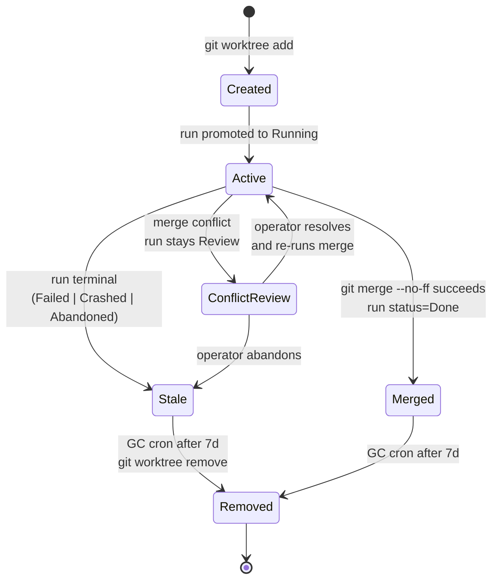
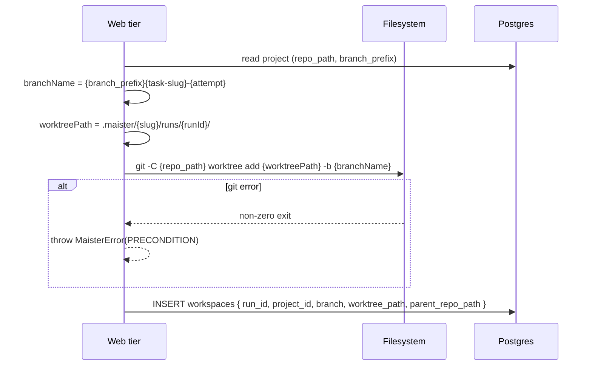
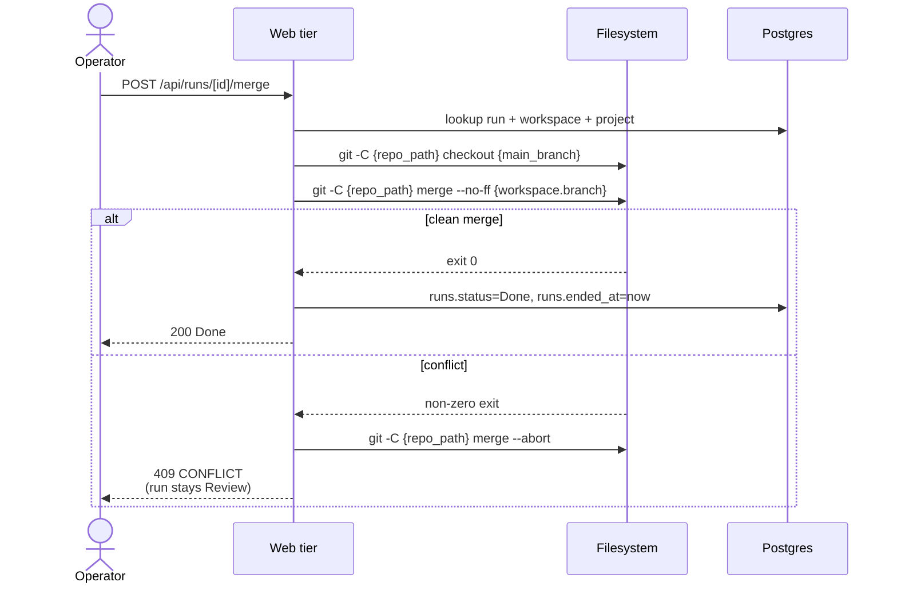
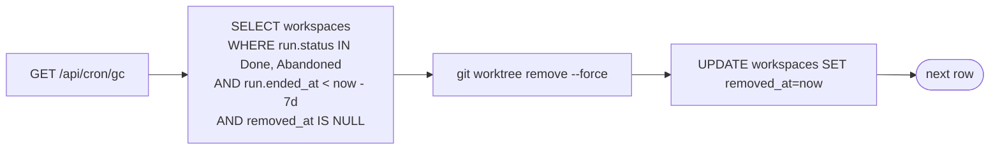

# Workspaces domain

## Purpose

A **workspace** is the git worktree where a run executes. Every run
gets a fresh worktree under `.maister/<slug>/runs/<runId>/`, isolated
from other concurrent runs on the same project. Workspace lifecycle
covers creation, merge, archival, and reconciliation on host or
process restart.

## Domain entities

- **Workspace row** — `workspaces` table. One row per run.
- **Worktree path** — absolute filesystem path, globally UNIQUE.
- **Branch** — derived as `<branch_prefix><task-slug>-<attempt>` (e.g.
  `maister/bugfix-login-button-3`).
- **Parent repo** — `projects.repo_path`. The worktree shares `.git`
  with the parent.

## Lifecycle state machine

## Process flows

### Create a worktree (Designed M6)

### Merge on Review (Designed M9)

### Reconciliation on startup (Designed M6)

Compares three sources of truth:

### Garbage collection

A cron route GCs worktrees older than 7d in terminal state.

## Expectations

- Exactly one worktree per run, rooted at
  `.maister/<slug>/runs/<runId>/`; no cross-project bleed.
- `workspaces.worktree_path` is globally UNIQUE across all projects;
  enforced at the DB layer.
- Branch name pattern is exactly `<branch_prefix><task-slug>-<attempt>`
  and is created with `git worktree add ... -b`.
- Worktree creation runs preconditions (clean parent, branch free,
  path free) BEFORE the `git worktree add` call; failure throws
  `PRECONDITION` with no filesystem side effect.
- Worktree shares `.git` with the parent repo at
  `projects.repo_path`; the parent is the single source of truth.
- Merge policy is `git merge --no-ff` ONLY; conflict always invokes
  `git merge --abort` and leaves the run in `Review`.
- Reconciliation runs on every Next.js boot AND every supervisor boot,
  comparing `runs`, `git worktree list`, and supervisor's live
  sessions.
- GC removes worktrees of runs in `Done | Abandoned` older than 7 d;
  GC failures log and continue without setting `removed_at`.
- Workspace lifecycle ends at `Removed`; rows are NEVER hard-deleted —
  `removed_at` is set instead.

## Edge cases

- **`PRECONDITION`** — dirty parent repo (uncommitted changes), branch
  already exists, worktree path already exists.
- **Worktree path collision across projects** — globally UNIQUE
  enforcement at the DB layer.
- **Parent repo deleted** — reconciliation flags every active run on
  the project as `Crashed`; project transitions to a degraded state
  (Phase 2 will define).
- **`CONFLICT`** — `git merge --no-ff` exited non-zero. Run stays
  `Review`, worktree stays Active, parent repo is restored via
  `git merge --abort`.
- **`git worktree remove` fails** (locked worktree, missing dir) — GC
  logs and continues; row stays without `removed_at`. Operator can
  force-cleanup manually.
- **Concurrent merges on the same `main_branch`** — POC trusts that the
  parent repo is single-writer (one operator). Phase 2 may add a merge
  queue.

## Linked artifacts

- ADRs: [ADR-011 Workspace lifecycle](../decisions.md#adr-011-workspace-lifecycle-via-git-worktree),
  [ADR-012 Merge policy](../decisions.md#adr-012-merge-policy-no-ff-abort-on-conflict).
- ERD: [`../db/runs-domain.md`](../db/runs-domain.md) (workspaces table).
- Related: [`runs.md`](runs.md), [`projects.md`](projects.md).
- Source: planned `web/lib/worktree.ts`, `web/lib/reconcile.ts`.
