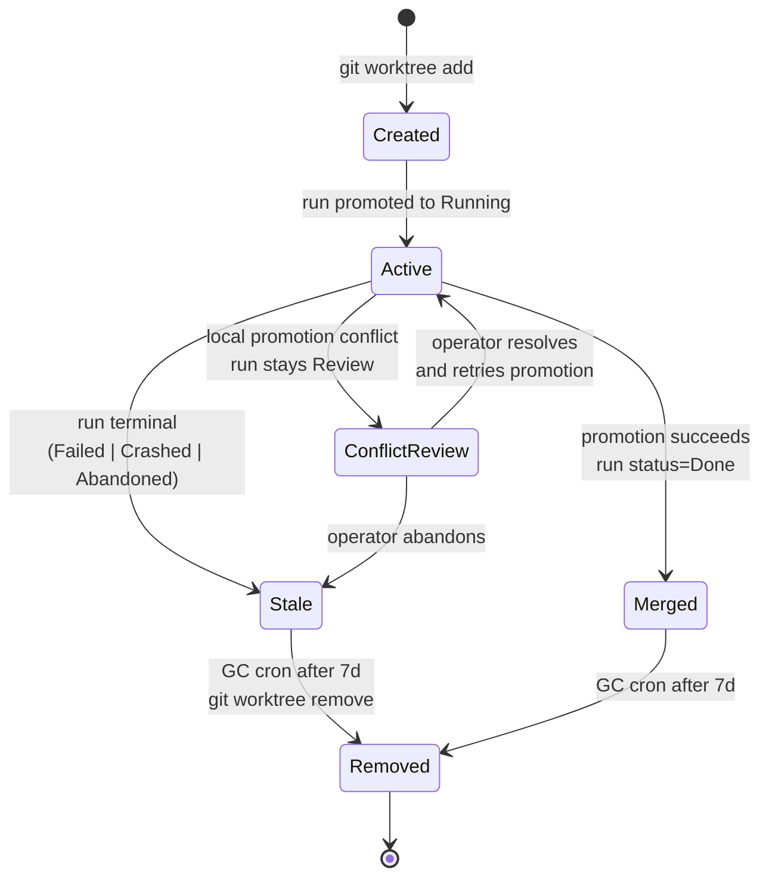
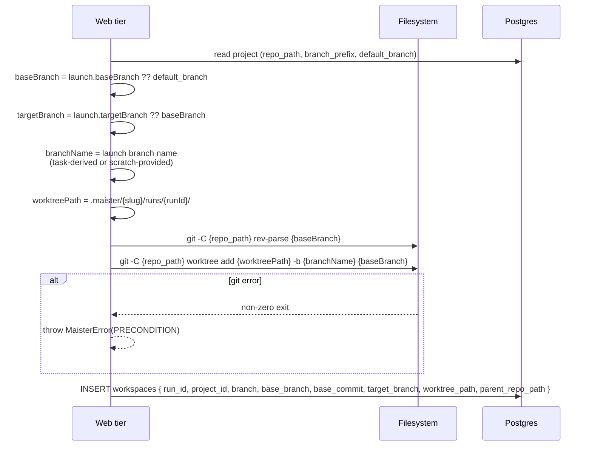
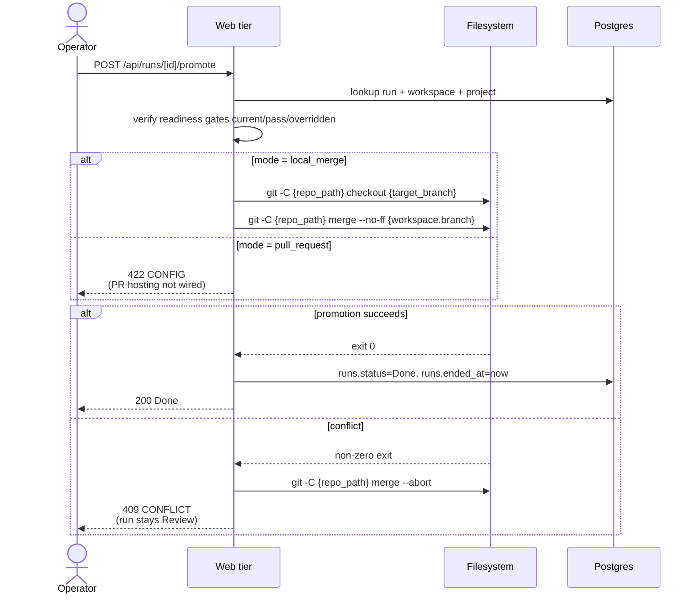
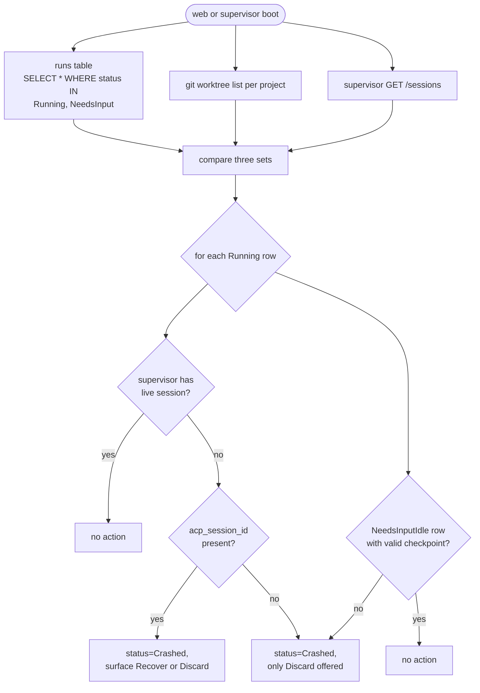
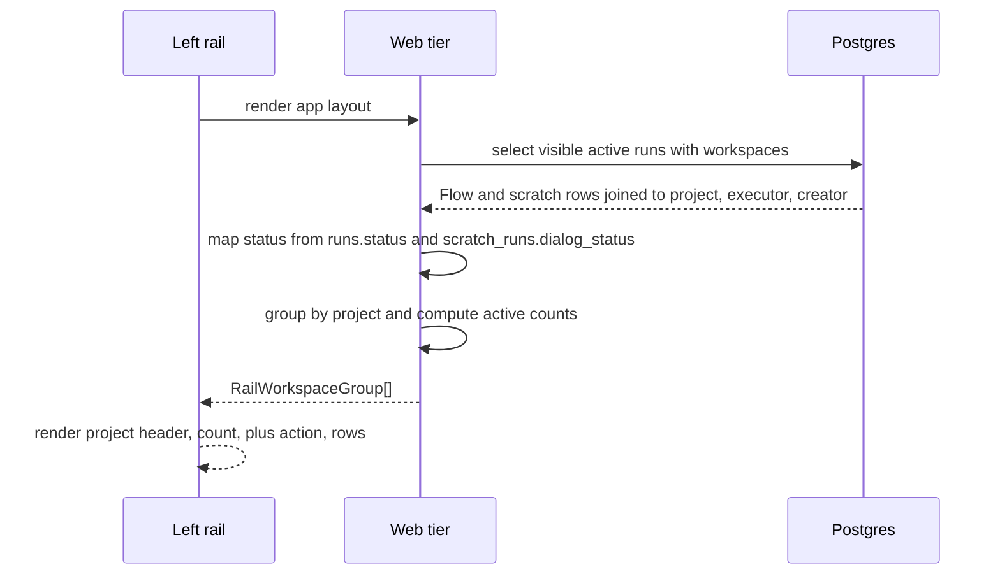

# Workspaces domain

## Purpose

A **workspace** is the git worktree where a run executes. Every run
gets a fresh worktree under `.maister/<slug>/runs/<runId>/`, isolated
from other concurrent runs on the same project. Workspace lifecycle
covers creation, active workspace visibility, promotion, archival, and
reconciliation on host or process restart.

## Domain entities

- **Workspace row** — `workspaces` table. One row per run.
- **Worktree path** — absolute filesystem path, globally UNIQUE.
- **Branch** — derived by the launcher. Task runs use the project branch
  prefix plus a task/run slug. Scratch runs may use a validated
  operator-provided branch/workspace name.
- **Base branch** — branch selected at launch; the run branch is created from
  this branch's launch-time commit.
- **Target branch** — branch selected for promotion. Defaults to the base
  branch but can differ for engineer-controlled workflows.
- **Parent repo** — `projects.repo_path`. The worktree shares `.git`
  with the parent.
- **Active workspace group** — Implemented. The left rail groups active Flow
  and scratch workspaces by project. Each group shows project name, active
  count, latest activity, and a project-scoped scratch `+` action.
- **Active workspace row** — Implemented. A visible run/workspace row with
  branch or scratch name, run kind, executor profile, launched-by user, status
  label, status dot, relative time, and run/scratch detail link.
- **Read-only range git ops (M11b — Implemented)** — `logRange`
  (`git log <base>..<branch>`), `diffRange` (`git diff <base>..<branch>`), and
  `resolveBaseRef` (`git merge-base <mainBranch> <branch>`) in
  `web/lib/worktree.ts`, used by the manual-takeover return to capture the
  human's commits + diff against the existing worktree. No merge, push, or
  checkout-switch. See [`manual-takeover.md`](manual-takeover.md).

## Lifecycle state machine

## Process flows

### Create a worktree (Implemented)

### Promote on Review (Implemented local merge; PR designed)

### Reconciliation on startup (Designed)

Compares three sources of truth:

### Project-grouped active workspaces (Implemented)

Active workspace rows use `runs.status` for Flow rows and combine
`runs.status` with `scratch_runs.dialog_status` for scratch rows. Scratch
`WaitingForUser` is displayed as its own label even though the shared
`runs.status` remains `Running`.

### Garbage collection

A cron route GCs worktrees older than 7d in terminal state.

## Expectations

- Exactly one worktree per run, rooted at
  `.maister/<slug>/runs/<runId>/`; no cross-project bleed.
- `workspaces.worktree_path` is globally UNIQUE across all projects;
  enforced at the DB layer.
- Branch names are validated before reaching `git worktree add ... -b`; task
  runs are generated from server state and scratch runs may use a validated
  launch-time name.
- Launch can select `base_branch` and optional `target_branch`.
  `target_branch` defaults to `base_branch`; `base_branch` defaults to
  `project.default_branch`.
- Worktree creation records `base_branch`, `base_commit`,
  `branch`, `target_branch`, and promotion mode in the run ledger. Runs are not
  hard-coded to start from or promote to `main`.
- Worktree creation runs preconditions (clean parent, branch free,
  path free) BEFORE the `git worktree add` call; failure throws
  `PRECONDITION` with no filesystem side effect.
- Worktree shares `.git` with the parent repo at
  `projects.repo_path`; the parent is the single source of truth.
- Local promotion merge policy is `git merge --no-ff` ONLY; conflict always
  invokes `git merge --abort`, leaves the run in `Review`, and creates a
  manual-resolution assignment.
- Pull-request promotion is designed. The implemented route currently returns
  `CONFIG` for `pull_request` until repository-hosting integration is wired.
- Full Flow reconciliation across Next.js boot, supervisor boot, git worktrees,
  and live sessions is designed. Scratch recovery is implemented through the
  explicit recover route for crashed scratch sessions.
- GC removes worktrees of runs in `Done | Abandoned` older than 7 d;
  GC failures log and continue without setting `removed_at`.
- Workspace lifecycle ends at `Removed`; rows are NEVER hard-deleted —
  `removed_at` is set instead.
- Active workspace rail groups MUST include both `flow` and `scratch` runs
  visible to the current user and MUST keep task board queries filtered to
  `runs.run_kind = 'flow'`.
- Active workspace status labels MUST distinguish `Running`,
  `WaitingForUser`, `NeedsInput`, `NeedsInputIdle`, `HumanWorking`, `Review`,
  and `Crashed`; `WaitingForUser` is scratch-specific and maps from
  `scratch_runs.dialog_status` while `runs.status = 'Running'`.
- Each project group MUST expose a scratch launch `+` action with that project
  preselected and MUST show launched-by display when `runs.created_by_user_id`
  or legacy scratch creator metadata is available.
- **(Implemented, M11b)** The manual-takeover return reads the EXISTING worktree
  through read-only range ops (`logRange`/`diffRange`/`resolveBaseRef`) ONLY; it
  creates NO new branch/target/PR and performs no push, merge, or
  checkout-switch (the worktree is already on the run branch). A failed git op
  raises `CONFLICT`. See [`manual-takeover.md`](manual-takeover.md).

## Edge cases

- **`PRECONDITION`** — dirty parent repo (uncommitted changes), branch
  already exists, worktree path already exists.
- **Worktree path collision across projects** — globally UNIQUE
  enforcement at the DB layer.
- **Parent repo deleted** — reconciliation flags every active run on
  the project as `Crashed`; project transitions to a degraded state
  (Phase 2 will define).
- **`CONFLICT`** — `git merge --no-ff` exited non-zero. Run stays
  `Review`, worktree stays Active, parent repo is restored via
  `git merge --abort`.
- **`git worktree remove` fails** (locked worktree, missing dir) — GC
  logs and continues; row stays without `removed_at`. Operator can
  force-cleanup manually.
- **Concurrent promotions on the same `target_branch`** — current target trusts
  the parent repo is single-writer (one operator). Phase 2 may add a promotion
  queue.

## Linked artifacts

- ADRs: [ADR-011 Workspace lifecycle](../decisions.md#adr-011-workspace-lifecycle-via-git-worktree),
  [ADR-012 Local promotion merge policy](../decisions.md#adr-012-local-promotion-merge-policy-no-ff-abort-on-conflict).
- ERD: [`../db/runs-domain.md`](../db/runs-domain.md) (workspaces table).
- Related: [`runs.md`](runs.md), [`projects.md`](projects.md).
- Source: `web/lib/worktree.ts`; scratch recovery routes under
  `web/app/api/scratch-runs/[runId]/recover/`. Full Flow reconciliation remains
  designed.
