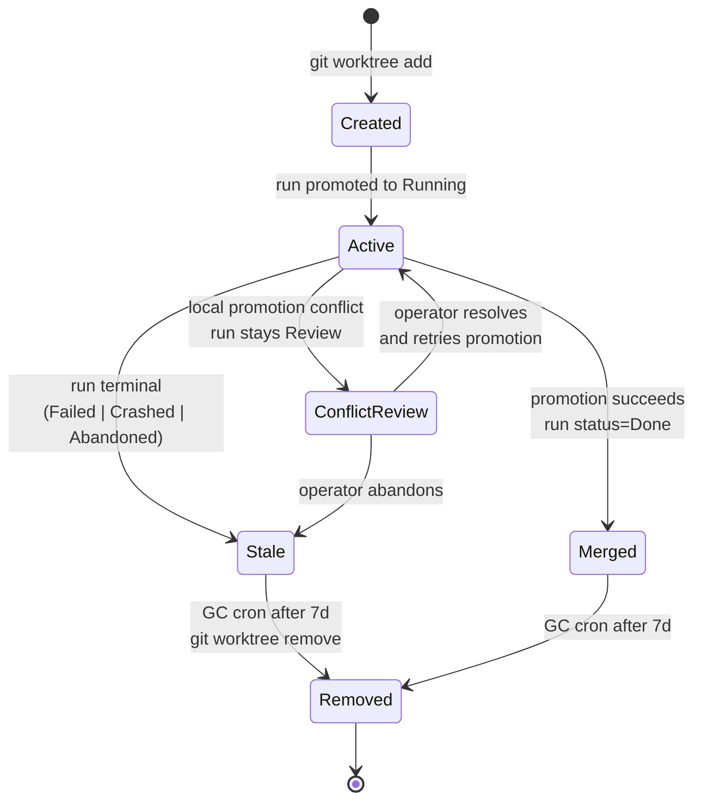
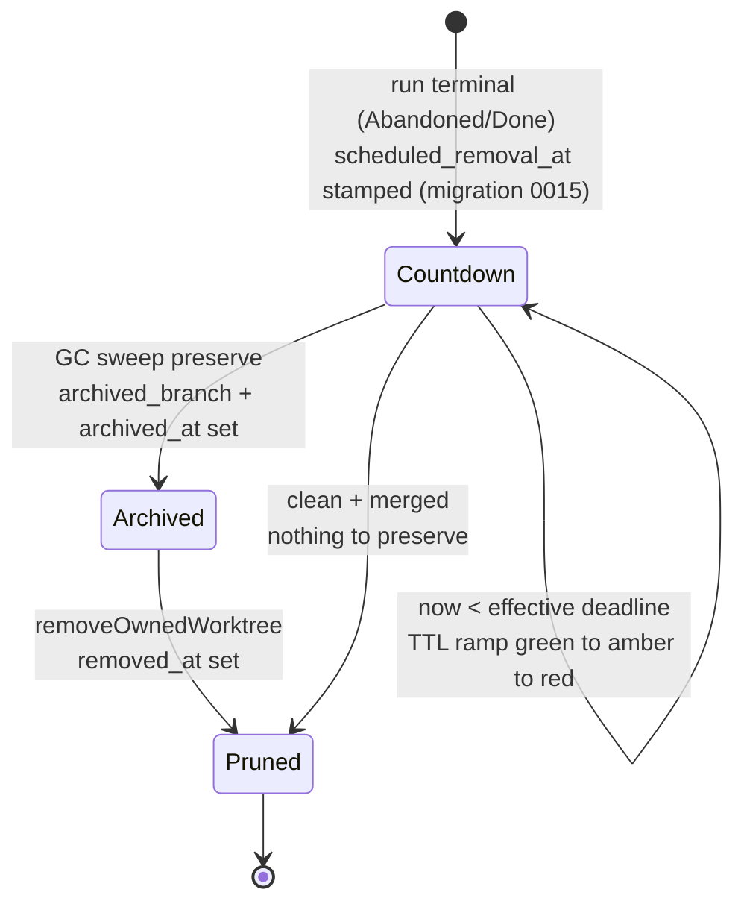
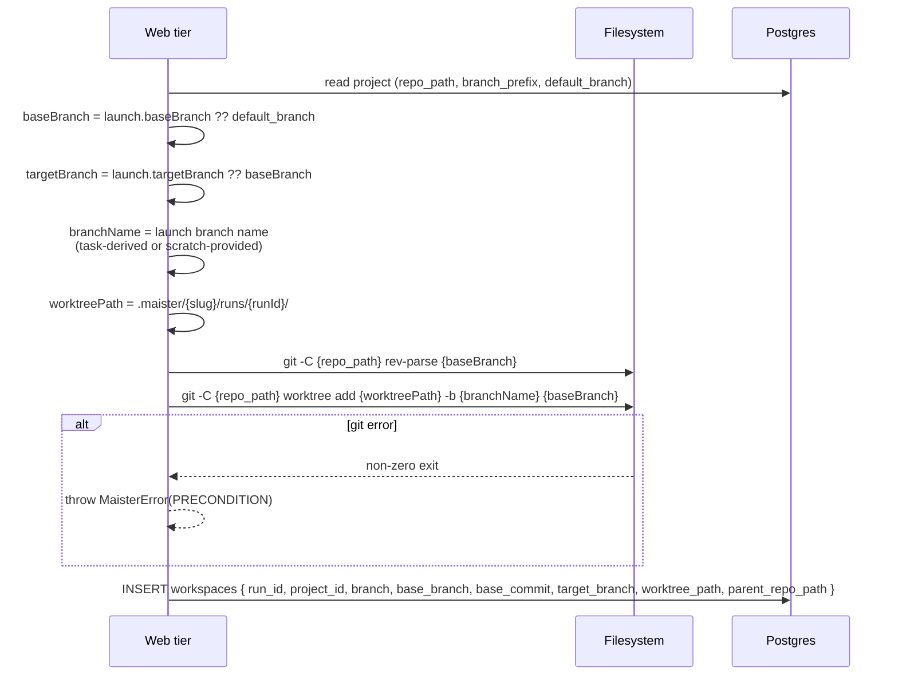
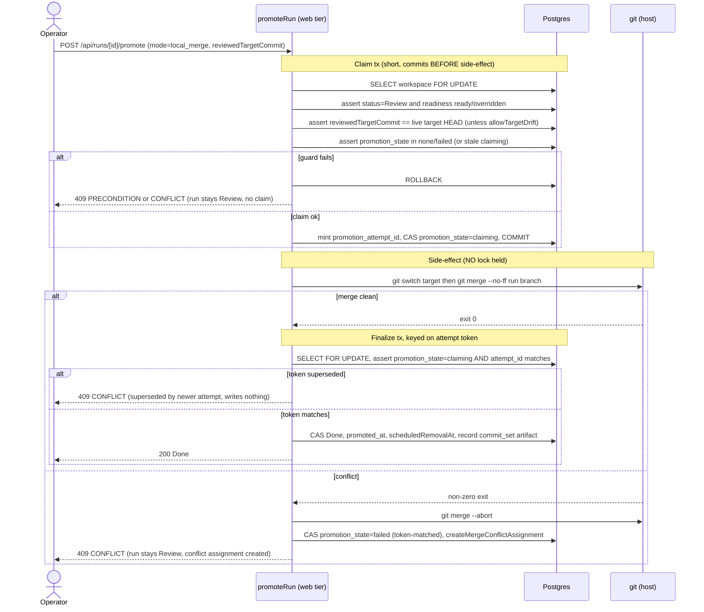
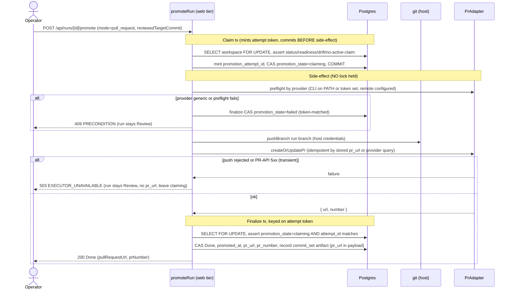
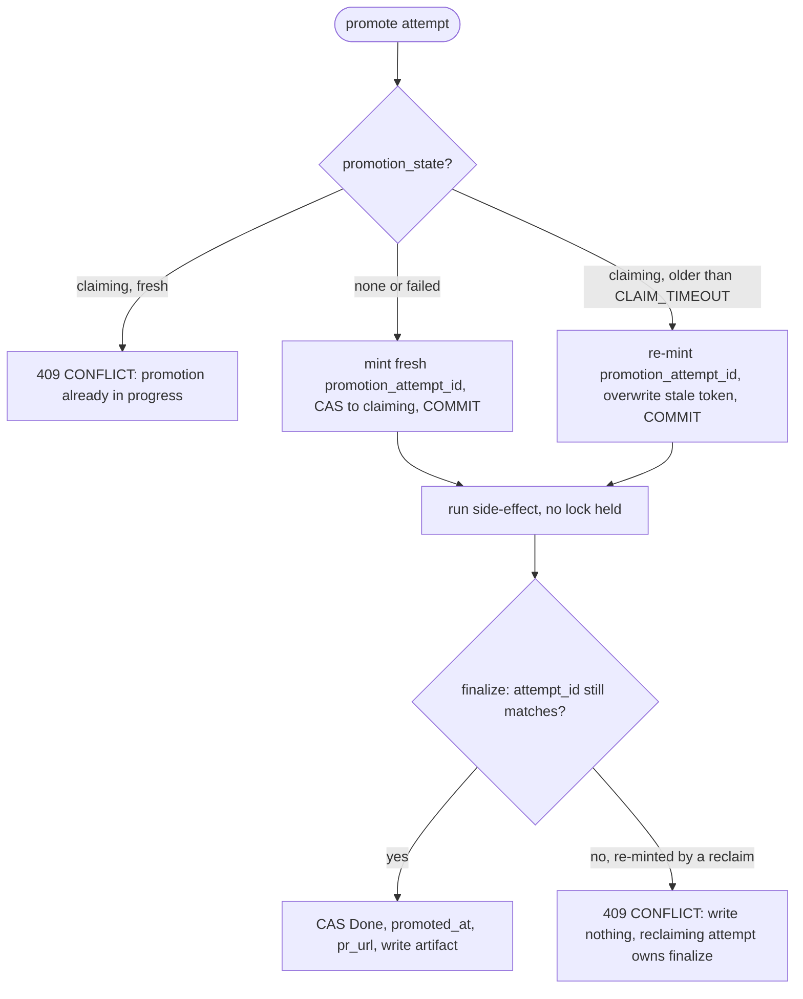
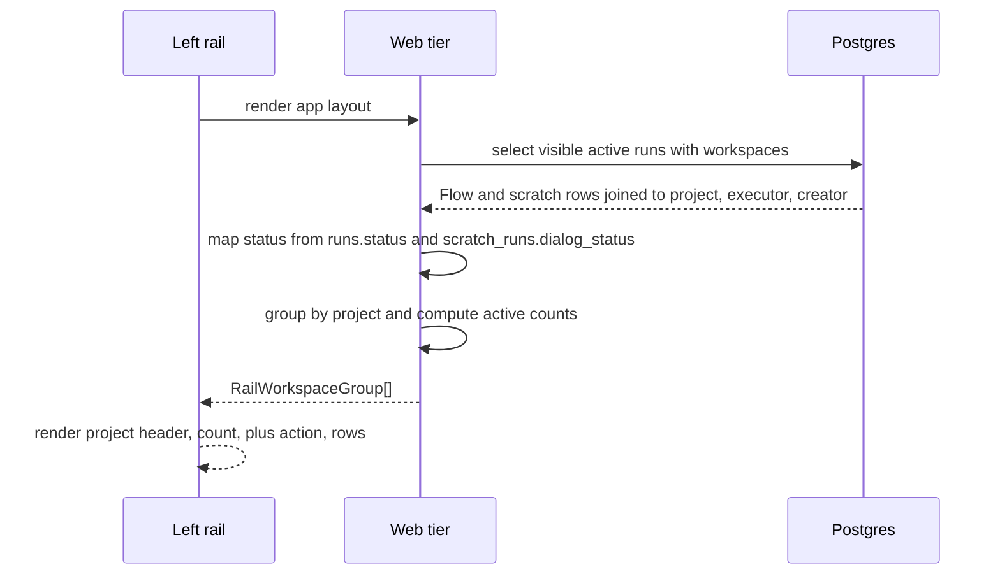
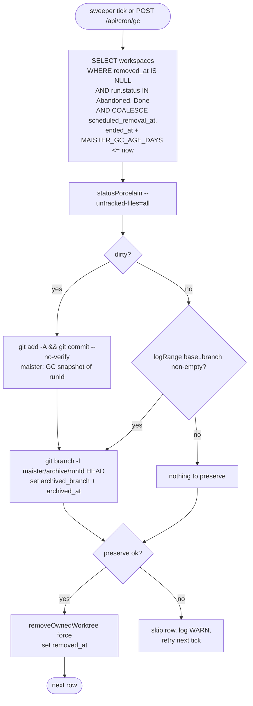
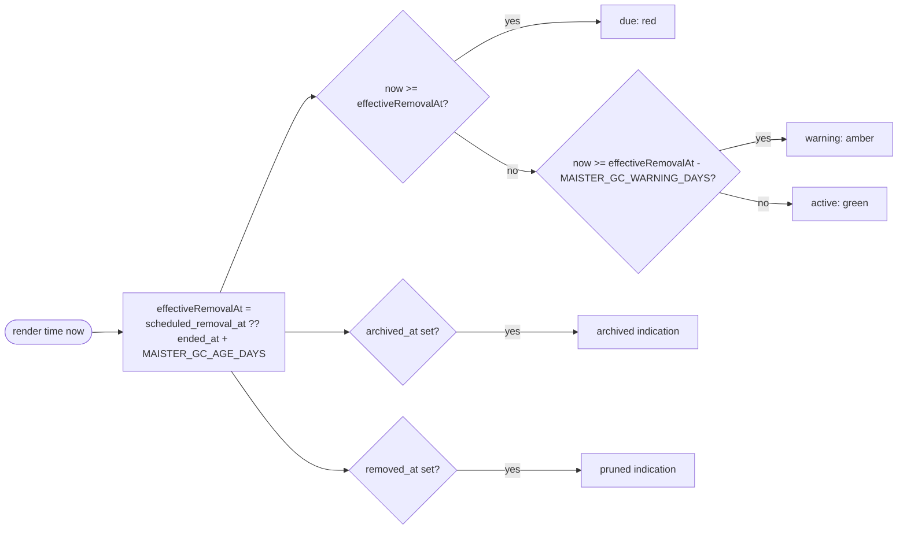

# Workspaces domain

## Purpose

A **workspace** is the git worktree where a run executes. Every run
gets a fresh worktree under `.maister/<slug>/runs/<runId>/`, isolated
from other concurrent runs on the same project. Workspace lifecycle
covers creation, active workspace visibility, promotion, archival, and
reconciliation on host or process restart.

## Domain entities

- **Workspace row** — `workspaces` table. One row per run.
- **Worktree path** — absolute filesystem path, globally UNIQUE.
- **Branch** — derived by the launcher. Task runs use the project branch
  prefix plus a task/run slug. Scratch runs may use a validated
  operator-provided branch/workspace name.
- **Base branch** — branch selected at launch; the run branch is created from
  this branch's launch-time commit. Validated against `listBranches` before use.
- **Base commit** — the resolved launch-time commit of the base branch
  (`resolveBaseCommit`), recorded as `workspaces.base_commit` and passed as the
  `startPoint` to `git worktree add`. The run branch forks from this exact commit.
- **Target branch** — branch selected for promotion. Defaults to the base
  branch but can differ for engineer-controlled workflows. For **flow** runs M18
  relaxes the scratch hard-lock that pinned the target to the base
  (`assertPromotionTargetAllowed`). Must exist (validated on launch and promote).
- **Promotion mode** — `local_merge | pull_request` (`workspaces.promotion_mode`).
  Resolved at launch from the override chain (launch override > project
  `promotion.mode` > default `local_merge`); a per-run snapshot, not live-synced.
- **Delivery policy** (Designed, ADR-085) — typed run snapshot resolving
  project default -> launch override -> promote-time override. It supersedes
  `promotion_mode` for new Flow runs while preserving legacy compatibility:
  `local_merge` maps to `strategy=merge`, `pull_request` maps to
  `strategy=pull_request`. Scratch runs keep legacy M18 promotion semantics in
  this slice.
- **Durable promotion claim (Implemented, M18)** — the serialization point for
  idempotent promotion, held on the workspace row (1:1 with the run):
  - `promotion_state` — `none | claiming | done | failed`. CAS'd to `claiming`
    in a short tx **committed BEFORE any side-effect**; the single concurrency
    gate (not a held row lock).
  - `promotion_attempt_id` — a fresh opaque token (e.g. `crypto.randomUUID()`)
    minted on each claim. The finalize transaction is keyed on it, so a slow or
    crashed attempt whose token was re-minted by a stale reclaim cannot
    double-finalize.
  - `promotion_claimed_at` — claim timestamp; a `claiming` row older than
    `MAISTER_PROMOTION_CLAIM_TIMEOUT_SECONDS` (default 300) is reclaimable.
  - `promotion_owner_user_id` — actor who claimed the promotion.
  - `pr_url` / `pr_number` — recorded on a successful `pull_request` promotion
    (**Implemented, M18**); `pr_url` is also the
    idempotency key that turns a re-promote into a PR update rather than a
    duplicate.
  - `promoted_at` — set in the finalize tx alongside `runs.status = Done`.
- **Parent repo** — `projects.repo_path`. The worktree shares `.git`
  with the parent.
- **Active workspace group** — Implemented. The left rail groups active Flow
  and scratch workspaces by project. Each group shows project name, active
  count, latest activity, and a project-scoped scratch `+` action.
- **Active workspace row** — Implemented. A visible run/workspace row with
  branch or scratch name, run kind, executor profile, launched-by user, status
  label, status dot, relative time, and run/scratch detail link.
- **Read-only range git ops (M11b — Implemented)** — `logRange`
  (`git log <base>..<branch>`), `diffRange` (`git diff <base>..<branch>`), and
  `resolveBaseRef` (`git merge-base <mainBranch> <branch>`) in
  `web/lib/worktree.ts`, used by the manual-takeover return to capture the
  human's commits + diff against the existing worktree. No merge, push, or
  checkout-switch. See [`manual-takeover.md`](manual-takeover.md).

## Lifecycle state machine



### M19 graceful GC lifecycle (Designed)

M19 ([ADR-035](../decisions.md#adr-035)) refines the terminal tail of the
lifecycle above into a **preserve-then-prune** countdown. On the `Abandoned`/
`Done` transition the run stamps `workspaces.scheduled_removal_at = ended_at +
MAISTER_GC_AGE_DAYS` (default 14); the worktree then sits in a TTL countdown,
is **archived** (preserved) by the GC sweep, and only then **pruned**. Full GC
domain detail — both delivery surfaces, the cron route, and the preserve
flowchart — lives in [`reconciliation-gc.md`](reconciliation-gc.md). The GC
state is **derived** from `scheduled_removal_at`, `archived_at`, and
`removed_at` (no `gc_state` enum column).



## Process flows

### Create a worktree (Implemented)



### Promote on Review — shared service over both run kinds (Implemented, M18)

Promotion is the product action after `Review`. M18
([ADR-058](../decisions.md#adr-058-branch-targeting-at-launch-shared-promotion-service-promote-time-readiness-re-gate-m18m15-carve))
introduces a **shared `promoteRun` service** that drives **both** scratch and
flow run kinds for `local_merge`; the `pull_request` mode
([ADR-049](../decisions.md#adr-049-pr-promotion-via-a-hybrid-provider-pradapter-credential-model-b-reverses-the-gh-is-never-invoked-invariant))
is **Implemented (M18)**. Both modes terminate at the existing
`Done` (no new `runs.status`). The service is retry-safe through a **durable
promotion claim**: a fresh `promotion_attempt_id` is minted and
`promotion_state` is CAS'd to `claiming` in a short transaction **committed
BEFORE any git/PR side-effect**, then the side-effect runs with **no lock
held**, then a finalize transaction **keyed on the attempt token** flips `Done`.
The claim — not a held row lock — is the single serialization point
(§ *Concurrent promote & stale-claim reclaim* below).

#### `local_merge` promotion (Implemented, M18)



#### `pull_request` promotion (Implemented, M18)



#### Promotion outcomes (Implemented, M18; both `local_merge` and `pull_request` rows)

| Outcome | HTTP | Run / claim effect |
|---------|------|--------------------|
| Success (`local_merge` clean / PR created-or-updated) | 200 | `runs.status = Done`, `promotion_state = done`, `promoted_at` set; PR mode adds `pr_url`/`pr_number` |
| Readiness not ready/stale | 409 `PRECONDITION` | no claim; run stays `Review` (retry after gate passes/overridden) |
| Target advanced since review (drift, no override) | 409 `PRECONDITION` | no claim; run stays `Review` (re-review, then `allowTargetDrift`) |
| Target branch invalid/missing | 409 `PRECONDITION` | run stays `Review` |
| `local_merge` conflict | 409 `CONFLICT` | `promotion_state = failed`; run stays `Review` + conflict assignment (no auto-resolve) |
| PR preflight fail (CLI/token/remote missing, `generic` provider) | 409 `PRECONDITION` | `promotion_state = failed`; run stays `Review` |
| Concurrent promote (a fresh active `claiming` already present) | 409 `CONFLICT` | unchanged; wait for the in-flight promotion |
| Push rejected / PR-API 5xx (transient) | **503 `EXECUTOR_UNAVAILABLE`** | leaves `claiming`; run stays `Review`, **no `pr_url`**; idempotently retryable |
| Finalize superseded by a same-user stale reclaim | 409 `CONFLICT` | superseded attempt writes NOTHING; the reclaiming attempt owns finalize |
| Already `Done` / non-`Review` (retry after success) | 409 | terminal — no re-attempt |

No new `MaisterError` code is added — the closed union
([ADR-008](../decisions.md#adr-008-typed-error-taxonomy-maistererror)) already
covers `PRECONDITION`, `CONFLICT`, and `EXECUTOR_UNAVAILABLE`.

#### Delivery-policy promotion (Designed, ADR-085)

New Flow runs snapshot a `DeliveryPolicy`:

```ts
type DeliveryPolicy = {
  strategy: "merge" | "rebase_merge" | "pull_request" | "ai_rebase_merge";
  push: "never" | "on_success";
  trigger: "manual" | "auto_on_ready";
  targetBranch?: string;
};
```

Promotion still uses the M18 durable claim and per-attempt token. Policy changes
only choose the side-effect path and the default UI selection:

| Strategy | Side effect | Claim/finalize model |
| --- | --- | --- |
| `merge` | `git merge --no-ff` from run branch into target branch | Existing `local_merge` claim, readiness re-gate, target-drift token, conflict assignment, finalize CAS. |
| `pull_request` | Push run branch and create/update provider PR/MR | Existing PR claim and idempotent PR lookup/update. |
| `rebase_merge` | Rebase run branch onto target, then merge | Same claim and finalize token; on conflict abort/restore and surface command/path/status. |
| `ai_rebase_merge` | On rebase conflict, start agent-assisted resolution before re-entering readiness | Same run event stream and assignment inbox; conflict HITL uses `merge_conflict` unless a later schema decision adds a narrower kind. |

`push=on_success` means push the successfully delivered target or run branch only
after the local side-effect succeeds. Push rejection is a degradation/refusal
state surfaced with the failing command and path context; it never silently
marks the run `Done` unless the Phase A contract for that exact strategy says
local success is final.

`trigger=auto_on_ready` fires only from `Review` after the readiness gate is
ready/overridden. If readiness is stale/not-ready or any command fails, the run
stays `Review`, the policy degrades to manual for that run, and the UI shows the
typed reason. The run-detail banner can cancel auto-delivery by CAS-ing the run
snapshot from `auto_on_ready` to `manual`; project defaults are untouched.

#### Concurrent promote & stale-claim reclaim (Implemented, M18)

The durable claim + per-attempt token guarantees **exactly one side-effect** per
promotion even under concurrency and crash. Two mechanisms compose: the
attempt-token CAS prevents a **double finalize**; the stored `pr_url` (+ a
provider query) prevents a **double side-effect** for PR mode (**Implemented,
M18**). A `local_merge` re-merge of an already-merged
source is a no-op (`Already up to date`).



Two crash windows live **between the claim commit and the finalize commit**,
recovered by the timeout reclaim + idempotent side-effect (no held lock, no
background sweeper):

- **`local_merge`** — the target may already carry the `--no-ff` merge commit
  while the run is still `Review`, `promotion_state = claiming`. Once the claim
  ages past `MAISTER_PROMOTION_CLAIM_TIMEOUT_SECONDS`, a re-promote reclaims it;
  the re-merge is a no-op and the attempt finalizes `Done`.
- **`pull_request`** (**Implemented, M18**) — the PR may
  be pushed/created while `pr_url` is not yet stored, `promotion_state =
  claiming`. The reclaiming re-promote's `createOrUpdatePr` detects the existing
  PR for `(run branch → target)` via the provider (`gh pr list --head` / `glab
  mr list` / Gitea `GET …/pulls`) and **updates instead of duplicating**, then
  finalizes. `pr_url`/`promoted_at` are AFTER-side writes, so a crash never
  strands a half-recorded PR.

A stale reclaim **re-mints** `promotion_attempt_id` and overwrites the prior
token, so even if the crashed/slow original attempt later resumes, its finalize
CAS no longer matches and is refused `409 CONFLICT` — a second `Done` or `pr_url`
is impossible.

### Reconciliation on startup (Designed)

Compares three sources of truth:


> M19 ([ADR-033](../decisions.md#adr-033)) makes this reconcile **allow-list
> `Running`-only** and adds a grace guard plus a retry-safety split (read-only
> `check`/`judge` gate nodes re-dispatch; `cli` nodes crash). The
> "runs vs `git worktree list`" branch becomes the `worktree-gone → Crashed`
> classification. The full classifier and the GC lifecycle live in
> [`reconciliation-gc.md`](reconciliation-gc.md).

### Project-grouped active workspaces (Implemented)



Active workspace rows use `runs.status` for Flow rows and combine
`runs.status` with `scratch_runs.dialog_status` for scratch rows. Scratch
`WaitingForUser` is displayed as its own label even though the shared
`runs.status` remains `Running`.

### Garbage collection

A cron route GCs worktrees older than 7d in terminal state.


### M19 preserve-then-prune GC (Designed)

M19 ([ADR-035](../decisions.md#adr-035)) replaces the single-step removal above
with a graceful, destructive-safe sweep delivered BOTH as a background
`globalThis`-singleton sweeper (`MAISTER_GC_SWEEP_INTERVAL_SECONDS`, default
3600) and the token-guarded cron route. The candidate select uses the
**effective deadline** so pre-0015 terminal runs (null `scheduled_removal_at`)
are still collected. Every removal is gated on preserve success; GC archives a
branch, it NEVER merges to main/target.



### M19 worktree TTL color ramp (Designed)

Read models surface a derived `ttlState` for `Abandoned`/`Done` workspaces so
the portfolio rail, board, and run-detail can render a countdown to GC removal.
The effective deadline mirrors the GC sweep exactly:
`effectiveRemovalAt = scheduled_removal_at ?? (ended_at + MAISTER_GC_AGE_DAYS)`.



## Expectations

- Exactly one worktree per run, rooted at
  `.maister/<slug>/runs/<runId>/`; no cross-project bleed.
- `workspaces.worktree_path` is globally UNIQUE across all projects;
  enforced at the DB layer.
- Branch names are validated before reaching `git worktree add ... -b`; task
  runs are generated from server state and scratch runs may use a validated
  launch-time name.
- Launch can select `base_branch` and optional `target_branch`.
  `target_branch` defaults to `base_branch`; `base_branch` defaults to
  `project.default_branch`.
- Worktree creation records `base_branch`, `base_commit`,
  `branch`, `target_branch`, and promotion mode in the run ledger. Runs are not
  hard-coded to start from or promote to `main`.
- Worktree creation runs preconditions (clean parent, branch free,
  path free) BEFORE the `git worktree add` call; failure throws
  `PRECONDITION` with no filesystem side effect.
- Worktree shares `.git` with the parent repo at
  `projects.repo_path`; the parent is the single source of truth.
- Local promotion merge policy is `git merge --no-ff` ONLY; conflict always
  invokes `git merge --abort`, leaves the run in `Review`, and creates a
  manual-resolution assignment.
- **(Implemented, M18)** A **flow** run MUST be promotable from `Review` through
  the shared `promoteRun` service; `local_merge` finalizes at the existing `Done`
  (no new `runs.status`) and the scratch path stays behavior-identical
  (regression-pinned). `pull_request` also finalizes at `Done`.
- **(Implemented, M18)** Promotion MUST be idempotent: a fresh `promotion_attempt_id`
  is minted and `promotion_state` is CAS'd to `claiming` and **committed BEFORE**
  any git/PR side-effect; the finalize tx is keyed on that token so a superseded
  attempt writes NOTHING. `pr_url` is the PR dedup key (re-promote
  updates, never duplicates).
- **(Implemented, M18)** Two concurrent promotes of the same run MUST yield exactly
  ONE side-effect — one `Done`, one `409 CONFLICT`; a `claiming` claim older than
  `MAISTER_PROMOTION_CLAIM_TIMEOUT_SECONDS` is reclaimable and re-minting the
  token blocks a crashed/slow original from double-finalizing.
- **(Implemented, M18)** Promotion MUST refuse `PRECONDITION` (no claim, run stays
  `Review`) when readiness is not ready/stale (`assertEvidenceReady(runId,
  "review")`, overridden gates satisfy it) or when the target advanced since
  review (`reviewedTargetCommit` ≠ live target HEAD) unless `allowTargetDrift`.
- **(Implemented, M18)** Pull-request promotion is provider-dispatched through the
  hybrid `PrAdapter` (github→`gh`, gitlab→`glab`, gitea+gitverse→Gitea REST API,
  generic→`PRECONDITION`); PR creation MUST be idempotent (existing PR updated, not
  duplicated). The provider boundary (`gh`/`glab` exec + Gitea-API `fetch`) is
  MOCKED in CI and exercised live in manual verification (see
  [`git-integration.md`](git-integration.md)).
- Full Flow reconciliation across Next.js boot, supervisor boot, git worktrees,
  and live sessions is designed. Scratch recovery is implemented through the
  explicit recover route for crashed scratch sessions.
- GC removes worktrees of runs in `Done | Abandoned` older than 7 d;
  GC failures log and continue without setting `removed_at`.
- **(Designed, M19)** GC MUST select terminal candidates by
  `COALESCE(workspaces.scheduled_removal_at, runs.ended_at + MAISTER_GC_AGE_DAYS) <= now()`
  (default age 14 d) and MUST preserve before pruning: dirty tracked + untracked
  state is snapshot-committed onto `maister/archive/<runId>`, and
  `removeOwnedWorktree` runs ONLY when preserve succeeds. See
  [`reconciliation-gc.md`](reconciliation-gc.md).
- **(Designed, M19)** GC MUST NOT merge into main/target; preservation is the
  archive branch (+ optional push when `MAISTER_GC_ARCHIVE_PUSH=true`, default
  `false`) only.
- **(Implemented, M27)** Operator archive/drop/export/snapshot/handoff actions
  use the same workspace row and preserve/remove helpers but are explicit UI
  lifecycle actions, not background GC. Their allow-list, durable operation
  claim, and trust boundary live in
  [`workbench-lifecycle.md`](workbench-lifecycle.md).
- Workspace lifecycle ends at `Removed`; rows are NEVER hard-deleted —
  `removed_at` is set instead.
- Active workspace rail groups MUST include both `flow` and `scratch` runs
  visible to the current user and MUST keep task board queries filtered to
  `runs.run_kind = 'flow'`.
- Active workspace status labels MUST distinguish `Running`,
  `WaitingForUser`, `NeedsInput`, `NeedsInputIdle`, `HumanWorking`, `Review`,
  and `Crashed`; `WaitingForUser` is scratch-specific and maps from
  `scratch_runs.dialog_status` while `runs.status = 'Running'`.
- Each project group MUST expose a scratch launch `+` action with that project
  preselected and MUST show launched-by display when `runs.created_by_user_id`
  or legacy scratch creator metadata is available.
- **(Implemented, M11b)** The manual-takeover return reads the EXISTING worktree
  through read-only range ops (`logRange`/`diffRange`/`resolveBaseRef`) ONLY; it
  creates NO new branch/target/PR and performs no push, merge, or
  checkout-switch (the worktree is already on the run branch). A failed git op
  raises `CONFLICT`. See [`manual-takeover.md`](manual-takeover.md).

## Edge cases

- **`PRECONDITION`** — dirty parent repo (uncommitted changes), branch
  already exists, worktree path already exists.
- **Worktree path collision across projects** — globally UNIQUE
  enforcement at the DB layer.
- **Parent repo deleted** — reconciliation flags every active run on
  the project as `Crashed`; project transitions to a degraded state
  (Phase 2 will define).
- **`CONFLICT`** — `git merge --no-ff` exited non-zero. Run stays
  `Review`, worktree stays Active, parent repo is restored via
  `git merge --abort`. **(Implemented, M18)** a stale-claim reclaim that finalizes
  after a same-user re-mint also surfaces `CONFLICT` ("superseded by a newer
  attempt") and writes nothing.
- **`git worktree remove` fails** (locked worktree, missing dir) — GC
  logs and continues; row stays without `removed_at`. Operator can
  force-cleanup manually.
- **(Implemented, M18) Concurrent promotions of the same run** — serialized by the
  durable `promotion_state` claim keyed on `promotion_attempt_id` (committed
  before the side-effect); exactly one finalizes `Done`, the other gets `409
  CONFLICT`. Supersedes the prior single-writer assumption.
- **(Implemented, M18) Target advanced since review (drift)** — `reviewedTargetCommit`
  ≠ live target HEAD → `PRECONDITION`. **(Implemented, M18)** the panel re-renders against
  the new HEAD and offers "Promote anyway" (`allowTargetDrift`).
- **(Implemented, M18) Crash between claim and finalize** — a durable
  `promotion_state='claiming'` row; reclaimable past
  `MAISTER_PROMOTION_CLAIM_TIMEOUT_SECONDS`, the idempotent side-effect makes the
  re-promote a no-op (local merge) — or a PR update (provider query) for
  `pull_request` — then it finalizes `Done`.
- **(Implemented, M18) Legacy pre-M18 workspace (null branch metadata)** — promote
  derives fallbacks (`target_branch ?? project.default_branch`, diff base via
  `resolveBaseRef`) or refuses `PRECONDITION` ("relaunch to promote"); never a
  silent null into git.
- **(Implemented, M27) Concurrent lifecycle action** — archive/drop/export/
  snapshot/handoff are serialized by `workspaces.lifecycle_operation_*`. A
  losing claim returns `409 CONFLICT`; a transient push failure leaves the
  operation retryable rather than marking promotion done.

## Linked artifacts

- ADRs: [ADR-011 Workspace lifecycle](../decisions.md#adr-011-workspace-lifecycle-via-git-worktree),
  [ADR-012 Local promotion merge policy](../decisions.md#adr-012-local-promotion-merge-policy---no-ff-abort-on-conflict),
  [ADR-058 Branch targeting + shared promotion + promote-time readiness re-gate](../decisions.md#adr-058-branch-targeting-at-launch-shared-promotion-service-promote-time-readiness-re-gate-m18m15-carve)
  (Implemented, M18),
  [ADR-049 PR promotion via a hybrid provider `PrAdapter`](../decisions.md#adr-049-pr-promotion-via-a-hybrid-provider-pradapter-credential-model-b-reverses-the-gh-is-never-invoked-invariant)
  (Implemented, M18).
- ERD: [`../db/runs-domain.md`](../db/runs-domain.md) (workspaces table — base/
  target/promotion claim columns from M18 and lifecycle operation claim columns
  from M27).
- Config reference: [`../configuration.md`](../configuration.md)
  (`promotion.mode`, `MAISTER_PROMOTION_CLAIM_TIMEOUT_SECONDS`).
- Related: [`runs.md`](runs.md) (flow `Review → Done` promotion path),
  [`projects.md`](projects.md),
  [`git-integration.md`](git-integration.md) (push + provider PR dispatch),
  [`workbench-lifecycle.md`](workbench-lifecycle.md) (operator stop/archive/
  drop/snapshot/export/handoff actions),
  [`artifacts.md`](artifacts.md) (promotion `commit_set`/`diff` artifact),
  [`workbench.md`](workbench.md) (M22 — the worktree is the **tracked-file
  source** for the read-only file-tree + base→run diff).
- Source: `web/lib/worktree.ts`; scratch recovery routes under
  `web/app/api/scratch-runs/[runId]/recover/`. **(Implemented, M18)**
  `web/lib/runs/promote.ts` (shared `promoteRun`), `web/lib/runs/pr-adapter.ts`.
  Full Flow reconciliation remains designed.
